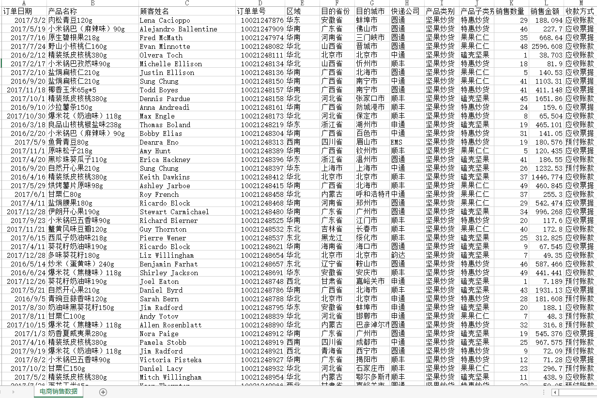

**轻松制作树形图**

今天我们的主题是制作树形图，我们会教大家如何轻松的制作出树形图。

那首先，我们先来了解下什么是树形图。官方解释，树形图是用来表示一个概率空间，它可以表示独立事件（例如多次掷硬币）和条件概率（例如不放回的抽卡）。

如何制作树形图呢？

1、制作工具。这次我们选用的是DataFocus数据可视化工具，其有丰富的图表类型可以选择，而且制作方法非常简单。

2、数据准备。我们要制作树形图，首先需要准备好的数据，有数据了才能展示，我们准备的数据如下：

3、数据导入。首先将数据导入DataFocus系统，才能在DataFocus中进行分析可视化展示，按照提示操作，DataFocus支持csv、xlsx、xls、txt、json等本地文件，在导入之前，还可对数据进行预览，查看数据格式是否正确，如无误，直接导入，如下图所示：

4、搜索分析。数据导入完成，即可开始制作树形图，DataFocus中有一个特点，其所有的分析以及可视化展示，都需要通过搜索的方式来实现，不同于传统的拖拽式，故我们在搜索框内输入相关的信息列，系统自动进行搜索，并默认以环图的形式展现：

5、更改图形。将图表类型从环图转换成树形图，树形图属于DataFocus中的高级图形，并配置成显示图表标签，如下图所示：

至此，完整的树形图已制作完成，但是后续还可以对树形图的属性做一系列个性化配置，例如主题设置，字体设置，数据标签格式等。

实际制作过程，只需要2步：搜索展示、图表转换，如此简单的制作方法，你们都学会了吗？
