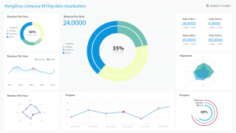
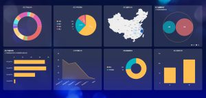

在这个大数据时代，各大行业都开始挖掘数据价值，以让企业能够更快更好地做出决策，并且能够利用数据更好的维系客户关系。而新零售行业更是数据应用的领头羊行业之一，不断数字化的交易让数据量以几何倍数在增长，更是有些大商家一个双十一活动就能让数据量翻上几十倍甚至几百倍以上。我们都知道，新零售行业是分类目的，不同类目有不同的运营和分析模式。比如食品类的客户生命周期就无法和家电类同比，前者可能只有30-45天就能回购，后者可能要以年计或是一次性客户。本次DataFocus就为大家分享活动数据复盘思路。

首先是总体数据分析。我们可以直接看计划销售额、实际销售额以及销售额完成率。并且对比的时间维度不用太多，两年即可，因为市场每一刻都在变。比如我可以直接搜索出2017年双十一的计划销售额和实际销售额，并使用VS关键词，对比2018年双十一的计划销售额和实际销售额，并计算销售额完成率，看看我们的销售额的增长情况。然后是两年的客单价和客件数对比，相当于对上一个数据的钻取，我们需要知道销售额的增长到底是客单价提升了还是客件数提升了，以更好的优化策略。

再者是推广费用合计。可以搜索总的推广费用，并搜索或钻取直通车、淘宝客、钻展、短信费用等维度，看看每个推广渠道的费用占比。然后在此基础上从运营的角度切入，进行流量分析，付费流量比如淘宝客、直通车等，免费流量如会场流量、搜索等，加上自主访问的流量，综合对比UV\\PV以及转化率，尤其是观察付费渠道的转化率。如果有稳定转化率的渠道，如聚划算，可持续做。

然后是利益点分析。利益点比如狂欢价、购物券、满减包邮等，一般来说利益点都与活动相关。有的商家活动利益点从预热开始，比如拉新、限量抢等，一直到活动结束的评价抽奖、积分兑换等，其实会让客户目不暇接，并且产生茫然感，甚至放弃。加上若是活动形式太多，对于分析人员来说也不便分析。一般我们可以搜索付款金额、付款人数、付款金额占比、付款订单数等维度。

以上就是可利用DataFocus进行活动数据复盘的思路参考。
