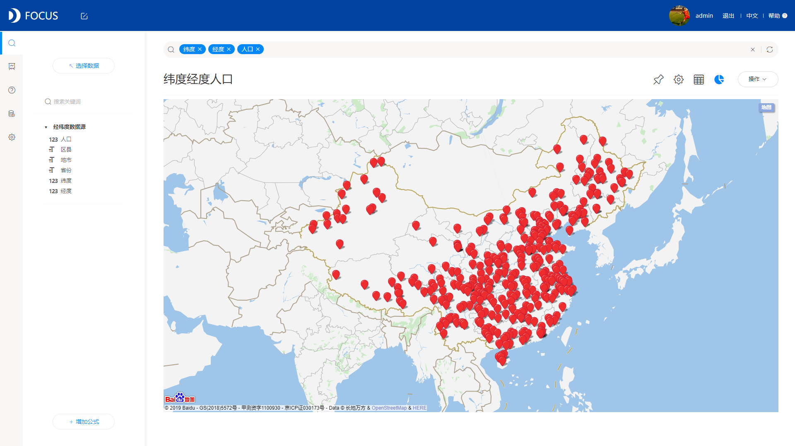

现如今，日常工作中，涉及到数据的表格、计算、图表和分析，大家首选的是什么？如果还是excel，那你就out了！

Excel好用吗，对于数据量少的并且只进行简单的统计这些，确实excel还可以应付，但是面对企业日积月累，以指数增长的数据，庞大而又复杂的计算公式，图形展示要求越高，没有很强代码能力的业务人员会感到很崩溃。那这种情况应该怎么办？一是要找到原因：excel满足不了企业的日常需求；二是提出解决方案：找一款专业的可视化工具，替代excel。

无论从效率，操作难易程度，图形展示效果，数据容量等，一款专业的可视化工具，都比excel来的好。比方说DataFocus，这也是一款专业的可视化工具，操作非常简单，不需要任何代码，分分钟可以做出一个好看的可视化大屏。

对于DataFocus这个可视化工具现在可能很多人还不太了解，那我就简单介绍下，看看DataFocus到底比excel强在哪里。

DataFocus是什么？

DataFocus 是首个中文搜索式数据分析系统，其集数据仓库，数据分析，数据可视化，报表系统于一身。今天我们主要介绍数据可视化部分。

DataFocus能干什么？

DataFocus的搜索分析，可以替代excel中大量手工作业，且在DataFocus中可以将常用的图表固定化，设置数据更新的频率，图表做一次即可，后面要用只需要查询就可以，省去了大量的人力物力时间。且系统可根据数据自动适配图形，非常智能。

DataFocus使用效果怎么样？

DataFocus支持30多种图表类型，每个图表以及可视化大屏都支持个性化设置，可以充分按照自己的习惯及喜好来设计；还完美匹配移动端，可随时随地查看图表。下面是我用DataFocus制作的一些图表及大屏：

所以，我个人觉得做可视化，还是选用专业的可视化工具比较好，这样既省时又省力。
