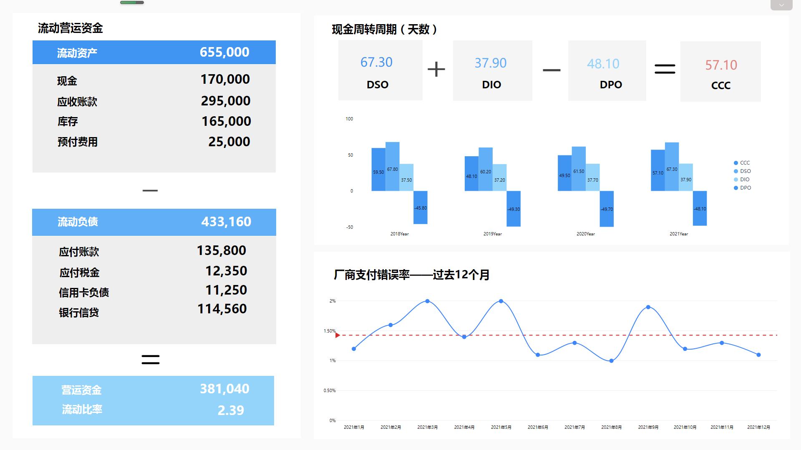
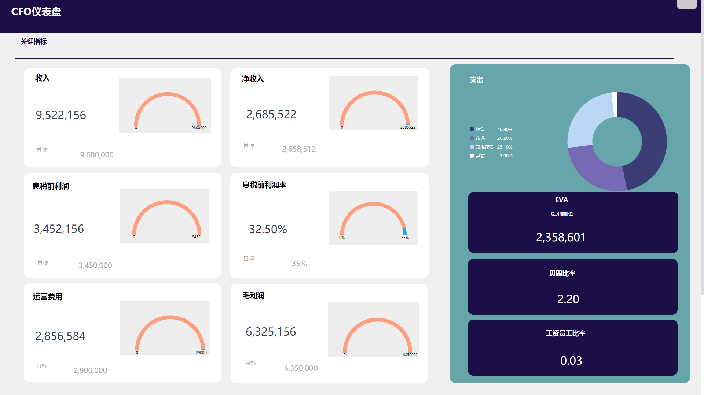

数据是决策的基础，尤其是在公司在做出重要决策时，财务方面的实时分析报告需求是至关重要的。借助专业的数据分析工具创建的财务报告可以清楚地反应公司的财务情况，同时为企业规划战略和解决财务问题时提供必要的决策基础。

那么依照什么样的步骤才能创建出全面的财务报表呢？您需要遵循以下几点步骤：

### **1.定义财务报表的目的和受众**

无论是中小型企业还是大型企业，在制作财务报表之前都需要清晰地定义出您想要通过报告实现的目标，以及报告的明确受众。明确报告面向的是公司管理层还是普通员工亦或是面向外部，这会对报告涵盖的内容造成巨大的影响。例如，是面向财务部门创建的内部报告，则可以包含专业的财务术语和数据；面向普通员工，则需将指标简化或者标注指标定义。

通过定义报表目标及受众，可以对报表呈现的指标和内容，以及指标专业性、复杂度做出初步的判断。可以选择先整理一份草稿大纲，然后逐步修改和完善，不要急于制作报表。

### **2.确定你的KPI**

在这一步，确定代表公司财务状况的关键绩效指标。可以从下述的3张表格中获取一些信息：

**资产负债表**：概述了企业的负债、资产和股东权益，显示了企业在特定时间段结束时的财务状况。

**损益表**：包括等于收入、支出和剔除成本后的净收益，表明了企业在一定时期内获得的收入，并显示企业的盈利能力。

**现金流量表**：详细说明企业在特定时间段内的现金流量变化情况，并表明企业在该时间段内是否产生或损失了现金。

这些财务报表中的专业数据可以帮助快速入门财务报告分析。此外，您可能需要考虑特定的KPI及其关系，例如毛利率、营业利润率、营业费用率等。

_DataFocus现金管理可视化大屏_

### **3.选择正确的可视化**

在指定要添加的财务报表和其指标之后，我们还需要考虑图表可视化包含的视觉效果。这一点对普通读者很重要，因为没有系统接触数据分析的普通员工很难消化原始数据，尤其是在处理大量信息时。

图表类型很重要，因为视觉效果的影响是即刻产生的。数据的组成、分布和比较，都将在报告实践中发挥出重要的作用。

举几个简单的例子，带有时间序列的折线图最适合查看数据的波动趋势，散点图和气泡图适合描述字段之间的相关关系，柱形图和直方图则适合描述数据的分布。据我了解到，BI工具DataFocus是可以根据输入的字段类型自动为您选择最合适的图形，可以大大减少图表选择的难度。**注意：选对比好看更重要！**

### **4.使用现代化软件和工具**

通过电子表格Excel制作报告的传统方式在目前信息化的时代已经不再使用，因为这样制作得到的报告结果不具备实时洞察效果，一定需要借助专业的分析工具。

现代化分析工具，例如DataFocus等，强大之处在于打破数据孤岛，将多个CRM系统和后台数据库相互关联，同时可以对数据进行实时访问，设置定时刷新和邮件发送等，这都是传统工具所无法实现的。同时，数据处理量级和反应速度也远超传统工具。

### **5.自动化您的财务管理报告**

自动化在当今创建公司财务报告中起到的作用可谓是至关重要。使用传统报告时，专业人员通常会浪费大量时间，需要每周、每月、每季度或每年都手动创建一份或多份报告。而通过自动化，可以大大提高分析人员的工作效率，避免重复作业带来的时间浪费，可以专注于其他重要任务。

您可以设计好财务报表报告样式，并设置时间自动将其发送给选定的收件人。此外，您可以共享您的数据看板或通过权限分配过滤数据查看人员等等。

 

_DataFocus财务相关可视化大屏_

通过DataFocus等分析工具创建不同情境下的多功能数据看板，可以帮助跟踪企业的收入、支出和盈利能力；运用数据进行预测分析，规划企业未来的运用发展；实时了解现金流变动，更有效地规划预算；提升数据分析的性能，摆脱传统工具带来的不便；创建并定制可视化报告。
