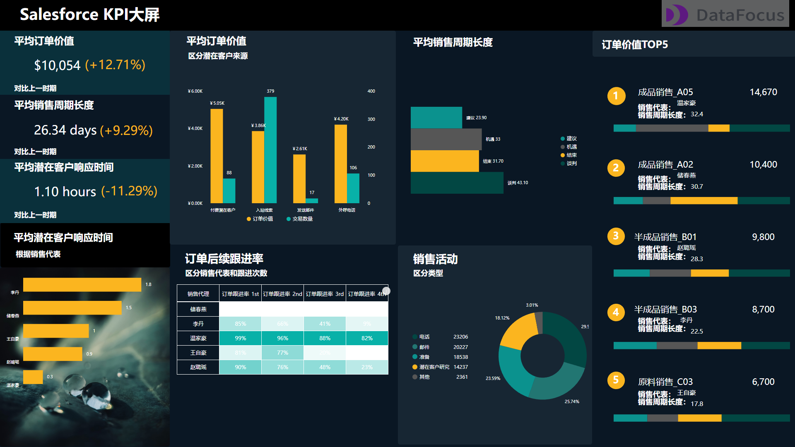
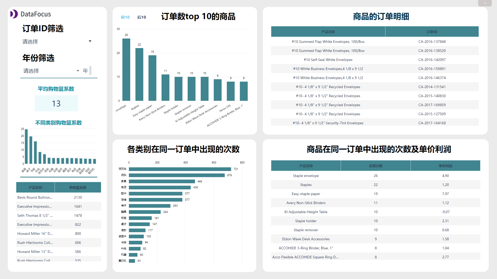
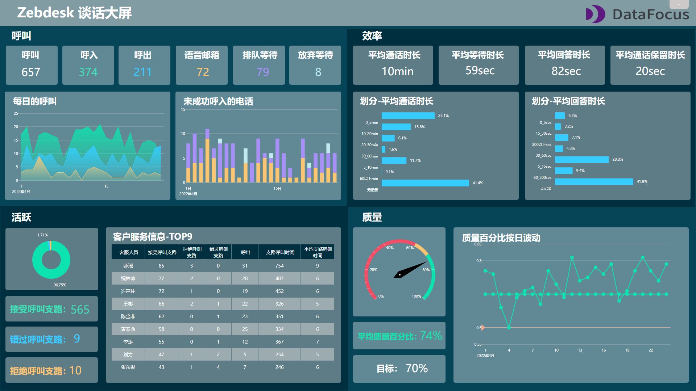

“过山车般的一年。”

谈到对今年的感受，身处旅游业运营部门的朋友小陈，不禁这样感慨道。“原本在3、4月份的时候还觉得今年旅游业能回春。”

这不，五一黄金假期刚结束，小陈又跑来向我诉苦，今年旅游业虽然因为疫情受到重创，但部门数字化的脚步并没有停下。领导现在不仅关注疫情和行业相关最新情报，还在不断精细化企业管理。像之前用Excel做出的报表总被领导挑剔，不是效率低下，就是做的太乱不够美观，小陈无奈道。

以前对于这些报表都是运营人员自己来做，采用的工具一般是Excel，仅仅是向多个部门收集数据就要耗费两三天，而且还时不时出现数据丢失、数据结构不统一等问题。尤其是旅游黄金期，数据量巨大，直接让工作量倍增。

而收集完数据就要开始制作报表，但Excel可选图表类型太少了，基本只能选择折线图、柱状图、饼图。如果有数据需要更改，又得重新制作，好不容易熬夜做出来的报表，又被领导吐槽又丑又乱。

我问他，为什么不试试像这样的可视化大屏呢？

可这样的可视化大屏不是还得让IT部门来做吗？现在IT部门人手稀缺，需求排期太满，每次和IT部门提完需求后，反馈速度都很慢。

其实制作可视化大屏早已不是只有IT部门人员才会的技能了。只要选择一款合适的工具，运营人员照样能轻松制作大屏。

我不允许还有人不知道这款叫DataFocus的良心国产工具，无需学习代码知识，花3秒把数据导入后，7分钟就可以制作出大屏。而且这上面还有很多免费的模板，直接套用就可以了，模板也提供了相应的分析思路，导入数据一替换就能用。

这款软件现在还推出了云版和免费版，注册登陆后就可以立刻数据分析，想做的时候随时随地可以做，低成本高产，再也不用担心熬夜还被领导吐槽了。

我选取了几款用DataFocus制作的优质模板，赶紧收藏，一定会用上！

关注我，并在下方评论“模板”，可以获得免费获得这些模板哦~

大屏集锦：

 
