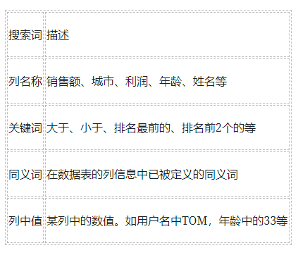
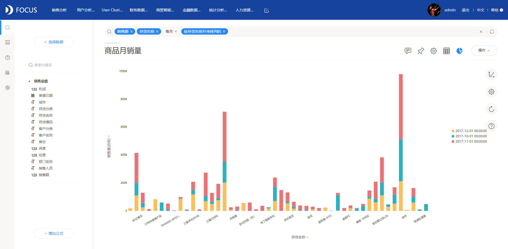

这款“搜索分析”的数据分析工具太酷了

说到数据分析，必定想到数据分析工具，从需要代码程序的python到R，从拖拽结构式的PowerBI到Qilk sense，数据分析工具在慢慢的变简单和自助。最近小编接触到国内的一款数据分析工具DataFocus，使用的是搜索式分析，惊艳到我了。

在这个AI智能时代，人机对话技术已经被应用到各个方面，DataFocus就是通过AI人机对话，分析问题并智能呈现图表的一款新型数据分析工具，是全球首个中文语言自然搜索数据分析工具，那么它到底是怎么进行“搜索分析”的呢？

FOCUS搜索基于数据表，所以在搜索框里可以输入任何相关的单词进行搜索如下表：

 我们来简单的举个例子，我们需要查看每个月商品的月销量情况：进入DataFocus搜索页面，在搜索框中输入“销售额 存货名称 每月”并将数据列按存货名称升序排列，可视化结果如下图：在英文条件下可以通过直接输入列名、已被标记的同义名、英文的关键词及列中值进行搜索；现阶段在中文条件下，若想通过输入列中值来搜索数据则需要对列中值加引号（单双引号都可以）才能使操作有效。

简单搜索就能出图，这款“搜索分析”的数据分析工具是不是很酷！
