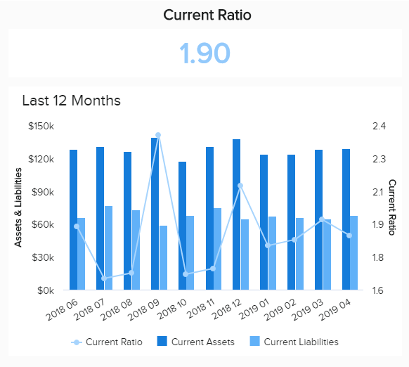

故事激励、吸引人并具有将统计信息转化为引人入胜的叙述的独特能力，从而显著提高业务成功。

通过获得对公司数据的集中访问，并以遵循逻辑路径的可视化方式呈现数据，并提供对特定领域或主题的宝贵见解，您将从竞争对手中脱颖而出，成为您所在领域的领导者。

在这里，我们将探索数字时代数据叙事的无与伦比的力量，同时查看由现代[仪表板创建者](https://www.datafocus.ai/infos/dashboard-creator)生成的强大数据叙事示例的组合。

## 什么是数据讲故事？

数据讲故事是用一种易于理解和广泛访问的格式交流相关见解的过程。通过使用叙述和可视化的结合，企业可以将他们的业绩纳入背景中，并做出明智的战略决策。

除了这个数据讲故事的定义之外，数据故事的力量还在于我们对传达信息的情节和叙事的天然亲和力。通过利用正确的工具，我们可以获取定量指标或信息，将其排列成逻辑格式，并创建一种简化复杂信息的叙述，以吸引特定目标受众的方式呈现。

也就是说，数据讲故事由三个主要元素组成，这使它们比传统统计数据更具吸引力。分别是叙述、数据和视觉效果。为了讲述一个好的和引人入胜的故事，有必要建立一个有趣的叙述，让观众对数据感兴趣。这要归功于可视化的巧妙使用，将数据从数字转化为可操作的见解。

我们将在后面的文章中更详细地讨论这些要点，现在让我们深入探讨讲述高效的数据故事带来的大量促进业务的好处。

## 为什么数据讲故事很重要？

故事有助于理解我们周围的世界，而这个概念正是使用数据讲故事的核心。

根据 Skyword 进行的一项研究，包含文字和视觉效果的内容比纯文本文章、博客文章或白皮书的参与度高出34%。通过利用数据可视化、[可视化分析](https://www.datafocus.ai/infos/visual-analytics)的力量，并结合相关见解来创建引人入胜的故事，您将获得一切。

以下是了解如何用数据讲故事的主要好处：

1. **包容性：**如前所述，从根本上讲，故事可以帮助我们理解一个复杂、偶尔令人困惑的世界。通过使用正确的数据讲述工具来衡量、跟踪和提取相关数据，并将其放入符合特定公司目标的叙述的可视化格式中，您将使您的分析信息能够被更广泛的受众访问。通过这样做，您将能够以一种激发灵感的方式分享重要信息，从而鼓励相关方或利益相关者的支持。
2. **决策：**通过功能强大的[KPI 仪表板软件](https://www.datafocus.ai/infos/kpi-dashboard-software)讲述数据故事，您将能够在整个组织的多个关键领域推动改进决策。如果您的受众（无论是组织内部还是外部）能够遵循叙述并从您的演讲中提取正确的信息，他们将获得所需的洞察力，从而将他们的战略建立在严密的数据上，从而使组织更高效、更经济、更成功。
3. **组织：**在一个由数据主导的世界中，知道要探索哪些见解可能会令人生畏。但是通过使用正确的数据叙事工具，不仅可以简化分析过程，而且您还可以获得以有效、高效的方式排列数据的能力，并最终节省时间。正如您所知道的那样——在商业中，时间就是金钱。
4. **行动：**如果您用数据讲述故事，并针对目标受众定制您的演讲，您将获得可操作的结果。如果人们被你展示给他们的东西所鼓舞，并且他们深刻而有意义地理解它，他们就会按照你想要的方式行动。例如，如果您的受众是内部人士，他们可能会制定有助于加强公司营销工作的计划。或者，如果您通过数据讲故事向外部利益相关者展示，您可能会促使他们增加投资。

_“讲故事是人类的基本活动。情况越严峻，就越重要。” ——蒂姆·奥布莱恩，作家_

## 7 个数据讲故事的技巧和最佳实践

很明显，用数据讲故事是很强大的。为了把如何用数据讲故事的概念放到实际的角度，在这里我们结合了数据讲故事技术和最佳实践，并以可操作的建议为后盾，帮助您入门。让我们一探究竟吧！

**1) 将指标转化为可操作的概念**

正如我们所探索的，知道如何用数据讲述故事将使您能够将指标转化为可操作的概念或见解。

将定量数据转化为以结果为导向的叙述的最有效方法之一是使用关键绩效指标 (KPI)。通过利用交互式商业智能 (BI) 仪表板的强大功能，您将能够选择与您的核心组织目标一致的 KPI，使用图形、图表和视觉效果的完美组合来构建一个将数据带进生活中的叙述。

要深入了解这个最无价的概念，请阅读我们的数据驱动[仪表板演示](https://www.datafocus.ai/infos/dashboard-storytelling-with-kpis-presentation-examples)指南。

**2)建立叙述**

回到我们前面提到的第一个组成部分，每一个可靠的故事，无论其主题或格式如何，都有一个确定的情节：_开头、中间和结尾。_通过使用数据讲故事的模板、工具和平台，您可以使用可视化来填充情节，这将推动叙事向前发展，同时以最有效的方式传达您的信息。就像任何电影或书籍一样，您的数据故事应该从设置当前场景开始，然后提供导致冲突的见解，并最终提供有用的建议来推进。

要通过绘图改进您的流程，您应该坐在一个协作环境中，并在概述开头、中间和结尾的同时考虑数据驱动故事的主要目标。框架到位后，您应该开始使用 KPI 和可视化来填充您的图表，这些 KPI 和可视化不仅代表您要说的内容，而且与您希望呈现的数据最相关。通过逻辑地处理您的情节，并使用正确的视觉效果来充实它，您将有助于简化组织中的流程，从而提高效率和生产力。接下来我们看看可视化组件。

**3) 定义数据源**

这可能是本文中讨论的最简短的要点之一，但是，它在此过程中至关重要。一旦你构建了你的故事框架，你就需要找到可以帮助你讲述它的数据，因为这是成功的分析性故事讲述的基础。在这里，您应该只优先考虑对您的分析有益的数据。就像我们稍后将看到的使用可视化效果一样，您不希望用无限的数据点压倒您的观众。仔细考虑您将使用的变量，仅保留关键数据，因为这是减少认知负荷的绝佳方法。

认知负荷概念建立在这样的前提下：“由于大脑一次只能做这么多事情，我们应该有意识地要求它做什么”。也就是说，集中您的数据点是很有意义的。

**4) 选择正确的可视化**

视觉效果是任何成功的数据故事都应该考虑的第三个也是最后一个相关组件。一旦你建立了一个有效的叙述并选择了你将用来讲述它的数据源和 KPI，那么还需要选择将使整个故事生动起来的图形表示形式。

有很多视觉效果，例如条形图、折线图、表格和饼图等等。虽然从所有这些方法中受益可能听起来令人兴奋，但您需要谨慎决定使用它们的方式和时间。并非所有视觉效果都适用于所有目的。在这里，遵循特定的[数据可视化技](https://www.datafocus.ai/infos/data-visualization-techniques-concepts-and-methods)以保持正确的道路非常重要。例如，使用饼图比较 3 个以上的元素可能会导致视觉混乱，使其难以理解。相反，使用条形图来展示不同元素之间的比较可能会更好。

关于视觉效果的另一个重要注意事项是保持简单。避免使用任何会使您的数据更难理解的 3D 图形。虽然为图表赋予维度可能看起来很复杂，但它也会显著影响视觉的感知方式。因此，始终将简单性作为优先选项。在这一点上，在整个演示过程中保持一个清晰的调色板也可以使其更具凝聚力和容易理解。

**5）消除任何混乱**

另一个重要的最佳实践是保持讲故事的重点。你可以把它想象成一个演示文稿。你肯定不想用一堆文字和数字淹没你的观众。对于仪表板等集中的数据视图以及特定图形上的更详细视图来说都是如此。

一方面，仪表板对于围绕 KPI 构建叙述非常有用，但是，用太多指标填充它们也可能会令人困惑。尽量只包含那些真正为您的故事提供价值的内容，并避免任何不必要的混乱。您还可以遵循[仪表板设计](https://www.datafocus.ai/infos/dashboard-design-principles-and-best-practices)最佳实践，以确保您走在正确的道路上。

另一方面，如果没有正确构建图表和图形，它们也会变得混乱。在这里，您应该只优先考虑您需要表达观点的数据集。举个例子来说，如果您想按收入显示排名靠前的产品，可以仅使用 5 个产品而不是 10 个，因为太多的数据点会误导你的叙述。

**6) 简化并建立联系**

如果您的组织全面了解情况、运转良好且具有战略性，那么随着时间的推移，您将成长、发展并提高利润。

通过利用数据讲故事的力量，您将能够连接各个点，简化想法，建立能够让您的企业重新获得战略方向感的联系。

为了从您的数据讲故事工作中获得最大收益，您应该专注于在您的洞察力和您的受众之间创建交互式对话，使用历史、实时和预测数据的组合来驱动您的信息，无论是[财务报告](https://www.datafocus.ai/infos/financial-reporting-and-analysis)流程或公司的战略发展。

此外，您应该在您的文字和视觉效果之间建立平衡或和谐，以使您的观众更容易建立必要的联系，从而促进业务增长。

简化讲解的创造性数据驱动叙述的最有效方式是采取“_用数据可视化讲故事”_的方法。现在，我们将在实践中探索这个宝贵的概念。

**7) 依靠正确的数据工具**

虽然我们刚刚提到的所有数据讲故事技术和最佳实践似乎都是为专业人士设计的，但事实并非如此。如果你使用正确的工具来实现它。今天，有各种各样的[在线数据可视化工具](https://www.datafocus.ai/infos/data-visualization-tools)，他们都是用户友好的，并为用户提供了必要的功能，可以用他们的数据生成易于理解和交互式的故事，而无需任何技术技能。

例如，DataFocus提供了一个带有多个图表选项的直观[仪表板工具](https://www.datafocus.ai/infos/online-dashboard)，允许您根据最重要的 KPI 和数据源创建有效的叙述。如果您还没有准备好构建自己的仪表板，该工具还提供了 80 多个模板，可帮助您在几分钟内高效地讲述多个行业和功能的数据故事。使用这类工具使讲故事的过程更加容易，因为它使任何知识水平的用户都可以使用数据进行决策。随着时间的推移，您的整个组织将成为数据驱动的，并获得巨大的竞争优势。

## 通过可视化的数据讲故事示例

正如这篇文章中提到的，数据可视化讲故事是与观众分享故事的最佳方式。它是我们迄今为止提到的所有想法的粘合剂。为了展示它的力量，这里有两种截然不同但同样强大的故事，并带有数据示例，用于根据您的见解构建有效的叙述。

### 1\. 带有仪表板的集中视图

如文章前面提到的，有两种方式可以讲述你的数据故事。仪表板是可视化分析工具，可为用户提供其最重要绩效指标的集中视图。这些 KPI 中的每一个都在所讲述的叙述的背景下发挥着重要作用。借助这些交互式工具，用户可以以交互式方式导航和探索数据。让我们看两个使用仪表板讲述数据故事的示例。

### a) 员工绩效仪表板示例

主要用于简化繁忙的人力资源部门，这个专注于员工绩效的[人力资源仪表板](https://www.datafocus.ai/infos/dashboard-examples-and-templates-human-resources)具有混合的 KPI，围绕出勤率、个人生产力、培训成本和累积的加班时间建立一个全面的档案。

通过利用[人力资源分析工具](https://www.datafocus.ai/infos/business-intelligence-human-resources)，可以使用图表、图形和图形信息的这种动态组合，并构建与特定时间范围内的员工绩效相关的有效叙述，创建一个引人注目的情节，从而提高生产力和经济效率，以及支持将成倍提高员工敬业度的战略。

通过查看此仪表板和相关的[HR KPI](https://www.datafocus.ai/infos/kpi-examples-and-templates-human-resources)，您可以轻松了解如何围绕这一完美的洞察风暴构建图表。再加上相关的基于 HR 的仪表板中的数据可视化给你拿，可能性似乎是无限的；从创建有效的[人力资源报告](https://www.datafocus.ai/infos/monthly-and-annual-hr-report-templates)到获得整个人力资源流程和发展有一个全面的了解。

**特色 KPI：**

- 缺勤率
- 加班时间
- 培训费用
- 员工生产力

### b) 销售业绩仪表板

我们的下一个数据故事示例侧重于销售部门随时间推移的发展。此[销售仪表板](https://www.datafocus.ai/infos/dashboard-examples-and-templates-sales)提供了部门进度的综合画面，重点关注销售增长、销售目标、ARPU、CAC 和 CLV。对于任何提供产品或服务的企业来说，销售都是最重要的领域之一。因此，能够建立一个可以理解的业绩故事，对于确保增长和盈利能力至关重要。

通过混合使用当前和历史数据，该仪表板使销售团队能够清楚地了解关键指标是如何及时发展的，并找到改进机会以实现其最终目标。

该数据讲述工具提供的交互水平允许更完整和直观的分析过程，因为可以轻松过滤和探索图形和图表，以发现新的见解并支持过程中可能出现的任何讨论。

**特色 KPI**

- 销售增长
- 销售目标
- 每用户平均收入
- 收购成本
- CLV

### 2\. 查看详细视图的 KPI

如前所述，仪表板为企业提供了最重要的 KPI 的集中视图。这些 KPI 在交互式图表的帮助下进行描绘，使数据更易于理解。我们已经提到了一些构建图表来讲述数据故事的最佳实践。现在让我们看一些例子来更好地理解它们的价值。

### a) 合规率 KPI

作为跨行业的基于实现的重要 KPI，这种动态图表组合提供了特定时间范围内供应商合规率的全景快照。

[作为我们采购仪表板](https://www.datafocus.ai/infos/dashboard-examples-and-templates-procurement)的一个关键组成部分，合规率 KPI 是个人可视化在传达重要信息方面的强大功能以及它如何适应更广泛的叙述的一个典型例子。

可以将此 KPI 置于围绕采购结构、成功和流程的故事的核心，除了公司的整体合规成功率之外，还提供每个供应商的合规细分。

[结合我们额外的前 10 大采购 KPI](https://www.datafocus.ai/infos/kpi-examples-and-templates-procurement)的定制组合，可以开发一个故事，帮助传达关键趋势、连接组织点，并分享推动真正变革的可行见解。数据讲故事的主要[业务报告示例](https://www.datafocus.ai/infos/business-report-examples-and-templates)。

### b) 流动比率

[可以说是财务分析](https://www.datafocus.ai/infos/finance-analytics)中最重要的指标之一，流动比率衡量公司在短时间内（通常在 12 个月内）支付其财务债务的能力。

现在，仅凭当前比率并不能告诉我们足够的信息来构建一个准确的故事或得出任何有价值的结论。这就是为什么这个图表模板是用提供上下文的补充数据构建的。流动比率是通过将流动资产与流动负债相除来计算的。因此，该图表提供了这些指标在过去 12 个月中如何变化的情况。这些信息可以让观众更清楚地了解数据是如何波动的，以及它是如何达到其当前值的。

在直观的[财务仪表板](https://www.datafocus.ai/infos/dashboard-examples-and-templates-finance)中将此图表与其他图表相互补充，将提供企业财务健康状况的完整图景，并提供确保持续改进的必要工具。

## 高效数据故事的关键要点

_“你永远不会扼杀讲故事，因为它是人类计划中的一部分。我们随之而来。” ——玛格丽特·阿特伍德，《使女的故事》作者_

当我们读到本实用指南的结尾时，我们希望您了解有效讲述数据故事背后的主要原则。我们涵盖了一系列好处、最佳实践和示例，以充分展示这种实践的力量。关键是要时刻牢记叙事、数据和视觉效果如何相互交织在一起的，从而构建能够推动业务发展的高效故事。正确使用这三个元素将使您能够用事实支持您的观点，同时让您的观众参与到这个过程中！

抛开行业或细分市场之外，用数据讲故事将推动您的业务达到令人兴奋的新高度。借助DataFocus 的30 [天试用版](https://www.datafocus.ai/console)，您可以开始自己的数据故事，并立即体验数据讲故事的力量！
