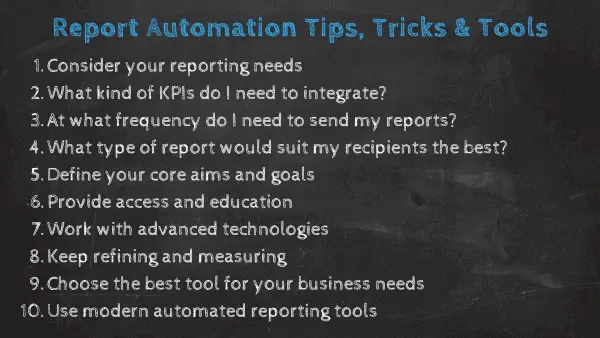
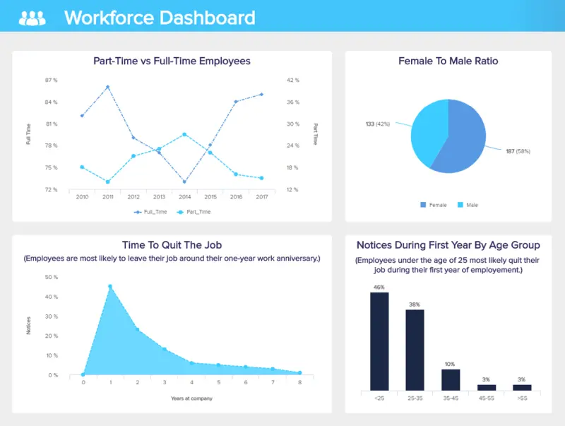

数据、信息和见解就在我们身边。 为了超越您的潜力并在竞争日益激烈的市场中脱颖而出，总有新的商业计划要制定，有新的战略要制定，有新的报告要生成 - 所有这些都需要时间。 由于每秒都会生成大量信息，因此企业一直在寻找最好的[在线数据分析工具](https://www.datafocus.ai/infos/data-analysis-tools) - 最终将使其流程更轻松，更快，更有效的创新。

生产力已成为成功专业流程的缩影。 虽然每个经理都在寻求如何提高生产力和降低成本，但一些宝贵的流程可以推动可持续发展 - 幸运的是，自动化报告和系统是前进的方向。

 

也就是说，在这篇文章中，我们将解释什么是自动报告及其好处，流程的来龙去脉，并以真实商业世界的示例结束。

阅读本文后，您将有能力创建自己的自主实践，了解报告自动化的基础知识，并在现代[在线报告软件](https://www.datafocus.ai/infos/online-reporting)的帮助下增强您的分析能力。

让我们开始吧。

您的机会：[想要测试现代报告自动化软件吗？](https://www.datafocus.ai/console) 探索我们的 14 天免费试用版并使用 DataFocus 自动化您的流程！

## 什么是自动报告？

自动报告是专业人员用来在特定时间间隔创建和共享组织报告的管理工具，而无需每次都更新信息。 这些更新通常是在智能报告工具的帮助下实时进行的。

这些报告完全消除了传统的数据通信方式，因为它们依赖于使用尖端 BI、技术和智能功能（如交互性、拖放界面和预测分析等）的业务[报告软件](https://www.datafocus.ai/infos/business-reporting-software)。 这些报告能够存储您的所有见解并生成漂亮的仪表板，这些仪表板可以以简单、直观的方式讲述您的数据叙述。

这些见解背后的技术将启用触发器，这样您就不必手动检查是否发生了意外的组织事件或导出多个电子表格以生成单个文件。

## 自动报告系统的优势

现在我们已经掌握了智能报告的概念，让我们看看它的好处。 首先，当问自己“为什么我应该使用报表自动化？ ”这个问题时，简短的回答应该是“为什么不呢？

报告自动化将从本质上改善您的业务，使您能够制定比竞争对手更好的战略和计划。 为了正确看待这一点，以下是为您的公司使用自动化报告的主要好处的概要。

- 节省时间和成本：如果您自动报告，您将节省大量的时间和金钱来手动跟踪，更新和添加关键信息。 当然，时间和金钱是相关的，因此通过自动化报告，您将获得有价值的数据驱动型见解的回报，同时使您的团队能够将精力投入到更具创造性或战略性的活动上。 此外，自动报告系统旨在提供准确、动态和高度可视化的见解，为您的组织提供更大的智能。 反过来，这将改善您的决策，同时为您提供洞察力，以简化流程中的任何低效率，并最终为您节省更多资金，同时产生更多利润。
- 可访问性、透明度和生产力：通过从一个中心位置提供自主见解，自动报告将为组织中的每个人提供工具，使其在个人角色中表现得更好，同时受益于强大、可靠和准确的共享可视化。 由于现代自动报告工具易于使用和理解，因此每个人都会发现它们易于访问。 由于它们将确保您的所有基本见解都是最新的，因此可以使用自主报告来支持协作头脑风暴会议或团队会议中的讨论，从而提高创意产出。 结果呢？ 一个更透明、更具协作性的环境，让您的团队保持[相互联系](https://www.scoro.com/blog/improve-cross-team-collaboration)，从而全面提高生产力，并为可持续增长而建立业务。
- 实时决策：使用手动报告工具或流程时，很容易陷入困境。 除此之外，更繁琐的报告流程会返回更难理解且通常不准确的数据。 通过自动报告，您可以访问以可视化[KPI指标](https://www.datafocus.ai/infos/kpi-examples-and-templates)形式呈现的准确数据 - 有利于实时决策的信息。 从本质上讲，这种报告风格提供了清晰度。 它设置简单，并提供实时数据，用户只需一眼即可利用这些数据。 如果您发现问题出现，您将能够咨询您的客户并做出明智、准确的决定，这将节省您的时间、金钱或组织头痛。

- 增长和发展：上述元素，加上您可以从多个设备24/7全天候访问报告自动化工具的事实，意味着通过采用数据分析的这一创新分支，您将为公司的持续增长和发展做好准备。 借助交互式[数字仪表板](https://www.datafocus.ai/infos/digital-dashboard-definition-and-examples)，您可以自信地应对不断变化的变化，同时保持创新水平，让您始终在竞争中占据重要优势。 在不断发展的数字环境中，这是一项无价的资产。
- 降低人为错误的风险：自动化报告的另一个主要好处是它为人为错误留下的空间更少。 一个小的分析或管理错误可能会花费您的公司时间和金钱。 但是，通过使用报告自动化技术，您将减少对费力的手动数据输入的需求，同时与易于消化、准确和可靠的见解联系起来。
- 提高合规性：当自动生成仪表板，并且可以确保在正确的时间和地点交付时，合规性变得更加易于访问和例行。 在我们这个数据驱动的时代，信息合规性对于确保您的组织保持可信、合法和值得信赖至关重要。 自动报告将确保您始终站在繁文缛节的正确一边。

## 报告自动化提示、技巧和工具

67%的业务决策者认为实施数字或软件解决方案对于保持竞争力至关重要。

自动化的潜力肯定会对生产力水平产生积极影响，因为整个劳动力可以专注于更以人为本的任务，同时围绕数据的含义进行更深入的讨论，摆脱繁琐的任务和过程中的手动计算。 但这在实践中如何看待呢？

为了确保您充分利用自主报告，在开始之前，请回答这些关键问题并考虑这些提示或技巧。

### 1\. 我的报告需求是什么？

首先，重要的是要考虑您的特定信息需求。 根据您认为将从提高智能或效率中受益的内容（例如，您可能觉得需要在不影响生产力的情况下改进客户服务通信），您可以就最适合您的组织的功能、仪表板和可视化类型做出明智的决策。 此时，还值得考虑谁将使用您的自动化报告以及他们成功所需的功能见解。

花点时间解决您的特定需求，您将为下一个自动报告问题奠定坚实的基础......

### 2\. 我需要整合什么样的关键绩效指标？

KPI 是每个工具的中心，您需要清晰、准确地传达它们。 选择最重要的内容来生成全面的叙述应该是您自动化报告的第一步。 通过在[仪表板设计器](https://www.datafocus.ai/infos/dashboard-designer)的帮助下创建视觉对象，您可以将所有 KPI 放在一个屏幕上，随时可以利用强大的交互功能进行探索。

### 3\. 我需要以什么频率发送报告？

此问题将帮助您确定您的见解是侧重于运营层面还是战略层面。 [运营报告](https://www.datafocus.ai/infos/strategic-operational-reporting)的基础是较短的时间范围，通常每天或每周，并专注于较低级别的 KPI。 另一方面，战略着眼于需要在较长时间内监控的指标，以便能够得出最佳结论。

您可以浏览我们的财务报告指南，我们在其中分析了各种类型的[报告](https://www.datafocus.ai/infos/daily-weekly-monthly-financial-report-examples)并提供了示例。

### 4\. 哪种类型的报告最适合我的收件人？

如前所述，人工智能驱动的报告具有许多功能，应该使您的工作生活更轻松。 在开发适当的自主报告系统时，您应该寻找这些宝贵的选项，以更好地利用您的努力：

- 标准和自定义报告：无论收件人数量如何，标准和自定义报告都只需按照定义的时间表发送到指定的电子邮件地址。 他们的内容和过滤器可以自定义，因此您可以完全控制要共享的信息。
- [实时](https://www.datafocus.ai/infos/live-dashboards)仪表板和/或安全查看器区域：如果要共享或发送整个仪表板，只需一个简单的 URL。 此外，您可以分配一个查看器区域，用户可以在其中访问仪表板并使用您分配的筛选器，但他们无法自行编辑或重新排列仪表板。
- 嵌入仪表板：通过更进一步，您的仪表板可以嵌入到您自己的应用程序或网站中，例如，您可以接管整个产品并将其作为您自己的产品呈现给您的客户。 通过使用[嵌入式BI](https://www.datafocus.ai/infos/embedded-dashboards)工具（如DataFocus），您可以获得该软件的所有好处，而无需投入大量金钱和时间来创建自己的工具。
- 打印边界：打印虽然是一种更传统的数据呈现方式，但有时证明是有用的，尤其是对于面对面的会议。 您只需设置打印仪表板的提醒，所有更新的指标都将以功能性 PDF 或 PNG 格式显示。

您的机会：[想要测试现代报告自动化软件吗？](https://www.datafocus.ai/console) 探索我们的 14 天免费试用版并使用 DataFocus 自动化您的流程！

### 5\. 定义你的核心目的和目标

虽然这听起来很明显，但你会惊讶于有多少人忽视了这条黄金法则。 现在，我们已经概述了设置 KPI 的重要性。 我们在这里的意思是：决定您认为需要简化的特定部门、流程或职能，并在这些参数内定义您的核心数据自动化目标。

您想节省时间来证明您的付费广告工作的价值吗？ 您是否正在寻找一种更好、更有效的方式来显示团队的绩效指标？ 节省筛选招聘见解的时间是重中之重吗？ 如果您设定了特定目标，您将在正确的领域简化数据分析策略。 因此，您的自主见解将提供与最重要的部门职能相关的响应式智能见解。 例如，您的销售团队可以不断访问您的[社交媒体报告](https://www.datafocus.ai/infos/social-media-reports-examples-and-templates)，并查看您从某个广告系列中获得的潜在客户数量。

### 6\. 提供访问和教育

在自动报告方面，受益的人越多越好。 与其让少数人单独访问，不如举办研讨会，让公司中的每个人了解自动数据报告的优点。

通过为组织中的每个人提供对您的工具和模板的某种形式的访问权限，并教他们如何利用它们来发挥自己的优势，您将创建一个数据驱动的声誉，从而提高生产力和全面参与度。 这也延伸到合作伙伴和客户：通过提供对自动报告的访问，您将使他们能够通过使用响应迅速、可靠的实时数据来检查他们的绩效。

### 7\. 使用先进技术

报表自动化附带大量直观的技术，使策展、收集、可视化和分析过程更简单、更快捷、更准确。

在人工智能 （AI） 的推动下，许多自动报告系统功能以最少的人为干预提供动态信息可视化和深入见解。 利用这些自主技术将简化您的运营，同时确保您不会错过重要的趋势、模式或信息。

[数据警报](https://www.datafocus.ai/infos/business-intelligence-data-alerts)是基于 AI 的报告样式函数的一个主要示例。 智能数据警报由神经网络和机器学习技术提供支持，根据您的特定目标和需求，在关键的组织里程碑（例如，达到基准或出现需要立即关注的某种模式时）通知您。 一项强大的功能，可全面提升您的商业智能 （BI） 功能，同时最大限度地减少为持续监控数据波动而投入的手动工作量。

### 8\. 不断完善和测量

自动化报告非常强大且有价值。 但这并不意味着您可以运行报告并期望它无限期地提供价值。

要从智能报告中获得健康的投资回报 （ROI），您应该定期检查它们，以确保您正在使用的数据仍然相关。 如果您的公司不断发展或您周围的行业发生变化，您可能需要稍微重新定义您的目标并优化您的可视化。 这样做将确保您继续获得这些提升奖励。

### 9\. 选择最适合您需求的工具

无论哪个行业，数据收集的过程都是繁琐且耗时的。 想象一下，通过简单地跨部门引入自动报告生成，可以减少多少时间。 为了能够充分利用它，您应该根据您的特定需求明智地选择报告自动化工具。

虽然一些[商业智能](https://www.datafocus.ai/infos/best-bi-tools-software-review-list)工具包括自动报告功能以及交互式仪表板，但其他工具（如 DataFocus）还提供了许多执行质量分析的高级方法，例如预测分析、数据连接器以在一个位置查看所有信息，以及让您知道数据中发生任何非常规情况的数据警报。 像这样，在选择自动报告工具时，您应该始终考虑可以从中提取的额外潜力。

### 10\. 使用现代自动报告工具

使用现代自动报告工具是前进的方向。 正如我们告诉您的，[BI解决方案](https://www.datafocus.ai/infos/business-intelligence-bi-solutions)（例如DataFocus）提供了创建标准或自定义平台的选项，同时将最有价值的数据整合到一个动态且可访问的仪表板中。 观看我们的视频概述，了解我们的自动报告工具的实际应用：

 

为了充分了解报告自动化软件如何使公司的运营和战略计划受益，无论它们有多大，我们准备了行业真实世界的示例，我们将更详细地探索这些示例，并确保您在实践中直观地了解智能报告。

## 业务场景中的自动报表系统

为了正确看待自动报告的强大功能，我们将根据五个常见的组织职能、部门和方案查看五个仪表板。

### 1\. 制造业的自动报告

制造业需要在整个流程中实现持续自动化，公司的每个部分都需要完美地工作，以避免潜在的内部问题和成本增加。 这就是为什么像下面这样的[敏捷 BI](https://www.datafocus.ai/infos/agile-business-intelligence-analytics)仪表板可以在此过程中提供帮助的原因。

\*\*点击放大\*\*

此仪表板旨在报告制造公司的生产状态。 在这种情况下，自动化至关重要。 当有许多接触点需要控制、分析和反应时，如有必要，该软件将被证明是无价的。 通过让仪表板自动监控和报告是否存在任何问题，公司可以成倍地提高效率。 [制造 KPI，](https://www.datafocus.ai/infos/kpi-examples-and-templates-manufacturing)例如产量、活动机器数量以及按产量排名前 5 的机器，肯定会让您清楚地了解设备的状态。

您无需手动更新任何数据，自主报告将提供您的生产过程的全部范围并及时提供信息。

### 2\. 营销中的自动报告

营销是需要定期和更新报告的功能之一，无论是每日、每周还是每月数据。 为了能够启动和优化最佳广告系列，可视化[营销报告](https://www.datafocus.ai/infos/daily-weekly-monthly-marketing-report-examples)可以让您专注于手头的数据，不包括导出电子表格和编写全新文档所需的时间。 在营销中，这个概念是宝贵的。

\*\*点击放大\*\*

我们可以看到，探索上面报告中描述的数据是多么容易，这些数据侧重于付费促销工作的效果。 通过每周或每月发送此报告，而无需手动更新每条内容，您的营销部门将节省无数的报告创建时间。 此外，如果您在一个代理机构中管理多个客户帐户，则此报告也可以嵌入，并标记为[客户报告仪表板](https://www.datafocus.ai/infos/client-dashboard-report-examples)，因此您可以将其用作自己的品牌并进行调整，使其符合客户的需求。

### 3\. 物流和运输自动化

在蓬勃发展的数字经济中，无论客户身在何处，都可以与他们建立联系，您需要确保您的运输物流在每个关键接触点都得到全面优化。

\*\*点击放大\*\*

我们的智能运输仪表板旨在提供基本[物流指标](https://www.datafocus.ai/infos/kpi-examples-and-templates-logistics)的详细快照，包括装载和重量以及交货时间、目的地和状态，将帮助您以最小的摩擦简化策略。 在这里，您可以查明需要改进的问题或领域，同时不断对您的活动进行基准测试，以实现持续的流畅性、一致性和增长。

### 4\. 销售和收入增长的自动化

如果没有正常的销售流，您的公司会在哪里？ 为了最大限度地提高您的销售工作和活动，同时保持始终如一的高生产力水平，您需要正确的见解 - 我们的[销售仪表板](https://www.datafocus.ai/infos/dashboard-examples-and-templates-sales)可以提供。

\*\*点击放大\*\*

这款精明的工具拥有基于 KPI 的销售图表类型、[图表](https://www.datafocus.ai/infos/sales-graphs-and-charts-for-managers)和可视化效果的平衡组合，可根据您的交叉销售或追加销售活动、根据活动增加的销售额、每个销售代表的收入等提供深入的信息。

这个深入洞察的大熔炉将帮助您完善消息传递、策略和潜在客户生成活动，以实现持续增长和成功，同时降低不必要的成本 - 这是每个现代企业的基本工具。

### 5\. 采购和质量控制自动化

您如何采购商品、服务和资产将对公司的整体增长及其底线产生巨大影响。

\*\*点击放大\*\*

我们的采购仪表板是信息的神经中枢，提供以KPI为中心的见解，包括供应商拒绝率和成本，供应商质量评级，紧急采购比率，时间和预算[采购](https://www.datafocus.ai/infos/dashboard-examples-and-templates-procurement)以及管理支出。

通过经常访问此信息流，您可以评估现有供应商的价值，同时识别采购过程中的任何潜在问题。 通过这样做，您将提高财务效率，并确保采购链中没有障碍或瓶颈，从而使您的组织在此过程中更加健康。

您的机会：[想要测试现代报告自动化软件吗？](https://www.datafocus.ai/console) 探索我们的 14 天免费试用版并使用 DataFocus 自动化您的流程！

### 6\. 财务管理和战略自动化

自动化报告以提高财务效率至关重要，因为它们将有助于保持您的业务安全、流畅、可扩展并对潜在投资者具有吸引力。

\*\*点击放大\*\*

这个动态财务仪表板配备了许多有价值的 KPI，可以全面了解业务的所有关键[财务](https://www.datafocus.ai/infos/dashboard-examples-and-templates-finance)领域。 通过基于现金转换周期、营运资金、预算差异和供应商付款错误率的准确见解，以易于理解、自主的方式提供，在这里您可以获得保持公司货币管理策略尽可能健康所需的所有见解。

通过在同一页面上提供关键的过去、预测和实时指标，在这里，您还可以将任何新出现的问题扼杀在萌芽状态，同时制定最终将减少不必要成本并有助于提高底线的计划。

### 7\. 客户服务报告自动化

在当今超互联的数字时代，客户服务和体验是各行各业的关键品牌差异化因素。如果您改善客户支持、关怀和沟通，您将加速组织的发展。

\*\*点击放大\*\*

问题是，有这么多的查询需要解决，并且要考虑的渠道越来越多，对面向消费者的策略采取分析方法似乎是一场艰苦的斗争。但是，通过使用报告自动化，您可以领先一步。

我们的自主服务团队平台配备了高度可视化的[客户服务 KPI](https://www.datafocus.ai/infos/kpi-examples-and-templates-customer-service)的平衡组合，可深入了解首次呼叫解决方案、响应时间、表现最佳的座席和问题编号。这个信息大熔炉将为您提供改善决策所需的一切，同时制定有针对性的计划以提高准确性、效率和客户服务输出。

### 8\. 人事和劳动力管理的自动化

能够充分利用其人力资源和以劳动力为中心的分析功能的企业将在几乎每个关键领域超越其直接竞争对手。

\*\*点击放大\*\*

我们富有洞察力的[人力资源分析工具](https://www.datafocus.ai/infos/workforce-people-hr-analytics)提供了连贯的“可浏览”可视化的横截面，旨在让人力资源操作员和决策者了解有关公司内部人才的关键行为、人口统计数据和模式。

在这里，您可以探索现有的性别比例，检查第一年辞职的趋势，根据年龄范围的通知以及兼职和全职员工的数量。有了这些信息，您可以制定有针对性的策略来提高参与度，同时在正确的时间为正确的人提供培训和指导，从而为您的人才招聘工作赢得更健康的投资回报率。

### 9\. 医院绩效和运营自动化

对于医疗机构而言，分析计划的质量、速度和准确性可能意味着生与死的区别。

\*\*点击放大\*\*

我们的医院绩效仪表板提供对医疗保健财务方面的动态洞察以及物流信息，将帮助您实现最佳的财务效率，同时提高患者管理水平。

通过使用此交互式平台，您可以在一个可访问的位置监控患者与护士的比例、发现医院感染趋势、了解入院率并检查治疗费用。为各地高压医疗机构带来游戏规则的改变者。

### 10\. 谷歌分析报告中的自动化

Google Analytics（分析）是任何现代企业的重要工具，这些企业希望针对特定受众群体优化各种网络和登录页面。

\*\*点击放大\*\*

为了获得竞争优势并使您的Google Analytics运营更具影响力，我们的专用自治工具可以更深入地挖掘您最重要的见解，自动提供大量可操作[的网站KPI](https://www.datafocus.ai/infos/kpi-examples-and-templates-google-analytics)。

在这里，您可以轻松获得有关目标转化率、跳出率、各种访问者和网络会话的其他背景信息，从而发现您以前可能从平台上错过的见解。简化您的在线策略并提供目标消费者想要的资产的有效方法。

## 自动报告工具的类型

现在您已经探索了十个真实世界的示例，让我们通过查看当今数据驱动环境中可用的四种类型的自治工具来巩固我们的知识。

### 1\. 基于代码的工具

在自动生成报告方面，基于代码的工具非常有用，因为它们提供了对报告系统的完全控制，允许您根据特定要求或首选项自定义某些方面。

基于代码的工具的主要缺点是它们需要大量时间来开发、测试和调试，这可能会耗尽您的时间和预算。此外，它们需要高级技术知识，这可能会给希望从中受益的普通业务用户带来问题。

### 2\. 低代码或无代码工具

低代码或无代码工具易于掌握且实施速度相当快。这些工具主要通过拖放功能运行，同时从各种来源（包括社交媒体、电子邮件和电子表格）中提取信息。

虽然低代码或无代码工具可以证明是有效的，并且几乎不需要编程技能即可使用，但它们是僵化的，范围有限且难以定制。

### 3\. 商业智能工具

BI 工具非常直观，可以轻松访问与组织每个运营方面相关的大量指标。 将 BI 工具用于以自动化为中心的目的有助于在交互式仪表板样式工具的范围内聚合、分析和可视化业务见解。

DataFocus 等现代 BI 工具提供完全可定制的分析体验，从多个来源提取以提供一系列积极的业务成果。 这些工具几乎不需要思考和培训即可成功实施，但投资无疑是值得的。 他们以自助服务为重点，使普通用户能够轻松熟悉分析的力量。

### 4\. 仪表板工具

现代仪表板工具与 BI 平台密切相关，并提供丰富的动态自治功能，最终使数据栩栩如生。 通常，这些类型的工具分为三个主要领域：战略、运营和分析。 通过提供对高度可视化和交互式 KPI 的访问，这些动态产品使用户能够访问过去、预测和实时见解的有凝聚力的组合。 现有的几个 BI 仪表板工具只需单击几下即可自动生成[仪表板](https://www.datafocus.ai/infos/bi-dashboard-best-practices)，使流程直观高效。

正确的以 BI 为中心的工具在很大程度上是可定制的、可访问的、相当容易掌握的，并且完全可集成。

您的机会：[想要测试现代报告自动化软件吗？](https://www.datafocus.ai/console) 探索我们的 14 天免费试用版并使用 DataFocus 自动化您的流程！

## 自动报告结论

当您考虑如何自动化报告时，了解分析原则上的工作原理是值得的 - 希望这就是我们在这里取得的成就。

企业在采用智能报告的强大功能时发挥最佳作用。 通过采用自主报告软件的强大功能，您将显着提高生产力，同时获得将精力集中在推动公司发展的能力。 我们生活在一个大胆的以技术为中心的新时代，那些加入的人将长期获胜。

在数字化转型呈上升趋势且越来越多的企业进入分析领域的时代，使企业最宝贵的见解尽可能高效、准确和信息化至关重要。 没有例外，没有妥协。

在我们的旅程中，我们探索了官方的自动报告定义，查看了明确的路线图以及创建此类报告的实际示例，并解释了报告自动化如何实现可持续增长。 不可否认：自动报告软件将确保您的业务蓬勃发展。 您将在竞争中获得优势。

您准备好利用自主分析的力量改进流程了吗？ 试用[DataFocus 进行为期 14 天的试用](https://www.datafocus.ai/console)，以最大限度地利用您的分析计划。 我们期待与您合作。
