“知识就是力量”这句话从未如此重要，这要归功于大数据和数据分析的广泛商业使用。

这种趋势是由现代市场的新需求带来的，并且将继续存在。 近年来，数据的生成速度呈指数级增长。 从这个角度来看，仅通过谷歌每秒就执行 [40，000](https://www.internetlivestats.com/google-search-statistics)次搜索查询——这相当于每天 346 万次搜索和每年 1.2 万亿次搜索。

大大小小的公司都在寻求利用其数据获得竞争优势的最佳方法。 考虑到这一点，我们准备了一份排名前 19 位的权威数据分析和大数据书籍的列表，以及 Goodreads 社区投票的杂志和真实读者评论。 无论您是完全的新手还是经验丰富的BI专业人士，您都可以在这里找到一些有关数据分析的书籍，这些书籍将帮助您培养对这一重要领域的理解。 有了这种理解，您将能够利用数据分析的潜力来创造战略优势，利用您的指标将它们塑造成令人惊叹的[业务仪表板](https://www.datafocus.ai/infos/dashboard-examples-and-templates)，并识别新的机会或至少参与该过程。

在我们深入研究数据分析的最佳书籍之前，这里有三个大数据见解，可以正确看待它们的相关性和重要性。

## 基本大数据和数据分析洞察

- 从现在起的短短五年内，地球上的智能连接设备数量将超过500亿 - 所有这些都将产生可以共享，收集和分析的数据。
- 白宫在大数据项目上投入了令人难以置信的2亿美元，这真正证明了跨部门大数据分析的重要性和相关性日益增加。
- 截至目前，只有5%的可访问数据被分析和使用 - 想想潜力。

## 发现有史以来最好的数据分析和大数据书籍

### 1）每个人都在撒谎：大数据，新数据，以及互联网可以告诉我们我们到底是谁，作者：Seth Stephens-Davidowitz

[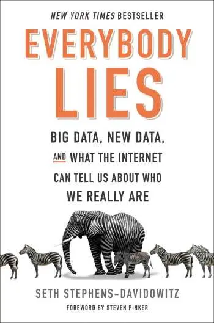](https://www.goodreads.com/en/book/show/28512671-everybody-lies)

最适合：任何从社交角度对大数据主题感兴趣的人，以及谷歌搜索如何讲述人类心理。

好评如潮的摘录：

“《人人都说谎》提供了引人入胜、令人惊讶、有时甚至大笑的见解，涉及从经济学到伦理、体育、种族、性别等各个方面，所有这些都来自大数据世界”。

——史蒂文·平克（Steven Pinker），《我们本性中更好的天使》（The Better Angels of Our Nature）的作者

与此列表中的其他出版物不同，“每个人都说谎”并不是一本全面涵盖大数据技术方面的书。 相反，它通过分析谷歌搜索数据可以告诉我们的关于人类行为的信息，提供了该主题的社会视角。 这本书的论点是基于这样一个前提，即每个人都在撒谎，即使在回答匿名调查时也是如此。 这导致作者相信，我们认为我们对人的了解实际上并不是事实。

也就是说，前谷歌数据科学家Stephens-Davidowitz认为，谷歌搜索提供的数据揭示了人类心理的真实本质。 他通过借鉴社会学、心理学、经济学、医学、性、性别和犯罪等主题的研究和实验来证明自己的观点。 并展示了大数据和分析技术的进步如何塑造人们感知世界的方式。

“每个人都说谎”获得了许多奖项，包括经济学人年度最佳书籍，企业家顶级商业书籍，亚马逊年度商业和领导力最佳书籍以及纽约时报畅销书。

### 2）设计数据密集型应用程序，作者：Martin Kleppman。

[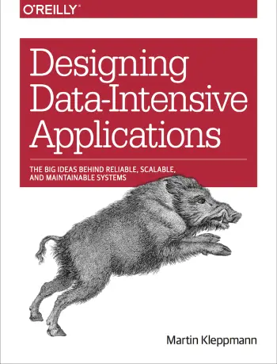](https://dataintensive.net)

最适合：希望了解设计数据密集型应用程序的基础知识、可用不同技术的优缺点以及在此过程中取得成功所需的关键概念的软件工程师。

好评如潮的摘录：

“这是我读过的最伟大的技术书籍之一。 它不仅全面彻底，而且易于理解。 马丁·克莱普曼（Martin Kleppmann）善于以易于理解和遵循的方式解释事物，即使它们的复杂性并非微不足道”。

全面管理数据并非易事，尤其是在系统设计方面。 这个过程通常伴随着与可扩展性、一致性、可靠性、效率和可维护性相关的挑战，更不用说处理市场上可用的软件和技术的数量了。 考虑到这一前提，作者马丁·克莱普曼（Martin Kleppmann）旨在帮助读者以一种技术性但又全面的方式理解所有这些流行语和技术。

《设计数据密集型应用程序》一书并不是关于如何设计分布式系统的分步指南，而是提供了一个有经验的视角来理解这个过程。 解释主要概念，介绍可用工具和技术的优缺点，并帮助读者浏览数据处理和存储的完整环境。

### 3）实践中的扩展现实：虚拟，增强和混合现实正在改变商业和社会的100+惊人方式，作者：Bernard Marr

[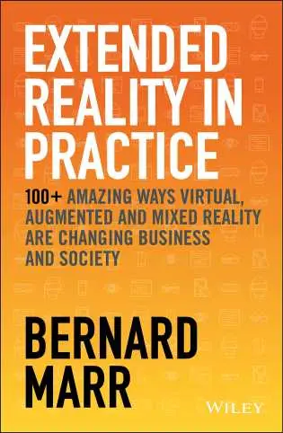](https://www.wiley.com/en-ie/Extended+Reality+in+Practice:+100++Amazing+Ways+Virtual,+Augmented+and+Mixed+Reality+Are+Changing+Business+and+Society-p-9781119695172)

最适合： 适用于首席执行官、企业主、经理和从事业务发展的专业人士。

这本书虽然与大数据没有直接关系，但介绍了与数据使用相关的新兴技术的来龙去脉：扩展现实（XR），这是我们在今年早些时候的[IT流行语](https://www.datafocus.ai/infos/technology-buzzwords)文章中引入的概念。 从本质上讲，XR是一个概括虚拟现实（VR），增强现实（AR）和混合现实（MR）技术的总称。

由著名作家和技术专家Bernard Marr撰写的“实践中的扩展现实”提供了易于理解的指南，介绍了XR如何通过来自不同行业的100 +示例彻底改变商业格局。

该出版物在 2022 年商业图书奖中荣获“最佳专业商业书籍”，引导读者发现公司如何在零售、餐厅、制造和整体客户体验等领域利用 XR 的力量。

考虑到XR技术利用来自用户的大量数据，这可能是一个优势，但也是一个保护和安全方面的挑战，了解汉堡王，宝马和优步等现代组织如何利用隐藏在最近探索的扩展现实世界背后的巨大潜力是一个有趣的读物。

由于这本书最近出版，因此没有任何书面评论可用。

### 4）大数据：可扩展实时数据系统的原则和最佳实践，作者：Nathan Marz和James Warren

[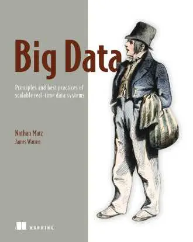](https://www.manning.com/books/big-data)

最适合：对于想要学习大数据系统理论的读者，如何在实践中实现它们，以及如何在构建它们后部署和操作它们。

好评如潮的摘录：

“我最喜欢的是它被组织成理论和插图（实践）章节，因此首先概述和解释理论概念，然后下一章通过支持需求和用例的示例技术指导您完成实际应用。 在我看来，这使得这本书非常值得，也因为整体组织结构良好，并且很好地指导了 Lambda 架构的不同部分。

根据developer.com 的说法，Lambda架构是“一种基于lambda演算的数据处理架构，可以大规模处理大量数据，并将大数据系统构建为一系列层。 它允许通过横向扩展而不是向上扩展来进行大量数据处理。 以这项技术为前提，本书介绍了大数据系统的基础知识，以及如何使用lambda方法成功实现它们，特别是在涉及社交网络或电子商务等网络规模的应用程序时。 正如笔者所说，不一定要有大规模数据分析的经验或知识才能理解这本书，但基本的数据库知识是首选。

在谈论结构时，本书经过深思熟虑地分为三个部分，涵盖了构成 Lambda 架构的层：批处理、服务和速度。 这三个部分中的每一部分都以理论章节开始，并以更实际的章节结束，以理解之前提出的所有概念和知识，这是读者真正喜欢内森·马兹的作品的地方。

被称为创造Lambda架构一词的人，合著者Nathan Marz是大数据和编程领域的知名专家。 他于2011年创立了Apache Storm项目，该项目后来成为“世界上最受欢迎的流处理器之一，并已被许多世界上最大的公司采用，包括雅虎，微软，阿里巴巴，淘宝，WebMD，Spotify，Yelp”据Marz本人说。 另一方面，詹姆斯·沃伦（James Warren）是一位成功的分析架构师，具有机器学习和科学计算的背景。

### 5）数据分析可访问，由Anil Maheshwari博士提供

[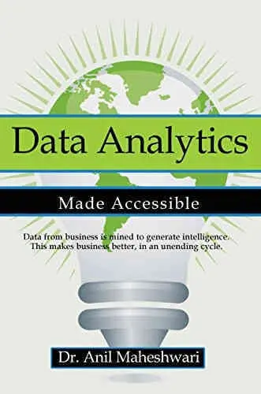](https://anilmah.com/my-book)

最适合：不知道数据科学意味着什么的新实习生。

好评如潮的摘录：

“我肯定会向所有有兴趣从头开始学习数据的人推荐这本书，并会说它是所有其他大数据分析书籍中最好的资源。

如果我们必须为数据科学领域的绝对新手挑选一本书来阅读，那就是这本。 “商业智能和数据挖掘变得可访问”无疑是数据分析方面最伟大的工作，正如它的名字所暗示的那样：它以一种简单的方式解释它，并使外行能够理解和消化。

本书通过以下方式促进易于理解：

- 每章开头的具体真实示例
- 直观组织的布局，结构类似于一个学期的大学课程
- 每章中的案例研究，将材料联系在一起

由于其内容范围和清晰的解释，“数据分析变得可访问”已成为美国和全球许多大学的大学教科书。 作者Anil Maheshwari博士拥有数据分析的实践和知识; 在成为教授之前，他在IBM的数据科学领域工作了9年。

在 2022 年发布的最新版本中，作者增加了一个摘要章节，将本书的内容概括为 50 分。 新版本还更详细地探讨了人工智能，涵盖了数据湖和数据共享实践等主题。 这本书在Kindle上有156页，如果你愿意的话，你可以一口气读完，你也可以在制定[商业智能战略](https://www.datafocus.ai/infos/roadmap-to-a-successful-business-intelligence-strategy)时将其用作灵感。

### 6）精益分析：使用数据更快地建立更好的创业公司，作者：Alistair Croll和Benjamin Yoskovitz

[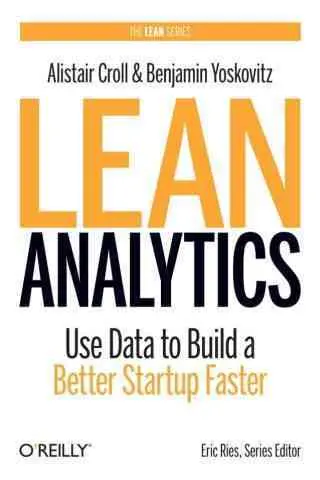](https://leananalyticsbook.com)

最适合：公司中希望通过使用数据深入了解客户的任何人。

好评如潮摘录：

“对当今价值数十亿美元的公司和企业家一样有用。

— 约翰·斯托默，Salesforce.com

“你的竞争对手会利用这本书来超越你。

\- 迈克·沃尔普，哈布斯波特

埃里克·雷斯（Eric Reis）通过出版《精益创业》（The Lean Startup）一书发起了一场全球运动。 它的理念是尽快从客户那里获得反馈，并根据该反馈快速迭代。 “精益理念”应用于数据分析只是时间问题。

但是，不要被欺骗 - 就像你不需要成为一个真正的创业公司就可以从Eric Ries的工作中获得很多价值一样，各种规模和形式的公司都可以从“精益分析”中学到很多有价值的信息。 这本书有三个主要思想：

- 您的公司面临的最大风险是投入大量时间和资源来构建市场不想要的东西。
- 产品/市场契合度是最重要的正确因素。
- 通过使用正确的指标，您可以确定要关注或构建的产品或服务，以及如何营销它们。

在当今世界，每家公司都面临着被颠覆的潜力。 这取决于你：你是想通过成为内部创业者从内部颠覆你自己的公司，还是让别人在市场上颠覆你？

从我们的大数据书籍列表中阅读此出版物将为您提供所需的工具包，以确保前者发生而不是后者。

### 7）预测分析：预测谁会点击，购买，撒谎或死亡的力量，作者：Eric Siegel

最适合：听说过很多关于预测分析的嗡嗡声，但对该主题没有牢固掌握的人。

好评如潮的摘录：

“大数据的怪胎经济学。

——斯坦·克雷辛格（Stein Kretsinger），广告部创始执行官。. com

我们已将预测分析列入最突出[的商业智能趋势](https://www.datafocus.ai/infos/business-intelligence-trends)列表中，因为它被广泛认为是释放大数据力量的战略。 从业务角度来看，预测分析用于分析当前数据和历史事实，以便更好地了解客户、产品和竞争对手，并识别公司的潜在风险和机遇。

然而，由于其广泛的应用，预测分析不应该只关注业务专业人士。 大多数人都知道公司收集我们的GPS区域设置，短信，信用卡购买，社交媒体帖子，Google搜索历史等，本书将让您深入了解他们的数据收集程序及其背后的原因。

埃里克·西格尔（Eric Siegel）的数据分析书对于任何想要了解什么是预测技术以及如何将它们部署到广泛学科的人来说都是一本令人大开眼界的读物。 它不是手册，因此寻找说明的数据科学家会感到失望。 虽然有一些关于算法的讨论，包括线性回归或决策树，但即使对于外行来说也很容易理解。

西格尔的研究清楚地表明，预测分析不是公司用来销售更多的偷偷摸摸的程序，而是技术的重大飞跃，通过预测人类行为，可以帮助应对财务风险，改善医疗保健，减少垃圾邮件，加强打击犯罪，是的，促进销售。 它最近于 2016 年 1 月进行了修订和更新。

### 8）数据智能：使用数据科学将信息转化为洞察力，作者：John W. Foreman

最适合：一个有点技术性的读者，擅长Excel，但对数据科学了解不多。

好评如潮的摘录：

“我最喜欢这本书的地方是，它没有试图挥舞魔杖来治愈公司的所有弊病。 相反，它专注于数据和分析技术可以提供具体好处的几个领域，并为您提供足够的入门。

“数据智能”包含具体的提示，说明应用哪些分析技术来有效地处理数据。 对于任何在应用数学和PC上的电子表格程序有一点背景的人来说，这都是一本有用的读物。 这是一个经过深思熟虑和设计的教程，其中包含许多易于理解的真实示例，适用于必须使用数据集的业务专业人员。

每一章都涵盖了电子表格中的不同技术，包括非线性规划和遗传算法、聚类、图形模块化、图中的数据挖掘、通过逻辑回归的监督 AI、集成模型、预测、季节性调整和通过蒙特卡罗模拟的预测间隔，以及从电子表格迁移到 R 编程语言。

“Data Smart”包含足够的实践知识，可以使用旧的Microsoft Excel实际开始执行分析。 它的目标不是通过其他软件彻底改变您的公司，而是通过可访问的分析技术对流程进行渐进式改进。 但是，一旦您开始使用包含数百万行和数百列信息的大型企业级数据集，Excel 可能无法处理此类卷。 在这一点上，转向[自助式商业智能](https://www.datafocus.ai/infos/self-service-bi-tools)将是最实惠和最有效的解决方案。

### 9） 大数据傻瓜，作者：Judith Hurwitz、Alan Nugent、Dr. Fern Halper 和 Marcia Kaufman

[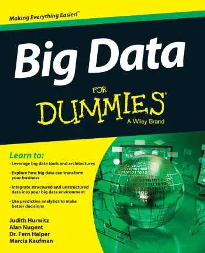](https://www.wiley.com/en-us/Big+Data+For+Dummies-p-9781118504222)

最适合：任何有兴趣通过易于理解的语言和概念全面了解大数据的读者。

好评如潮的摘录：

“它没有什么”愚蠢“的 - 一个坚实的概述，以启动您的专业知识”

——Eric Siegel，《预测分析世界》的作者和创始人

大数据管理对于希望将数据用作竞争优势的组织来说是一个巨大的挑战。 如果您没有必要的技能和工具来正确管理大量数据，那么处理大量数据可能会让人不知所措。 考虑到这个问题，这四位信息管理专家的作者整理了《傻瓜大数据》一书。 一本富有洞察力的指南，为想要深入了解大数据世界的初学者奠定了基础。 这本书以友好易懂的语言编写，共 336 页，详细探讨了以下主题：

- 什么是大数据（什么不是），以及为什么从技术和业务角度来看它如此重要。
- 如何根据您的需求选择和实施解决方案。 介绍常见问题和挑战以及要考虑的基本领域，如安全性、存储、分析和演示。
- 各种可用技术的概况
- 云在数据管理中的作用
- 管理大数据的十大最佳实践

“大数据傻瓜书”是数据分析方面最好的书籍之一，它是开始使用大数据的分步指南。 它提供了必要的知识，以了解如何处理大量信息以及它可以为您的组织带来什么价值。 它包含一些读者认为更具技术性的章节，因此重新阅读句子或花几分钟时间沉浸在信息中并没有什么坏处。

### 10）黑客增长：当今增长最快的公司如何推动突破性成功，作者：Sean Ellis&Morgan Brown

[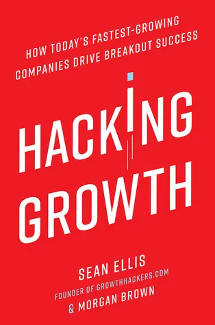](https://www.goodreads.com/book/show/31625067-hacking-growth)

最适合：希望通过利用大数据的力量来发展和发展自己的帝国的新兴创业者。

好评如潮的摘录：

“任何对这个主题感兴趣的人都必须读书。 作者对增长黑客涉及的内容进行了非常全面而简洁的描述，以及如何执行此操作的分步方法。 他们令人信服地表明，无论你为初创公司还是大公司工作，增长黑客方法或心态都可以而且应该适用于你。

增长黑客是一种相对较新的现象，它赋予了使用关键见解、数据和数字策略在更有意义、更个人的层面上与目标受众建立联系的术语。 如果以正确的方式执行，它会起作用。

在当今所有以增长黑客为主题的书籍中，这是最鼓舞人心、最易于理解、最终也是最有价值的。 您不仅可以切实了解Airbnb和Pinterest等品牌如何成为全球轰动，还可以访问基于明智数据驱动决策的增长黑客工具包。

您的机会：[想将您的大数据知识付诸实践吗？](https://www.datafocus.ai/console/) 立即试用我们的大数据分析软件，免费试用 14 天！

### 11）大数据：一场将改变我们生活、工作和思维方式的革命，作者：Victor Mayer-Schönberger和Kenneth Cukier

最适合：对大数据如何改善我们的生活质量（而不仅仅是商业意义上）感兴趣的读者。

好评如潮的摘录：

“对大数据革命的乐观和实际的看法 - 只是让你了解已经发生的重大变化和即将到来的更大变化的事情”——Cory Doctorow，boingboing.com

这是另一本大数据书籍，为读者提供了有关大数据关键问题的更普遍的观点，作者就技术将如何发展提供了他们的观点和见解。 对于那些想要了解如何利用大数据来提高人们生活质量的人来说，这将是一本完美的读物 - 从识别消费者的购物模式到预测流感爆发。

这本书还阐明了大数据的关键特征（数量、种类、速度和准确性）将如何改变我们处理和管理数据的方式。 它提到了数据的完整性（而不是抽样），量化和数字化以前无法访问的新信息格式的能力，以及使用新数据库（如Hadoop和NoSQL）和统计工具（机器学习和数据挖掘）来描述大量数据的能力。

### 12）《工作中的大数据：消除神话，发现机会》，作者：Thomas H. Davenport

最适合：希望在小型和大型组织中启动和管理大数据之旅的经理。

好评如潮的摘录：

“对于管理者来说，这是一本必读的读物，他们需要对大数据进行直接、无炒作的介绍，在围绕这个令人困惑和错误标签的术语的令人难以置信的噪音中发出清晰而清晰的'信号'。”

本书提供了有关如何制定有关大数据的战略和行动计划，您需要采用哪些技术以及如何雇用合适的人来处理大数据的提示，显然是以经理为导向的。

它还概述了大数据技术，解释了大数据成功所需的条件，并给出了初创公司、在线公司和大公司成功和失败的数据实践的例子。 作者还介绍了“分析3.0”的概念，以描述公司如何将传统分析与大数据方法相结合。 他认为像谷歌或Facebook这样的大型在线公司是顶级大数据工具和技术的鼻祖，以及数据驱动的[管理报告](https://www.datafocus.ai/infos/management-reporting-best-practices-and-examples)和最佳实践。

“工作中的大数据”是一本令人愉快的读物，然而，这种平易近人对一些读者来说可能是一个优点，而对另一些读者来说是一个缺陷。 评论家指出，这本书对这个主题提供了一种相当轻松的方法，因为它避免使用技术语言，因此它避免回答一些基本问题。

### 13）《太大到不能忽视：大数据的商业案例》（Too Big to Ignore ： The Business Case for Big Data），作者：获奖作家菲尔·西蒙（Phil Simon）

最适合：管理团队中每当提到大数据或预测分析时都会翻白眼的成员。

好评如潮的摘录：

“西蒙为非技术人员提供了对”大数据“新世界的非常彻底的探索，并展示了许多公司如何开始利用这一资源来发挥自己的优势。

有两种类型的人应该阅读这本书：一种是不相信大数据和预测分析的优点的人，另一种是对这些主题非常感兴趣以至于他们喜欢了解这些技术的当前用例的人，这就是使它成为最好的大数据书籍之一的原因。

“太大而不能忽视”考察了许多公司（和地方政府！ ）如何利用大数据为自己谋利的例子，包括：

- 渐进保险使用GPS跟踪器/加速度计来确定客户安全评级
- 谷歌通过测量与流感相关的本地搜索高峰来预测当地流感爆发的能力
- 波士顿政府使用居民输入智能手机的数据修复坑洼

作者菲尔·西蒙（Phil Simon）是一位演讲者，曾在EA，思科，Zappos和Netflix发表主题演讲，是简化技术信息的专家。 Simon认为，大数据不仅是一个潜在的创新领域，而且是你的公司现在必须解决的关键因素，以便在现代市场中生存。 他的论点包含紧迫性和清晰度，围绕这一点：大数据不是时尚。 这是业务开展方式的巨大变化，而且已经在发生。

“太大而不能忽视”非常没有行话，充满了案例研究和例子，是对大数据的极好介绍，从以下角度来看：大数据能为我和我的组织做什么？

### 14）Data Science for Business： What You Need to Know About Data Mining & Data-Analytic Thinking，作者：Foster Provost & Tom Fawcett

[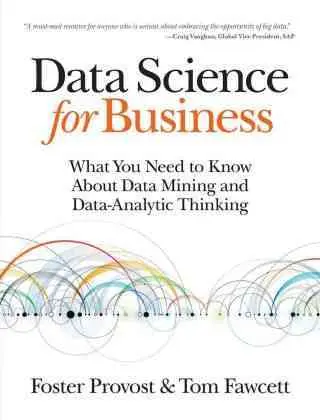](https://data-science-for-biz.com)

最适合：读过几本数据科学入门书籍并准备挑战自己并深入研究的人。

好评如潮的摘录：

“这本书在技术基础和业务应用程序之间取得了令人满意的良好平衡：足够的数字和技术细节奠定了坚实的基础，并辅以大量商业案例和示例，以了解技术内容是如何到位的。

许多关于数据分析和大数据的书籍都集中在数据科学的“如何”——技术和机制上。 “商业数据科学”也做到了这一点，但也深入探讨了数据科学的“原因”，并提供了对在商业环境中思考数据科学的一些有用方法的见解。

这本书回顾了数据分析的一些基本原则，对于一个有抱负的数据驱动型决策者来说，这是一本很好的读物，他们希望智能地参与使用大数据来改善公司的战略和战术选择。

最后，“商业数据科学”足够详细地解释了当今使用的数据挖掘技术，使用了大量的科学思维，而不会用数字和方程式压倒读者。 通过使用技术部分来促进这一点，读者可以根据自己的兴趣选择跳过或吞噬。

### 15） Business UnIntelligence： Insight and Innovation Beyond Analytics and Big Data，作者：Barry Devlin博士

[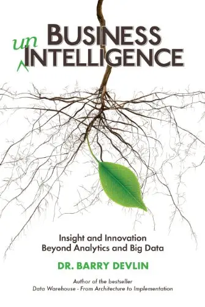](https://www.goodreads.com/book/show/18230651-business-unintelligence)

最适合：经验丰富的BI专业人员，随时准备深入思考数据分析和大数据中的重要问题。

好评如潮的摘录：

"... 数据仓库和商业智能领域的巡回演出。 它深入到行业的每一个角落和缝隙，巨大的成功以及疯狂的深度（两者都揭示了很多）。 这本书详细介绍了真正的'数据仓库之父'对他的孩子的看法，而且并不总是很漂亮......”

本出版物对于生活和呼吸 BI 的人最有用 - 并且准备批判性地看待他们围绕该领域的想法的人。 在这本时而逆向和坚定不移的书中，Barry Devlin博士展示了现代商业智能如何经常无法以有意义的方式处理来自移动，社交媒体和物联网的数据。 德夫林还认为，现代公司决策必须从数据驱动（理性）和情感（直觉）来源的组合中做出，而不是只使用数据 - 商业智能必须反映这些需求。

这本书还作为BI，大数据和数据分析领域的历史，因为Devlin详细介绍了该领域的过去，现在和未来。 他这样做是为了挑战现代数据分析和数据收集中的许多假设，通过展示由于现代数据源的数量和速度，旧的最佳实践已经过时的速度有多快。

如果你准备好接受挑战以不同的方式思考，“Business unIntelligence”是最好的数据分析书籍之一。

### 16）数字感！ 外行的数据科学：没有数学添加 作者：Annalyn Ng & Kenneth so

最适合：任何没有数学或分析背景的外行人，他们想在这个领域工作或管理其他数据科学家。

好评如潮的摘录：

“啧啧！ 《外行数据科学》是一本很棒的小书。 对于对数据科学知之甚少的人来说，这不仅是一个很好的介绍，而且还为那些熟悉数据科学的人提供了几个不同领域的精彩总结。 五颗星，照标题说的做。

对于面向数字洞察实际应用的大数据书籍，Numsense！ 是市场上最伟大的产品之一。 这本易于理解的指南不仅以清晰易懂的语言与读者交谈，而且还在 A/B 测试、社交网络分析、回归、聚类等领域提供了丰富的可操作提示。

这本数据分析书拥有鼓舞人心的真实世界示例和全面的术语表，是任何希望踏上分析启蒙终身旅程的人的必读之作。

### 17） 《大数据世界中的分析：数据科学及其应用的基本指南》（Analytics in a Big Data World： The Essential Guide to Data Science and its Applications），作者：Bart Baesens。

[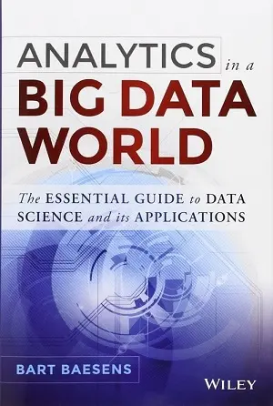](https://www.wiley.com/en-gb/Analytics+in+a+Big+Data+World%3A+The+Essential+Guide+to+Data+Science+and+its+Applications-p-9781118892701)

最适合：业务数据分析师、顾问和商业分析研究生。

好评如潮的摘录：

“在一个充斥着炒作和夸张的领域，'大数据世界中的分析'提供了对细节和实施最佳实践的严肃、专注的报道。

这是一本真正的数据分析手册，适合已经具备数据挖掘和BI基础知识的读者，并且正在寻找有关如何在实际业务管理中进行[大数据分析](https://www.datafocus.ai/infos/big-data-examples-in-real-life)的结构和技术说明。

“大数据世界中的分析”以非常强烈的实践为重点，首先为读者提供基本术语，分析过程模型及其与其他相关学科（如统计学，机器学习和人工智能）的关系。 然后，作者继续重点介绍过程模型中最重要的步骤，例如采样、缺失值的处理和变量选择。 后续章节重点介绍预测性和描述性分析。

此外，还包括许多关于风险管理、欺诈检测、客户关系管理和 Web 分析的案例研究，并对其进行了详细描述。 在第七章中，作者为我们提供了具体的说明，说明使用哪些[业务分析工具](https://www.datafocus.ai/infos/best-bi-tools-software-review-list)和实践来使分析发挥作用。 这里涵盖的主题范围从回溯测试和基准测试方法到数据质量问题、软件工具和模型文档实践。

这本重要的大数据书旨在成为一种可访问的资源，并不包括所有分析技术的详尽介绍。 相反，它突出了真正在公司环境中提供附加值的数据分析技术。

### 18）通过社交媒体分析创造价值：管理，对齐和挖掘社交媒体文本，网络，操作，位置，应用程序，超链接，多媒体和搜索引擎数据，作者：Gohar F. Khan

[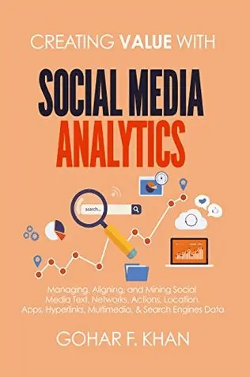](https://www.goodreads.com/book/show/40058189-creating-value-with-social-media-analytics)

最适合：任何希望通过知名社交媒体平台深入了解基于数据的见解和指标的个人。

好评如潮的摘录：

“Gohar Khan是新兴社交媒体分析领域的先驱。 这本最新文本是商业领袖、经理和学者的必读之书，因为它从社交角度通过社交媒体数据提供了对商业价值创造的清晰简洁的理解。

\- Laeeq Khan，俄亥俄大学社交媒体分析研究团队主任。

如果您对世界上最著名的社交媒体平台和[数字营销KPI](https://www.datafocus.ai/infos/best-digital-marketing-kpis-and-metrics)的功能有扎实的了解，但又想从每个渠道中榨取更多价值，那么这本大数据书是必读的。

作者关于该主题的知识不仅广泛而令人印象深刻，而且还以这样一种方式呈现，即崭露头角的数据科学家、数字营销人员、社交媒体高管和领导者可以轻松提取无价的信息。

通过使用大数据和分析来完善和推动您的社交媒体策略，您将在竞争中脱颖而出 - 而这本大数据书将帮助您做到这一点。

### 19）分析哲学：迈克尔·比尼的简短介绍

最适合：希望了解分析、数据驱动思维的历史、起源和核心理念的个人。

好评如潮的摘录：

“简明扼要，易于理解，在分析传统中对哲学进行智力刺激的介绍，尤其是其形成阶段。” - Erich Reck，加州大学河滨分校教授

作为现存最多产的数据分析书籍之一，这本富有洞察力、内容丰富且令人耳目一新的散文作品是我们列表中更实用的书籍和工具包的理想补充。

本书深入挖掘了该主题的构思和分析思维背后的前提，准确地定义了为什么大数据分析如此有价值，同时提供了易于理解的概念，这些概念将成为您使用可用的数字见解所做的一切的基础。 对于任何渴望大数据启蒙的人来说，这是一本真正的必读书。

“我所知道的最有价值的商品是信息，”——戈登·盖科，华尔街

如果您发现我们的最佳数据分析和大数据书籍列表很有用，但您对知识的渴望尚未得到满足，请查看我们[最好的商业智能](https://www.datafocus.ai/infos/best-business-intelligence-books)书籍或[我们的数据可视化书籍](https://www.datafocus.ai/infos/best-data-visualization-books)帖子，以不断加深您对数据科学的理解。 如果您想将新学到的大数据分析知识付诸实践，请浏览我们的[在线仪表板工具](https://www.datafocus.ai/infos/online-dashboard)。

您的机会：[想将您的大数据知识付诸实践吗？](https://www.datafocus.ai/console/) 立即试用我们的大数据分析软件，免费试用 14 天！

那么，关于大数据的最佳书籍是什么？ 以下是摘要：

- 每个人都在撒谎：大数据，新数据，以及互联网可以告诉我们我们到底是谁 作者：Seth Stephens-Davidowitz
- 设计数据密集型应用程序 作者：Martin Kleppman（英语：Martin Kleppman）
- 实践中的扩展现实：虚拟、增强和混合现实正在改变商业和社会的 100+ 种惊人方式 作者：Bernard Marr
- 大数据：可扩展实时数据系统的原则和最佳实践，作者：Nathan Marz 和 James Warren
- 数据分析可访问，作者：A. Maheshwari 博士
- 精益分析：使用数据更快地建立更好的创业公司，作者：A. Croll 和 B. Yoskovitz
- 预测分析：预测谁会点击、购买、撒谎或死亡的力量 作者：E. Siegel
- Data Smart： Using Data Science 将信息转化为洞察力，作者：J.W. 福尔曼
- 大数据傻瓜书作者：Judith Hurwitz、Alan Nugent、Dr. Fern Halper 和 Marcia Kaufman
- 黑客增长：当今增长最快的公司如何推动突破性成功 作者：Sean Ellis&Morgan Brown
- 《大数据：一场将改变我们生活、工作和思维方式的革命》（Big Data： A Revolution That Transform Our Living， Work， and Think），作者：V. Mayer-Schönberger 和 K. Cukier
- 《大数据在工作：消除神话，发现机会》，作者：T. H. Davenport
- 《太大到不能忽视：大数据的商业案例》（Too Big to Ignore ： The Business Case for Big Data），作者：获奖作家P. Simon
- Data Science For Business： What You Need to Know About Data Mining & Data-Analytic Thinking，作者：F.教务长和T.福塞特
- Business UnIntelligence： Insight and Innovation Beyond Analytics and Big Data，作者：Dr.B. 德夫林
- 啪！ 外行的数据科学：没有数学添加 作者：Annalyn Ng & Kenneth so
- 《大数据世界中的分析：数据科学及其应用的基本指南》（Analytics in a Big Data World： The Essential Guide to Data Science and its Applications），作者：B. Baesens
- 通过社交媒体分析创造价值：管理，对齐和挖掘社交媒体文本，网络，操作，位置，应用程序，超链接，多媒体和搜索引擎数据，作者：Gohar F. Khan
- 分析哲学：迈克尔·比尼的简短介绍

要开始更深入地掌握您自己的数据集，您可以免费试用我们的[在线数据可视化](https://www.datafocus.ai/infos/data-visualization-tools)工具，试用[14 天](https://www.datafocus.ai/console/)！
