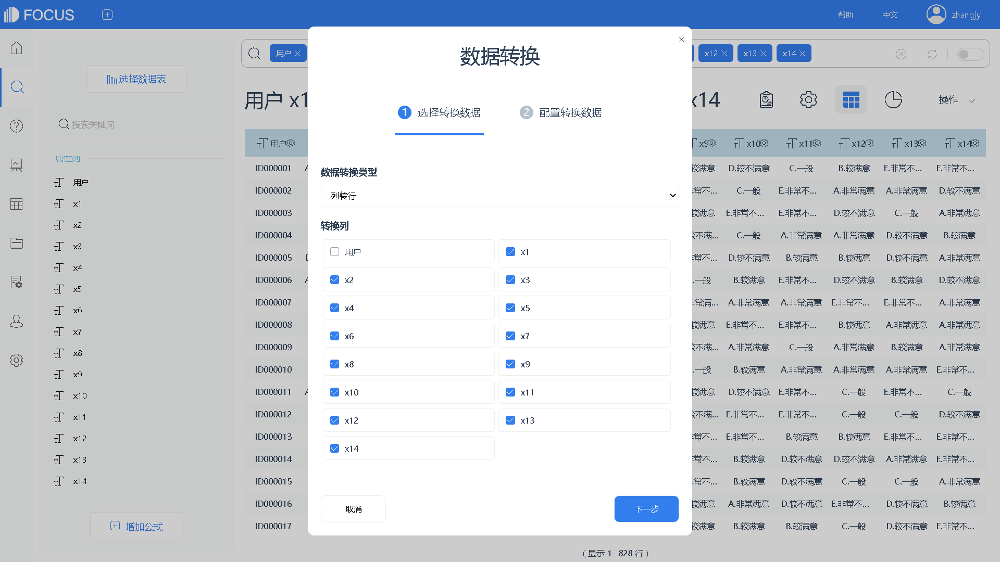

_“永远不要浪费一场好的危机！”--温斯顿.丘吉尔_

2019年，大部分互联网行业的火爆已经接近尾声。回看近10年，从移动互联网兴起的那一刻起，各种新型的商业模式如春日的繁花，相继绽放与落幕，令人不甚唏嘘。

O2O一度是大佬和基金们押宝的重点对象。从共享单车、共享雨伞到共享空间，几乎所有的物品都被狂热的创业者们尝试过走向“共产主义”。然而，随着最具代表性的共享单车渐渐落寞，似乎再也没有人去提共享经济了。

（图源于百度百科）

随着美团的上市，似乎所有人都要给O2O画上句号了。让人意想不到的是，万达王公子一度赌咒发誓、宁愿吃翔也不看好的共享充电器，居然在2019年起死回生，大有卷土重来之势。简单的商业模式，伴随着共享电源的厂商们一次次地提价——眼看着王公子就要兑现尴尬的一幕了。然而，随着2020年新冠疫情的爆发，形势又发生了戏剧性的转变——餐饮、影院、酒店等消费场所的关闭，以及重新开张的遥遥无期，让街电们重新又跌落到了深渊。全民宅家看手机，自然都用不上共享充电器。如果疫情继续迁延日久，好不容易回过神来的最后的O2O们，眼看着又要倒下了。创业这趟鬼门关，真是人算不如天算。

有人欢喜有人愁。

本来已经快被投资人判了死刑的生鲜电商，估计做梦也没想到，人们连菜场也不敢去了。就在去年，盒马鲜生还在忧愁：“到底要不要淡化线上的概念，继续去线下开店呢？”宋小菜们本来就已经放弃了家家户户送菜上门的幻想了，准备转战餐饮店的后台配送——这下好了，从toB又做回toC，市场前景不可同日而语，估值的故事还用讲吗？

最受益的互联网企业，非京东莫属了。东哥近年来糟心事频频，本来都搞得有点儿心灰意冷了。没想到叮咚卖菜不仅歪打正着，赶上了好日子；强大的京东物流配送能力，也让它今年能抓住更多机会。不要放弃啊，东哥还是有机会坐上电商行业头把交椅的。

再说到资本行业，最有远见的还是高瓴资本了。疫情一出现，就火速加仓视频软件企业zoom，如今赚得盆满钵满。顺带着，国内像小鹅通、小鱼易联等一批做视频会议的软件，终于开始过上了好日子；在惨烈的直播大战中剩下来的，也都再也不愁找不到商业模式了；甚至多年惨淡经营的各类视频网站，随着线下院线的长期关停，也有机会咸鱼翻身哪。王公子心里痛。

很多年以来，投资人一直纳闷为什么欧美的toB领域，会出现SAP、SalesForce这种巨无霸，而中国的市场总是结上用友、金蝶这种倭瓜，我也想不通。从2015年以来，投资人喊了很多年的saas，也没声气儿了。而今，随着疫情的发展，toB领域开始快速地崛起了。企业家们发现，有了好的软件系统，居家也能开工厂啊。

再往后，就是一大批类似DataFocus的数据类公司崛起了。数据增长速度可能会超乎你的想象，一批嗅觉灵敏的资金已经开始行动了。

2003年的时候，大家也没想到淘宝上买东西，竟然会成为主流。

那么未来呢？也许再过3年，整个中国都已经完全数字化了。
