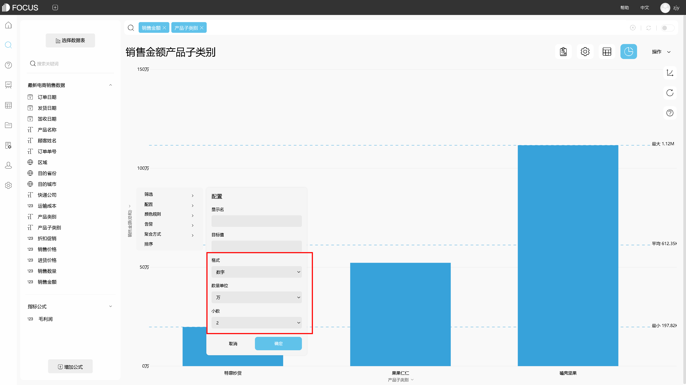
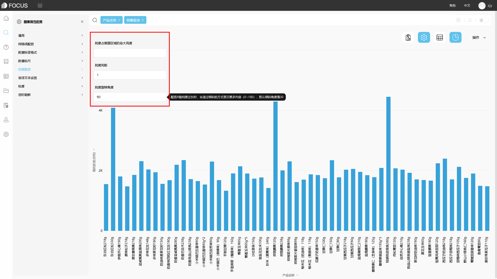
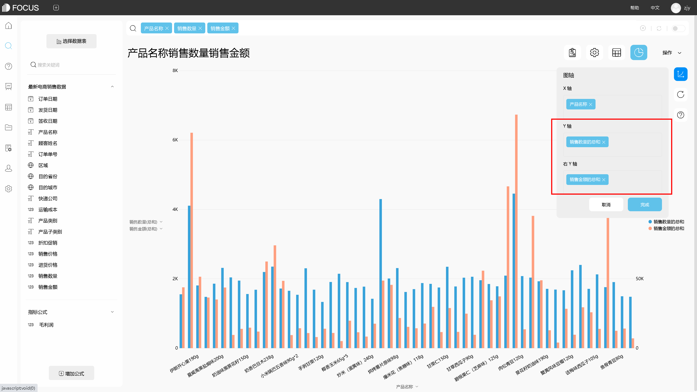

对于可视化，很多人可能觉得就是几个柱状图，几个折线图，几个饼图，用的最多的工具就是excel，但其实用过excel做可视化的，都知道用excel来做可视化还是有一定缺陷，一是图表类型不够丰富，二是数据量过多时excel不给力，三是某些图表制作比较复杂。那有没有更专业的可视化工具呢？肯定是有的，今天就要给大家分享一款深得我心的可视化工具——DataFocus。

DataFocus，用了也有一段时间了，为什么深得我心呢？因为其性价比高，制作简单，图表丰富且美观。DataFocus不需要那么多的额外配置，也不需要任何代码，分分钟就能完成一个好看的可视化大屏。

下面这些都是DataFocus制作的可视化大屏。

大屏一

大屏二

大屏三

那么如何制作呢？

首先必须要了解DataFocus，只有熟悉了工具，才能更好地运用工具。DataFocus拥有30多种图表样式，分基础图形和高级图形，基本涵盖市场对图表的所有需求；

不同图表还可以自定义配置，比如主题、字体、样式等；

DataFocus还完美匹配移动端，随时随地都可以查看大屏，其有一个很大的特点也是它的优势之一，DataFocus制作图表采用搜索的方式，而不是传统的拖拽方式，制作方式的改变，大大地降低了可视化的难度以及复杂程度，提高了制图效率。

其次，了解DataFocus如何使用。

1、搜索出图，搜索想要可视化展示的数据，系统智能适配图表；

2、图表保存，加入大屏；

3、数据看板（可视化大屏）自定义配置，看板展示；

怎么样，这个是不是比excel好用多了，有需要的可以get起来了~
