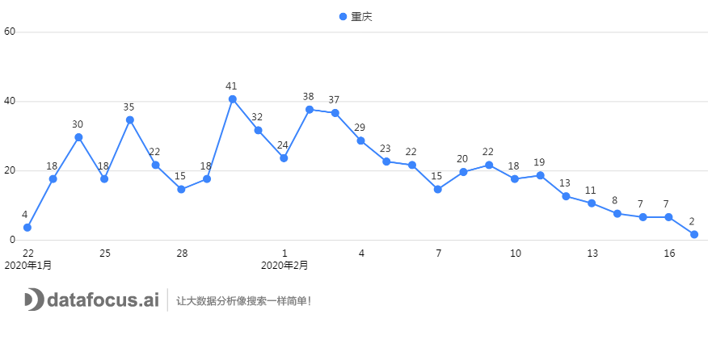
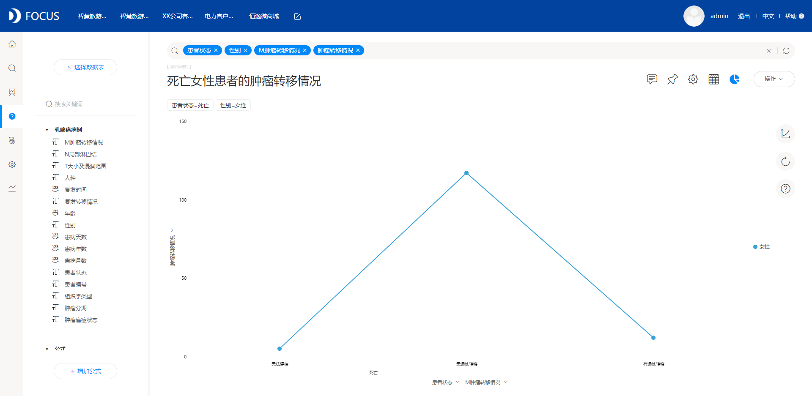
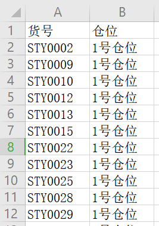
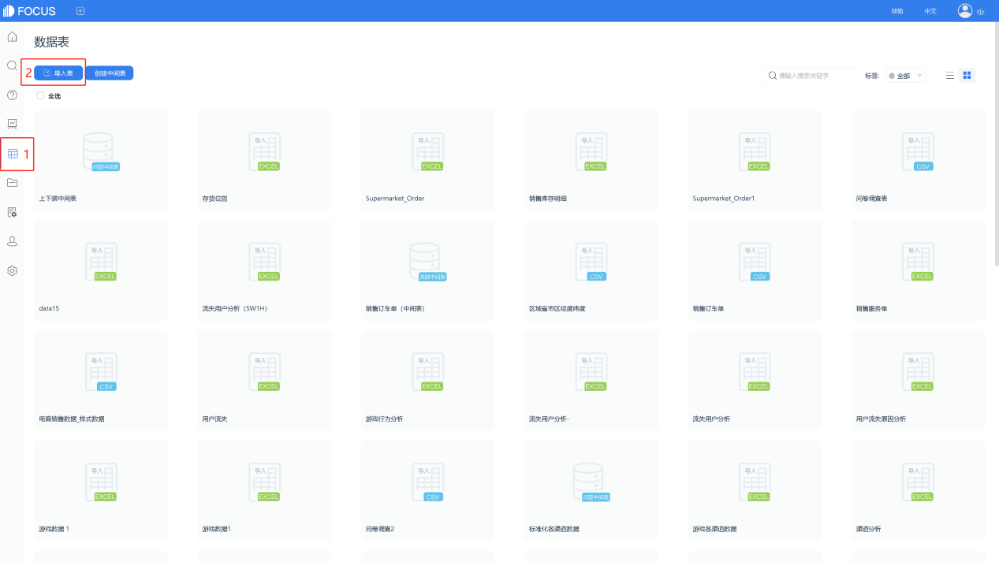

_上一次重庆走入大家的眼帘，是刚被“抢”了口罩的时候，那时候重庆疫情的非常严重，在全国排在第8位，因此这个事件引起了非常广泛的关注。我们DataFocus的小编们也因此对重庆的疫情现状作了数据上的分析。那么疫情发展至今，半个月后的重庆又是怎样一片光景？_

1. 宏观了解疫情现状

截止2月17号24时，重庆市报告累计确诊病例累积553例，其中死亡病例5例，累计治愈出院225例。现有在院确诊病例323例，其中重型病例36例，危重型病例13例。累计追踪到密切接触者22315人，已解除医学观察18766人，尚有3549人正在接受医学观察，**目前确诊病例数排在全国第9位**。比对2月5日，全国排名下降了1位，且尚在接受医学观察的人数也逐步减少了。

图1绘制的是重庆市确诊人数随日期变动的时序图，我们可以看到，重庆的累计确诊人数基本已经进入了一个平台期，已经开始趋于平缓，每日新增的病例数也在不断减少。

图1 每日确诊人数

接下来，将确诊病例数的每日新增人数提取出来绘制折线图。结合图1图2，我们可以看到从2月2日开始，每日的新增病例数就基本处于下降的趋势，从2月9号至今，已连降7天，最近四天的新增病例数也已经下降到个位数。说明重庆虽一开始受武汉疫情严重，蔓延迅速，但现今疫情已经受到控制，防疫措施已经取得一定的成效，确诊人数不再飞快增长。

图2 日增长量

1. 分区深入了解疫情数据

从第一部分我们可以了解到重庆市目前的疫情已经在慢慢到达顶峰，希望接下来迎接我们的可以是不断下降的确诊病例数。

重庆市各区的疫情分布如下图3所示，万州区的疫情最为严重，占据总人数的19.53%左右，其余区域比例都在5%上下。上一篇的重庆疫情文章也介绍过，万州区的患病人数之所以高出别的区接近4倍，主要是因为万州区发病高峰时段与春节返渝时段隔期重叠，人员来往复杂，更容易接触一些输入性病例。

图3 各区确诊比例

接下来筛选出2月17日重庆市排名前4的地区，了解一下这四个地区的确诊病例增长率情况。从图4我们可以看到，就算是疫情最严重的万州区，在1月24日除夕那天有了一个最大的增长后，也基本开始呈现下降的趋势，最近5天的病例日增长率已经基本可以看做零增长了。希望重庆市各区都能操持这个趋势，争取将此次疫情完全控制住，结束这场“战争”。

图4 排名前4区的确诊病例的日增长率

1. 从各项指标着重分析

从追踪到的密切接触者，以及接受医学观察人数，和确诊人数，来计算每个阶段的转换率，从中可以预判未来的确诊人数增加情况，重庆市最终确诊率为2.47%，说明密切接触者里面有2.47%的机会可能被感染。

图5 各阶段转换率

一般在传染病分析里面，一定会关注的四项指标，分别是：死亡率、感染率、重症率以及治愈率。结合重庆上一阶段的文章，截至到2月5日24时，重庆市的四项指标分别是，死亡率0.51%、每万人感染率13%、重症率8.2%以及治愈率3.9%。那么现在，图6是截至到2月17日24时，重庆市的死亡率0.9%、每万人感染率18%、重症率6.5%以及治愈率41%。我们可以看到，患者治愈率有了一个非常大的提升。除了前几日出现的治愈患者特异血清之外，各位医学专家也找到了一定的方式去抑制这个肺炎病毒。

图6 重庆四项指标

在这里小编想对所有在一线工作，昼夜不分的医护工作人员说一句：你们辛苦了。正是因为有了他们的无私奉献，不畏艰难，才能使得疫情又了这么大的好转，希望你们都能平安归来，患病的人们也都能痊愈归家。
