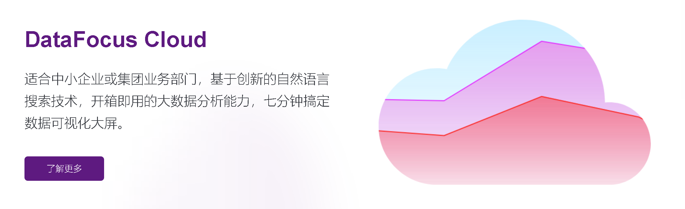
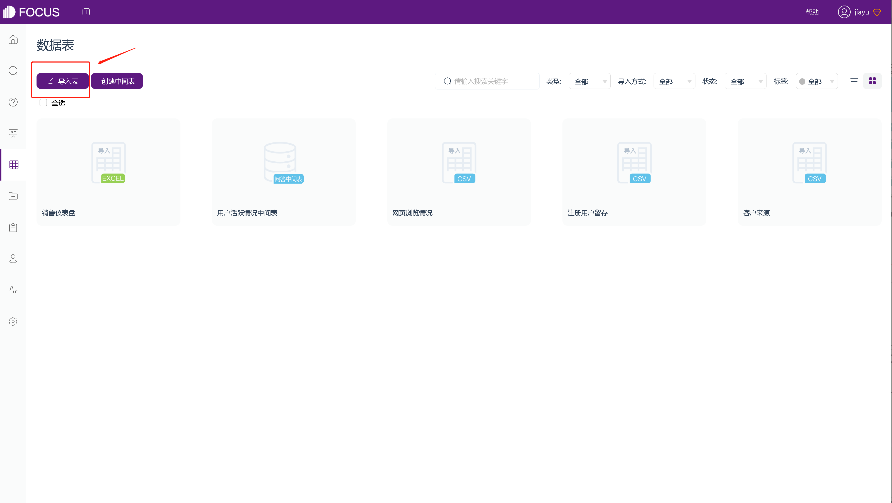
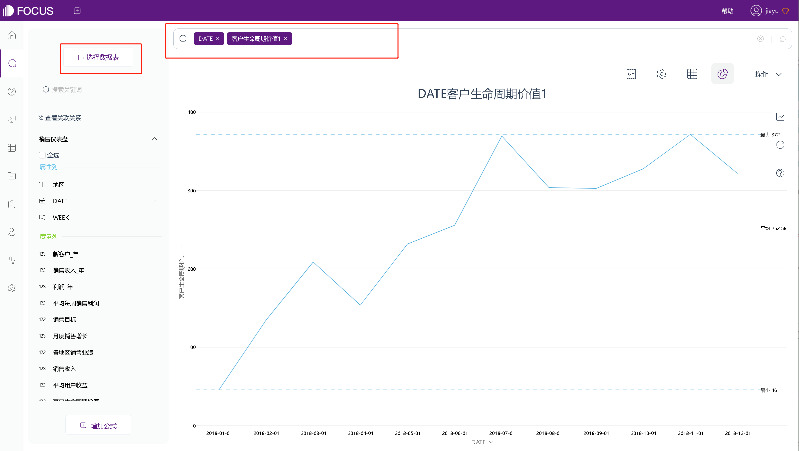
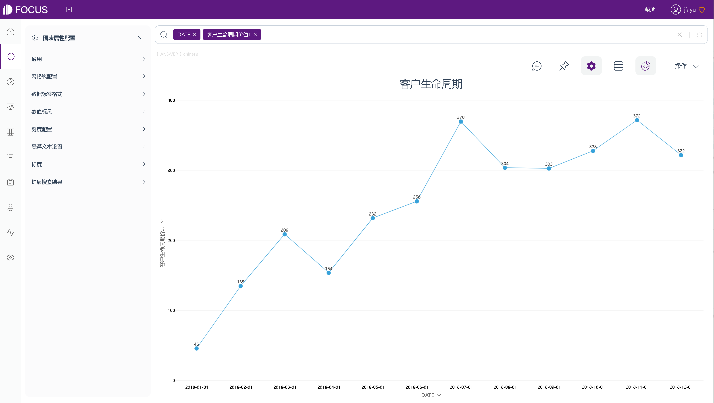
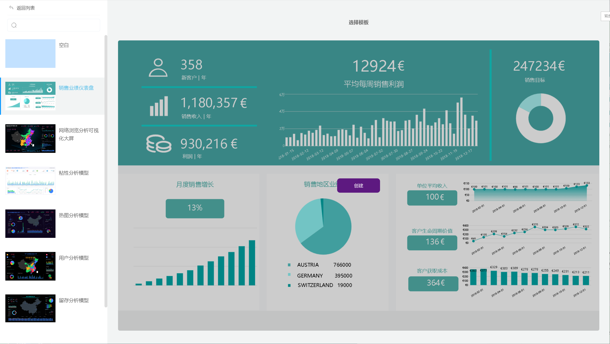
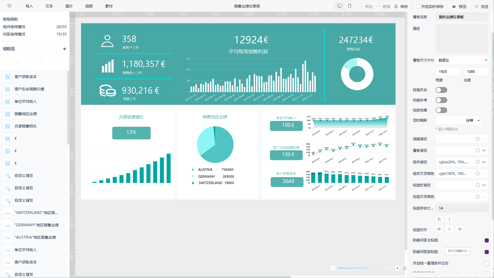

你是否希望快速、全面地了解你的销售业务？

作为一名销售经理，你是否希望即时了解你的团队是否实现了他们的个人目标？

“销售业绩仪表板”可以满足这些需求，为你的销售洞察提供“一站式服务”。

上面展示的销售仪表板，通过关注销售增长、销售目标、ARPU、CAC 和 CLV，完美地概述了销售部门的进度。这种组合了销售各个方面的可视化，可以为你提供一个能够快速、轻松、全面地了解你的销售业务的，而不会丢失任何有价值的信息。专业的BI工具，可以使销售仪表板的制作更加简单，使你的运营和销售数据易于消化，吸引观众深入挖掘并提供有关你最重要的指标和发展的即时见解。

我们以专业BI工具DataFocus为例，了解仪表盘的简单制作过程，并进一步了解销售业绩仪表盘中的指标。

### **销售仪表盘的制作**

首先，我们在DataFocus官网，登录已经创建好的DataFocus在线应用。将所需数据导入到应用中。

接下来，在该应用的搜索模块，选择刚刚导入的表作为数据源表，双击字段进行搜索，如：查看客户生命周期情况。

设置图形样式，并进行保存。（其它图形同理）

制作好图表后，使用看板模板，创建新的看板。（看板模版可找工作人员免费获得）

 

将看板模板中的组件，依次替换为刚刚制作的图形，并保存，即可完成销售业绩看板的创建。

创建完成后，可以全屏预览。

销售业绩仪表板，能让你深入了解部分销售关键 KPI，例如每单位平均收入 (ARPU)、客户获取成本 (CAC) 和客户生命周期价值 (CLV)。

### **销售绩效指标**

1、**销售增长**

你的业务是否在稳步增长？在特定时间段内的正销售增长，可以表明你正在按照销售目标发展业务。

通过跟踪你的销售增长，你也可以跟踪到公司的增长。例如，在销售业绩仪表盘中，跟踪你的销售代表的目标行业和地区的绩效。假设你的团队专注于许多垂直领域，但只有其中一个领域能够带来显著的回报。这可能表明，你需要重新评估团队中的垂直领域分布。灵活分析你的销售KPI，将为你的业务带来更多的销售收入，从而带来利润。

**2、销售目标**

作为销售部门中的一员，你的首要任务之一，应该是了解你是否正在按计划实现目标。在对实际收入与预测收入进行评估时，目标应该是优于预测金额。

结合销售目标进行分析，你可以了解以下问题：你的实际收入比预测收入好还是差？当你第一次计划你的目标时，你是基于什么？你的基线是否包含在图表中？这些信息将帮助你预期交易活动和结果，如果出现不一致，你可以更好地识别异常值与趋势。

这个指标可以让你知道你的团队是否在做他们应该做的事情，他们是否需要帮助，或者整个战略是否应该改变或调整。这对预测至关重要，它可以让你知道，是否有其他因素会影响你的底线。

3、**客户获取成本**

当我们提到客户获取成本（CAC）时，我们指的是注册客户时产生的所有成本。根据你的业务范围，会产生不同的成本，例如，如果你是在线营销人员，你将包括所有广告系列的成本。在传统的SaaS业务中，这可能意味着包含所有员工的工资、所有营销和销售成本。

4、**每单位平均收入（ARPU）**

ARPU代表单位的平均收入，这里的“单位”，可以指用户、帐户或任何其他付费客户。此销售KPI表示客户从你的所有销售中获得的平均收入。即每月（经常性）总收入，除以你的客户总数。

每单位的平均收入是衡量所有销售平均收入的重要基准，尽管此衡量标准没有考虑不同客户或产品的不同获取成本，但它能很好地展现你各个客户之间的平均值。

5、**客户生命周期价值（CLV）**

该指标很重要，因为你拥有付费客户的时间越长，你赚的钱就越多。

如果你的ARPU和CLV正在上升，这表明你平均从每个客户那里获得更多收入，时间更长。

客户生命周期价值是一种预测，它向你表明你的客户在未来的客户价值。

将这些指标放在销售业绩仪表板上，进而尝试提高客户生命周期价值和每单位（或用户、帐户）的平均收入，同时降低购置成本，有助于提高你的部门业绩和销售业绩。

### **销售业绩仪表盘，带来的好处**

作为一名销售经理，你需要了解你的团队是否实现了他们的个人目标，而销售业绩仪表盘，可以为你的销售洞察提供“一站式服务”，一目了然这些信息。通过查看销售目标KPI，你可以了解你的团队是否正在按计划实现其目标。这些洞察可以帮助你规划未来，创建完善的销售报告，并确定你的销售团队是否需要额外培训。使用销售业绩仪表板，你可以实时监控销售数据，深入了解如何增强运营管理并提高利润率。

尝试最大化地从客户和每次销售收入回报中产生利润，是业务基础。但是，此销售仪表板使你能够快速、轻松、有效地跟踪和监控这些指标的变化，这样你就不会错过任何一个关键点。它使你能够轻松比较这些重要数据并监控你是否走在正确的轨道上，并确定你可以在哪些方面进行战略更改以进一步改进。
