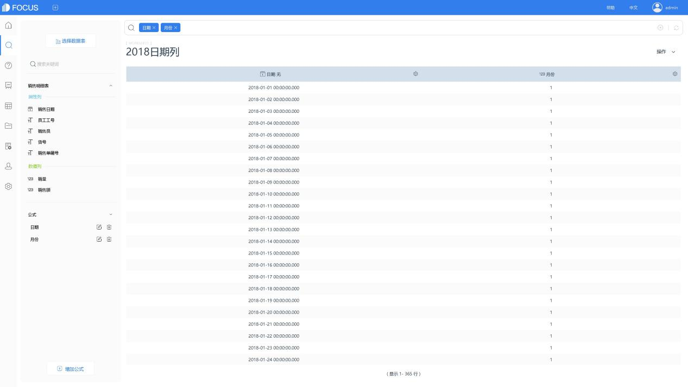
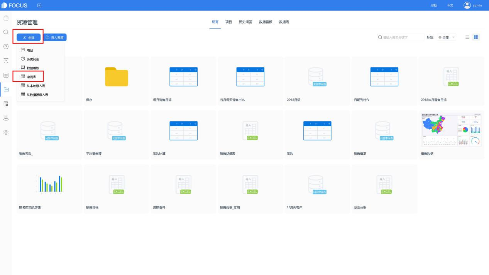
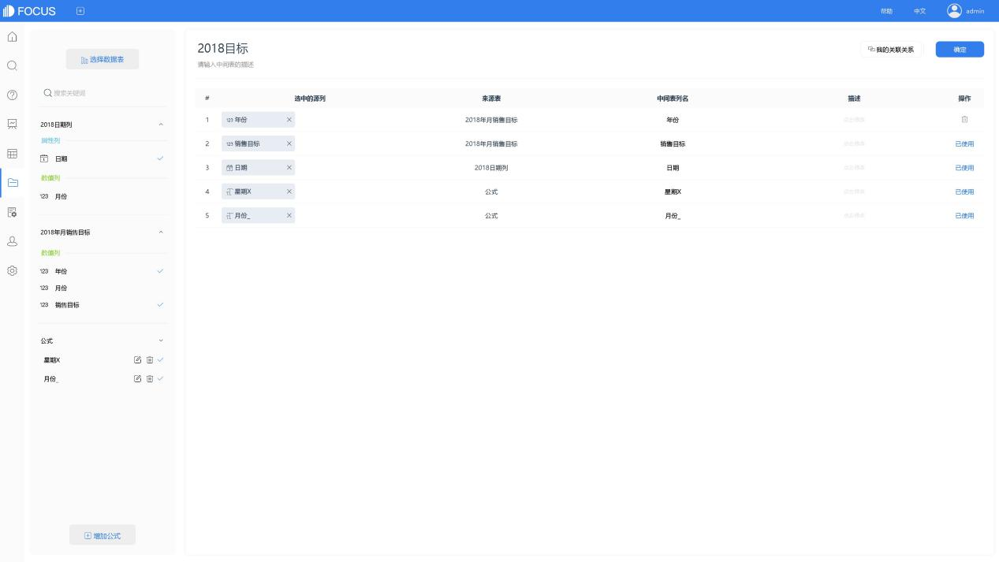
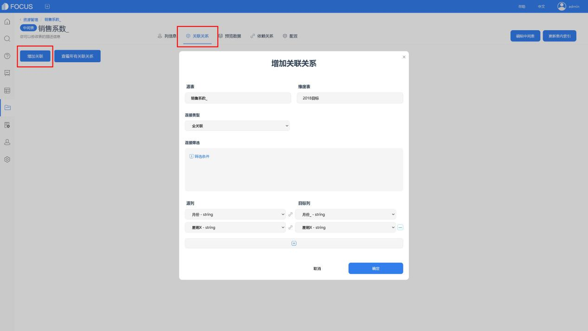

销售的起点是制定销售目标，而目标的完成需要每一天的跟进。因而，零售等销售业务，有必要将销售总目标分解至每一天。

今天，我们通过DataFocus系统，来了解一种分解销售目标的方法。

## 目标分解难点

销售目标分解的难点主要包括：某些企业的销售业务具有季节性；相同月份，天数不同无法复制，如去年2月和今年2月；即使天数相同，例如去年某月有4个周末，今年该月有5个周末，也会对销售趋势造成影响。

当然，节假日也会对销售产生影响。本次为了将问题简化处理，我们暂不考虑这一因素。有需求的朋友可以对分析流程进行少许变更，以对特殊日期进行特殊处理。

## DataFocus分解销售目标

我们以一份2017年销售数据为基础，对每个月、每周7日赋予不同的销售权重，制成销售系数表，用来分解2018年每月销售目标。

图表 1 2017年销售数据

图表 2 2018年销售目标

### 制定销售系数表

#### （1）计算2017年每月7个“星期X”的平均销售额

在数据表管理界面，将销售数据表导入DataFocus系统。再进入搜索模块，选择该表作为数据源表。

点击增加公式按钮，进入公式编辑界面，通过公式分别获取销售日期中的“月份”和“星期X”。将获得的数值转换为string类型后，保存为公式列，用于进行表间关联。再计算每月各组“星期X”的平均销售额，保存为公式列后，用于销售系数的计算。

【月份】to\_string(month\_number(销售日期))

【星期X】to\_string(day\_number\_of\_week (销售日期))

【平均销售额】sum(销售额)/unique\_count (销售日期)

#### 计算销售系数

通过公式嵌套，用group\_min计算每月最小平均销售额，再计算销售系数。

【最小销售额】group\_min(平均销售额, 月份)

【系数】平均销售额/最小销售额

最后，搜索列名“月份 星期X 系数”，并在操作栏下保存为中间表，以完成销售系数表的制作。

### 分解销售目标

计算2018年每个月的不同星期状况，并与销售目标、销售系数进行匹配，将目标分解到每一天。

#### 构建完整的日期列

由于需要将2018年销售目标分解到每一天，因此，需要创建完整的2018年日期列。我们可以通过2017年的日期列进行制作。

在搜索模块，数据源表选择2017年销售数据。点击增加公式按钮，编辑公式add\_years(销售日期,1)计算2018年日期列。再用公式提取月份，用于表间关联。

【日期】add\_years(销售日期,1)

【月份】month\_number (销售日期)

最后，搜索列名“ 日期 月份”，并于操作栏下保存为中间表“2018日期列”。

保存成功后，根据提示，直接跳转至项目界面。

#### 将日期列与销售目标合并

在项目界面，点击创建、中间表，进入中间表编辑界面。

选择中间表“2018日期列”和含有2018年每月销售目标信息的表作为数据源表，再增加公式列“星期X”、“月份”。通过公式转为string类型，用于与销售系数表关联。

【星期X】to\_string(day\_number\_of\_week (日期))

【月份\_】to\_string(月份)

将所需列，双击添加至右侧，并点击“我的关联关系”将这两张表关联，最后点击确定，以实现中间表“2018目标”的制作。

#### （3）计算每天的销售目标

回到项目界面，进入表详情，将前面制作的销售系数表与该中间表进行全关联，以实现后续对两表中数据的同步分析。关联字段为“月份”和“星期X”。

成功关联后，回到搜索模块，选择这两个表为数据源表。添加公式列，计算每月的系数和，以及每日系数的占比情况，再进行公式嵌套，求出每日销售目标。

【系数和】group\_sum(系数, 月份)

【占比】系数/系数和

【每日销售目标】占比\*销售目标

最后，在搜索框中输入列名“日期 每日销售目标”，即可查看到分解完成的2018年每日销售目标。

数据分析的方法还有很多，大家可以去尝试哦~
