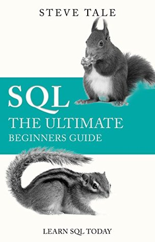
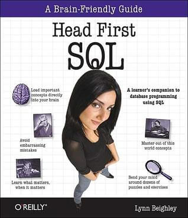
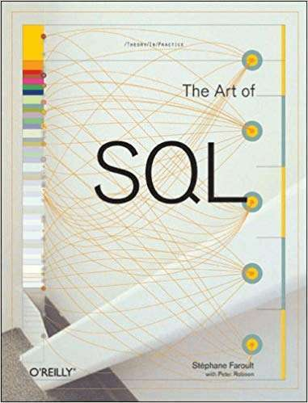
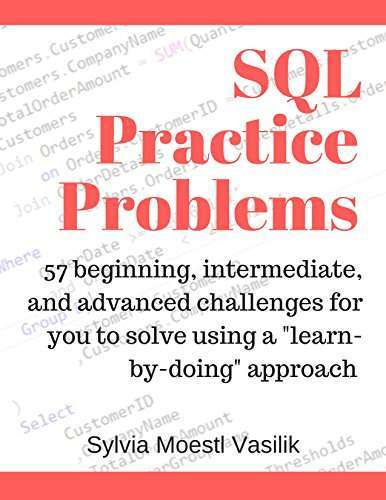
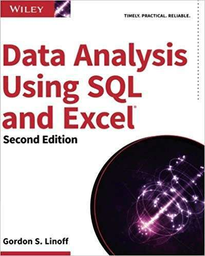
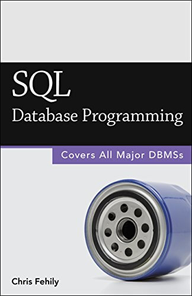
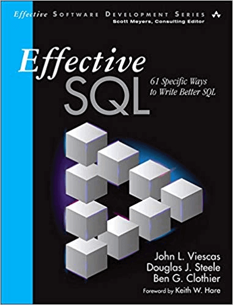
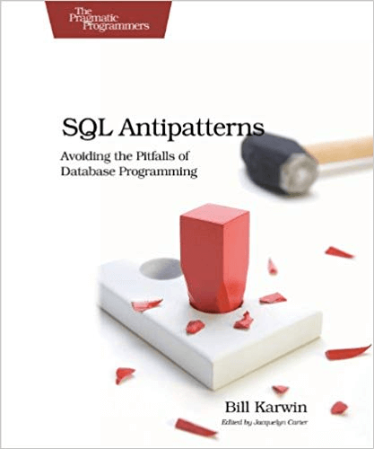
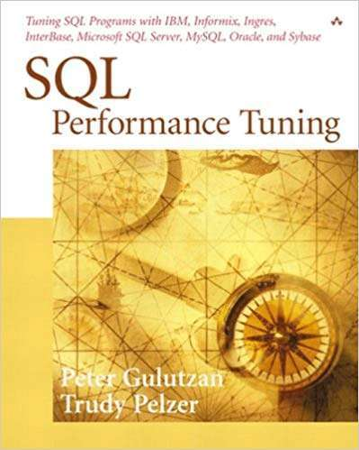
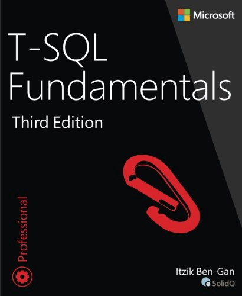

业务领导者、开发人员、数据主管和技术爱好者——是时候在您的商业智能书架上腾出一些空间了，因为 datapine 再一次有新书供您添加。我们已经为您提供了顶级 [数据可视化书籍](https://www.datafocus.ai/infos/best-data-visualization-books)、顶级 [商业智能书籍](https://www.datafocus.ai/infos/best-business-intelligence-books)和最佳 [数据分析书籍](https://www.datafocus.ai/infos/best-big-data-and-data-analytics-books)。现在是时候思考我们精心挑选的 16 种当今可用的最佳 SQL 书籍的清单了。

结构化查询语言 (SQL) 是用于创建、访问、操作、查询和管理数据库的最流行的语言。这种特殊的代码或语言是在 1970 年代开发的，从那时起，它已成为与各种关系数据库管理系统 (RDMS) 进行通信的标准，包括 Oracle、Microsoft SQL Server、Sybase、PostgreSQL、Informix、和 MySQL。

无论您是程序员、数据分析师还是[商业智能](https://www.datafocus.ai/infos/bi-skills-for-business-intelligence-career)最终用户，了解学习 SQL 的最佳方式对于任何处理或处理数字数据的人来说都是无价的。SQL 不仅适用于数据库管理员 (DBA)。

学习 SQL 对于查询数据库、操作[在线 BI](https://www.datafocus.ai/infos/online-bi-tools)（商业智能）工具以及利用 BI 平台的高级功能非常有用。此外，即使对于那些不直接处理数据库的人来说，了解学习 SQL 的最佳方法也是有益的：[商业智能软件](https://www.datafocus.ai/infos/best-bi-tools-software-review-list)，如 datapine，提供直观的拖放界面，无需任何 SQL 知识即可进行出色的数据查询。也就是说，了解 SQL 基础知识将帮助您了解组织的数据并更好地生成可操作的见解。

为了在您的旅程中助您一臂之力，这里是我们个人精选的 16 种现有最佳 SQL 书籍的清单。浏览我们的 SQL 书籍纲要，立即开始或继续您的旅程。但在此之前，让我们探索一些有趣的 SQL 事实：

- 除了使用结构搜索信息外，SQL 还有助于数据库中信息的结构化和管理。其中一些“结构”可能包括放置所有信息；例如，一个结构可以是关于汽车的，将它们放在由品牌、型号、制造年份和颜色组成的表格中。例如，使用[MySQL 仪表板构建器](https://www.datafocus.ai/infos/data-connectors/mysql)，您只需单击几下即可连接所有数据。
- SQL 可以在几分之一秒内执行大量复杂的功能。
- 许多拥有大量库存和多个站点页面的知名品牌和零售商使用 SQL 来增强其站点的结构功能和[MySQL 报告](https://www.datafocus.ai/infos/mysql-reporting-tools)流程。这些企业包括 eBay、Autotrader 和亚马逊。
- 尽管已经存在了一段时间，但结构化查询语言的有效和宝贵性质意味着它仍然是世界上最受追捧的技能之一，各行各业的公司都在寻找 SQL 专家来帮助他们完成一些最重要的业务计划。

**感觉受到启发？**让我们看看我们的 16 本书最好的 SQL 书籍。

## SQL 初学者书籍

这 9 本精选的 SQL 书籍中的每一本都截然不同，但都以自己的方式同样无价。如果您希望牢牢掌握结构化查询语言的基础知识及其在现实环境中的功能，那么这些就是您需要的资源。

**1) “Sams 在 10 分钟内自学 SQL”，作者 Ben Forta**

如果没有Ben Forta最畅销的 SQL 书籍“Sams Teach Yourself SQL in 10 Minutes”，就无法列出顶级 SQL 书籍。在所有面向初学者的 SQL 书籍中，这是必读的。Ben Forta 是一位专业的培训师、受欢迎的作家，他的书可能是初学者学习 SQL 的最佳方式。对于这个项目，他查看了现有的 SQL 文献，发现需要一本不面向数据库分析师 (DBA) 的 SQL 书籍。这本书满足了这一需求。正如 Forta 所说，“重点是完成工作并快速完成，帮助您在使用的任何工具或环境中尽快提高工作效率。”

换句话说，“Sams Teach Yourself SQL in 10 Minutes”教你需要了解的 SQL 部分：从简单的数据检索开始，然后快速进入更复杂的主题，包括使用[sql 连接](https://www.datafocus.ai/infos/sql-joins-and-data-analysis-using-sql)、子查询、存储过程、游标、触发器和表约束。最好的部分是您将在 22 节简短、快速的课程中有条不紊地、系统地、简单地学习 SQL。每节课只需 10 分钟或更短的时间即可完成。确保您掌握了基础知识并查看这本书。你也可以使用

**2) Alan Beaulieu 的“学习 SQL”**

Alan Beaulieu 的“Learning SQL”是我们面向初学者的另一本顶级 SQL 书籍。凭借其真实风格的写作，本介绍性指南将帮助您快速上手并运行 SQL。有了这本书，你将：

- 快速了解 SQL 基础知识并学习一些高级功能
- 使用 SQL 数据语句生成、操作和检索数据
- 使用 SQL 模式语句创建数据库对象，例如表、索引和约束
- 了解数据集如何与查询交互并了解子查询的重要性

无论您需要编写数据库应用程序、执行管理任务还是使用[SQL 报表生成器](https://www.datafocus.ai/infos/sql-report-builder)，这本书都是学习 SQL 的最佳书籍之一。

**3) “SQL：终极初学者指南：今天学习 SQL”，作者：Steve Tale**

Steve Tale 的“SQL – The Ultimate Beginners Guide”正如其名：一本适合初学者的好书。

SQL 概念以简单、简洁的语言阐述。Tale 还提供了很好的示例和示例表，以进一步增强概念和说明。

本书将作为 SQL 初学者的必备指南。此外，SQL 的概念以简单、简洁的语言和说明进行布局，以帮助您正确学习步骤。

**4) Clydebank Technology 撰写的“SQL：快速入门指南 – SQL 的简化初学者指南”**

如果您前往亚马逊，您会看到我们最喜欢的 SQL 初学者指南之一的好评。“SQL：快速入门指南”致力于向读者展示 SQL 的实际工作原理。

通过多个循序渐进的示例，作者将读者从对 SQL 完全一无所知，转变为能够快速检索和分析来自多个表的数据。

此外，您会发现许多初学者容易犯的常见错误的实际示例，使其成为学习 SQL 的最佳书籍之一。

**5) Lynn Beighley 的“Head First SQL”**

Lynn Beighley知道如何以平易近人的方式撰写技术主题。她的书“Head First SQL”就是这样做的。它的视觉丰富格式专为您的大脑工作方式而设计，而不是让您入睡的文本繁重的方式。

这本 SQL 书采用有趣的方法来展示 SQL 的基础知识以及如何真正利用该语言。无论您是复习基础知识还是从头开始，这确实是一本“最好的 SQL 书籍”。哦，她还写了另一本关于 PHP 和 MySQL 的好书。

**6) John L. Viescas 和 Michael J. Hernandez 撰写的“普通人的 SQL 查询”**

行业专家 John L. Viescas和Michael J. Hernandez在“普通人的 SQL 查询”中编写了关于编写有效 SQL 查询的最清晰、最简单的教程之一。这个动手实践的经典指导读者为几乎任何基于 SQL 的现代数据库创建可靠的查询，您也可以将其用作构建自己的[SQL 仪表板](https://www.datafocus.ai/infos/data-connectors/ms-sql-server)的一种手段。

作者揭开了 SQL 查询编写的各个方面的神秘面纱，从简单的数据选择和过滤到连接多个表和修改数据集。无论您是 DBA、开发人员、用户还是学生，如果您正在寻求建立一个坚实的全方位知识库，这可能是最好的 SQL 书籍。

**7) Stéphane Faroult 和 Peter Robson 的“SQL 的艺术”**

在我们关于 SQL 的最佳书籍清单中的第七本来自结构化查询语言专家 Stephane Faroult 和 Peter Robson 的这本简洁而富有洞察力的指南。这本 SQL 书籍是 SQL 最多产的两个声音之间的紧密合作，提供了对最佳编码实践和流程的真正洞察。

专注于开发第一次工作的那种 SQL 代码的艺术（而不是在以后消除任何潜在的有害错误和错误），对于任何初露头角的 SQL 爱好者来说，这都是一本“关于 SQL 的最佳书籍”。基于学习一门手艺而不是获得“快速修复”，SQL 的艺术是一本手册，适用于那些希望使用世界上最宝贵的处理语言之一获得长期成功的人。

**8) “SQL 实践问题：57 个初级、中级和高级挑战，供您使用‘边做边学’”方法解决，作者 Sylvia Moestl Vasilik**

该实用资源基于这样一种概念，即编写结构化查询语言和熟练处理数据的能力是目前最受追捧的工作技能之一。在这里，作者 Sylvia Moestl Vasilik 展示了一些您在现实世界中经常会遇到的 SQL 实践问题，这是我们列表中最好的 SQL 书籍之一，也是最实用的书籍之一。

对于那些希望在现有或未来的工作角色中使用 SQL 的人来说，这个“学习并实践”指南易于理解、有见地、有趣、有益且实用（如前所述）。这本令人惊叹的 SQL 初学者书籍分解成大量无价的现实世界情况和场景，提供了语言语法、设置说明、示例数据库和 57 个现实世界问题和挑战的背景知识，将帮助您掌握 SQ 的基础，将您的技能提升到一个全新的水平。任何初露头角的 SQL 开发人员阅读清单的重要补充。

**9) Gordon S. Linoff 的“使用 SQL 和 Excel 进行数据分析，第 2 版”**

对于那些与高级数据分析密切合作的人，使用 SQL 和 Excel 进行数据分析，信息专家 Gordon S. Linoff 的第二版将成为您教育书单的重要补充 - 并且是我们名单上最好的 SQL 书籍之一，手下。

作为分析思维的最佳 SQL 初学者书籍之一，这本精湛的创作展示了如何利用两个最重要的数据查询和分析工具——SQL 和 Excel——来执行全面的数据分析，而无需复杂且昂贵的数据采矿工具或应用程序。这本书深入探讨了 SQL、Excel 和数据挖掘的“在哪里”和“为什么”，内容丰富且易于理解，使其成为我们最佳 SQL 书籍列表的成功补充。

## 高级 SQL 书籍

既然我们已经专注于为新手学习 SQL 的最佳书籍，让我们进入高级领域，接下来的五本在我们的列表中。

如果您已经掌握了基础知识，那么有几本优秀的书籍可以让您的 SQL 更上一层楼。如果您正处于旅程的这个阶段，请务必查看适合您的特定关系数据库管理系统 (RDMS)的文献。

虽然许多核心概念从一个平台转移到另一个平台，但 Oracle、MySQL、SQL Server 等之间会有差异。值得注意的是，以下一些 SQL 书籍不是特定于 RDMS 的。

**10) 安东尼莫利纳罗的“SQL 食谱”**

“SQL Cookbook”旨在让您的 SQL 技能更上一层楼。如果您了解 SQL 查询语言的基础知识，但您觉得自己没有充分利用 SQL 的表达能力，那么这本书就是为您准备的。

在“SQL Cookbook”中，经验丰富的 SQL 开发人员 Anthony Molinaro 分享了他最喜欢的 SQL 技术和特性。

以 O'Reilly 流行的问题/解决方案/讨论风格编写，“SQL Cookbook”从一个问题快速移动到另一个解决方案，为您节省每一步的时间。

**11）“SQL 数据库编程”（2015 年版）作者：Chris Fehily**

《SQL 数据库编程》也可以作为一本面向初学者的 SQL 书籍列出。这本学习 SQL 的书很好地涵盖了基础知识。然而，它也远不止于此。这本书非常适合各种最终用户、分析师、数据科学家和应用程序开发人员。

读者将找到关于各种 SQL 语句可以做什么的一般概念、实用答案和清晰的解释。

本书涵盖了 Oracle、Microsoft SQL Server、IBM DB2、MySQL、PostgreSQL 和 Microsoft Access。这本书包罗万象，是数据书架的必备之选。

**12) Ralph Kimball 和 Margy Ross 的“数据仓库工具包”**

Ralph Kimball 和 Margy Ross 合着了 Kimball 的三维建模经典指南的第三版。本书提供了完整的建模技术集合，从基础开始，逐步通过日益复杂的现实世界案例研究进行。这是了解数据仓库设计的必读书籍。虽然这本书不是专门的 SQL 书籍，但它将使您对 SQL 的理解更上一层楼。

您甚至不必了解任何 SQL 即可欣赏这本书。BI 顾问 Dustin Ryan 将“数据仓库工具包”列为他为商业智能专业人士编写的四大书籍之一。他在谈到这本书时写道：“在我看来，这应该是所有在商业智能领域工作的人的必读之选。”

如果您正在寻找在现实环境中提高现有技能的方法，那么这是一本关于 SQL 的最佳书籍。

**13) John L. Viescas、Douglas J. Steele 和 Ben J. Clothier 撰写的“Effective SQL: 61 Specific Ways to Write Better SQL”**

对于在编写结构化查询语言方面具有基本能力的任何人，John L. Viescas、Douglas J. Steele 和 Ben J. Clothier 编写的这本行业广受好评的 SQL 学习书籍提供了一种可行的方法，可以让您的技能更上一层楼并应用您的新知识到许多现实世界的场景或情况。

深入研究非常具体的方法和方法，有效的 SQL：61 种编写更好 SQL 的具体方法将帮助您制作更好的结构化查询语言，同时提高您的整体成功和效率领域。

包含许多 SQL 版本的真实示例代码，包括 IBM DB2、Microsoft Access、Microsoft SQL Server、MySQL、Oracle 数据库和 PostgreSQL，这确实是世界上最好的 SQL 学习高级书籍之一。

**14) Bill Karwin 的“SQL 反模式：避免数据库编程的陷阱（实用程序员）”**

作为他所在领域的艺术家，Bill Karwin 帮助无数人编写了更好的 SQL 并创建了更强大的关系数据库，现在轮到您从他的世界级知识中受益了。

SQL Antipatterns: Avoid the Pitfalls of Database Programming 的独特之处在于它专注于常见的 SQL 编程错误，为避免此类事故或在发生此类事故时纠正它们提供了清晰的见解。

该资源分为四个实用章节，可能是在更高级级别学习 SQL 的最佳方式。如果您想跳出框框，同时微调您的技术技能，那么您应该随时将它放在您的办公桌上以供参考，并且是最好的 SQL 书籍。

**15) Peter Gulutzan 和 Trudy Pelzer 的“SQL 性能调优”**

SQL Performance Tuning 是两位才华横溢的技术头脑的有效合作，是一本 SQL 书籍，对于希望提高数据库核心性能的 DBA 和程序员来说是无价之宝。

涵盖所有类型、风格和品牌的 SQL，这是一个超出手册范围的资源。相反，这份宝贵的指南提供了一种实用的方法，不仅可以提高您在日常情况下的表现，而且可以随着时间的推移从您的数据库（或多个数据库）中获得最佳效果。

这是提高您的编程技能的最有价值的方法之一，如果我们读过一本“学习 SQL 的最佳书籍”的话。

**16) Itzik Ben-Gunn 的“T-SQL 基础第三版”**

对于希望在该领域扩大技能的高级学习者，这是地球上最好的 SQL 书籍之一。一旦您掌握了 SQL 的艺术，并且能够在一系列实际情况中应用您新学到的知识，那么学习 T-SQL 的关键元素就是下一个合乎逻辑的步骤。

专门研究 Microsoft SQL Server 和 Azure SQL，这个与平台无关的指南平衡良好，易于理解，并提供了许多挑战和解决方案，这将提高您的技能，同时让您以全新的眼光看待您的编程工作.

## 继续教育

_“对知识的投资会带来最大的利益。” - 本杰明·富兰克林_

这些多产的 SQL 书籍毫无疑问是最好的 SQL 书籍，它们会让您有一个良好的开端。但是，如果您特别渴望知识，您的 SQL 教育应该进一步扩展：那里有许多令人惊叹的 SQL 资源，包括这些出色的[商业智能播客](https://www.datafocus.ai/infos/business-intelligence-podcasts)和编程挑战。

此外， Codecademy和SQLZoo等交互式在线工具和平台将使您能够在引人入胜的实用环境中发展和练习您的编程技能——这是对您的书籍学习工作的极好补充。此外，研究一些[商业智能示例](https://www.datafocus.ai/infos/analytics-and-business-intelligence-examples)可以全面了解利用该软件生成综合商业数据的价值。

要完全掌握 SQL，您应该使用自己组织的数据进行试验。如果这让您的开发团队有点紧张，您可以随时索取数据库的本地副本，这样您就可以玩耍，将其用作练习平台，而不会对您的组织产生真正的影响。您还可以利用[数据发现工具](https://www.datafocus.ai/infos/what-are-data-discovery-tools)进一步了解数据的重要性以及如何处理数据。

掌握与您相关的真实数据是最有效的学习方式，这些关于 SQL 的最佳书籍将为您提供真正实际成功所需的指导。

**总而言之，这里是最好的 SQL 书籍列表：**

1. “Sams 在 10 分钟内自学 SQL”，作者 Ben Forta
2. Alan Beaulieu 的“学习 SQL”
3. “SQL：终极初学者指南：今天学习 SQL”，作者：Steve Tale
4. “SQL：快速入门指南 – SQL 的简化初学者指南”，作者：Clydebank Technology
5. Lynn Beighley 的“Head First SQL”
6. “普通人的 SQL 查询”，作者：John L. Viescas 和 Michael J. Hernandez
7. Stéphane Faroult 和 Peter Robson 的“SQL 的艺术”
8. “SQL 实践问题：57 个初级、中级和高级挑战供您使用‘边做边学’”方法解决，作者 Sylvia Moestl Vasilik
9. “使用 SQL 和 Excel 进行数据分析，第 2 版”，作者 Gordon S. Linoff
10. 安东尼莫利纳罗的“SQL 食谱”
11. “SQL 数据库编程”（2015 版）作者：Chris Fehily
12. Ralph Kimball 和 Margy Ross 的“数据仓库工具包”
13. John L. Viescas、Douglas J. Steele 和 Ben J. Clothier 撰写的“有效 SQL：编写更好 SQL 的 61 种特定方法”
14. “SQL 反模式：避免数据库编程的陷阱（实用程序员）”，作者：Bill Karwin
15. Peter Gulutzan 和 Trudy Pelzer 的“SQL 性能调优”
16. Itzik Ben-Gunn 的“T-SQL 基础第三版”

### 现在开始阅读！

有了这 16 本书，你就可以成为 SQL 大师了。但是，如果您不想成为一名成熟的 SQL 专家，这不是问题 - BI 工具，例如 datapine，提供了简单的拖放界面来为您执行 SQL 查询 -[数据质量](https://www.datafocus.ai/infos/data-quality-management-and-metrics)将变得更加高效和成本友好。

我们祝您好运。如果您对我们的工具、平台或服务有任何疑问，请不要犹豫，试用我们的软件进行[14 天试用](https://www.datafocus.ai/console/)，要更深入地了解我们的解决方案，您可以浏览我们的[仪表板示例](https://www.datafocus.ai/infos/dashboard-examples-and-templates)和模板。
