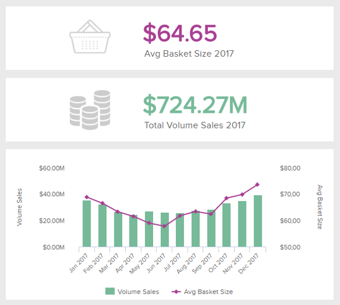
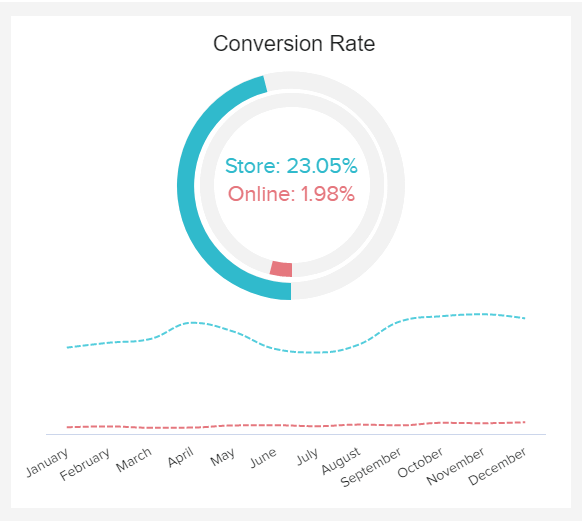
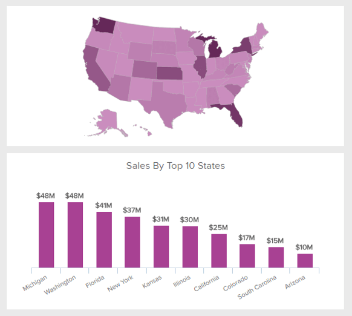
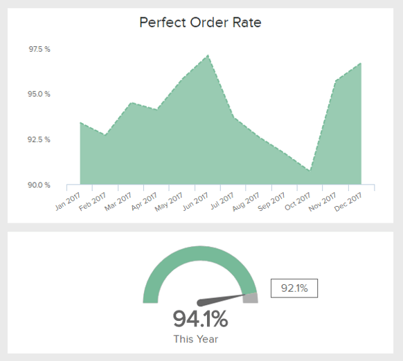
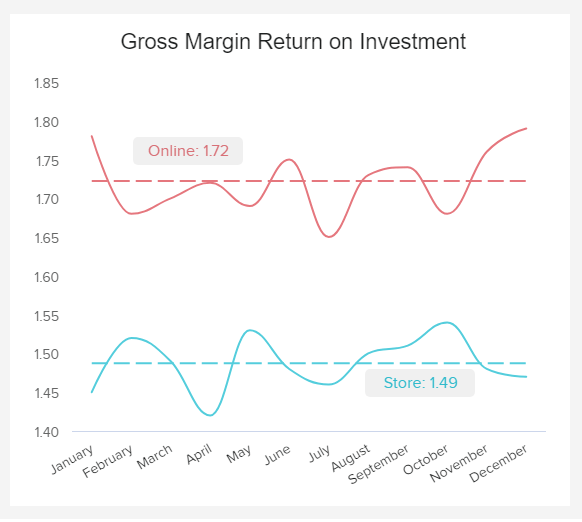
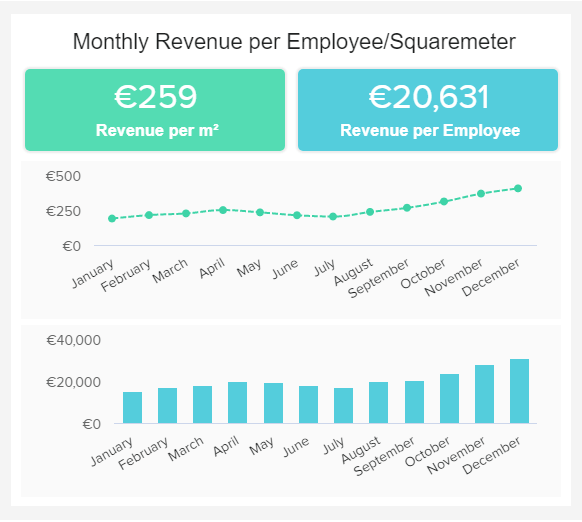

### ✔ 查看不同的模板和设计✔ 查找和跟踪正确的零售 KPI 以满足您的企业目标

**零售 KPI 或指标**是一种绩效衡量，以有效的方式跟踪重要的零售流程。零售商使用这些 KPI 通过识别消费者模式以及订购或运输过程中的瓶颈来增加利润。

零售业是一个严重依赖于提供优质客户体验的行业，但同时也要优化内部流程以产生利润。也就是说，[零售仪表板](https://www.datafocus.ai/infos/dashboard-examples-and-templates-retail)是许多专业人士为了在这个竞争激烈的行业中茁壮成长而使用的工具，无论是作为小商店还是大型跨国企业。无论公司规模如何，都需要[零售分析](https://www.datafocus.ai/infos/retail-analytics)来提高客户满意度、监控促销活动、销售、退货原因和许多其他关键零售指标。通过使用专业的[KPI 软件](https://www.datafocus.ai/infos/kpi-dashboard-software)，零售商有更大的机会在市场上竞争并建立数据驱动的文化，以确保可持续发展。

**_在这里，我们提供了现代零售商必须了解的 16 个最重要的零售 KPI 和指标：_**

[网站流量/人流量](https://www.datafocus.ai/infos/kpi-examples-and-templates-retail#website-foot-traffic)：评估您的营销和广告投入

[平均交易规模](https://www.datafocus.ai/infos/kpi-examples-and-templates-retail#average-transaction-size)：分析客户的购买行为

[每个客户的平均单位数](https://www.datafocus.ai/infos/kpi-examples-and-templates-retail#average-units-per-customers)：深入了解客户行为趋势

[总销售量](https://www.datafocus.ai/infos/kpi-examples-and-templates-retail#total-volume-of-sales)：随时间跟踪您的销售数量

[销售率](https://www.datafocus.ai/infos/kpi-examples-and-templates-retail#sell-through-rate)：比较收到和销售的库存

[延期交货率](https://www.datafocus.ai/infos/kpi-examples-and-templates-retail#back-order)：衡量履行客户订单的能力

[退货率](https://www.datafocus.ai/infos/kpi-examples-and-templates-retail#rate-of-return)：评估退回给您的订单数量

[客户保留](https://www.datafocus.ai/infos/kpi-examples-and-templates-retail#customer-retention)：了解如何长期留住客户

[零售转化率](https://www.datafocus.ai/infos/kpi-examples-and-templates-retail#retail-conversion-rate)：提高您的零售转化率

[总订单](https://www.datafocus.ai/infos/kpi-examples-and-templates-retail#total-orders)：查看订单的演变

[按地区划分的总销售额](https://www.datafocus.ai/infos/kpi-examples-and-templates-retail#total-sales-by-region)：评估您的销售额和销售地点

[订单状态](https://www.datafocus.ai/infos/kpi-examples-and-templates-retail#order-status)：实时跟踪和分析您的订单

[完美订单率](https://www.datafocus.ai/infos/kpi-examples-and-templates-retail#perfect-order-rate-retail)：查看无事故交付的订单数量

[退货原因](https://www.datafocus.ai/infos/kpi-examples-and-templates-retail#return-reason)：深入了解客户退货的原因

[GMROI](https://www.datafocus.ai/infos/kpi-examples-and-templates-retail#gross-margin-return-on-investment-gmroi) ：跟踪投资和回报之间的关系

[每位员工的月收入](https://www.datafocus.ai/infos/kpi-examples-and-templates-retail#monhtly-revenue-per-employee)：评估员工的价值

## 网站流量/人流量

**评估您的营销和广告工作**

网站流量和人流量是零售 KPI，对于评估您的促销活动是否产生了积极的业务影响至关重要，这首先要从流量开始。客流量是指进入您商店的人数，而网站流量是指访问过您网站的访问者人数。在线下世界，如果你有一个有趣的橱窗展示，或者推出了促销活动，人流量将决定你是否成功。另一方面，如果您在在线广告上投入了大量资金并增加了网站流量，则必须查看最终的转化率和销售额。值得吗？

**性能指标**

您需要创造多少流量是没有对错之分的，但这种流量最终需要带来销售，因此请仔细计划您的营销活动。

**相关展示仪表板**

- [零售分析仪表板](https://www.datafocus.ai/infos/dashboard-examples-and-templates-retail#retail-analytics-dashboard)

## 平均交易规模

**分析客户的购买行为**

平均交易规模将使您能够衡量每笔交易平均花费的金额，并根据零售店的类型而有所不同。在一年中评估此 KPI 是了解您的客户何时更有可能花钱的一个很好的指标，使您能够相应地调整广告。同样，根据客户群或用于进行购买的设备来衡量它，会让您知道谁是您的客户以及他们最喜欢的购买平台是什么，让您有机会调整您的在线商店。但是，要对零售KPI保持警惕，因为它可能会误导你：如果您有很多异常值，则取中位数而不是交易规模的平均值会更准确。

**性能指标**

当然，您希望随着时间的推移增加平均交易规模。然而，将此指标与您的 ARPU（每单位/客户的平均单位数）结合起来通常是有意义的，它显示了您所有交易的平均客户收益。

**相关展示仪表板**

- [零售店仪表板](https://www.datafocus.ai/infos/dashboard-examples-and-templates-retail#retail-store-dashboard)

## 每个客户的平均数量

**深入了解您商店的购买趋势**

每个客户的平均单位是零售中使用的销售指标，用于评估客户在任何给定交易中平均购买了多少商品。把它分成不同的时间段或不同的物品类别是很有趣的，这样可以对销售额有一个更精确的评估。这样，您将了解全年的购买趋势，或者您的销售团队的效率。将此数据与平均交易价格等其他零售 KPI 并行化，您可以更全面地了解客户的行为。

**性能指标**

该指标越高，每笔交易购买的商品就越多。低的数量可以通过鼓励更多的交叉销售来增加。

**相关展示仪表板**

- [零售店仪表板](https://www.datafocus.ai/infos/dashboard-examples-and-templates-retail#retail-store-dashboard)

## 总销量

**衡量您销售的产品、销售地点和时间**

这是一个非常简单的零售 KPI 示例。它衡量一段时间内或跨地点（包括实体店和在线交易）的销售量。这样，您就可以看到需求在何时何地升高或降低，并尝试了解原因。它还有助于衡量您的业务动态并创建未来的预测。此外，通过在同一时间段内的商店之间进行比较，您可以根据这些地点适当地定制产品或服务，以及执行 A/B 测试：对于地点 1 和 2 的类似销量，只在其中一个地点实施折扣/促销/样品/演示，并观察其对销售的影响。

**性能指标**

详细监控和预测您的总销量，以便及早识别您的业务或产品类别中表现不佳的领域。

**相关展示仪表板**

- [零售 KPI 仪表板](https://www.datafocus.ai/infos/dashboard-examples-and-templates-retail#retail-kpi-dashboard)

## 销售率

**比较收到和销售的库存**

销售率是零售业的关键绩效指标之一，重点关注特定时期内售出的库存量与收到的库存量之间的相关性。如果您想确定销售库存的速度（通常按月计算），那么这个指标应该在您的列表中名列前茅。此 KPI 的目标是改进库存管理流程，并确保尽可能高的百分比，以实现健康的销售流程。请记住，任何留在货架上的产品都会让您花钱，并有可能减慢您的产品移动速度。

**性能指标**

如果您的销售率处于较低水平，那么是时候重新评估您的商品表现和导致销售缓慢的商品了。

**相关展示仪表板**

- [零售分析仪表板](https://www.datafocus.ai/infos/dashboard-examples-and-templates-retail#retail-analytics-dashboard)

## 延期交货率

**衡量完成客户订单的能力**

延期交货率是客户下订单时无法完成的订单数量除以订单总数。这是一种零售指标，可以以商品或美元为单位进行衡量。延期交货率高通常是公司希望避免的情况；但是，它并不总是负面的。如果这种情况经常发生，它确实表明生产过程中存在一定的低效，需要加以解决；但它也可能意味着出乎意料的销量增长。同样，延期交货率的下降可能会导致需求不足，或者相反，生产效率会提高。

**性能指标**

为了充分利用该指标并理解其含义，在其环境中衡量它是一件有趣的事情，同时还要衡量其他物流和供应链kpi，如库存准确性或缺货率。

**相关展示仪表板**

- [零售 KPI 仪表板](https://www.datafocus.ai/infos/dashboard-examples-and-templates-retail#retail-kpi-dashboard)

## 退货率

**评估退回给您的订单数量**

没有企业喜欢看到顾客带着他的物品走回来，或者一个包裹回到工厂。退货成本高昂，因为它们需要再次处理，或者由于缺陷而丢失。这就是为什么不仅要跟踪您的零售店在特定时间段内的退货量，而且还要跟踪原因：您可以将此零售指标与退货原因结合起来，以获得更深入的洞察力。了解这些退货发生的速度以及受影响最大的类别将有助于您在未来减少退货。

**性能指标**

要计算退货率，请将退货数量除以售出商品的数量。将此比率乘以 100 ，以百分数表示。目的是让它尽可能低。

**相关展示仪表板**

- [零售 KPI 仪表板](https://www.datafocus.ai/infos/dashboard-examples-and-templates-retail#retail-kpi-dashboard)

## 客户保留

**分析您在留住客户方面的能力**

在努力获取新客户之后，公司还要更加注重客户的留存，并长期培养一定的品牌忠诚度。客户留存率衡量的是您的零售业务从现有客户数据库中产生经常性收入的能力。像这样的零售指标会根据您的业务性质而有很大差异，因此了解平均值并尝试达到它会很有趣。由于零售业存在激烈的竞争，因此客户获取成本非常高，以至于您很少能从他们的第一个订单中获利：留住他们对于未来的利益至关重要。

**性能指标**

客户留存率=重复从您的企业购买的客户数量。请记住，留住客户比获得新客户更便宜。

**相关展示仪表板**

- [零售 KPI 仪表板](https://www.datafocus.ai/infos/dashboard-examples-and-templates-retail#retail-kpi-dashboard)

## 零售转化率

**提高您的零售转化率**

我们的零售业 KPI 列表将继续以转化率为准。这是最重要的跟踪指标之一，因为它将向您展示最大化销售的能力，并使您能够发现在线和离线商店的任何低效。更高的流量是很好的，但如果您的商店或网店的访问不能转化，您的底线就会受到影响。要计算零售转化率，您需要将销售数量除以访客总数。随着时间的推移进行比较，看看您的策略是否对您的业务产生了积极影响。

**性能指标**

如果您不衡量此指标，您的业务决策将基于猜测。与您的客户建立融洽的关系，但不要太急于求成。

**相关展示仪表板**

- [零售分析仪表板](https://www.datafocus.ai/infos/dashboard-examples-and-templates-retail#retail-analytics-dashboard)

## 总订单

**查看下单的演变**

另一个非常简单的零售指标。您的总订单数据计算了在一天、一个月或一年的时间里，您的企业收到了多少订单。这将帮助您了解高峰期，并相应地调整您的库存，以避免任何缺货或延期交货。它还将帮助您调整您的员工管理，并避免由于人员超载而导致的错误或缺陷。您也可以计算每个客户的平均订单数量，但就像交易规模一样，如果一位客户一次下大量订单，则平均值可能会有所偏差。你的公司收到的订单总数也是你业务的脉搏。

**性能指标**

订单总额的增长是业务增长的一个很好的指标。但要注意将其与你的收益/利润增长进行比较，这也应该有所提高。

**相关展示仪表板**

- [销售和订单概览仪表板](https://www.datafocus.ai/infos/dashboard-examples-and-templates-retail#sales-and-order-online-dashboard)

## 各地区总销售额

**评估您的销售量和销售地点**

如果您有在线业务，则根据客户的位置来衡量您的销售量，如果您有实体销售点，则根据您的商店位置来衡量销售量。如前所述，在查看销量 KPI 时，您可以比较不同地区的销量并尝试了解原因，尝试实施新的营销计划并在不同地点进行测试。为了充分利用这一零售指标，请与其他 KPI 一起分析它，例如与您的客户相关的人口统计指标：性别、年龄、城市和州的人口，以便全面了解您的客户和手头的所有卡，从而提高你在每个地区的总销售额。

**性能指标**

确认您的客户在哪里购买最多，以发现趋势并相应地实施特定策略。

**相关展示仪表板**

- [销售和订单概览仪表板](https://www.datafocus.ai/infos/dashboard-examples-and-templates-retail#sales-and-order-online-dashboard)

## 订单状态

**实时跟踪您的订单**

订单状态是一个很好的零售 KPI 示例，可为您的企业和客户提供服务。事实上，客户想知道他们下的订单是在达成过程的哪个阶段，你需要实时更新不同的订单，你必须在这件事上评估你的供应链效率。这样做的目的当然是减少延期交货或补货的百分比，并保持较高的新订单比例以保持业务发展。跟踪此类零售指标将帮助您监控供应链并在处理缓慢、不准确或新订单少的情况下进行调整。

**性能指标**

订单总额的增长是业务增长的良好指标。但要注意将其与你的收益/利润增长进行比较，这也应该有所提高。

**相关展示仪表板**

- [销售和订单概览仪表板](https://www.datafocus.ai/infos/dashboard-examples-and-templates-retail#sales-and-order-online-dashboard)

## 完美订单率

**评估贵公司的交付效率**

完美订单率是评估绩效的良好零售 KPI。它衡量在运输途中没有发生任何事故（不准确、损坏、延误、丢失……）的情况下完成并发货的订单数量。一个低的完美订单率会导致供应链效率低下，不可避免地会影响您的客户满意度以及您的商业声誉。高比率将避免您因退货或损坏而产生的无用费用，并将在你的客户心中建立一个可靠的企业形象，这将有更多的可能性回来并向朋友和家人推荐你的服务。

**性能指标**

越高越好。此 KPI 直接影响您的客户留存率。

**相关展示仪表板**

- [销售和订单概览仪表板](https://www.datafocus.ai/infos/dashboard-examples-and-templates-retail#sales-and-order-online-dashboard)

## 退货原因

**深入了解客户退货的原因**

退货原因是质量评估的零售 KPI 示例：在评估了您的业务面临的退货率之后，您应该深入研究为什么要退货。可能是产品质量、未兑现的营销承诺、客户服务、缺陷、不准确等。有了这些见解，您可以改善零售业务不足之处。退货原因要与其他kpi进行比较，如退货率或完美订单率，以充分发挥其潜力。一旦你评估了你的退货情况，你就可以考虑实施针对特定商品、服务或原因的退货政策。

**性能指标**

经过仔细的评估和基准测试，您的目标应该是降低退货率，这要归功于您从退货原因中获得的洞察力。

**相关展示仪表板**

- [销售和订单概览仪表板](https://www.datafocus.ai/infos/dashboard-examples-and-templates-retail#sales-and-order-online-dashboard)

## 投资回报率

**追踪投资与回报之间的关系**

如果您想提高零售业的 KPI 绩效，跟踪毛利率投资回报率 (GMROI) 以及仪表板上描述的其他关键指标显然是必须的。公式很简单，你需要用毛利除以平均库存，结果会告诉你你的库存赚了多少钱。该指标值得针对特定产品或类别进行衡量，因为它是一种明确的库存盈利能力衡量标准，它可以让您了解哪些商品值得在您的商店或在线商店中拥有。要改善零售的 此KPI，您可以提高价格或降低商品成本，但这取决于您当前的状态以及是否需要调整。较高的比率意味着您的公司在销售额、利润和库存成本之间存在一个健康的关系。

**性能指标**

如果 GMROI 比率高于 1，则表明业务状况良好。如果低于 1，则需要调整业务管理并找出瓶颈。

**相关展示仪表板**

- [零售分析仪表板](https://www.datafocus.ai/infos/dashboard-examples-and-templates-retail#retail-analytics-dashboard)

## 每位员工的月收入

**评估员工的经济能力**

每位员工的收入是零售业的一个 KPI，它向您显示每位员工为您的零售公司创造了多少收入。它的简单计算方法是将公司的总收入除以当前的员工人数。比率越高，生产率越好。在我们的示例中，我们还将每平方米的收入可视化，这是您实体店生产力的直接展示，您可以看到它随着时间的推移而增加。如前所述，这些零售绩效指标是公司生产力的重要指标，如果您看到某些负面趋势，则应包含高级分析、重新评估商店布局、优化价格或推动促销活动。

**性能指标**

在规划商店布局和评估员工的生产力时，您可以使用每位员工和每平方米的收入。

**相关展示仪表板**

- [零售分析仪表板](https://www.datafocus.ai/infos/dashboard-examples-and-templates-retail#retail-analytics-dashboard)
