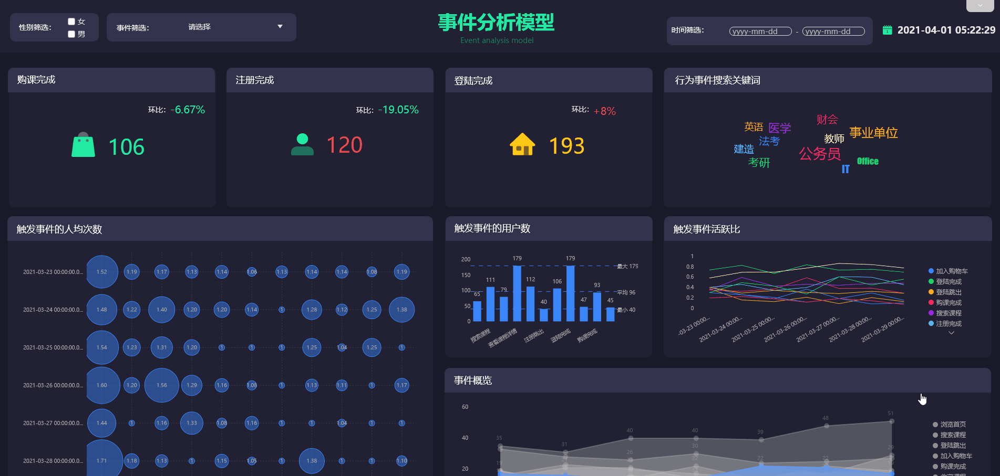

此商业智能软件数据对接相关功能主要在涵盖数据分析过程的初始阶段。无论业务规模如何，公司都在从多个来源收集数据。这些数据通常保存在不同的数据库、外部应用程序或无限数量的 Excel 表中，这使得几乎不可能合并不同的数据集并及时更新每个源。BI 工具旨在通过提供以下功能使数据集成成为一项简单的任务：

### a） 数据连接器

我们的第一个商业智能功能是数据分析流程中最早的一步，它是指能够将所有内部和外部数据源连接到一个访问点。必须手动处理来自不同渠道的所有数据是一项非常痛苦的任务，需要很多时间。由于现代数据连接器，数据集成从未如此简单。只需配置，就可连接数据库、平面文件、社交媒体数据、API、CRM 数据和其他几个源。连接源后，您不必担心手动更新它们，因为软件会自动向您显示最新的可用数据。

\[caption id="attachment\_40367" align="aligncenter" width="1920"\] DataFocus搜索式BI-页面banner-数据大脑\[/caption\]

### b） 灵活数据集成

灵活的数据集成是您在为业务投资 BI 软件时应寻找的另一个重要功能。您选择的工具应为您提供不同的数据存储选项，例如远程连接或存储在数据仓库中。一方面，远程连接允许您将所有数据保留在服务器上并远程访问。这意味着您在查询数据时将依赖于自己的服务器的速度和容量。另一方面，将数据保存在工具的仓库中意味着您的分析数据将由软件进行克隆和存储，软件将自动更新该数据以获取新的业务见解。软件内部数据仓库的好处是，它们创建了专门的解决方案，这些解决方案创建了更快、更高效的服务器来支持海量信息。

\[caption id="attachment\_41393" align="alignnone" width="1903"\] DataFocus搜索式BI-搜索可视化大屏分享-事件分析模型\[/caption\]

### c） 加入数据源

与连接信息相关的最后一个商业智能功能是能够加入数据源。这意味着，您可以轻松地从多个来源统一数据以运行跨数据库查询并提取高级业务见解。拥有匹配和统一来自多个来源的数据的技术对于获得必要的见解以使您的业务成功至关重要。现代 BI 工具应通过点击几下来定义各个源之间的关系，例如DataFocus中间表或者关联关系，都可以实现这种能力。
