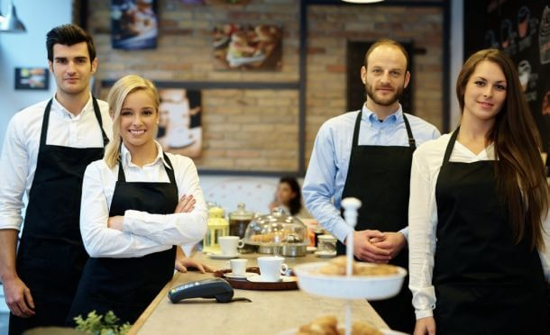

餐饮业是世界上竞争最激烈的行业之一。作为一个物种，我们不仅需要吃和喝来生存;几个世纪以来，人们一直珍视公共用餐的体验。由于我们一有机会就喜欢外出就餐，所以全球各地的村庄、城镇和城市对餐馆的需求都很大。

但随着这种需求的出现， 餐馆饱和度显着提高，这意味着要在餐饮业蓬勃发展，或者说真正生存下来，就必须在竞争中领先。

在之前对现实生活中的[大数据示例](https://www.datafocus.ai/infos/big-data-examples-in-real-life/)的研究中，我们探讨了餐饮业如何从餐厅分析的使用中受益——我们将在此深入探讨这一主题。

现代餐厅管理和全国餐厅协会透露，每年约有 60,000 家新餐厅开业。但令人震惊的是，每年有 50,000 家餐厅关门。这是一个发人深省的数据。

如果您正在阅读本文，您可能想知道如何防止您的新兴美食店加入那些“差点成功”的餐厅的行列。

虽然这个问题没有速成的解决方案或明确的答案，但我们可以说，投资于数据驱动的解决方案、[报告工具](https://www.datafocus.ai/infos/online-reporting)并利用餐厅分析的力量将帮助您在这个竞争最激烈的行业中取得成功。

通过使用[数据分析工具](https://www.datafocus.ai/infos/data-analysis-tools)管理您的信息，您可以提高竞争优势、提高盈利能力、提高利润率并扩大客户群。数据使您能够客观、准确、全面地了解餐厅的日常功能。

在这里，我们将研究餐厅数据分析、餐厅预测分析、餐厅分析软件，以及大数据可以帮助全面提升您的商业前景的具体方式。

让我们从定义开始。

## 什么是餐厅分析？

餐厅分析的核心是分析与您的餐厅业务相关的所有数据，并在商业智能软件的帮助下将其转化为可操作的见解，最终显着提高效率。

在当今高度互联的数字环境中，可以收集、组织和呈现每一个信息片段，以从等待时间到员工绩效和菜单进行优化，来帮助您的餐厅不断发展和改进。

## 为什么餐厅分析很重要？

餐厅的业务分析对于了解您的业务的内部运作是不可或缺的，但也要了解如何改进它以促进可持续的成功，从而使您在竞争中脱颖而出。

通过使用相关的关键绩效指标 (KPI) 和[数据仪表板](https://www.datafocus.ai/infos/data-dashboards-definition-examples-templates/)，您将能够以一种清晰、简洁和易于理解的方式，从过去、现在和预测数据中提取数据，跟踪、监视和衡量最有价值的业务见解。这将实现可持续的[KPI 管理](https://www.datafocus.ai/infos/kpi-management-and-best-practices/) 流程，最终提高生产力并节省资金。

餐厅数据分析将帮助您了解问题的核心，并了解关于您的业务的全部真相。当我们讨论这个主题时，让我们看看餐馆的业务分析将如何帮助您做出积极的改变，从而获得真正的结果。

总之，基于餐厅的数据分析对于餐厅的成功至关重要，因为它们使您能够：

- **整理**您的数据并忽略与您的目标相关的任何指标。
- **将您最有价值的数据转化**为可行的见解。
- **使用交互式 KPI监控**、衡量和跟踪您的绩效。
- 发现让您在竞争中脱颖而出的新兴趋势**。**
- **让**您的业务比您想象的更高效、更智能、更有利可图。

## 预测分析在餐厅中的作用

佩里集团（The Perry Group）和餐馆经纪人（The Restaurant Brokers）的研究表明，_90% 的独立餐厅在开业后一年内就倒闭了。_此外，能够存活 12 个月的餐厅中70% 将在未来三到五年内关门歇业。因此，毫不夸张地说，这个世界上开设的绝大多数餐厅都没有成功。但这并不意味着你的也不能。

我们探讨了餐厅分析是什么以及餐厅数据分析如何帮助您更深入地了解您的业务。但在我们深入探讨餐厅数据分析如何增强您的业务的具体方式之前，重要的是要掌握预测数据在服务行业中的一般作用。

虽然[预测分析](https://www.datafocus.ai/infos/what-is-predictive-analytics/)不是某种形式的魔法数字，但这种具有前瞻性的数据和洞察力可以帮助您的餐厅根据趋势做出宝贵的改变，这些趋势表明您的业务的特定元素可以如何展开。

以下是预测分析在餐厅中的主要作用：

**1\. 预测趋势**

餐厅预测分析使用历史数据和实时数据来预测未来的优势、劣势和趋势。通过访问这些信息（通常在[实时仪表板](https://www.datafocus.ai/infos/live-dashboards)的帮助下） ，您将能够制定策略并创建有助于增强您的企业未来成功可能性的计划。

**2.全景视野**

通过使用预测分析，您将能够深入了解过去和现在的趋势、见解和可视化，从而用您的数据创建一个叙事。这样做，您将享受到您企业的全景视野，获得真正了解您的餐厅所需的视角，进而为您提供制定创新业务、促进战略所需的灵感。

**3\. 运营效率**

从减少食物浪费到季节性菜单优化和未来员工绩效水平，餐厅预测分析可以帮助您的业务的日常、每周和长期运营业务，我们将在适当的时候看到这些好处。

## 但我非常了解我的业务......

此时，您可能会想，“好吧，数据都很好，但我在餐饮行业工作了很长时间。我相信我的直觉，而且我认为数据不会比我更有见识”。让我们进一步研究一下。

假设您从事餐饮业已有数十年。也许您已经从洗碗工一直工作到老板或经理职位。或者，从你记事起，你家就有一家餐馆，而且你从小就参与其中。无论哪种方式，您都已经对您的餐厅和地理位置中的“什么有效”以及“什么无效”产生了一种微妙的感觉。您尝试过特价商品，尝试过促销活动，并换过菜单。

你觉得你已经做了几乎所有事情。在所有这些实验之后，您就知道您的客户喜欢什么，不喜欢什么，以及他们未来可能对什么感兴趣。没有人质疑这一点。数据不能为你经营餐厅，数据也不能取代底层的体验。数据也无法取代您的创造力、风格和对业务的热情。

事情是这样的：数据并不意味着“取代”任何东西。相反，餐厅分析是对于您已经具备的[商业智能](https://www.datafocus.ai/infos/bi-skills-for-business-intelligence-career)的补充。说实话，你的某些直觉可能并不完美。假设你觉得你知道：

- 您的客户最喜欢什么类型的菜肴
- 哪些服务器的订单数量一直最大
- 可能会有什么新的促销活动

您根据过去的经验了解这些事情，因此您对这些领域形成了信念。问题是我们的现代世界正在加速变化。你的信念和直觉很快就会变得不准确。

数据可以作为一种“检查自己”的方式，并深入了解真正让您的业务运转的原因。正如数据科学大师 Peter Chen在一篇文章中所写,“分析不能提出想法，但它可以帮助你改进好的想法，避免尝试糟糕的想法，并发现可以修复的缺陷”。

## 赚取利润的案例研究

让我们通过一个案例研究来说明其中的一些原理。Dickey's Barbecue Pit 是一家位于美国的家庭经营的连锁餐厅，拥有 500 多家分店。有一天，首席执行官 Roland Dickey 向他的妻子（也是 CIO）Laura 提出了一个想法：“烧烤和大数据——让我们来做这件事吧！” 这对夫妇想要的不仅仅是大数据，还需要实时、可操作的见解。

在他们的餐厅分析系统到位后，他们开始收集“无价”的信息，例如：

- **人口统计数据：** 通过分析，Dickey's 现在知道他们的午餐客人一般是43岁、开SUV上班的男性。他们甚至知道这个客户的平均通勤时间是 30 分钟。因此，Dickey's 制作了专门针对居住在距离 Dickey's 位置 15 到 30 分钟路程的福特车主的广告。
- **行为数据：** Dickey's 了解到，有孩子的女性经常在星期三去某个地方，并在下午晚些时候享用一顿丰盛的午餐。由于这些数据，Dickey's 在 食谱创意网站上发布了 “Craft Wednesdays”的广告，以吸引母亲和他们的孩子。
- **共同的客户兴趣：** Dickey's 发现他们的客户喜欢梦幻足球和狗。因此，他们开始在梦幻足球网站和爱狗人士网站以及动物类电视频道上投放广告。他们甚至在他们的餐饮照片中使用狗作为品牌举措。

最后，由于其餐厅分析平台的实时性，Dickey 的经理和加盟商可以根据日常销售趋势采取巧妙的战术行动。结合您的知识与各种[销售 KPI](https://www.datafocus.ai/infos/kpi-examples-and-templates-sales)，您可以优化您的运营。

例如，您可以库存中积累的商品制定新的销售计划；或者，如果某个地点的业务比最初预期的少，根据本地情况销售。

餐厅数据分析的另一个优势。

## 现代餐厅分析回答关键业务问题

基于餐厅的数据分析的基本好处之一是它可以帮助您发现关键的业务问题。通过这样，您将使您的餐厅更具凝聚力、更具竞争力，当然，也更盈利。

作为餐厅老板，毫无疑问，您每天都会遇到许多亟待解决的问题，并想要找到可行的答案。正如我们说的，餐厅分析将帮助您完成这个过程。

供您参考，通过使用[交互式仪表板](https://www.datafocus.ai/infos/interactive-dashboard-features)，您将能够找到以下基于餐厅的业务问题的切实答案：

- **我的菜单中的哪些项目或哪些菜单优惠最受欢迎？**
- **我一周中哪段时间最安静?**
- **哪个服务员表现最好，且始终如一?**
- **就利润和服务而言，我的员工工作安排得如何?**
- **我的收入是否会随着时间稳步增长？**

让我们看看这在实践中是如何工作的。

## 6 种可以帮助您业务的餐厅分析

在我们前面的观点的基础上，现在是时候探讨在现实世界中，采用数据驱动的解决方案如何帮助您回答问题并提高许多关键领域的效率。

因此，事不宜迟，这里有六种基于餐厅的分析方法可以帮助您的业务。

### 1) 增加饮料的订单量

如果您正在设计一个新的饮品菜单，您可以查看您的餐厅分析，以了解人们倾向于在您菜单上的商品中订购哪些饮品。

然后，您可以通过在菜单上或者通过侍应生推荐这些已经很受欢迎的葡萄酒或饮料搭配餐点，来增加销售额。

### 2) 通过菜单分析获得更多回头客

您可以使用餐厅分析来识别菜单上的哪些食物是受欢迎的，哪些是劣质的。这与客户忠诚度计划结合使用效果最好，这样您就可以跟踪每个客户的长期消费模式。

例如，假设您运行几个月的购买数据。您可以将菜单项分为 4 类：

1**.你的历史最佳菜品:**

**_这些物品被订购了很多，人们倾向于重新订购它们_**

绝对不要乱来——如果有的话，考虑做更多的广告来提及这些菜肴或以其他方式展示它们。此外，如果您想在菜单中添加新菜品，你应该首先从你的“历史上最好的菜肴”中寻找灵感。如果你所有的“拿手好菜”都是牛排，那么新的素菜可能就不那么受欢迎了。

**2\. 你的“昙花一现”菜品：**

**_这些菜品被订购了很多，但人们不倾向于重新订购它们。_**

你将需要进一步调查这些。人们是因为菜不好而不再订购吗？或者他们只是想尝试一种“不同”的菜，看看会是什么样子？如果是第一个原因，让它变得更好，或者干脆把它扔掉。然而，如果人们只是想尝试“不同的菜”——这也是一件很有用的事情。显然，这件商品很诱人！检查菜品名称和菜单描述，寻找可以应用于菜单其余部分的线索。

**3\. 你的“隐藏的宝石”菜品：**

**_人们不会经常点这些菜，但是一旦有人尝试过一次，他们就会上瘾。_**

这是一个很好的分析案例，因为您可以通过促销和折扣来吸引人们尝试这些菜肴。一旦他们尝试了，您的工作就完成了。这一类别还可能受益于更好的菜单名称和描述，使它们更吸引那些以前没有尝试过它们的人。

此外，这些都是非常棒的菜肴，可供您的服务员重点介绍，让他们有机会展示自己。毕竟，很多人都_喜欢_美味但鲜为人知的“隐藏的宝石”。

**4\. 你的厨艺不佳菜品：**

**_这些菜不常点。当它们被订购时，人们不会再次订购它们。_**

您应该重新加工这些菜肴或将它们从菜单中删除，因为它们给您的餐厅带来了坏名声。拥有一份选择较少的“紧凑”美味菜单比拥有一个包含一些马马虎虎菜品的庞大菜单要好得多。

最后，您应该培训您的员工，在客户要求推荐时，从”历史最佳菜品”和“隐藏的宝石”菜品中推荐。这些菜肴最有可能给人留下好印象（并获得回头客）。

### 3）你可以（客观地）看到你的明星演员是谁

假设您在招聘和解雇员工时依赖经理的意见。这可能行得通——但你的经理可能有自己的偏见，这些偏见会影响和扭曲他们对侍应生高水平表现的看法。

如果您拥有与员工平均订单规模相关的餐厅数据分析，您就可以更清楚地了解谁在“赚钱养家”。

### 4）您可以看到（并预测）趋势

使用餐厅分析一段时间后，您将能够了解以下信息：

- 你一天中最忙的时间是什么时候
- 你最忙的日子是什么时候
- 假期生意是怎样的

这时[数据可视化工具](https://www.datafocus.ai/infos/data-visualization-tools)加入进来，可以帮助您将各种指标和措施安排到引人注目的[业务仪表板](https://www.datafocus.ai/infos/dashboard-examples-and-templates)中。有了这些见解，您可以更好地规划您的人员配备需求，并确保任何一个班次中都不会人满为患或人手不足。为了充分利用这些数据，您需要将其进行可视化，以便更好地理解它。

### 5）你可以改善你的资金流

任何一家成功的餐厅最关键的因素之一就是财务效率。

除了通过餐厅预测分析，更好地管理您的库存之外，您还可以更深入地了解可以在哪里调整利润率以增加收入，并维持递增的水平。通过使用[财务仪表板](https://www.datafocus.ai/infos/dashboard-examples-and-templates-finance)，您甚至可以在发生业务异常时收到通知。

此外，餐厅[财务分析软件](https://www.datafocus.ai/infos/finance-analytics)提供的数据将使您全面了解您的交易、优惠和赠品的成功与否。如果某些优惠比其他优惠更有效，您可能需要专注于制定促销策略以覆盖更广泛的目标受众。或者，如果你发现某项交易的花费超出了你的预期，您可以将其取消或进行必要的更改以确保其盈利。

保证增加的现金流和财务效率。

### 6）你可以减少食物浪费

我们之前简要介绍了这一点，但作为一个以食品为基础的行业，餐厅分析软件的这一优势当然值得更深入地探索。

作为一家餐厅，食物就是金钱，所以你最不想做的就是浪费它（大量浪费食物也是不道德的）。通过使用正确的[仪表板报告软件](https://www.datafocus.ai/infos/dashboard-reporting)和 KPI，您可以增加餐厅运营的食品管理元素。

根据产品的保质期，以及在一天、一周、一个月或一个季节的特定时间的需求，针对餐厅的分析可以帮助你了解哪些产品你可能需要最多或最少的数量。

此外，分析软件为餐厅提供的洞察，将为您提供制定食物准备时间表所需的信息，这将确保您减少浪费，最大限度地提高利润率并改善餐厅的基础设施。

## 最后的想法

餐厅分析软件对于任何现代、雄心勃勃、有远见的餐厅老板来说都是无价之宝。

餐厅数据分析将为您提供额外的竞争优势，但不会帮助您更详细地了解您的客户。您还将能够发现您甚至从未知道的、有关您的业务的洞察——正是通过这些发现，才能实现最大的业务增长。

在今天这个竞争激烈但潜在回报丰厚的餐饮业，你需要每一个你能获得的优势来赢得以食物为基础的战场，而餐厅分析将帮助你达到你需要达到的位置。

从今天开始您的成功之旅，[免费试用 30 天](https://www.datafocus.ai/console/)，从现代自助分析软件中获得洞察力！
