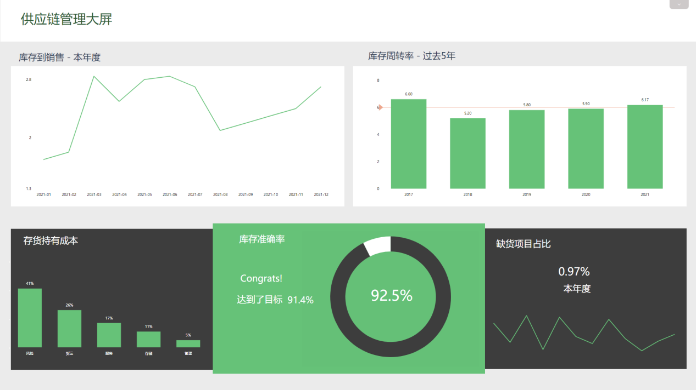

物流大屏允许监控和报告与仓库运营、运输流程和整体供应链管理有关的重要物流KPI。它是一种现代分析工具，可通过高级数据分析帮助可视化和优化物流运营。

作为物流组织，如何跟上当今蓬勃发展的全球经济，客户总是更习惯于即时满足？答案很简单：这不是小菜一碟。要管理物流流程的所有起起落落，您需要跟踪基本数据，这些数据将帮助您提取可行的见解以推动业务成功。使用DataFocus的BI数据分析工具，您可以在一个地方管理所有物流数据，并通过实时更新的交互式在线数据看板将其可视化。通过将所有相关的物流指标汇总到一个专业的数据看板中，企业可以有效地管理其运营、发现趋势并发现任何潜在问题，以确保提供高质量的服务。

接下来，我们将借助数据分析工具——DataFocus实现3个物流大屏示例，交通运输大屏，仓库KPI大屏，供应链管理大屏。

## **交通运输大屏**

在交通运输大屏上，显示了七部分指标，每个指标都为运输管理带来了有价值的信息。

监控装载时间及其重量是衡量运输效率的主要KPI。了解您的车队根据其重量装载需要多长时间，您可以评估每吨的特定时间并设定装载时间目标。优化这个时间会让你装载更多，运输更多；但要保持目标切合实际，因为匆忙的装载有可能会让货物被压碎。随着时间的推移对其进行监控还将使您能够识别可以转化为某种困难或相反效率更高的趋势和模式；它还可以让您深入了解供应链的运作情况。当您想要更有效地分配资源时，确认这些数据会很有帮助。你可能还需要这样的信息来更深地挖掘和分类：哪些订单更重，需要更多的人来装载？相反，是否有其他人不需要大量劳动力，但在装载它们时却更耗时？根据您找到的答案，您可以在充分了解您的运输管理的情况下采取不同的行动措施。

您的车队和驾驶车队的人员是您的第一大资产，这就是为什么通过优化使用拖车容量并同时减少环境中的二氧化碳排放和燃料消耗来尽可能保持其效率很重要；路线的管理是另一个重要方面；作为完成在线订单的最后一步，交付是贵公司效率和可靠性的证明，货物应该在最初您的客户给定的时间范围内被送达，并且订单没有损坏。如果不着重所有这些指标，您的企业形象可能会受到影响。

## **仓库KPI大屏**

作为仓库经理，您需要对您的设施有一个即时的了解，并且一眼就知道您的工厂是否实现了目标同时保持了可靠的性能。为此，您需要跟踪正确的指标并观察操作。我们在另一个物流大屏中汇总了几个KPI来帮助您解决这个问题。

直接影响上一个大屏数据的指标是准时发货：如果这些延迟发货，装载也会延迟——并且有可能造成未来的瓶颈——交货也会延迟。准时发货是指在设定的时限内准备发货的订单的比率，重要的是使其尽可能接近1。它确实衡量了供应链管理的绩效；如果该指标太低，则可能会在下订单和发货的过程中出现麻烦，可能会出现需求增加而无法满足，或者计划流程不是最新的等情况。一旦管理准时发货，另一个值得衡量的KPI是订单准确性。尽可能高的完美订单率将确保满意的客户再次使用您的服务，并向朋友和家人保证。完美的订单是在放置和到达客户之间没有任何意外的处理、运输和交付的订单。它是准时的，既没有损坏也没有不准确。如果管理得当，您还可以节省资金，避免因需要再次发货而造成的退货损失。

在此仓库KPI大屏中，您还可以监控运营成本。这些成本涵盖了仓储管理的各个方面，从设备、能源消耗和材料使用的费用，到更多与人力相关的成本，如劳动力、装运履行和交付等。这些运营成本将使您对处理一个订单所需的费用有一个较好的了解，并相应地调整价格，以便您的仓库能够维持自己的生存。它还将帮助您确定不同的入门成本及其随时间的演变。将它们与一年前的同一时期进行比较可能是一个有趣的洞察来源。

最后，总出货量是一个很好的评估指标，因为它可以作为未来的指标：了解随时间推移的出货趋势，可以让您在一天中的高峰时间或高峰时段更好地准备人力和库存存储。

这个物流仪表板的底线当然是拥有更好的仓库管理，以实现平稳运营、提高效率和增加收入的目的。

## **供应链管理大屏**

为了应对当今的全球经济及其带来的诸多挑战，物流公司需要重新思考供应链并将其转变为数据驱动的价值链。我们最后一个供应链管理大屏将专注于供应链和库存管理。

从分析库存与销售比率开始，可以获得第一个绩效晴雨表，因为它是处理意外情况的一个很好的指标。该指标是库存商品价值除以正在履行的销售订单总价值之间的比率；目标通常是保持在低位。将此指标与下一个指标“库存周转率”结合起来，可以对企业的财务稳定性有一个很好的了解。库存周转率将衡量组织在一年内设法销售其全部库存的次数。这是一个很好的效率指数，也是一个关于你的需求和你如何回答它的重要指标:良好的购买实践，良好的发货时间管理，等等。库存周转率越高越好，低周转率意味着无法将商品转化为销售。

该物流大屏的第三个KPI是库存持有成本，它衡量存储和维护库存商品的成本。以百分比表示，它评估资本成本、存储空间成本、库存服务成本和库存风险成本。这些成本的年总和除以平均存货投资，通常认为它的值在存货价值的20-25%之间。维护库存对于任何组织都是必要的，但问题是要知道有多少库存是过时的或过剩的？目标是降低这些成本，同时保持高库存周转率。同时，我们经常可以观察到仓库里空空如也的货架，这增加了缺货率。这个比率是用客户下订单时的缺货数量除以库存商品的数量来衡量的。将此比率保持在尽可能低的水平可以避免让客户感到失望、沮丧。

最后但并非最不重要的一点是，它是另一个与库存相关的KPI，它将告诉您很多有关您的库存管理的信息：库存准确性。如果您的电子版库存与您的实际实物库存不匹配，那么它对您的业务造成的损害可能比缺货更大。有差异当然是正常的，但是您必须设定一个目标并尽可能地尝试使您的库存保持最新并且这个比率尽可能高。然后，您的业务将显得更加可靠，您将避免浪费金钱并留住客户。

此物流大屏应有助于您了解数据可视化在绩效跟踪和多个物流流程优化方面的强大功能。如果您想开始构建自己的专业物流仪表板，请试用DataFocus，试用14天，完全免费！
