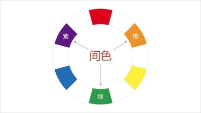
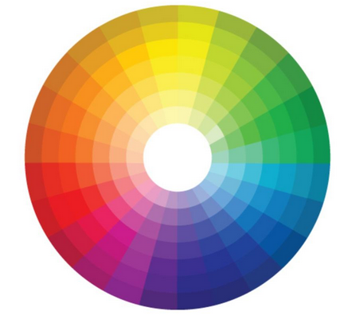
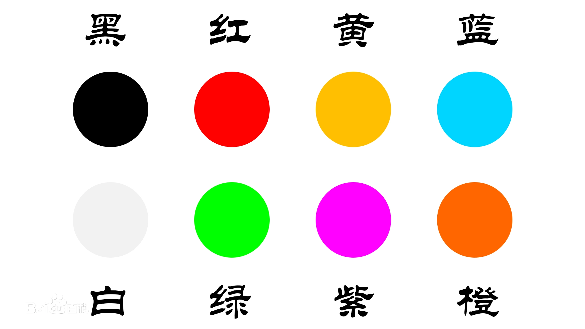
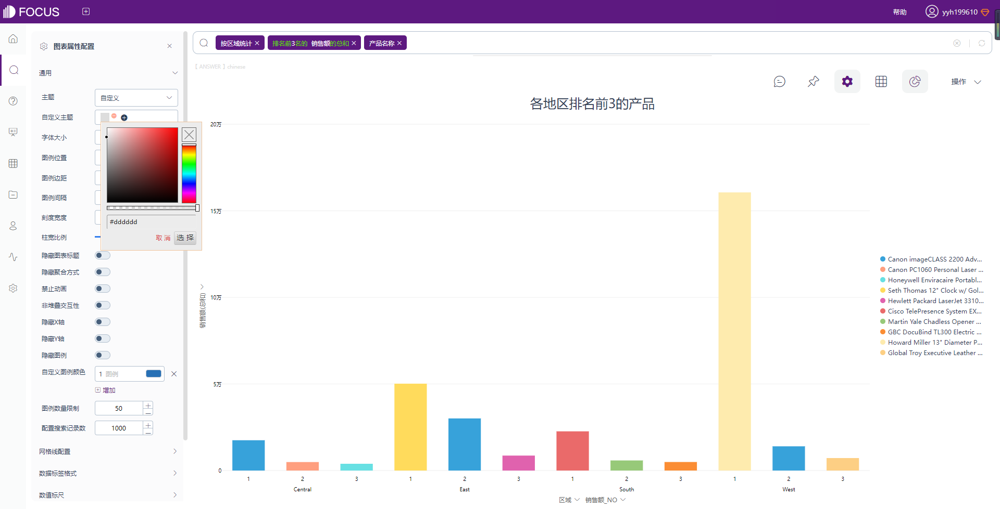
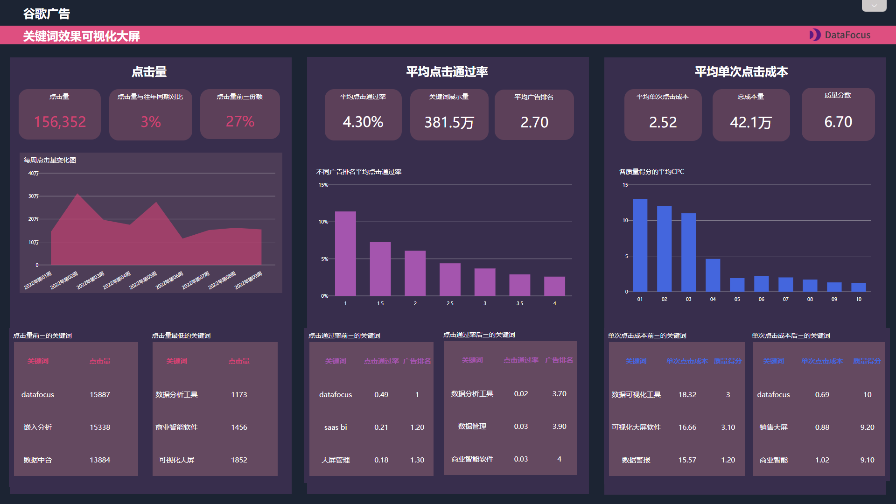

数据可视化就是数据分析师手中锋利的武器，优秀的可视化可以如同画卷一般为你娓娓道来一段故事。这时候，数据可视化图表的配色就会为你的表达增色不少了。

然而大多数人只会使用系统默认配色，毫无凸显特色。

其实学习起来没那么复杂，今天一文带你详解数据可视化图表配色基本原理。

### 颜色基本原理

**原色**

色彩基础知识，三原色是红黄蓝。

为什么说三原色是红黄蓝，因为只能靠它们调配别的颜色，而它们本身无法被别的颜色调配出来。

**间色**

间色是指两种三原色调配出来的颜色。

比如红+黄变橙，黄+蓝变绿，红+蓝变紫。

**复色**

复色是指两个间色或者三个原色配成的颜色。复色就包含了除原色、间色以外的所有颜色。

**衡量颜色的三大属性**

色相，是区别各种不同的色彩的最准确的标准，最初的基本色相为：红、橙、黄、绿、蓝、紫。

十二基本色相，就是在每个基本色相中间加一两个中间色，按光谱从头到尾的顺序为：红、橙红、黄橙、黄、黄绿、绿、绿蓝、蓝绿、蓝、蓝紫，紫。红紫，再加到紫和红之间，

**明度**

明度就是色彩的亮度，是你的眼睛对物体表面或者光源明暗程度的感觉。你对色彩的感觉更偏向于明亮，则明度越高，通常光线也会比较强。

就比如绛红色给人感觉就比较暗，玫红色给人感觉会更亮。

**彩度**

彩度也叫纯度、饱和度，它用于形容颜色的鲜艳程度。通常以某彩色的的同色名纯色所占的比例，来分辨彩度的高低，纯色比例高为彩度高，彩度越高，色彩越纯，感觉越艳丽；纯色比例低为彩度低，彩度越低，色彩越涩，感觉越浑浊。

### 色彩搭配

**单色搭配**

只有一个色相，通过改变该色相的纯度产生层次感的搭配方法。

**类比色搭配**

又叫近似色、相似色搭配，就是找到相似的颜色来搭配，那什么是相似呢，也就是前面说的十二色相环中的位置相近的2~4个色相，如红色和橙红色，黄色和橙黄色的搭配。

**互补色搭配**

互补色搭配，主要是指色相环180°角的两种颜色，它们可形成互补。补色并列的时候，你会感觉到画面色彩对比更重了。

比如当红色和绿色放在一起，你会感觉到红色更红，绿色更绿。

**分裂补色搭配**

同时用互补色和类比色的方法来搭配，如红色和绿色是互补色，绿色和蓝色是相似色，红+绿+蓝的搭配就是分裂补色。

这样的搭配会带来类比色低对比度的美感，又增添了色彩的力量感。既有重点，又很和谐。

**冷暖色搭配**

下图中黄色到红色的顺时针方向为暖色，逆时针方向为冷色，冷暖色的搭配也能形成一个不错的效果。

**三角搭配**

即在色环中成等边三角形或等腰三角形的三个色相搭配在一起时的配色，最典型的就是三原色红黄蓝，三角配色会具有很强烈的视觉冲击感。

**四角搭配**

选定一个主色相和其补色后，再选主色相隔一个位置的颜色作为第三个颜色，再选第三个颜色的补色，即形成一个矩形，为四角配色，常见的有红、黄、蓝、绿及红、橙、黄、绿、蓝、紫等色。

### 颜色的情感

了解颜色所传递的情感，也可以更好地帮助我们去配色。

<table><tbody><tr><td>颜色</td><td>情绪</td><td>性格</td><td>氛围</td></tr><tr><td>红色</td><td>热情</td><td>活泼</td><td>喜庆</td></tr><tr><td>黄色</td><td>轻松</td><td>活泼、可爱</td><td>光明、灿烂</td></tr><tr><td>蓝色</td><td>冷静</td><td>宁静、稳重</td><td>寂静</td></tr><tr><td>橙色</td><td>热烈</td><td>动感</td><td>青春</td></tr><tr><td>绿色</td><td>生机</td><td>活力</td><td>和平、希望</td></tr><tr><td>紫色</td><td>孤独</td><td>高贵、优雅</td><td>神秘</td></tr></tbody></table>

### BI软件中的配色

考虑到用户使用体验上，这款搜索式BI软件DataFocus就已经都搭配好了配色方案，不需要自己再去配了。

**自定义主题颜色**

有的时候觉得系统默认的配色用的多了，就没有新意了。那也可以自定义颜色，比如可以模仿优秀的可视化模板的配色。

在DataFocus中，通过指定RGB值来设置计算机中红色、绿色和蓝色的强度，RGB值从0~255取值，依次输入就可以改变颜色。

可以自定义主题颜色，分别输入着色的RGB值改变着色，并重新命名。

**主题的作用**

主题是一个还挺重要的功能，可以迅速地改变外观，使颜色、字体和图形格式效果得到浑然一体的搭配，DataFocus自带的主题很多，选择不同的主题可以快速更改搭配效果。

### 小结

了解数据可视化图表配色原理后，再使用工具去给图表配色是不是清晰了很多呢？

希望你在这一番学习后能逐渐成长为数据可视化高手，记得点赞、收藏、加关注~
