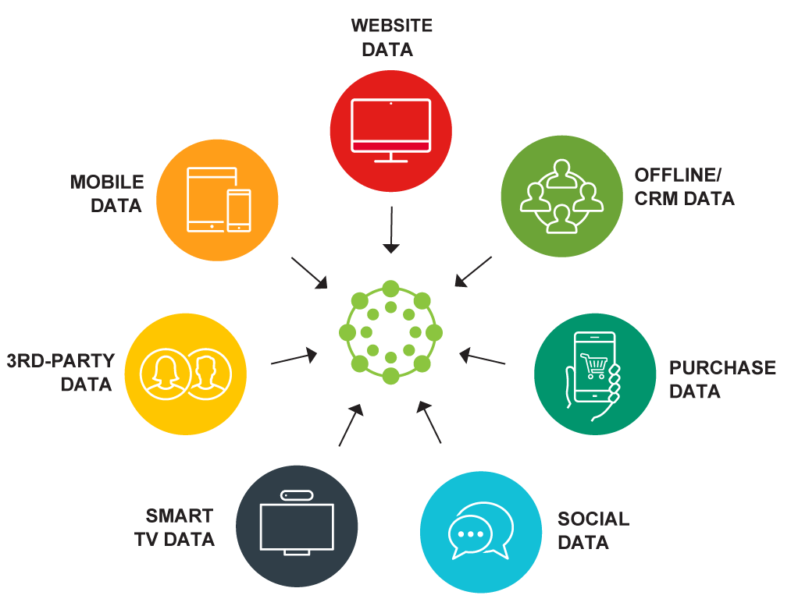

使用 A/B 测试工具来查找具有最佳转换率的内容的实用性已广为人知。此外，工具不断成熟，包括 A/B/X 测试——测试多种组合以确定最佳组合的能力。这些工具还强调了使用数据仓库对站点数据进行更深入分析的额外潜力。数字营销并不总是人们的第一想法，但这种合作关系有可能提供可在整个公司范围内使用的分析结果。

在本文中，我们将定义 A/B 测试，并讨论如何通过使用最佳实践和改进的技术来克服常见挑战。然后，我们将扩大讨论范围，讨论如何将扎实的数字内容和正确的数据管理与成功的营销策略联系起来。我们还提到了，将数据合并到数据仓库对于需要分析大量数据的组织来说是一种很好的做法。最后，我们将讨论如何将所有信息和工具放在一起以获得更好的结果，以及您需要学习什么来完成这一切。

## 什么是 A/B 测试？

A/B 测试比较网页的两个不同版本，看看哪个版本的性能更好。显示给用户的版本是随机选择的——使用 A/B 测试的网站会计算统计数据以检查哪个页面的转换效果更好。

从营销的角度来看，A/B 测试能够帮助你更好地优化网站。战略营销决策变得由数据驱动，从而更容易为网站制定理想的营销策略。营销人员可以测试不同的网站标题、操作按钮、图形、销售文案和产品描述。

## A/B 测试挑战

对于市场营销人员来说，A/B测试的一些挑战是:

- **小样本量**。营销人员不是统计学家——他们想要的是结果，而且是快速的结果。使用 A/B 测试时，通常会过快得出结论性结果，每个页面变化的样本大小一般会被普通统计学家嘲笑。营销人员需要了解样本量，特别是更大的样本量如何导致更准确的结论。
- **提出一个假设。**您需要发现您的网站的问题所在并提出假设，即根据有限的证据提出的建议性陈述，需要进一步调查以通过测试来证明或反驳。否则，你最终只会测试随机的东西而什么也没得知。考虑很少点击 CTA 按钮的问题。一个假设可以简单到：“人们不会因为按钮的位置而点击它。但页面上更好的位置可能会更好，因为它会更容易看到。”
- **处理失败的测试。**当测试失败时，营销人员倾向于转向另一个页面。不过，迭代测试很重要。你应该进行测试，即使失败也可以从中学习，并建立一个新的假设。可能需要进行多次后续测试才能看到转化的真正变化——不要在一次测试未能改进页面后放弃页面。

## A/B 测试最佳实践

实施有效 A/B 测试的一些最佳实践是：

- **头脑风暴**——与网站的其他工作人员（网页设计师、数据分析师等）坐下来，积极讨论网站的主要问题，优先考虑最影响用户体验的问题，并根据分析师或[在线 BI工具提供的数据创建假设](https://www.datafocus.ai/infos/online-bi-tools)。
- **有意义的** **指标**——始终使用有意义的指标，能根据您的 A/B 测试结果提供可操作的信息。
- **挑战现状**——测试不同的价值观，挑战你对推动转变的先入为主的想法。考虑 CTA 按钮复制；与其测试“加入”还是“注册”，不如测试一些更有创意或个性化的东西。

### 如何从 A/B 测试中学习

除了简单地提高转化率之外，还要考虑与领域相关的多个指标。您还需要考虑每种变化对 SEO 的影响，并获得“大局”。

通过捕获揭示用户行为洞察力的额外数据（例如热图、滚动图或访客记录）来增强 A/B 测试的结果。例如，只有当人们真正使用导航栏时，对导航栏进行A/B测试才有价值。追踪用户行为能够提供比A/B测试更有启发性的见解。

构建一个知识库，记录每个 A/B 测试及其结果，包括用户行为数据。在为未来的测试提出假设时，您可以参考您的知识存储库。

## 数字内容和转换

作为数字营销人员，您担心转化率是可以理解的。A/B 测试工具的主要目的是提供内容比较，确保具有最高预期转化率的页面出现在您的网站上。这些工具使分析师可以更轻松地确定哪些内容最有效，而无需对网站访问者进行 beta 测试。

今天，内容就是一切。网站必须有很多高质量的内容，并且需要定期更新。高[转化率](https://www.datafocus.ai/infos/kpi-examples-and-templates-marketing#goal-conversion-rates)还需要用户不断回访，而新内容是让他们保持兴趣的一种方式。如今，视频、博客、白皮书、网络研讨会和新产品都是公司网站的组成部分。

这种多样化的内容使 A/B 测试变得更加重要，也更加困难。如果页面被中途停止或访问者观看视频然后单击关闭，则浪费了创建专业视频所花费的时间。

## 数据仓库金矿

不要让所有这些数据堆积成灰。将分析和指标添加到[数据仓库](https://www.datafocus.ai/infos/data-storage)，您可以通过多种方式分析大量信息。从数据库导入很简单，并将所有数据放在一个位置。与您的信息技术人员和业务分析师合作，规划如何将这些数据包含在您的数据仓库中。也许只存储站点数据的分段数据集市符合您的需要。

这不必复杂或昂贵。如果您的企业尚未使用数据仓库，有许多工具和服务可帮助您构建数据存储库。[例如，借助MySQL 数据连接器](https://www.datafocus.ai/infos/data-connectors-mysql)，当前的数据库可以集成到数据仓库中。存储库对您的商业智能工作的价值是指数级的。研究一下这些选择，你会找到一个适合你的需求和预算的。

### 把它们放在一起

现在您可以从各种角度访问有关您的网络的信息——预测、测试结果、指标、历史——您的分析工作可以真正支持您的业务目标。您的网站不作为孤岛存在，将 Web 分析与其他业务数据相结合可以提供前所未有的洞察力。如何处理这些数据？

将 A/B 测试结果与实际站点统计数据和 Web 分析相结合，提供了假设场景的能力，用于确认与站点流量历史记录相比，您的A/B检测工具正在产生准确的结果。看看新内容是否吸引了新客户。或者结合数据分析和 A/B 测试来预测新市场的销售情况。

组合数据的一种方法是客户资源管理 (CRM) 系统，用于分析您的网络工作对客户和销售的直接影响。为了在全球市场上保持竞争力，这种整体的观点是必要的。

## 了解从哪里开始

要从整体角度制定您的在线营销策略，需要一套复杂的工具和技术，所有这些都可以帮助您更深入地了解客户数据、回答紧迫的业务问题并提高转化率。但在开始采用新技术之前，您可能需要退后一步，重新熟悉 Web 分析和 BI 领域，确定最新的[商业智能趋势](https://www.datafocus.ai/infos/business-intelligence-trends)，并绘制出不同概念和技术之间的联系。

CoolaData是一个端到端大数据行为分析平台的制造商，它的团队开展了一个项目，以使有关网络分析和数字营销BI 的可用内容更易于获取。他们建立了Web Analytics & BI Wiki，这是第一个知识中心，它收集了与主题相关的所有信息，并将其组织在一个有意义的结构中。

wiki 背后的一个核心认识是，普通营销专业人士、网络分析师和经验丰富的大数据专业人士之间存在巨大的知识差距。因此，他们着手构建一个综合性资源，汇集了数以千计的专家意见、操作指南、案例研究和现实案例——由博客作者、分析专家、行业分析师甚至竞争对手撰写——是市场营销、网络分析、商业智能和数据科学之间的交点。
