# Amazon QuickSight vs DataFocus Cloud

在商业智能和数据分析领域，有很多工具可以帮助处理数据。Amazon QuickSight和DataFocus Cloud (DFC)是这些领域中好用的两款工具。这些工具为数据处理、数据分析和数据可视化提供了各种特性和功能。

通过搜索式分析，DFC 为用户提供了一个综合系统来处理、分析和可视化数据，从而可以轻松地将原始数据转化为可操作的洞察。

在本文中，我们将在界面、易用性、可视化和其他因素方面比较 Amazon QuickSight 和 DataFocus Cloud，以帮助您就哪种工具更佳适合您或您的组织做出决定。

# 简介

借助交互式看板、分页报告、嵌入式分析和自然语言查询，Amazon QuickSight提供了一个易于使用的平台来分析和可视化数据。企业可以快速深入了解数据。

DataFocus Cloud允许企业快速轻松地创建交互式看板大屏、报告和可视化，而无需费心技术专业知识。借助可扩展的解决方案，企业可以通过数据驱动的决策制定获得竞争优势。

# 对比

## 界面

该节从导航栏、数据、资源、分析、模块和社区等方面比较了两个平台之间的差异。

### 导航栏

Amazon QuickSight的导航栏主要在左侧。在控制台，导航栏会显示不同的资源、社区等模块，如图2-1所示。如果在分析模块进入特定的分析，导航栏则会显示不同的功能，如“过滤器”、“参数”等用于分析。

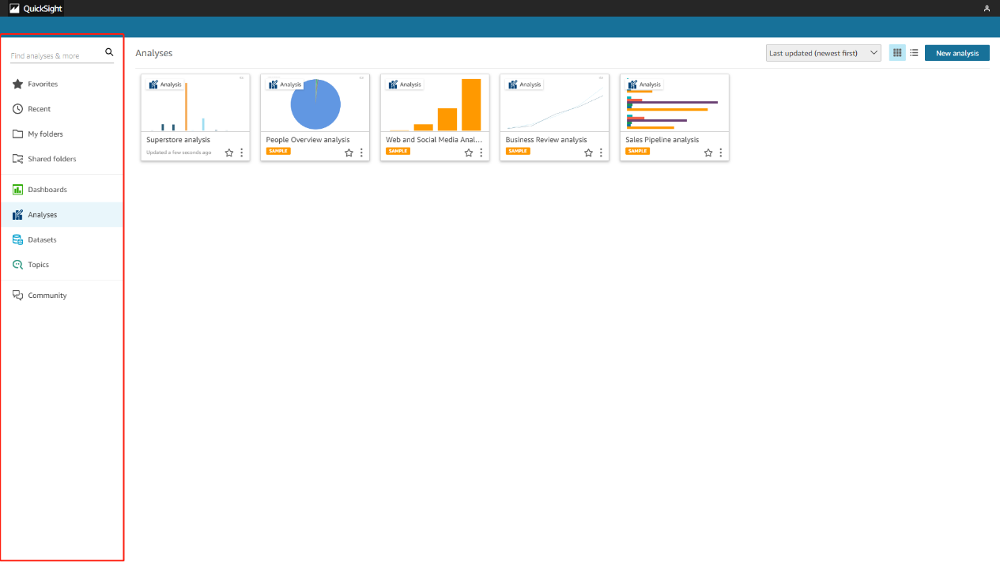

Figure 2-1 Navigation bar 1 - Amazon QuickSight

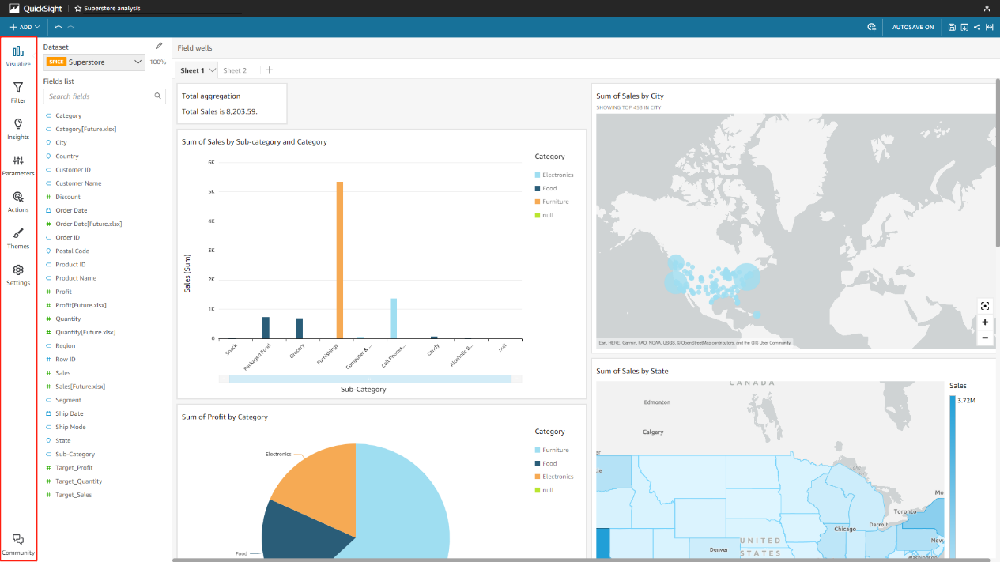

Figure 2-2 Navigation bar 2 - Amazon QuickSight

DFC 使用两个导航栏，顶部和左侧。同样，左侧的导航栏显示“搜索”、“问答”等10个不同的[功能模块](https://wiki.datafocus.ai/index.php/%E4%BA%A7%E5%93%81%E6%89%8B%E5%86%8C_v5.0.2" \l ".E5.8A.9F.E8.83.BD.E6.A8.A1.E5.9D.97)，如图2-3所示。而顶部导航栏展示了用户设置的可以随时查看的重要看板，以及一些帮助文档的按钮。

Figure 2-3 Navigation bar – DataFocus Cloud

GIF Figure 2-4 Pin dashboard

### 数据

这里介绍的是数据表的展示界面。

\- Amazon QuickSight

主要有信息和编辑两个页面。如图2-5所示，信息页面列出了表的摘要、刷新、权限和使用情况。而编辑页面是可以对数据进行处理的地方，包括添加计算字段、筛选器、数据、预览数据等。

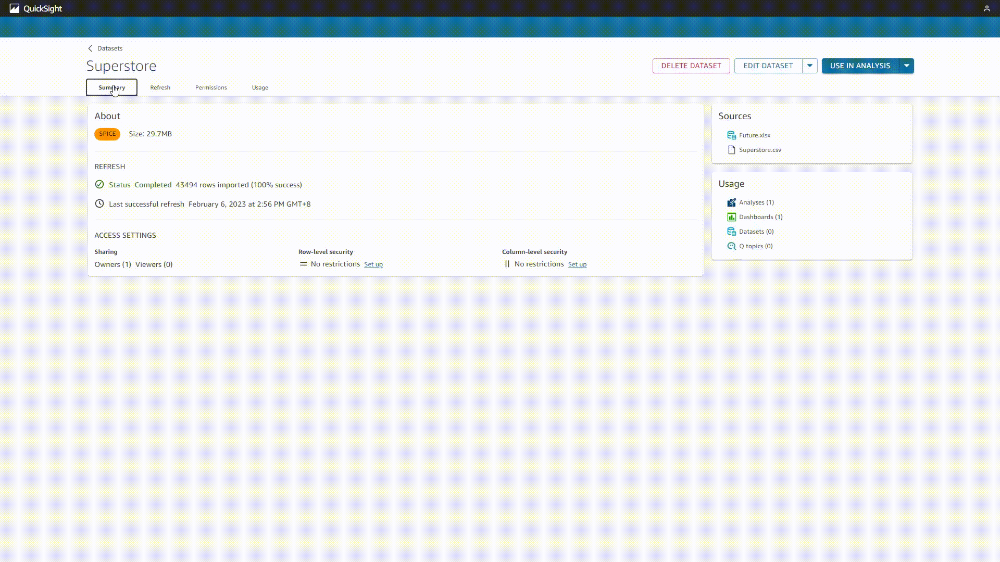

GIF Figure 2-5 Data table info - Amazon QuickSight

Figure 2-6 Data table edit - Amazon QuickSight

\- DataFocus Cloud

表格模块列出了系统中所有的数据表格。数据表信息页显示列信息、关系、数据预览、依赖关系。此页面的其他功能包括累加/覆盖上传数据、智能洞察等。DFC中的数据处理主要在搜索模块里，将在稍后讨论。

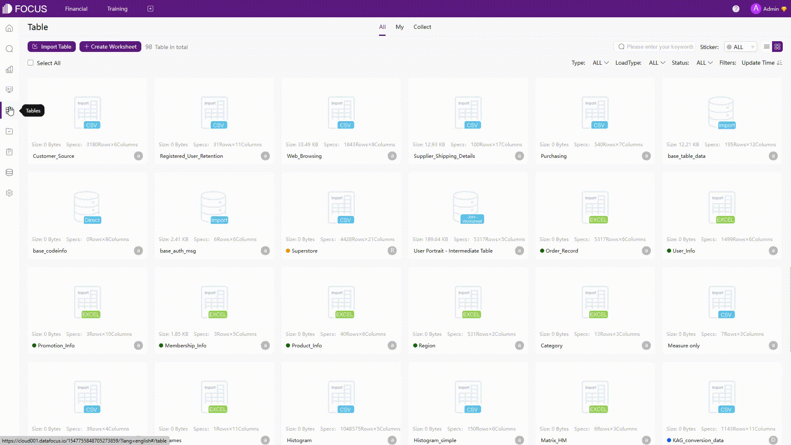

GIF Figure 2-7 Data table module

### 资源

\- Amazon QuickSight

资源可以分为四个部分，数据集、分析、看板和主题。数据集列出所有数据表，分析是数据可视化，看板是仅用于交互的公开的分析，主题是从自然语言查询中获取数据。

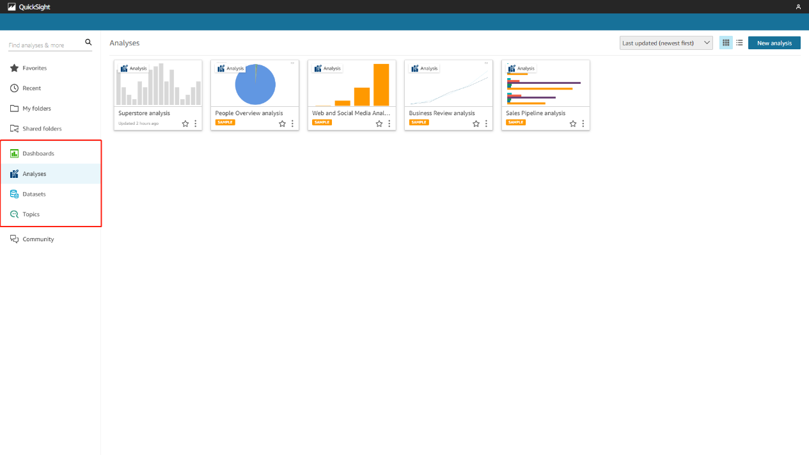

Figure 2-8 Resources - Amazon QuickSight

\- DataFocus Cloud

资源主要包括数据表、问答和看板。问答是来自搜索的分析图表，而看板是解释数据发现的可视化大屏。每个资源都有一个单独的模块，除此之外还有一个总资源模块展示各种资源。通过迷你导航栏可以切换查看不同的资源。

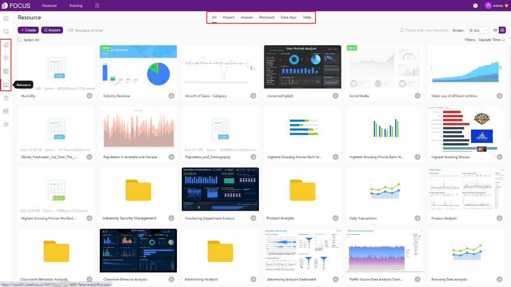

Figure 2-9 Resources - DFC

### 分析

\- Amazon QuickSight

如前所述，Amazon QuickSight中的分析是正在编辑的看板，每个分析可以包含多个图表。除了分析，还有QuickSight Q，用户可以在其中使用自然语言来获得结果。分析页面主要由导航栏、字段列表和工作表画布组成，如图2-10所示。搜索栏是QuickSight Q搜索，但是只针对企业版。

Figure 2-10 Analytics - Amazon QuickSight

\- DataFocus Cloud

DFC的系统中有一个搜索分析模块，可以使用搜索（接近自然语言）来分析数据并制作可视化图表。除了固定的导航栏，该模块由表格列信息、搜索框和画布组成。列显示为属性和度量，搜索框是用户可以输入分析的地方，而画布用于图表显示和修改一些配置。

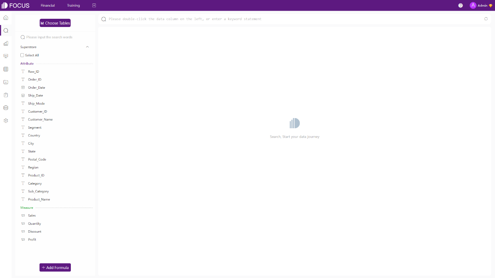

Figure 2-11 Analytics - DFC

### 社区

Amazon QuickSight和DataFocus Cloud都提供了一个社区来帮助用户相互交流并在遇到问题时搜索一些答案。

Figure 2-12 Community - Amazon QuickSight

Figure 2-13 Community - DFC

## 2.2 数据源

Amazon QuickSight和DataFocus Cloud都支持上传本地文件和连接到不同的数据源，例如MySQL和Oracle等数据库。

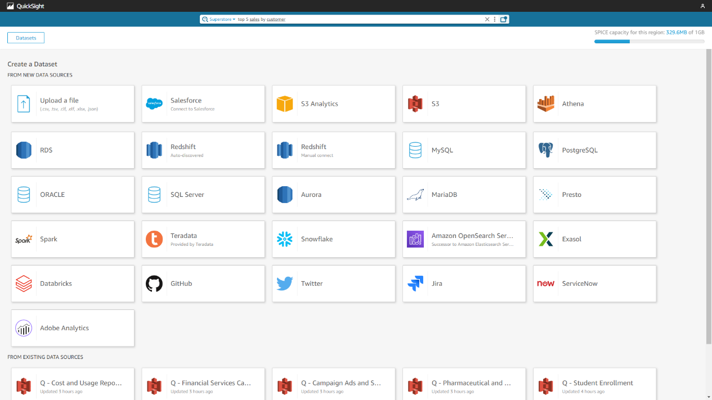

Figure 2-14 Data Source - Amazon QuickSight

Table Figure 2-15 Data sources - DFC

不同之处在于：

1. Amazon QuickSight还支持软件即服务（SaaS）数据源，例如Jira和Salesforce，而DFC支持使用API访问可靠的数据源。
2. 连接数据库时，DFC提供了两种获取数据的方式，连接和导入。 连接是实时获取数据，导入是将数据库中的表上传到系统中。
3. 在本地文件方面，Amazon QuickSight 支持六种不同类型的文件，DFC 支持四种。但是，在DFC中用户可以使用不同的文件编码。此外，在导入excel文件进入DFC系统时，用户可以最多同时上传 10 个工作表。

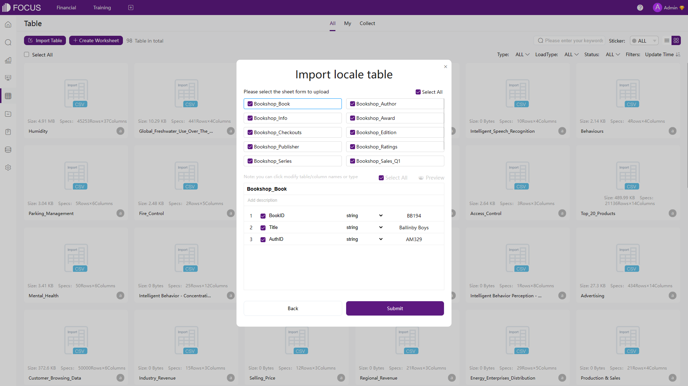

Figure 2-16 Upload Excel Sheets - DFC

1. 上传文件的设置如下所示，用户可以更改格式、分隔符等。DFC还提供了更多的配置选项。

Figure 2-17 Upload settings - Amazon QuickSight

Figure 2-18 Upload settings – DFC

1. 两种工具都可以更新/覆盖表格，用户还可以向系统已有表格添加新数据。

## 2.3 易用性

### 2.3.1 分析

\- Amazon QuickSight

Amazon QuickSight主要有两种方式对数据进行分析和可视化。

1. 分析

一个分析可以包含多个图表。对于每个图表，用户可以拖放添加字段，也可以单击页面左侧的字段名称来添加字段，如下所示。

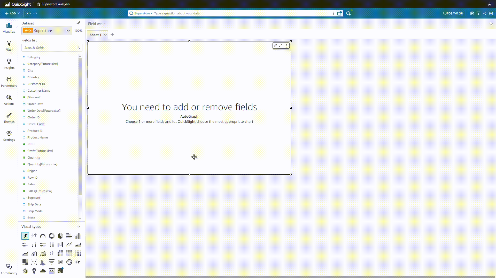

GIF Figure 2-19 Analyses – Amazon QuickSight

1. QuickSight Q

企业版中，用户可以使用QuickSight Q来分析数据。用自然语言输入问题，系统会返回一个图表，用户可以选择将其添加到分析中或将其固定保存（最多30个）。

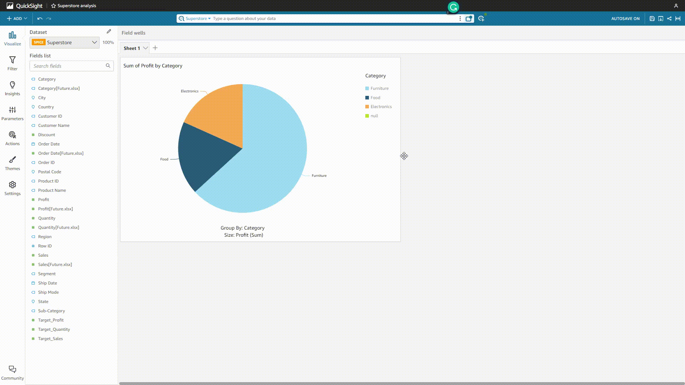

GIF Figure 2-20 QuickSight Q 1 – Amazon QuickSight

虽然用户可以添加同义词、选择语义类型等，但有时系统可能会误解问题并给出错误的分析。

GIF Figure 2-21 QuickSight Q 2 – Amazon QuickSight

\- DataFocus Cloud

DFC以搜索为交互方式，用户只需搜索即可获得分析结果。主要有两种方式添加列，选中和输入。并且类似于Amazon QuickSight，系统会根据搜索返回合适的图表。

GIF Figure 2-22 Analyses 1 – DFC

DFC的搜索非常接近自然语言，但有自己的[关键词](https://wiki.datafocus.ai/index.php/%E4%BA%A7%E5%93%81%E6%89%8B%E5%86%8C_v5.0.2" \l ".E5.85.B3.E9.94.AE.E8.AF.8D)规则，这样使搜索更加准确。

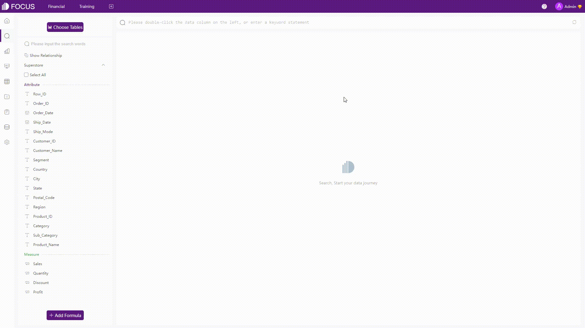

GIF Figure 2-23 Analyses 2 – DFC

一些复杂的分析也可以通过系统轻松完成，比如计算季度增长量。

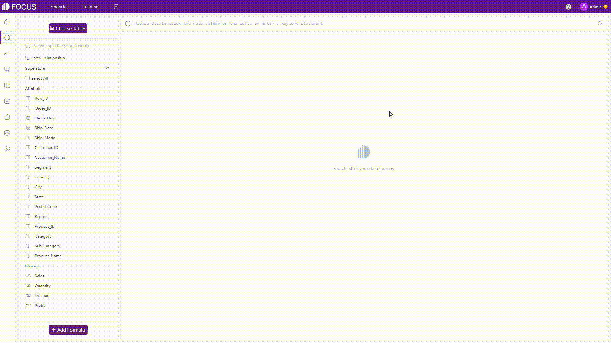

GIF Figure 2-24 Complicated analyses – DFC

### 2.3.2 筛选

\- Amazon QuickSight

数据集或分析中都可以添加筛选条件。

1. 数据集

过滤条件可以被直接添加到数据集，然后所有根据该数据集进行的分析也将被一起筛选。

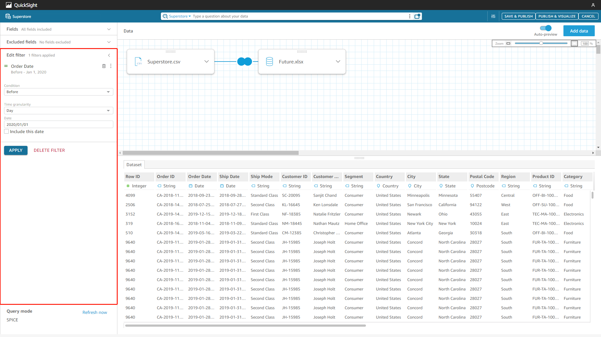

Figure 2-25 Dataset filter – Amazon QuickSight

1. 分析

分析中也可以添加筛选条件，用户可以选择将筛选条件应用于某些图表或所有图表等。

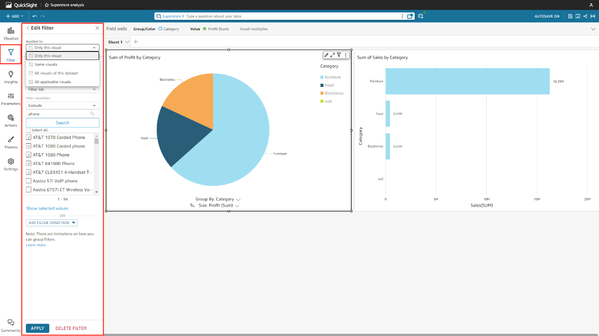

Figure 2-26 Analyses filter – Amazon QuickSight

1. 筛选控件

筛选控件可以被添加到分析中，查看者可以与它们交互以筛选图表。控件可以被添加到画布的任意位置，也可以固定到顶部，如图2-27所示。

Figure 2-27 Filter control – Amazon QuickSight

\- DataFocus Cloud

同样，筛选条件可以应用于数据表、问答（图表）或看板。

1. 中间表

DFC 不是直接在数据表中筛选，而是使用[中间表](https://wiki.datafocus.ai/index.php/%E4%BA%A7%E5%93%81%E6%89%8B%E5%86%8C_v5.0.2" \l ".E5.88.9B.E5.BB.BA.E4.B8.AD.E9.97.B4.E8.A1.A8)。中间表有两种类型，并且用户可以先对数据进行筛选处理，之后保存为中间表。中间表也可以作为数据集来做进一步的分析。

GIF Figure 2-28 Intermediate tables

1. 问答

- 关键词

[关键词](https://wiki.datafocus.ai/index.php/%E4%BA%A7%E5%93%81%E6%89%8B%E5%86%8C_v5.0.2" \l ".E5.85.B3.E9.94.AE.E8.AF.8D)可以被看作是筛选条件。例如，使用关键字“包含”来筛选不同的文本，如下所示。

GIF Figure 2-29 Keyword

- 图表中的筛选

类似于QuickSight分析中的筛选，筛选条件可以应用到各个图表中。在DFC的表格中，可以通过每列的设置按钮添加筛选条件，而对于其他图表，则通过轴添加筛选条件。

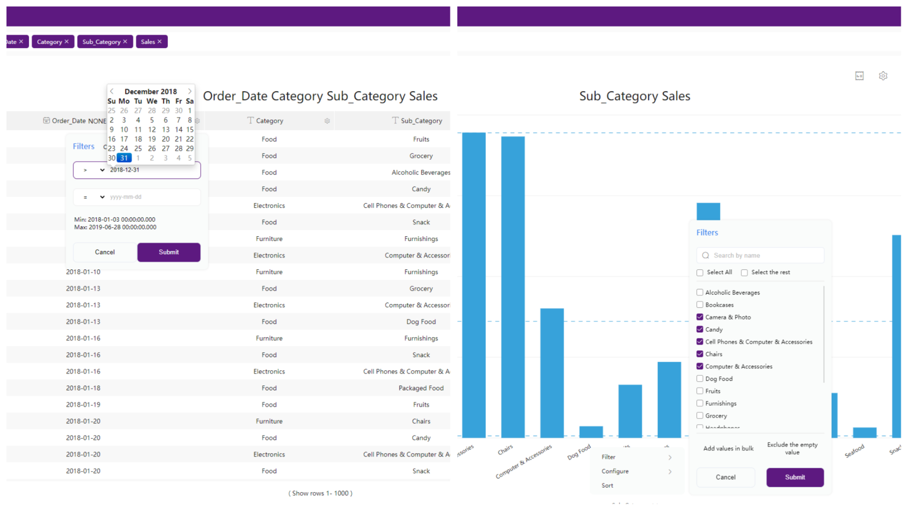

Figure 2-30 Filter on charts

- 选中

对于一些图表，比如柱状图，如果你选中了图表的某些部分，那么图表会聚焦在选中的部分上。

GIF Figure 2-31 Selection

1. 看板

- 筛选组件

与筛选控件类似，筛选组件可以被放入看板中，用户可以与它们进行交互。此外，用户还可以选择不同类型的筛选组件。

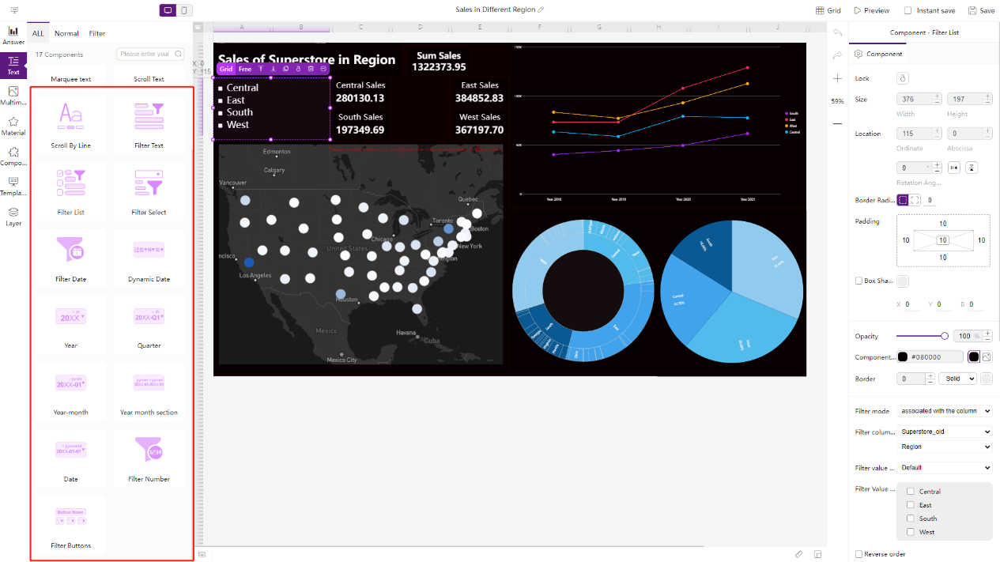

Figure 2-32 Filter components

- 筛选交互

用户可以通过点击数据点与看板进行交互，看板中的相关图表将被一起筛选。或者通过选择特定区域的数据来查看详细信息。

GIF Figure 2-33 Filter interactions

- 联动筛选条件

查看看板时，可以添加不同的联动条件来筛选所有相关图表。

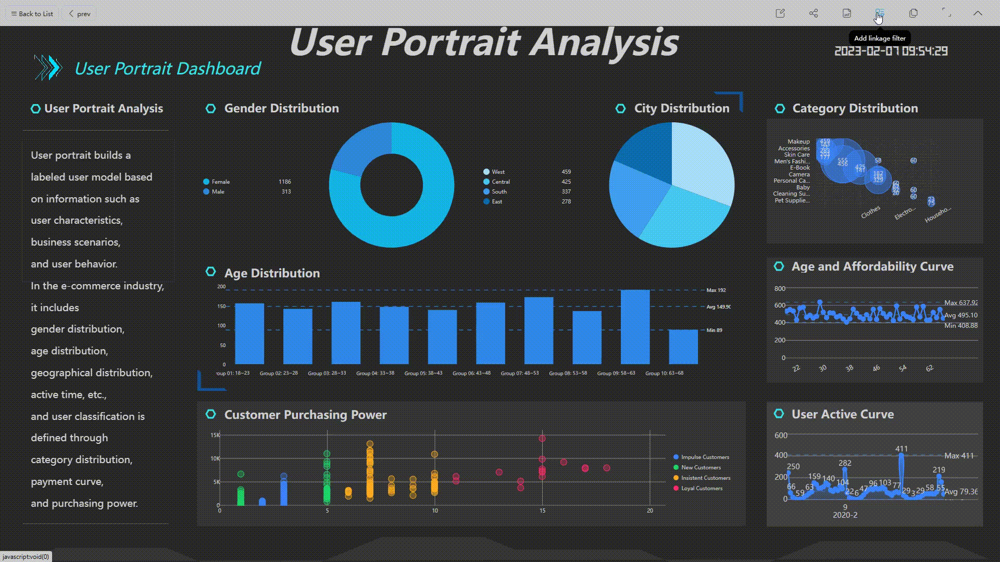

GIF Figure 2-34 Filter conditions

### 2.3.3 公式编辑器

<table><tbody><tr><td>方面</td><td>Amazon QuickSight</td><td>DataFocus Cloud</td></tr><tr><td>公式类型</td><td>聚合, 条件, 日期, 数字, 字符串, 表计算</td><td>聚合, 分析, 变换, 日期, 数字, 文本, 逻辑, JSON, …</td></tr><tr><td>提示</td><td>输入后</td><td>输入前后</td></tr><tr><td>示例/语法</td><td>列类型</td><td>样例列名来自数据表中真实列</td></tr><tr><td>验证</td><td>错误时提示</td><td>自动验证</td></tr><tr><td>更多</td><td>了解详情的跳转链接</td><td>高级设置</td></tr></tbody></table>

1. 公式类型

两个平台都支持各种公式供用户使用。Amazon QuickSight还显示“全部”类别以显示所有公式，而DFC还支持一些与 JSON 文件相关的[公式](https://wiki.datafocus.ai/index.php/%E4%BA%A7%E5%93%81%E6%89%8B%E5%86%8C_v5.0.2" \l ".E5.85.AC.E5.BC.8F.E5.88.97.E8.A1.A8)。

1. 提示

在Amazon QuickSight中实现公式时，系统会在输入后提示所有可能的函数、字段等，如下图。此外，系统还会在选择一个值后返回相关语法。

GIF Figure 2-35 Prompt – Amazon QuickSight

DFC的系统会在输入前后提示语法、函数以及列名。

GIF Figure 2-36 Prompt - DFC

1. 示例

这两个工具都提供公式的描述和示例。Amazon QuickSight显示列类型，DFC 显示特定示例，例如选中的数据表中的具体列名称。

Figure 2-37 Formula examples - Amazon QuickSight

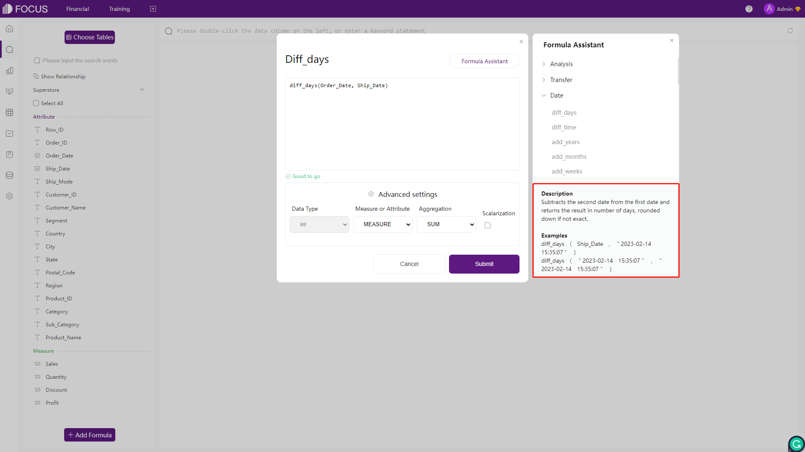

Figure 2-38 Formula examples - DFC

1. 验证

单击“保存”按钮后，Amazon QuickSight中的公式将得到验证，如果公式中存在某些错误，则会显示错误消息。而在DFC中，公式将实时自动验证，一旦检测到错误，会自动返回错误信息。

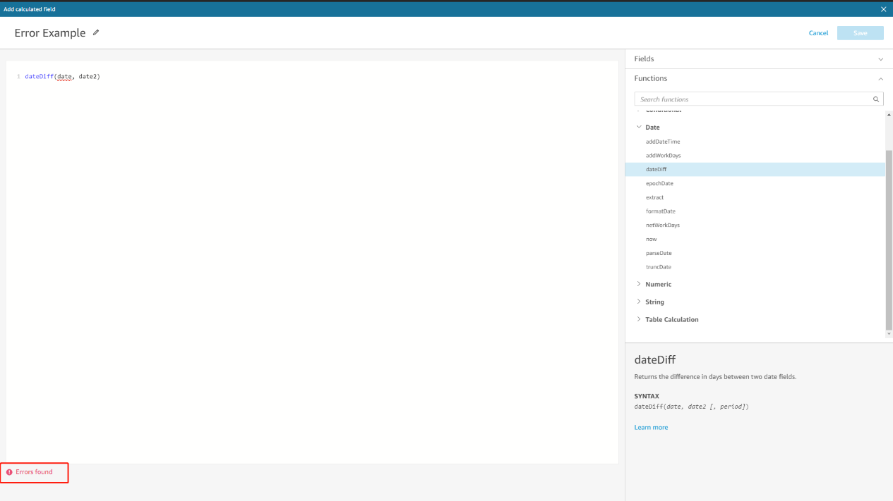

Figure 2-39 Validation - Amazon QuickSight

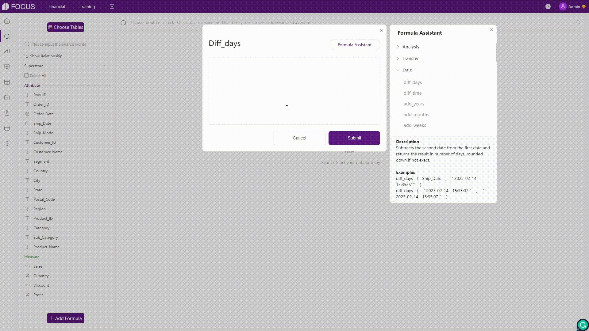

GIF Figure 2-40 Validation – DFC

1. 更多

公式编辑器中还有很多其他功能。在Amazon QuickSight中，用户可以单击“了解更多”按钮以获取有关公式的更多信息。而在DFC中，用户可以将结果设置为度量或属性，选择聚合方式，并选择是否对结果进行标量化。（标量化就是让聚合后的结果成为一个常数，以便进一步计算）

### 智能洞察

这两个平台都提供“智能洞察”功能，但它们有很大不同。

在Amazon QuickSight中，“见解”是分析中随时可用的总结计算后的数据。系统会列出来自数据的各种建议见解，用户可以将这些见解添加到分析中。

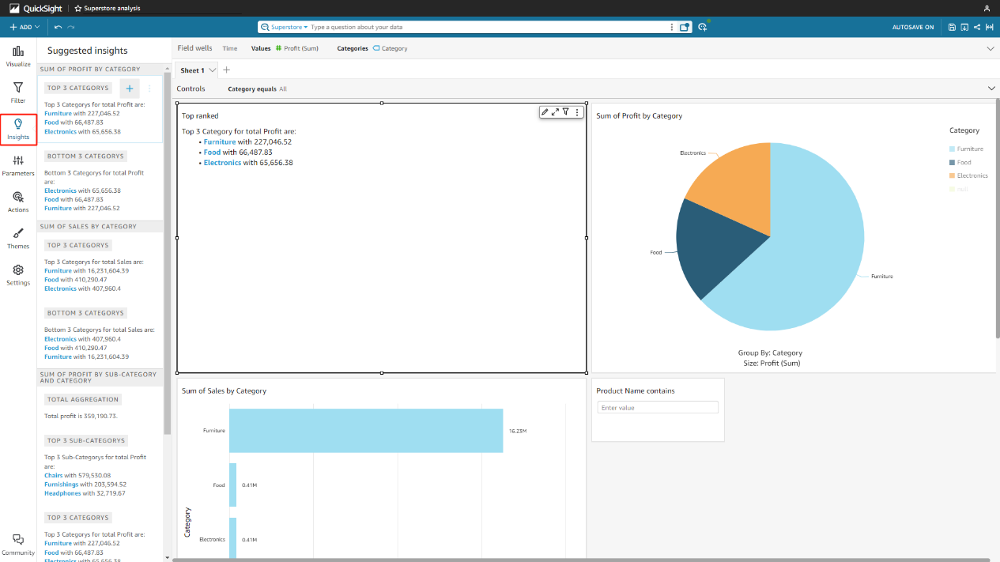

Figure 2-41 Insights - Amazon QuickSight

在DataFocus Cloud中，智能洞察的功能是对数据表进行一些统计分析，目前包括离群值、相关性和趋势分析。下面是异常值分析的示例。

Figure 2-42 Insights - DFC

## 2.4 数据处理

处理数据对于数据分析来说非常重要，这节比较了一些潜在的数据处理过程，如数据添加、表关联、行列转换、列拆分。

1. 数据添加

- Amazon QuickSight

用户可以更新原始文件或添加其他数据。若要更新文件，新文件需要与原始文件拥有相同顺序的相同字段。添加数据时，用户可以从数据集、数据源或本地文件中选择新数据。

- DataFocus Cloud:

用户可以通过上传本地文件来更新数据表。使用“累加上传”功能向原始表格添加额外的行数据，使用“覆盖上传”功能来替换整个表格。需要注意的是，新的数据表中的列类型及列名需要与原先的相同。

1. 表关联

两种工具都提供四种关联类型，一张表可以有多个连接。对于Amazon QuickSight，用户可以连接来自数据集、数据源或本地文件的表格。对于DFC，用户可以连接来自不同来源的表，只要这些表在系统中即可。此外，在DFC中，连接表时还可以添加筛选条件。

Figure 2-43 Join tables - Amazon QuickSight

Figure 2-44 Join tables - DFC

1. 行列转换

- Amazon QuickSight

要在行和列之间进行转换，在Amazon QuickSight中用户需要使用SQL命令“PIVOT”和“UNPIVOT”，如下所示。

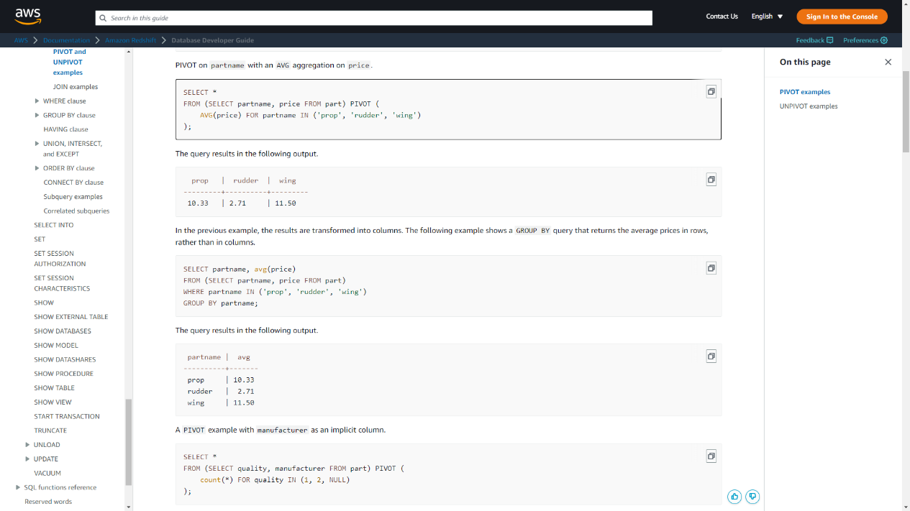

Figure 2-45 Pivot - Amazon QuickSight

- DataFocus Cloud

DataFocus Cloud是一个无代码系统，因此用户不需要使用SQL语句。如下图，通过简单的操作就可以实现行和列的转换。

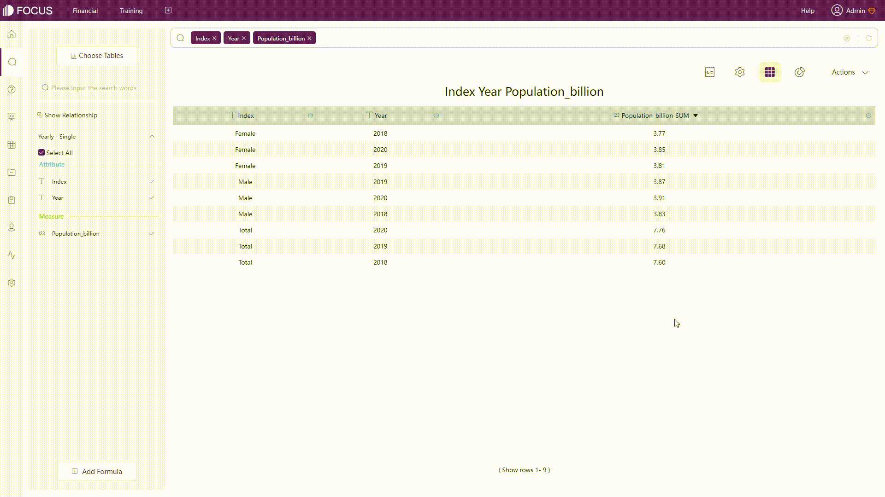

GIF Figure 2-46 Convert rows&columns - DFC

1. 列拆分

- Amazon QuickSight

要拆分列，用户可以使用公式“Split”。下面是拆分列的示例。

Figure 2-47 Split columns- Amazon QuickSight

- DataFocus Cloud

拆分列时，DFC的用户可以选择拆分数量和选择多个分隔符，如下图。

Figure 2-48 Split columns - DFC

除了上面提到的数据处理，DFC即将上线的DataSpring可以支持更多的数据处理功能。

## 2.5 可视化

### 2.5.1 图表

Amazon QuickSight提供大约30种可视化类型，DataFocus Cloud 提供50多种图表类型。每一种图表都有很多不同的配置。DFC具有高度的定制化，为用户提供了不同的功能来设计自己的图表，例如添加数据标签、设置轮播图等。这节对五种图表类型进行比较。

1. 表格

两个平台都支持二维表和数据透视表，DFC还支持交叉表。

- 二维表

数据显示为简单的行和列。两款工具都提供了编辑标题、表头、总行等功能，DFC的[数值表](https://wiki.datafocus.ai/index.php/%E4%BA%A7%E5%93%81%E6%89%8B%E5%86%8C_v5.0.2" \l ".E5.9B.BE.E5.BD.A2.E7.B1.BB.E5.9E.8B.E4.B8.8E.E5.AE.9E.E7.8E.B0.E5.89.8D.E6.8F.90)还支持设置热图模式、添加索引等。

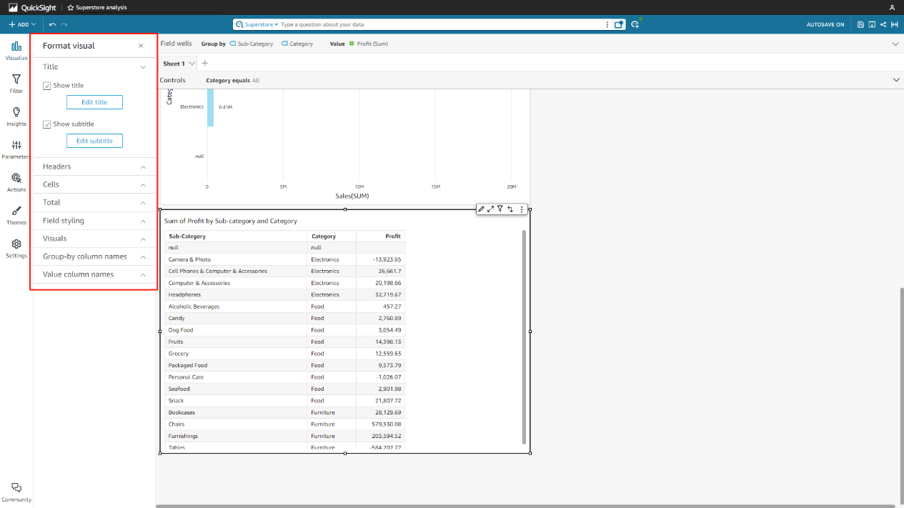

Figure 2-49 Table - Amazon QuickSight

Figure 2-50 Grid table – DFC

- 数据透视表

[数据透视表](https://wiki.datafocus.ai/index.php/%E4%BA%A7%E5%93%81%E6%89%8B%E5%86%8C_v5.0.2" \l ".E5.9B.BE.E5.BD.A2.E7.B1.BB.E5.9E.8B.E4.B8.8E.E5.AE.9E.E7.8E.B0.E5.89.8D.E6.8F.90)可用于汇总大型数据集。配置与表格基本相同，但用户还可以添加小计。

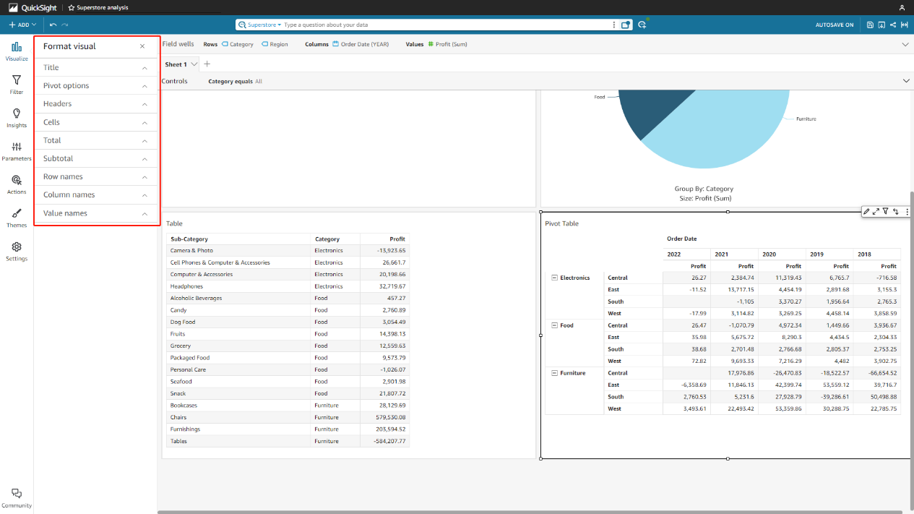

Figure 2-51 Pivot table - Amazon QuickSight

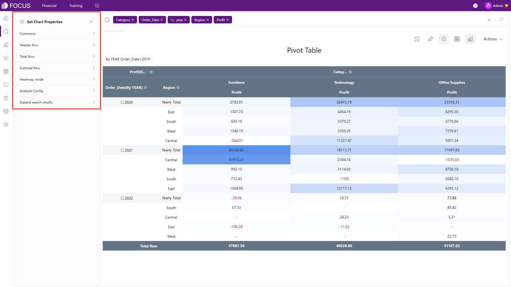

Figure 2-52 Pivot table – DFC

- 交叉表

交叉表可以汇总多个维度的数据，可以适应复杂的业务场景。除了配置表头和总计，用户还可以固定列和行，以便在移动表格时查看某些数据。

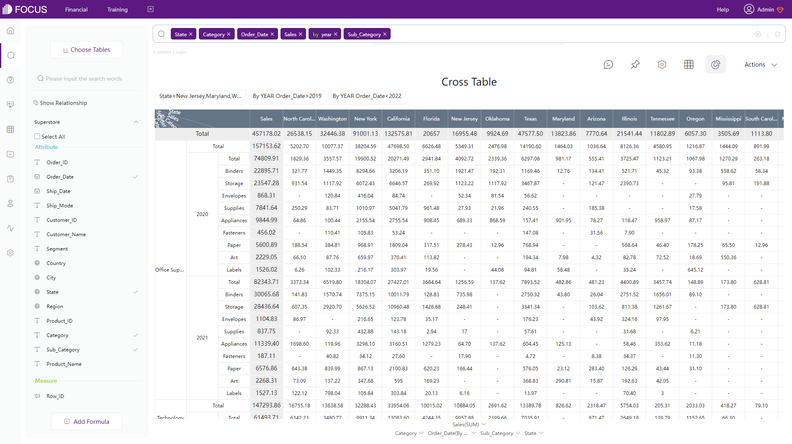

Figure 2-53 Cross table - DFC

1. 常见图表

两个平台都支持一些常见的图表，如柱状图、饼图、折线图和散点图。

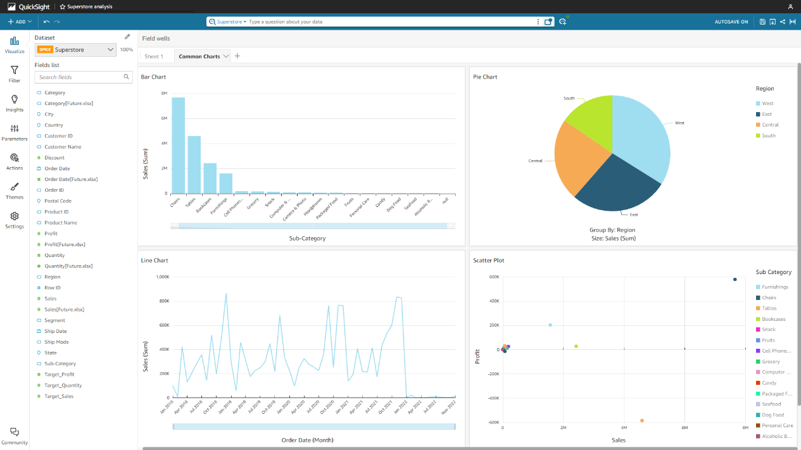

Figure 2-54 Common charts - Amazon QuickSight

Figure 2-55 Common charts - DFC

1. 地图

Amazon QuickSight有2种地图类型，点和填充地图。用户可以编辑标题、图例和地图类型。

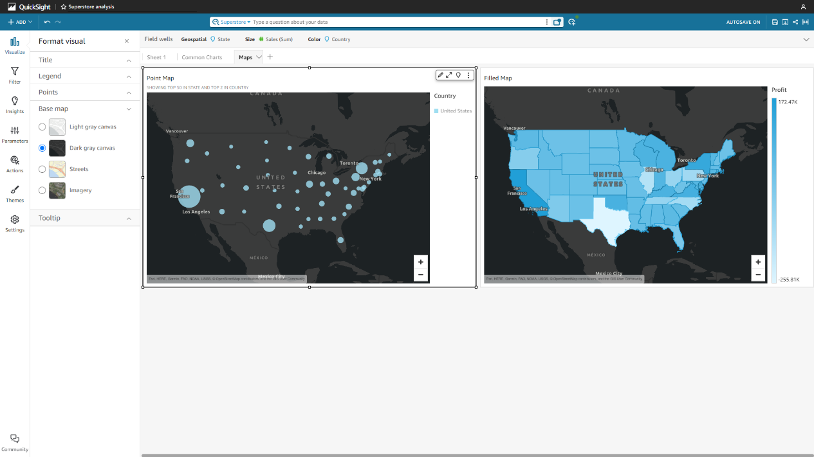

Figure 2-56 Map - Amazon QuickSight

DFC有LL（经纬度）位置图、GIS位置图、轨迹图、3D散点图等，用户还可以上传自定义的地理数据。

Figure 2-57 Maps - DFC

1. 高级图表

箱型图、漏斗图、桑基图、雷达图等高级图表。

Figure 2-58 Advanced charts - Amazon QuickSight

Figure 2-59 Advanced charts 1 - DFC

DFC 的一些其他示例：旭日图、相关热图、弦图、网络图等。

Figure 2-60 Advanced charts 2 - DFC

1. 动态图表

DFC还支持一些动态图表，比如时序气泡图，3D飞线图等。

GIF Figure 2-61 Time series bubble chart

GIF Figure 2-62 3D globe fly line

### 2.5.2 看板

<table><tbody><tr><td>方面</td><td>Amazon QuickSight</td><td>DataFocus Cloud</td></tr><tr><td>看板尺寸</td><td>适应窗口</td><td>自定义</td></tr><tr><td>布局</td><td>平铺，自由，经典</td><td>网格,，自由</td></tr><tr><td>背景</td><td>主题颜色</td><td>自定义</td></tr><tr><td>多个看板</td><td>工作表</td><td>轮播/数据应用</td></tr><tr><td>更多</td><td>控件</td><td>交互对象, 看板模板...</td></tr></tbody></table>

1. 看板尺寸

在Amazon QuickSight中，用户可以选择“适应窗口”以使看板的大小适合浏览器窗口。

在DFC中，用户可以使用预设尺寸或自己自定义尺寸。

GIF Figure 2-63 Dashboard size - DFC

1. 布局

Amazon QuickSight中有三种工作表布局：平铺、自由格式和经典。

Figure 2-64 Layout - Amazon QuickSight

类似的，DFC中有两种布局，这两种布局既可以应用于整个看板，也可以应用于单个图表。

GIF Figure 2-65 Layouts - DFC

1. 背景

如下所示，在Amazon QuickSight中，用户可以选择预设主题，也可以自行设计主题。

Figure 2-66 Background - Amazon QuickSight

在DFC中，除了可以自定义颜色，用户还可以上传图片来设置为背景。

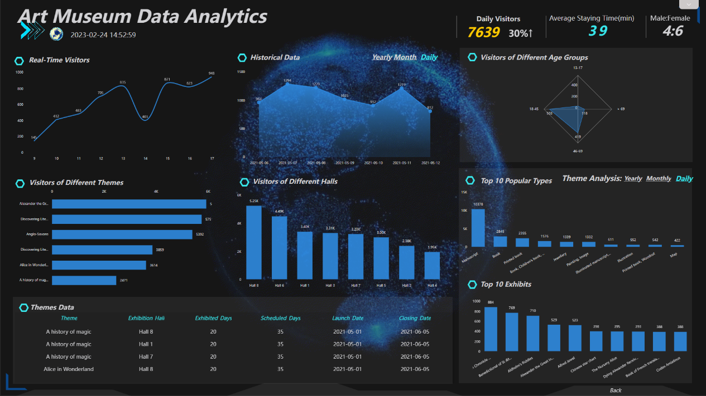

Figure 2-67 Background - DFC

1. 多个看板

Amazon QuickSight使用工作表来显示看板的多个页面，而DFC使用看板轮播和数据应用来添加多个看板。

Figure 2-68 Multiple dashboards - Amazon QuickSight

GIF Figure 2-69 Multiple dashboards - DFC

1. 更多

控件可以被添加到Amazon QuickSight中的看板中。同样，DFC也提供了一系列的交互对象以及[自定义组件](https://wiki.datafocus.ai/index.php/%E4%BA%A7%E5%93%81%E6%89%8B%E5%86%8C_v5.0.2" \l ".E8.87.AA.E5.AE.9A.E4.B9.89.E7.BB.84.E4.BB.B6)。更重要的是，用户还可以直接使用模板来快速建造大屏。

Figure 2-70 Dashboard templates

## 2.6 资源管理

- Amazon QuickSight

如[2.1.3节](#post-45231-_资源)所述，资源（包括数据集、分析和看板）可以存储在文件夹中。还有筛选器可以根据名称对资源进行排序，并且用户可以搜索名称来查找资源。

Figure 2-71 Resource management – Amazon QuickSight

- DataFocus Cloud

同样，资源（包括表格、问答、看板等）可以通过项目来管理，资源存储在各个模块中。除了可以使用多个筛选条件来选择数据表外，还可以应用标签来挑选不同资源。用户也可以通过搜索名称来查找资源。

GIF Figure 2-72 Resource management - DFC

## 2.7 协作

### 2.7.1 用户管理

1. 权限

权限可以分配给不同的资源。

用户可以自定义对Amazon QuickSight中整体资源的权限。

Figure 2-73 Permissions – Amazon QuickSight

在DFC中，权限也可以自定义配置，并且细化到单个资源级别。例如，用户可以选择是否授予对单个看板的权限。此外，针对数据表，权限可以设置为列和行级别，这意味着某些用户可能只能查看表的一部分。

Figure 2-74 Permissions - DFC

1. 角色

角色可以被应用来管理用户。

在Amazon QuickSight中，角色决定每个用户的权限级别。共有三种角色，管理员、作者和读者，其中读者只能与被共享的看板交互，作者可以编写分析和看板，而管理员还可以执行管理任务。

DFC的[角色](https://wiki.datafocus.ai/index.php/%E4%BA%A7%E5%93%81%E6%89%8B%E5%86%8C_v5.0.2" \l ".E8.A7.92.E8.89.B2)可以分为系统角色和自定义角色。用户可以分配不同的权限给自定义角色，而拥有不同角色的用户对不同的资源会有不同的权限。例如，“财务经理”可以管理与财务相关的所有资源，而“财务-销售”只能管理与销售相关的资源。

### 2.7.2 分享

Amazon QuickSight和DataFocus Cloud都提供了多种共享资源的方式。用户可以通过电子邮件在系统内共享资源，或使用链接供外部用户与看板交互。

### 2.7.3 更多

DFC还支持评论。此功能允许团队成员就图表相互交流。

Figure 2-75 Comments - DFC

## 2.8 价格

Amazon QuickSight有相当复杂的定价计划。就企业版而言，定价方案包括按角色、容量和其他一些如分页报告、警报、spice等。按角色收费对组织和团队来说是昂贵的，费用呈线性增长且难以衡量。

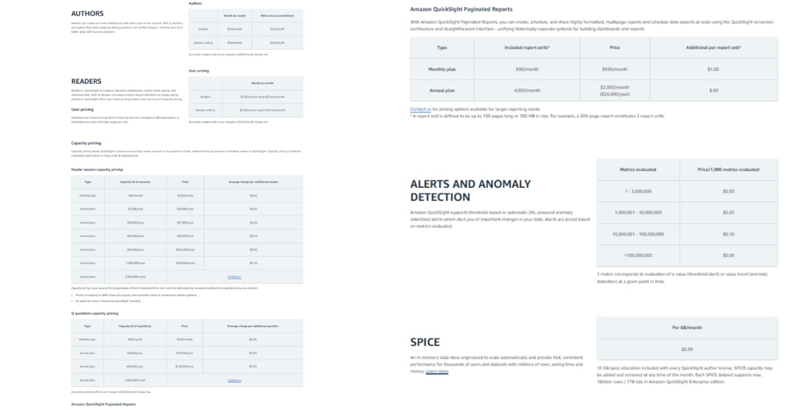

Figure 2-76 Cost - Amazon QuickSight

DFC有一个简单的定价计划，只按容量收费。这样，用户的数量就不是必须要考虑的了。跨团队分布更公平、更简单。以下是DFC的定价计划。

Table Figure 2-77 Cost - DFC

# 总结

总之，DataFocus Cloud 和 Amazon QuickSight 都是功能强大的工具，可提供一系列数据可视化和分析功能。通过了解这两个平台独特的特性和功能，用户可以就哪种工具最适合他们的特定业务需求做出明智的决定。

Amazon QuickSight 具有出色的功能，例如QuickSight Q，它允许用户使用自然语言来生成洞察。尽管仍有限制，但系统会不断改进。

DataFocus Cloud可以帮助各种规模的企业深入了解他们的数据并快速轻松地做出数据驱动的决策。其直观的界面、用户友好的工具和一些高级功能使其成为任何希望在当今数据驱动的世界中保持领先地位的企业的宝贵资产。它将不断努力使用户体验更好。可以在这里试用：[DFC](https://www.datafocus.ai/)。
