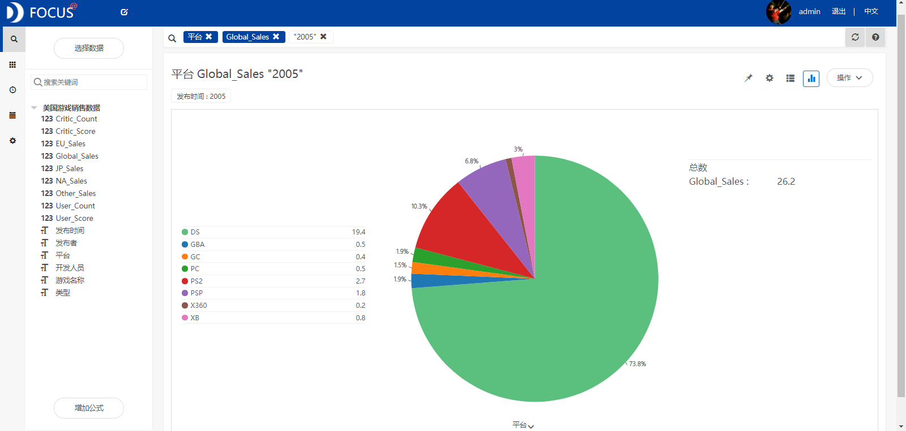
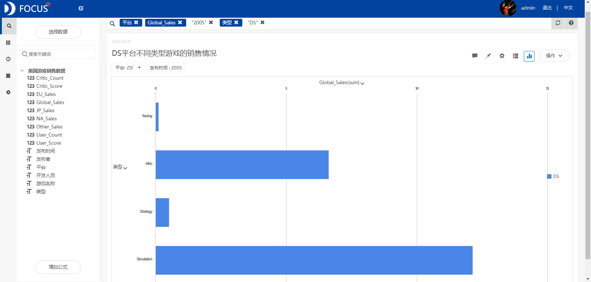
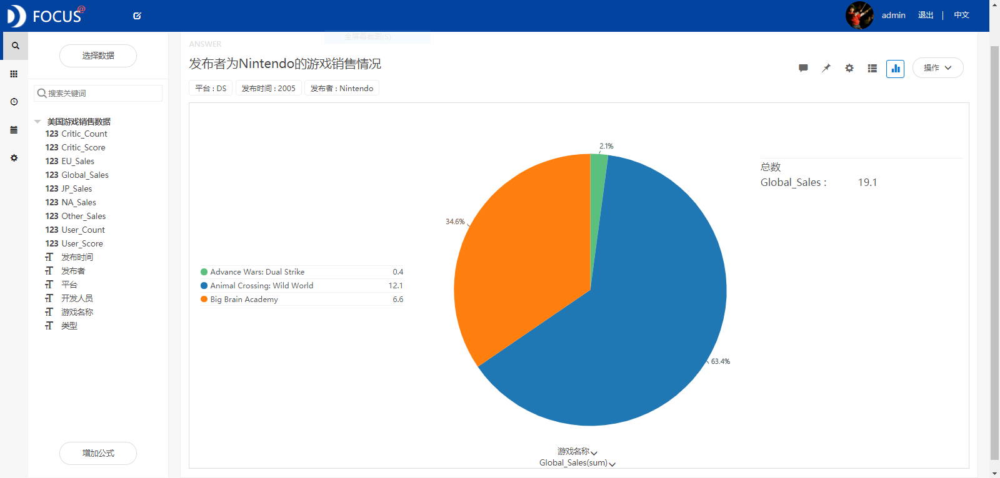
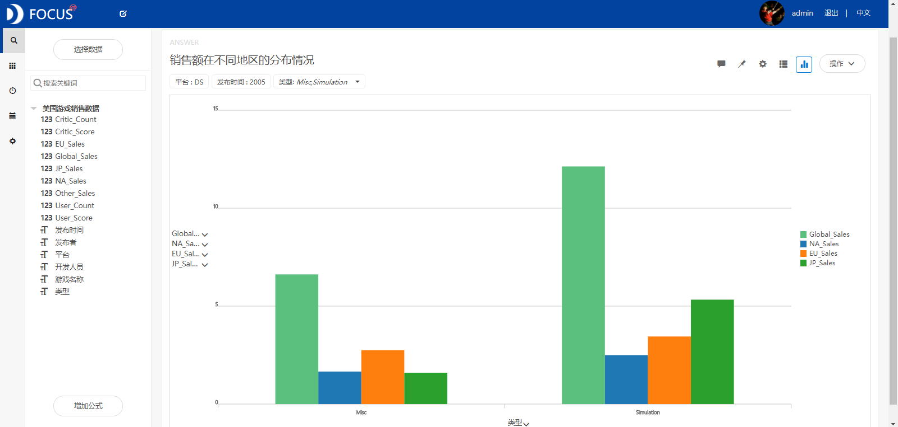
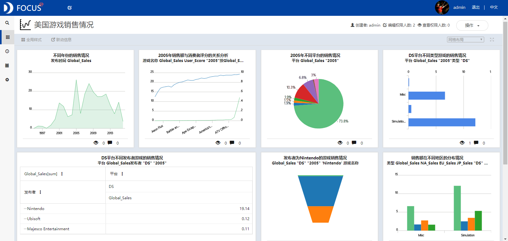

目的：统计分析美国游戏的销售情况，研究销售额与平台、发布时间、发布者、消费者评分、类型等之间的关系。

摘要：美国游戏产业发展历史悠久，细分游戏产业链成熟完整。本文通过统计分析美国游戏的销售数据，主要得出以下结论：销售额与消费者评分之间呈现一定的相关关系，随着消费者评分的增大，销售额也缓慢地增加。当消费者评分大于9.5时，销售额增长的速度加快。DS平台的销售业绩最好，销售额的占比达到了73.8%。DS是Nintendo公司的产品，Nintendo公司出品的游戏销售额最高，表明该公司制作的游戏产品最受游戏爱好者欢迎。Simulation类型的游戏在日本的销售额显著地大于其他地区，说明日本的游戏玩家相比于其他地区更喜欢玩模拟游戏。

关键词：Datafocus；游戏销售

 

一、案例背景

游戏产业是指生产互动数字娱乐产品和提供数字娱乐软件服务的行业，是游戏软件开发、营销和销售的总称。美国在游戏载体和操作方式上的不断创新、在游戏产品营销模式上的不断变革、美国政府和民众对游戏相对宽容的态度使美国游戏产业日益成为推动美国经济发展的一个新的增长点。通过对美国游戏的销售数据进行研究，了解其游戏产业的发展特色和现状，给游戏开发人员提供一些可靠的建议。

二、案例问题

本文基于美国的游戏销售数据，研究发布时间、消费者评分、平台等对销售额的影响情况，并对销售额最大的平台销售数据进行深入研究，具体包括统计分析该平台上的不同类型和发布者的游戏销售情况。

三、案例分析

将分析的“美国游戏销售数据”CSV文件导入到Focus系统中。

（一）不同发布时间的销售情况

为了分析不同发布时间的游戏销售情况，绘制出折线图如图1所示。从折线图中可以看出发布时间介于1994和2016年间的游戏销售额波动很大，2005年的销售额最高，究其原因发现该年便携式游戏设备的需求大大增加。 

图1  不同发布年份的销售情况

（二）2005年销售情况分析

1.销售额与消费者评分的关系

为了研究不同游戏的销售额与消费者评分之间的关系，筛选出2005年的销售数据进行分析，绘制成折线图（见图2）。从该图中可以看出，销售额与评分之间呈现一定的相关关系，随着消费者评分的增大，销售额也缓慢地增加。当评分大于9.5时，销售额增长的速度加快。 

图2  2005年销售额与消费者评分的关系分析

2.不同平台的销售情况

从饼图（图3）中可以发现不同平台的销售差距很大，DS平台的销售业绩最好，销售额的占比达到了73.8%。DS全称Nintendo Dual Screen（NDS），是Nintendo（任天堂）公司的产品,全球销量过亿。 

图3  2005年不同平台的销售情况

3.不同类型的销售情况

筛选出2005年DS平台的销售数据，分析销售额与类型之间的关系，绘制出条形图（见图4）。从条形图中我们可以看到，Simulation（模拟游戏）的销售额最大，其次是Misc。 

图4  DS平台不同类型游戏的销售情况

4.不同发布者的销售情况

基于2005年DS平台的销售数据，针对不同发布者的游戏销售情况进行分析。从数据透视图（图5）中我们可以发现Nintendo(任天堂)公司发布的游戏销售额最高，说明该公司制作的游戏产品最受玩家欢迎。喜欢玩游戏的人都知道，Nintendo是现代电子游戏产业的开创者，主营业务为家用游戏机和掌上游戏机的软硬件开发与发行，曾开发了游戏史上最热销游戏系列超级马里奥和精灵宝可梦，以及全球媒体综合评价最高的塞尔达传说系列。 

图5  DS平台不同发布者的销售情况

5.DS平台Nintendo的销售情况 从图中可以看出Animal Crossing :Wild World的销售额最高。该款游戏是2005年Nintendo基于社会模拟游戏开发和出版的DS掌上游戏机，说明游戏爱好者最喜欢玩的还是模拟游戏。 

图6   发布者为Nintendo的游戏销售情况

6.不同地区的销售额比较

筛选出发布时间为2005年的DS平台上类型为Simulation和Misc的游戏销售数据，比较它们在不同地区的销售情况。从绘制的条形中可以发现，Simulation类型的游戏在日本的销售额显著地大于其他，说明日本的游戏玩家更喜欢玩模拟游戏。 

图7   不同地区的销售额比较

（四）数据看板 最后将这7个结果图导入“美国游戏销售情况”数据看板中，操作结果如下： 

图8   数据看板

四、结论

销售额与评分之间呈现一定的相关关系，随着消费者评分的增大，销售额也缓慢地增加。当评分大于9.5时，销售额增长的速度加快。DS平台的销售业绩最好，销售额的占比达到了73.8%。DS是Nintendo公司的产品，Nintendo公司出版的游戏销售额最高，该公司制作的游戏产品最受观众欢迎。Simulation类型的游戏在日本的销售额显著地大于其他地区，日本的游戏玩家更喜欢玩模拟游戏。

五、对策建议

游戏发布者在销售其游戏产品时，首先要重视对消费者需求的调研，从“顾客需要的是好玩的游戏”这一角度来思考问题。其次，应尽可能地为消费者提供规范化和个性化的服务，以提高消费者的满意度。游戏开发者应该基于游戏玩家最喜爱的游戏类型（模拟游戏）来研发有创意的游戏产品。
