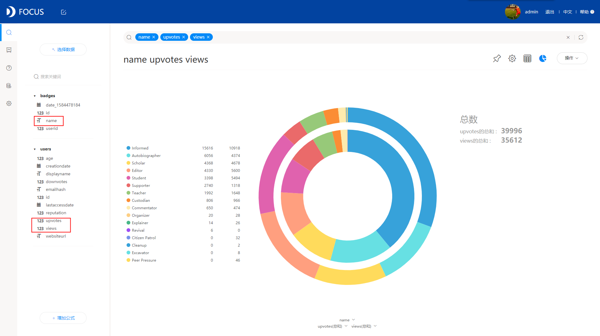
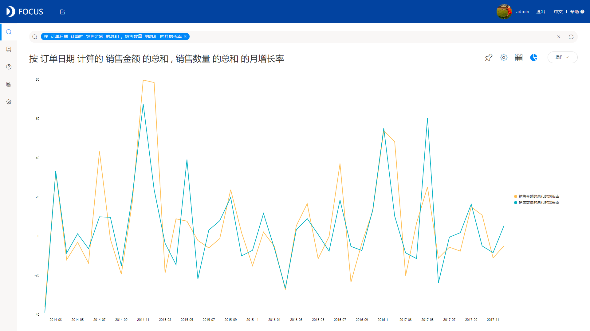

**目的：**分析大通银行2010至2016年各市区分行存款记录，研究哪些地区客户存款较多或较少，帮助总行判断该对哪些州、市、县增加或减少分行。

**摘要：**应该增设哪些地区银行分行的建设或减少哪些地区银行分行的投入是每个银行都想研究的问题。本文通过研究大通银行2012至2016各地区分行存款情况得到了以下结论：存款量最高的州为“OH”，其州内存款量最高的市为“Columbus”，该市管辖下存款量最高的县为“Delaware”；存款量最低的州为“ID”，其州内存款量最低的市为“Pocatello”，该市管辖下存款量最低的县为“Delaware”；存款量高低与两个因素有很大关系：1）地区分行的数量2）地区分行的创建时间。

**关键词：**大通银行,存款量,地区分行\[/box\]

**一、案例背景**

随着经济水平的迅速发展，人们的生活水平得到了很大提高，越来越多的人将余钱存入银行，但依旧存在着贫富差距。因此美国大通银行希望能掌握存款总量较高或较低的地区，若某地区分行存款总量很高，可以适当增加该地区分行的建设；反之，适当减少对该地区分行的投入或关闭一些分行，这样可以使地区分行更好被利用。

**二、案例问题**

首先基于“2012至2016大通银行各地区分行存款”数据，找出存款量最高的州和其州内最高的市及该市下最高的县、存款量最低的州和其州内最低的市及该市下最低的县。然后对存款量最高和最低的州的分行创建时间进行比较，分析地区存款量高低的原因。

1. **案例分析**

将分析的“2012至2016大通银行各地区分行存款”CSV文件导入到Focus系统中。

1.2012至2016年各州分行存款量对比

图 1 2012至2016年各州分行存款量对比

通过对2012至2016年各州分行存款量进行对比研究，可以得到存款量及其涨幅最高和最低的州。图1可知，从存款量和涨幅来说，州“NY”、“OH”“CA”、“IL”、“TX”较高，其中“OH”最高，可以对这些州适当增加分行的建设；而其它州存款量和涨幅都较低并且差别不大，其中“ID”最低，可以是适当对这些州减少或关闭一些分行。接下来主要对存款量及其涨幅最高和最低的两个州重点分析。

2.存款量最高的州的各市分行总存款量对比

图 2 存款量最高的州的各市分行总存款量对比

图2基于图1得到的存款量及其涨幅最高的州“OH”，对其管辖下所有市的总存款量进行了对比，发现名为“columbus”的市的总存款量和涨幅远远高于了其他市并于2016达到最大，说明该市经济水平与其他市相比非常高；而其它市存款量和涨幅相差不大并且都较低，所以大通银行可以考虑将该州下的分行集中到“columbus”，其余城市适当减少或关闭分行。

3.存款量最低的州的各市分行总存款量对比

图 3 存款量最低的州的各市分行总存款量对比

图3基于图1得到的存款量及其涨幅最低的州“ID”，对其管辖下所有市的总存款量进行了对比，发现市“Pocatello”的总存款量非常低，且每年涨幅速度太低，所以大通银行可以适当减少或关闭市“Pocatello”的部分分行。

4.存款量最高的市的各县分行总存款量对比

图 4 存款量最高的市的各县分行总存款量对比

图4基于图2得到的存款量及其涨幅最高的市“Columbus”，对其管辖下所有县的总存款量进行了对比，从图4可知，在该市开设分行的县只有两个，其中“Delaware”不管从总存款量还是涨幅来看，“Delaware”都非常高，可知“Delaware”的居民比较富有。所以可在该县多开设一些分行。

5.存款量最低的市的各县分行总存款量对比

图 5 存款量最低的市的各县分行总存款量对比

图5基于图3得到的存款量最低的市“Bannock”，对其管辖下所有县的总存款量进行了对比，图5可以看出，在该市设分行的县只有一个，所以该县的总存款量和市“Pocatello”是相同的。

## 6.存款量最高和最低的两个州的分行创建时间比较

图 6 存款量最高和最低的两个州的分行创建时间比较

图6基于图1得到的存款量最高和最低的两个州，对其所建设的分行创建时间进行了比较。从图中可知，州“OH”分行的创建时间范围为1900-2009，而州“ID”分行的创建时间范围是1961-2002；并且州“ID”每年创建分行的数量范围为1至2个，但州“OH”每年创建数量为1至5个。所以可推测：存款量出现高低不一致的原因主要有：1）地区分行的数量2）地区分行的创建时间。

7.数据看板

图 7 数据看板

最后将这6个结果图导入“2012至2016大通银行各地区分行存款量”数据看板中，如图7。

**四、结论**

通过对各州、市、县的大通银行各分行存款量的分析，找出了存款量最高的州（OH）和其州内最高的市(Columbus)及该市下最高的县(Delaware)、存款量最低的州(ID)和其州内最低的市(Pocatello)及该市下最低的县(Bannock)，发现存款量高低不一致的主要原因有1）地区分行的数量2）地区分行的创建时间，所以可推测客户的存款特点为：客户经常在一个分行存款后，不会轻易换地点。

**五、对策建议**

因各地区分行的存款量和其创建时间和数量有关，所以可以向创建时间比较久的分行投入更多人力和物力等资源，适当减少存款量较低地区的分行投入。

另外通过分析得，可增加大对州“OH”、市“Columbus”、县“Delaware”大通银行分行的建设，同时适当减少或关闭州“ID”、市“Pocatello”、县“Bannock”所开设的大通银行分行。
