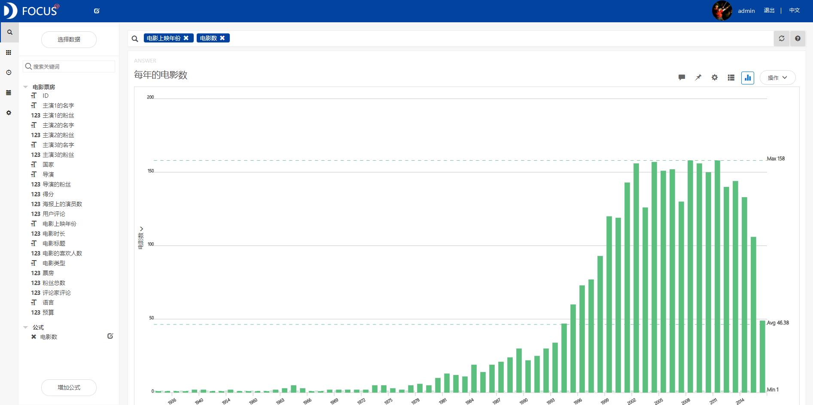
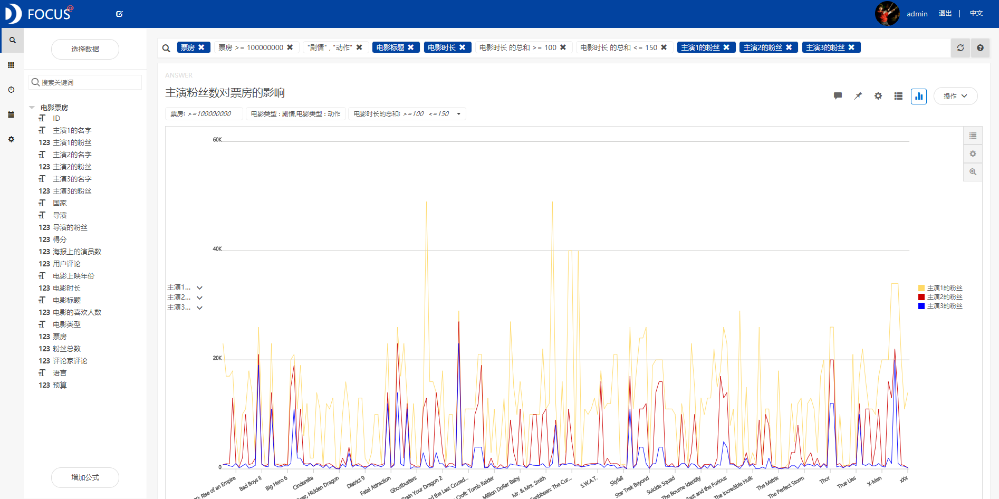

目的：使用datafocus通过研究影响电影票房的各类因素的大数据，为影视公司推出一部电影时的决策提供参考意见。

摘要：电影已经越来越成为一种潮流的象征，日益丰富着我们的日常生活。此次案例分析的大数据为1927年到2016年上映的3154部电影的票房数据及其影响因素。通过分析发现，容易得到较高票房数据的两类电影是动作片和剧情片，电影时长分布在100-150分钟的电影较容易获得高票房。导演粉丝数对于电影票房不存在很大的影响，但演员粉丝数对于电影票房存在一定的影响，特别是主演1。票房较高的电影得分也较高，得分基本在7-9分之间。但并不是得分越高的电影票房也就越高。

关键词：电影票房；影响因素；主演；得分

一、案例背景

随着现代化建设的发展，中国城乡居民收入水平显著提高，精神、文化生活伴随着物质生活水平的提高也日益成为广大城乡消费者追求的目标，以往只有少数人才可以看到的影视作品现在已经成为大众消费品，遍布各大中小城市，成为人们精神生活的寄托以及茶余饭后的谈资，电影作品已经成为一种潮流的象征，日益丰富着我们的日常生活。

影视作品的数量每年都以惊人的速度增长，影视业的竞争也因此日益增大，制片公司要想生存下去，票房是关键，一部电影的失败就可以葬送一家公司。于是了解票房的影响因素，通晓市场的偏好，生产大众喜欢的电影，努力为一部电影上市造势，已经成为制片公司的当务之急。

此次案例分析的数据为1927年到2016年放映的3154部电影的票房数据及其影响因素，包括导演的粉丝数，主演的粉丝数，电影时长，电影类型，电影在某网站上的得分等。

二、案例问题

电影票房会受到各种因素的影响，如电影时长、演员粉丝数、电影类型、电影预算等等。本文将着重讨论分析影响电影票房的主要因素。由于电影票房数据信息量巨大，用EXCEL来进行操作会略显麻烦，使用Datafocus产品就可以快速处理大量数据，分析的准确性也高。

三、案例分析

（一）综合分析

1.每年播出电影数

首先添加公式计算从1927到2016年每年上映的电影数，利用柱状图观察每年上映的电影数的变化。

图 1 每年播出的电影数

从图中可以看到，从1927年到1981年放映的电影数非常少，1990年后上映的电影数开始飞快上升。

2.各类电影的票房情况

在了解到电影行业的飞速发展后，利用数据观察可以获得最高票房的电影类型。

图 2 各类电影的票房情况

从图中可以看到，票房最高的两类电影是动作片和剧情片，其次是冒险片和家庭片。接下来的分析主要针对票房最高的两种电影类型进行影响因素研究。

（二）影响因素分析

1.电影时长的影响

首先分析电影时长对票房的影响，通过散点图观察电影时长对票房是否存在一定的影响。

图 3 电影时长对票房的影响1

图 4电影时长对票房的影响2

通过散点图可以看到，电影的时长基本在100-200分钟，去掉电影时长为312的离群点，进一步扩大电影时长的范围，通过观察可以明显发现，电影时长分布在100-150分钟的电影是最多的，因此可以推断电影时长分布在100-150分钟的电影较容易获得高票房。

2.导演粉丝数的影响

在确定了最优电影时长区间的情况下，再添加导演粉丝数的因素进行分析，通过面积图观察导演粉丝数对于电影票房是否存在影响。

图 5导演粉丝数对票房的影响

从图中可以明显地看到，电影时长在100-150分钟且票房过亿的剧情片和动作片有很多，但导演粉丝数高的确寥寥无几。因此可以推断导演粉丝数对于电影票房不存在很大的影响，不知名的导演一样可以拍出票房过亿的电影。

3.演员粉丝数的影响

演员粉丝数则是影响票房较为重要的因素之一。因此，对电影三位主演的粉丝情况进行对比。

图 6 演员粉丝数对票房的影响

从图中可以明显地观察到，电影时长在100-150分钟且票房过亿的剧情片和动作片的电影中，主演1的粉丝数大于主演2，而主演2的粉丝数则大于主演3，且主演1的粉丝数普遍较高。因此我们可以推断演员粉丝数对于电影票房存在一定的影响，特别是主演1。

4.得分的影响

添加得分因素对电影票房进行分析，通过气泡图观察两者之间的联系。

图 7 得分对票房的影响

气泡的大小是代表票房的大小，从图中可以观察到，票房较高的电影得分也较高，得分基本在7-9分之间。但并不是得分越高的电影票房也就越高。

（二）数据看板

最后将这6个结果图导入"电影票房影响因素"数据看板中，为了使数据看板更为美观，在全局样式中选择第三个预设样本，选择"自由布局"。操作结果如下：

图 8数据看板

四、结论

综上所述，可以看出从1927年到2016年电影的发展非常迅速，上映的电影也是越来越多。最容易得到较高票房数据的两类电影是动作片和剧情片，接下来的分析主要针这两种电影类型进行。

通过观察可以发现，电影时长分布在100-150分钟的电影是最多的，可以推断电影时长分布在100-150分钟的电影较容易获得高票房。推断导演粉丝数对于电影票房不存在很大的影响，不知名的导演一样可以拍出票房过亿的电影。但演员粉丝数对于电影票房存在一定的影响，特别是主演1。票房较高的电影得分也较高，得分基本在7-9分之间。但并不是得分越高的电影票房也就越高。

五、对策建议

1、影视公司在推出一部电影时首选动作片或是剧情片，在此基础上加上搞笑，恐怖，冒险等元素。

2、影视公司可以大胆选用有能力的新人导演，但主演的演员则要选择知名度较高的。电影时长尽量控制在100-150分钟。

3、创新电影品牌营销模式，首先关注消费者需求，重视影院品牌建设，其次打造品牌差异，启动个性化营销。
