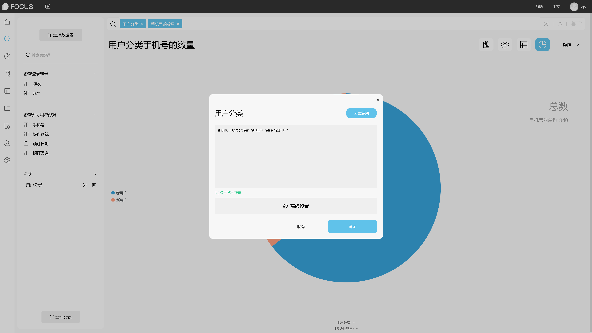

这个问题还是稍微有点宽泛了，首先App有很多不同的类型，涉及各行各业，其次，不同行业的App也会涉及到不同内容的数据分析，所以想要准确的回答题主的问题恐怕有些难度。但是我大胆猜测题主是想做一个App的运营分析，希望能够帮助App获取更多的下载和使用量，提高用户留存情况，同时对不同渠道的投放效果进行总结，优化资源配置。

其实综合上述的客户需求，常用到的App数据分析指标已经比较明显了：

1、用户数据监测

用户的下载、注册、浏览、点击、退出、付款等行为是进行App数据分析的基础数据来源，需要及时对这些数据进行收集、整理，如果能够借助BI工具，比如DataFocus，对这些数据进行实时展示，监测数据的变动情况就再好不过了~~

1. 广告投放效果分析

有时候公司花了很大的金钱和精力去不同渠道投放广告，但往往收效甚微，没有达到预期的效果。这时候就需要对这些广告的投放效果进行一个总结分析，哪些渠道的新增用户更多、投资回报率更高、注册转化率更高？而哪些渠道的效果较差？通过对这些内容的数据分析，优化配置资源，可以将更多的资源投放到表现较好的渠道中。

3、App页面设计分析

设计完成的App一般都会存在一个核心模块，这是开发者最希望用户到达的一个界面。借助对App内用户的行为监测，对用户后续的操作行为进行监测，计算出核心模块到达率，同时可以对App界面设计的合理性进行探究。

****

4、用户粘性分析

通过广告在提升App的知名度后，我们需要做的是留住更多的用户，且最好是活跃用户。通过监测用户的活跃情况、留存率和流失率等指标的进行用户留存分析和粘性分析。流失率的变化可以直观的反应出该APP在朝好的方向发展还是不好的方向发展，可以帮助调整App的内容，迎合用户喜好。

5、用户画像分析

通过对使用用户的一些基础信息的分类整理，可以对用户进行画像，定位该App的核心用户，并可以针对这些用户进行后续的研发和推广。

当然，今天介绍的这部分内容也并没有非常全面，每一部分的分析内容也需要后续仔细推敲，具体也可以进入DataFocus官网查看上述分析的完整内容。

学无止境，希望这段回答对大家能有所帮助~~
