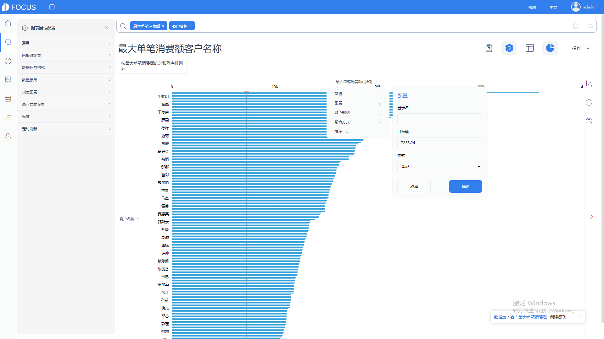

**目的 ：**探究浙江省1990-2016年能源生产与消费情况

**摘要 ：**能源是国民经济的重要物质基础，未来国家命运取决于能源的掌控。本报告使用datafocus系统，对浙江省统计局发布的包括能源生产量、能源消费量等能源相关数据进行分析得出结果：全省能源生产量年增率波动幅度大，能源消费量连年增加；历年来浙江省能源消费弹性系数基本小于1；第二产业的用电量最大，新能源“热力”在工业企业能源消费占大比例等。因此浙江省想要提高能源利用率，让能源跟上经济发展的步伐，需要明确提出“可再生能源”发展战略，优化能源结构和扶持可再生能源，合理开发利用能源资源，为全省经济社会长远可持续发展提供保障。

**关键词：**datafocus,能源生产,能源消费,电力

一、案例背景

能源的开发和有效利用程度以及人均消费量是生产技术和生活水平的重要标志。这将是资源小省，但却是能源消费大省，随着浙江经济的告诉发展，能源消费增长较快。本文主要探究浙江省1990-2016年能源生产与消费情况，看到问题，提出建议。

本文所用到弹性系数这一指标。其中能源消费弹性系数亦称“能源消费增长系数”。反映能源与国民经济发展关系的一个技术经济指标。它是指一定时期能源消费平均增长率与同期国民生产总值平均增长率或工农业生产总值平均增长率的比值。；能源生产弹性系数是研究能源生产增长速度与国民经济增长速度之间关系的指标：能源生产弹性系数=能源生产总量年平均增长速度/国民经济年平均增长速度。

二、案例问题

随着社会的发展，政府更多地强调职能的转变和管理创新。在管理上采用先进的商务智能(BI)技术，对大量的基础数据进行深入的分析，再依据分析结果进行科学和准确的决策正是坚持科学的发展观和管理上的创新。政府工作中提交政府报告是常见的工作，如果每次都是将报表、图表导出后再粘贴到报告中也是一件繁琐的重复性工作。使用datafocus产品可以只要经过一次设计，后续自动随数据更新而自动更新图表，再多的分析都可以通过一次鼠标点击来完成，极大的减少了人力和时间的花费。

三、案例分析

进入datafocus 产品系统，从数据管理页面中导入数据源“工业企业2016年能源消费”、“能源生产消耗”、“用电具体明细”，并在数据看板页面创建新的数据看板，命名为“浙江省能源生产与消费情况”。

首先根据原数据，将原数据进行整理。添加公式计算出能源生产量、能源消费量、电力生产量、电力消费量的年环比，建立4个新的中间表，并将新的中间表的年份添加公式：【年份=to\_date (concat(concat ( to\_string(year( 年份 )) , '-12' ) ,'-31'))】 进行统一并创建新的4个中间表。最后将4个中间表进行关联并建模。

1. 全省能源（电力）生产消耗量年增长率

选择折线图对全省能源（电力）生产消耗量年增长率进行可视化。

图 1全省能源（电力）生产消耗量年增长率

从图1中可以看到，全省能源生产量年增率波动幅度大，不稳定，在1997年能源生产量大幅度下跌；能源消费量连年增加；电力生产量年增率与消费量年增率波动幅度相近，且均是连年上升。

1. 全省能源（电力）弹性系数统计

通过添加公式计算得出能源消费弹性系数、能源生产弹性系数、电力消费弹性系数、电力生产弹性系数，选择折线图进行数据可视化，将Y轴配置中的目标值设为1。

图 2 全省能源（电力）弹性系数统计

从图2中可以看到历年来浙江省能源消费弹性系数基本小于1,说明浙江省的科学技术较发达，能源利用效率高。但能源生产弹性系数波动幅度大，说明生产技术需要进一步探索和创新。能源中，电力的消费弹性系数在数值1上下小幅度波动，近几年均小于1，说明电力利用效率在提高；电力的生产弹性系数接近0，说明电力的生产力还远远跟不上国民经济发展。

3\. 2016年工业企业能源消费情况

工业企业是能源消费的主要源头，使用饼图探索各类能源在工业企业消费中的分布。

图 3 2016年工业企业能源消费情况

从图3可以看到，新能源“热力”占工业企业能源消费的一半以上，为67.7%，其次为原煤消费，占比21.4%。

4\. 近5年全社会用电统计

选择条形图呈现2012-2016年全社会的用电情况。

图 4 近5年全社会用电统计

由图4所示，随着经济发展和电力生产量的上升，全社会电力消耗也逐年提升。

5\. 近5年产业用电情况

通过散点图了解2012-2016年行业的用电情况并进行对比。

图 5 近5年产业用电情况

从图5可以明显的看到，第二产业的用电量大于第三产业和第二产业，且第二产业和第三产业随着年份的变化有上升的趋势，第一产业则较平稳。

6\. 近5年第二产业电力消耗情况

通过折线图方便对比5年各类第二产业的电力消耗差异。 

图 6 近5年第二产业电力消耗情况

由上图可知，工业的电力消耗量最大，制造业次之。采矿业和建筑业的电力消耗量相对较低。随着年份的递进，工业和制造业的电力消耗量呈上升趋势，其他三个行业则较为平稳。

7\. 近5年第三产业电力消耗情况

根据折线图对比各类第三产业的电力消耗。

图 7 近5年第三产业电力消耗情况

从图7中可以看到，商业、住宿和餐饮业的电力消耗最大，其次为公共事业及管理组织，电力消耗最低的是信息传输计算机服务软件业。

8\. 近5年城乡居民生活用电统计

选择柱状图对居民生活用电进行分析对比。

图 8近5年城乡居民生活用电统计

如上图8所示，乡村居民和城镇居民的用电量随年份递进均无明显趋势；乡村居民的用电量大于城镇居民的用电量。原因猜想可能是农村因为输送远，电压可能没有达到要求，电气设备就更“耗电”，另外由于有些农村没有参加电网改造，所以损耗高。具体原因可以进一步收集相关数据进行探索。

将这8个结果图导入“浙江省能源生产与消费情况”数据看板中，排版结果如下：

图 9 数据看板

四、结论

1\. 全省能源生产量年增率波动幅度大，不稳定，在1997年能源生产量大幅度下跌；能源消费量连年增加；电力生产量年增率与消费量年增率波动幅度相近，且均是连年上升。

2.浙江省的科学技术较发达，能源利用效率高。但能源生产技术需要进一步探索和创新。能源中，电力的电力利用效率在提高但电力的生产力还远远跟不上国民经济发展。

3\. 随着经济发展和电力生产量的上升，全社会电力消耗也逐年提升。

4.第二产业的用电量大于第三产业和第二产业，且第二产业和第三产业随着年份的变化有上升的趋势，第一产业则较平稳。

第二产业中工业的电力消耗量最大，制造业次之。 新能源“热力”在工业企业能源消费占大比例采矿业和建筑业的电力消耗量相对较低。随着年份的递进，工业和制造业的电力消耗量呈上升趋势，其他三个行业则较为平稳。

第三产业中商业、住宿和餐饮业的电力消耗最大，其次为公共事业及管理组织，电力消耗最低的是信息传输计算机服务软件业。

5.乡村居民和城镇居民的用电量随年份递进均无明显趋势；乡村居民的用电量大于城镇居民的用电量。

五、对策与建议

近年来，各级政府吧可再生能源的开发利用与落实科学发展观、推进经济社会又好又快发展目标密切联系在一起，开发利用技术不断进步，可再生能源李永亮在不断增加。浙江省想要提高能源利用率，让能源跟上经济发展的步伐，需要明确提出“可再生能源”发展战略，优化能源结构和扶持可再生能源，合理开发利用能源资源，为全省经济社会长远可持续发展提供保障。
