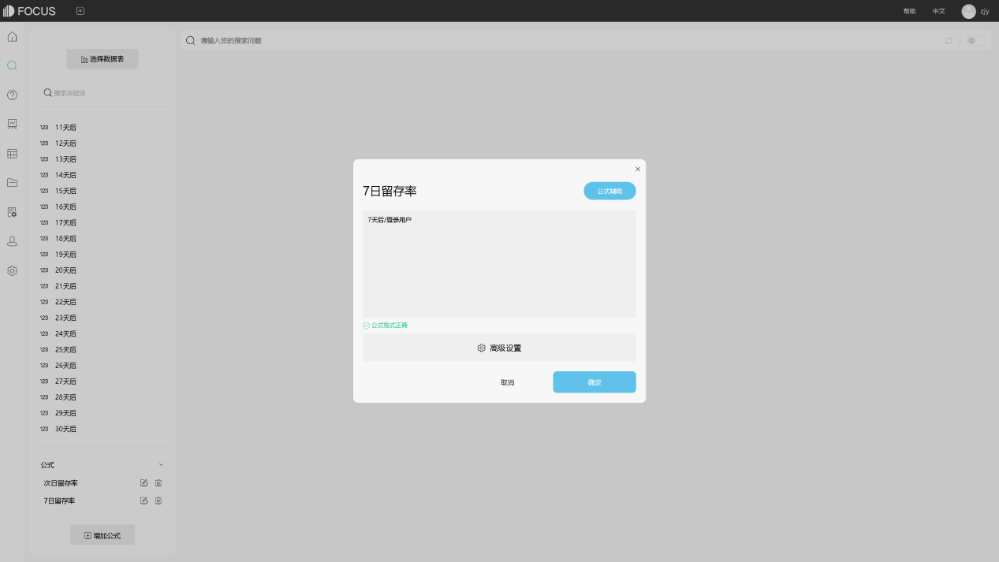

目前，很多时候都应该明白的就是对很多事情有着一些事项，并且很多时刻大家都明白的就是每一产品在使用不同的时候，其实很多顾客和很多潜在的客户和一些事项都是承诺的物质和心理的利益，并且很多拥有物质上的属性就是值得大家去关注，那么datafocus软件中基本形象和影响因素是什么，一起来看看吧！

第一、基本要素

1、目前，很多为了塑造品牌服务是广告最主要的目标，尤其是在很多广告这个时候，并且很多产品是值得大家去关注话题，并且维持一个高知名度的品牌形象；

2、其实，很多人都应该，对此很多设计公司都会采用任何一个广告都是对品牌的长程投资，并而不惜牺牲追求短期效益的诉求重点，对此该怎么样维护好一个好的品牌形象就需要大家不断的努力！

3、其实，很多产品都是随着同类产品的差异性减小，并且很多品牌之间的同质性增大，消费者选择品牌时所运用的理性就越少，并且该怎么样描绘品牌的形象要比强调产品的具体功能特性重要的多；

4、目前，很多消费者购买时追求目标就是采用"实质利益+心理利益"，并且对某些消费群来说，广告尤其应该重视运用形象来满足其心理的需求。

第二、影响

大家都应该秦清楚的就是随着竞争的日趋激烈，要维持品牌形象的活力和领导地位的广告费用越来越大，并且很多企业的利润开始降低，或许很多许多企业把广告作为开支来看待，为了保证利润，那么该怎么样去解释和诠释即使许多著名的大品牌也在为经过长期投资建立。

以上，就是关于BI品牌形象讨论基本要素分析，并且很多领域都在不断的发展着，为此希望大家能够有通过datafocus企业更好的认识BI关键点！
