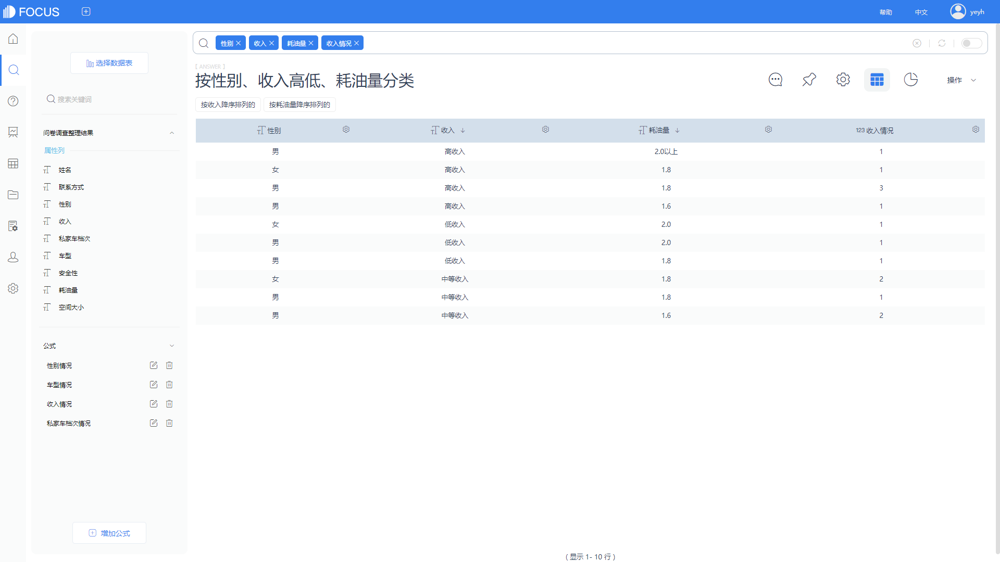

目前，数据分析要实现的应用领域之一就是预测性分析，并且很多关于可视化分析和数据挖掘都是前期需要完成的工作，对此大家主要只要在大数据中挖掘出信息的特点与联系，并且大家只要好好的掌握科学知识，datafocus软件在建立科学的数据模型，这样大家就可以通过模型带入新的数据，从而预测未来的数据。

很多数据是分析要实现的应用领域之一就是预测性分析，其实很多可视化分析和数据挖掘都是前期铺垫工作，其实大家在很多时候们大家就可以建立模型，为此不管从而预测未来的数据。

其实，说到底很多数据是结构化的，当然很多时候吗，大家针对原始数据中的关系数据库，同时也包括了网络的不同构型的数据，很多时候大家只要有针对性去面对数据交易。并且通过对不同类型数据的分析，在很大程度上大家就会数据是具有不同类型的知识结构和内容，包括反映表征的、用于反映数据的汇聚模式或根据对象的属性区分其所属类别的特征型知识。对于差异和极端特例进行描述的差异型知识;其实在很大程度上就是在反映一个事件和其皱着大家该怎么样去依赖或关联的关联型知识;其中之一就是可视化方法。

以上，就是关于BI工具分析和预测分析办法，并且很多时候大家都在针对数据这样的数据有着不同方面的看法，对此大家该怎么样去阐述相关方面的问题，为此希望为大家介绍datafocus软件信息能够帮助到大家！
