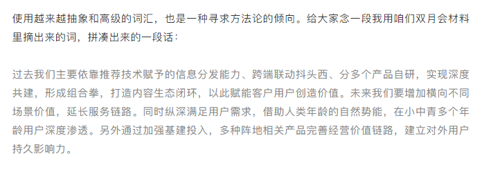
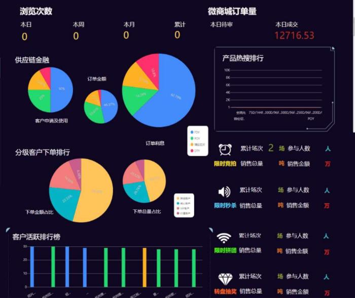

近日，张一鸣在字节9周年年会上念了一段吐槽互联网黑话的发言引爆了舆论。

他从公司一些人的文档里摘抄下报告大肆讽刺，以下是年会上原话：

图片来源于网络

简单来说，就是在吐槽「互联网公司不说人话」。

有人甚至说，互联网大厂黑话正朝着现实世界侵蚀。

可也有人认为，黑话代表的是互联网精神和企业文化，它能让一个「职场小白」迅速蜕变为「职场老炮」。

黑话的确是一个很大槽点，但也很有趣！因此，本文盘点了数据行业里那些数据人随口挂在嘴边的黑话，以及用看得懂的人话翻译。

看懂BI行业黑话，这一篇就够了！

### OLAP

被称为多维分析，提供多维数据管理环境。以一种称为多维数据集的多维结构访问来自商业数据源的经过聚合和组织整理的数据。

说人话：就是多个角度来分析数据，比如从产品类型来看各个地区的销售额，又或者从销售模式来看各个产品的销售额。

### 数据挖掘

从大量的数据中通过算法搜索隐藏于其中信息的过程。

说人话：就是从数据中总结出对业务有用的结论。

### 数据仓库

决策支持系统（dss）和联机分析应用数据源的结构化数据环境。

说人话：比数据库还大的放海量数据的地方。

### NLP

自然语言处理，人工智能（AI）的一个子领域。

说人话：就是你跟机器用人类自然语言对话。

### 批量处理

处理一段时间内收集的大量数据。

说人话：一口气处理大量数据。

### 商业智能

用现代数据仓库技术、线上分析处理技术、数据挖掘和数据展现技术进行数据分析以实现商业价值。

说人话：就是一种帮助企业对数据进行有效整合处理并提供决策思路的产品或者服务，帮你解决数据难题的工具。

### 为企业赋能

通过组织、流程的有效设计，使得企业的组织和个人能够敏捷、有效完成工作目标，从而有效达成组织的使命和战略目标。

说人话：帮企业达成目标。

### 大数据

无法在一定时间范围内用常规软件工具进行捕捉、管理和处理的数据集合，是需要新处理模式才能具有更强的决策力、洞察发现力和流程优化能力的海量、高增长率和多样化的信息资产。

说人话：就是你生活中经常接触到但又很难收集到的海量数据

### 闭环

业务流程从顺序变成循环。

说人话：就是把你的产品业务整套获客、促活、盈利流程变成死循环

### 快速迭代

产品与服务快速地适应不断变化的需求，不断推出新的版本满足或引领需求，永远快对手一步。

说人话：变得更好，更能满足用户的需求。

### 黑科技

高科技泛滥之后演变出来更强大或者更先进的技术以及创新、软硬件结合等，也包括基于现有技术的改进升级和该产品的使用体验等。

说人话：不明觉厉、看起来高大上的东西。

16.解决方案

针对某些已经体现出的，或者可以预期的问题、不足、缺陷、需求等等，所提出的一个解决整体问题的方案（建议书、计划表），同时能够确保加以快速有效的执行。

说人话：你提出你的需求，我来制定方案帮你解决你的需求。

17.自助式BI工具

最终用户在经过批准和支持的架构和工具组合中设计和部署自己的报告和分析。

说人话：就是你不需要谁的帮助就可以自己用这些数据制作一份分析报告。

### 数据看板

数据可视化的载体，通过合理的页面布局、效果设计，将可视化数据更直观、更形象的展现出来。

说人话：把你需要的图表放在一个屏幕里。

### SaaS

软件即服务，即通过网络提供软件服务。

说人话：我们帮你搞定了服务器，你不用下载安装，登陆网页就可以使用服务。

### 数据孤岛

数据在不同部门相互独立存储，独立维护，彼此间相互孤立，形成了物理上的孤岛。

说人话：数据分散在不同的地方，不集中。

### 数据驱动

以数据为中心依据进行决策和行动。

说人话：从数据中发现了问题，用数据指导行动。

### 本地部署（私有化部署）/SaaS部署

本地部署（私有化部署）就是由用户在自己本地部署服务器环境，本地管理。

SaaS部署就是采用云化的方案，使用厂商提供的云服务器。

说人话：本地部署就是你自己搞定服务器，SaaS部署就是我们来帮你搞定服务器。

### TB级数据

数据量为1TB以上，1TB相当于万亿字节

说人话：非常大非常大的数据量。

### 数据阈值

数据的最低值或最高值。

说人话：给数据设置一个范围。

### 钻取

改变维的层次，变换分析的粒度。

说人话：低维度和高维度转换。比如省比市维度要高，你选了杭州市，向上钻取转换成浙江省。

### 联动

一个运动或变化时，其他的也跟着运动或变化。

说人话：一部分数据变了其它数据跟着也变了。比如你选了浙江省，销售额变化对应的就是浙江省的销售额。

### 数据预处理

在主要的处理以前对数据进行的一些处理。

说人话：数据处理前要先处理一下，做菜前要先洗菜、切菜吧？

### 数字化转型

建立在数字化转换（Digitization）、数字化升级（Digitalization）基础上， 进一步触及公司核心业务，以新建一种商业模式为目标的高层次转型。

说人话：原本企业没重视利用数据，现在要好好利用数据指导业务。

现在，你听懂了吗？
