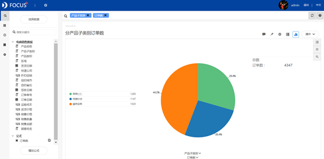
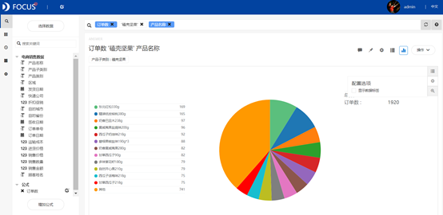
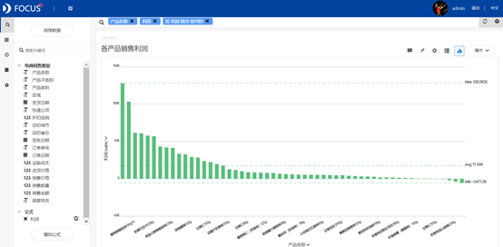
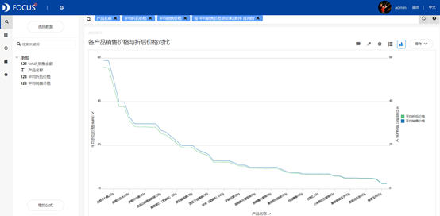
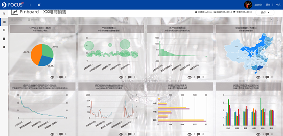

摘要 ：电子商务正在成为我国市场经济中一个重要的经济增长点和新领域，具有无可替代的优势力量。本报告使用datafocus系统，对某电商产品品牌的2012年1月至2013年12月的销售数据进行分析。通过对销售总概、折扣促销、运输选择构成三大板块的汇总分析，在广州该电商产品订单量最好；销售金额与折扣幅度大致成正相关等相关结论。因此认为通过提高品牌其他商品的宣传力度，增加产品类型；企划产品合理的促销方式等措施能更好的提高企业电商产品的竞争力。

关键词：datafocus；电商销售；折扣促销；快递公司

## 一、案例背景

当前，世界经济正在开始新一轮的增长，经济全球化趋势不断增强，以信息技术产业为先导的"新经济"方兴未艾，各界已经一致认为近期的重点是建立在互联网基础上的电子商务新经济。某电商产品企业为了提升企业产品的竞争力需要进行销售分析。

## 二、案例问题

如今大部分企业的销售情况分析是通过EXCEL来实现的。但是由于电商的发展迅速，互联网数据的庞大，用EXCEL来进行操作会略显麻烦，使用datafocus产品就可以快速处理大量数据，因此可以极大的减少人力和做销售报告的时间。

## 三、案例分析

进入datafocus 产品系统，从数据管理页面中导入数据源"电商销售数据"，并在数据看板页面创建新的数据看板，命名为"XX电商产品销售情况"。

A.首先我们需要了解该类电商产品的销售总情况。

1.分产品子类别订单数

分产品子类别订单数统计图选择使用饼图，可以看到产品子类别的销售的占比情况。

图 1分产品子类别订单数

从图1中可以清晰的看到，在两年期间销售的产品子类别中"磕壳坚果"类产品订单数占比最大。对此类别进行"向下钻取"功能，得到类别下的各产品订单占比，如下图：

由上图所示，"东北红松330g"，"精装纸皮核桃380g"产品的订单占比相对较大。

2.产品销售额

气泡图可以简单明了在一个图中展示销售量和销售金额两个数值量。

图 2 Top 业务人员

如上图所示，在销售金额和销售数量上优势明显的为"东北红松330g"，"精装纸皮核桃380g"两款电商产品。

3.各产品销售利润

通过添加公式对"利润"进行计算，然后使用柱状图方便对比各款产品的销售利润。

图 3 销售订单趋势

由图可以看到，销售利润较高的为"东北红松330g"，"精装纸皮核桃380g"两款电商产品。

4.全国销售额分布情况

根据位置图可以清晰的看到销售区域的分布和颜色对销售额的程度变化。

图 4 客户订单情况

如图4所示，在广州该电商产订单量最佳，其次为浙江、广西、北京等地区。

B.因为该电商产品存在折扣促销活动，所以接下来我们对折扣促销情况进行分析。

由于数据的局限性，先创建一张中间表：产品名称、平均折后价格（销售价格\*折扣价格）、平均销售价格、销售金额。

1.各产品销售价格与折后价格对比

此次统计图选择使用折线图，能清晰的看到各产品销售价格与折后价格的对比。

图 5 区域销售额

由图5可以看到， "东北红松330g"，"精装纸皮核桃380g"两款电商产品折扣幅度较大。结合第一阶段的总情况分析得到的结果，可以猜想:销售金额是否与折扣幅度有关？

2.折扣幅度对销售金额的影响

依旧选择折线图对销售金额和折扣幅度的相关性进行分析。折扣幅度由"平均销售价格-平均折后价格"计算得出。

图 6 各类商品利润

由图6可知，销售金额和折扣幅度上升下降的趋势基本相同，可以得出，销售金额与折扣幅度大致成正相关。

C.然后我们对快递公司选择对销售金额的影响进行分析。

1.快递公司选择情况

通过条形图可以看到各个快递公司的订单数和销售金额的对比。

图 7 商品销售明细

由图所示，顺丰的订单量和销售金额最多，EMS最少。那么为什么快递公司选择会有差异呢？

2.快递公司各区域运输时长

通过签收日期和订单日期计算运输时长，选择柱状图进行对比。

图 8 自制产成品具体数值情况

如图8所示，顺丰在各区域的运输时长较平均，EMS在各区域的运输时长波动较大。因此认为顾客更愿意选择运输时长较可控稳定的快递公司。

将这7个结果图导入"XX电商产品销售情况"数据看板中，为了使看板具有美观性，对看板进行了布局操作，操作结果如下：

图 10 数据看板

D.由销售总情况得出的结论，我们可以使用"联动功能"对"东北红松330g"，"精装纸皮核桃380g"两款电商产品进行进一步了解，以"东北红松330g"为例。

四、结论

1\. "东北红松330g"，"精装纸皮核桃380g"两款电商产品销售情况最佳。

2\. 在广州该电商产订单量最佳，其次为浙江、广西、北京等地区。

3\. 销售金额与折扣幅度大致成正相关。

4\. 顾客更愿意选择运输时长较可控稳定的快递公司。

五、对策与建议

1.提高品牌其他商品的宣传力度；增加产品类型，保证顾客有合适的产品选择规格。

2\. 继续跟进销售大省的顾客人群分类，调研销售量少的省份存在的本地问题和运营问题。

3.企划产品合理的促销方式，提高质量，从而提升产品在市场上的竞争力。

4\. 根据区域位置，考虑运输时长，选择合适的快递公司，适当调整运输成本。
