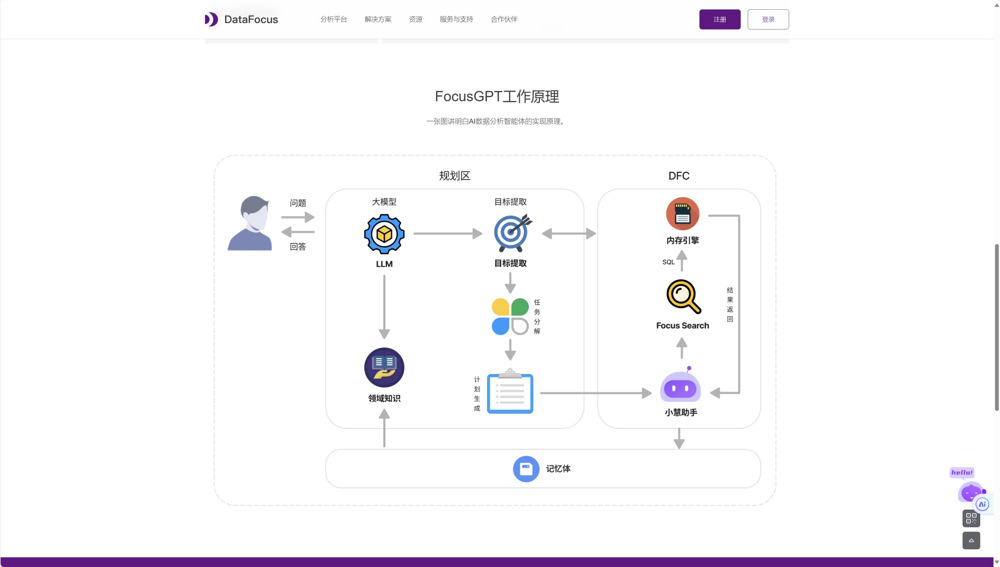

**导语**

在数据驱动的时代，企业如何高效利用数据来指导决策、规划战略和塑造企业文化，已成为决定企业成败的关键。ChatBI技术的出现，为企业提供了一种全新的数据分析与决策支持工具。它不仅能快速响应查询，提供深入的数据洞察，还能促进企业内部的数据共享与协作。接下来，我们将深入探讨ChatBI技术如何具体影响企业的各个方面。

**一、ChatBI技术与决策支持**

在企业管理中，快速、准确地获取关键业务信息对决策至关重要。ChatBI技术通过自然语言处理与机器学习算法，允许用户以会话的方式直接询问数据，从而迅速获取所需信息。

**实例**：假设一家电商公司的市场部门想要了解近期某款产品的销售额。通过ChatBI技术，他们只需在界面上输入“某产品最近一个月的销售额是多少？”即可立即得到答案，而无需手动筛选和计算数据。

**二、ChatBI技术与战略规划**

战略规划需要基于全面的数据分析和市场洞察。ChatBI技术能够整合多种数据源，提供全面的市场分析和预测，帮助企业制定更为科学、精准的战略规划。

**实例**：一家连锁餐饮企业在制定扩张计划时，可以利用ChatBI技术来分析各个区域的消费者行为、市场需求和竞争态势。通过输入“哪些地区的市场需求增长最快？”或“哪些区域的竞争最为激烈？”等问题，企业可以更有针对性地选择扩张地点和制定市场策略。

**三、ChatBI技术与企业文化**

ChatBI技术的普及和应用也在潜移默化中改变着企业文化。它促进了数据的民主化，使得每个员工都能轻松获取和分析数据，从而更加积极地参与到企业的决策和创新过程中。

**实例**：在一家制造企业中，生产线上的工人可以通过ChatBI技术实时查询生产数据和效率指标。这不仅让他们对自己的工作表现有更直观的了解，还能激发他们提出改进生产流程的建议。这种全员参与的数据文化，有助于提升企业的整体运营效率和创新力。

**四、ChatBI工具推荐——DataFocus**

在众多ChatBI工具中，DataFocus凭借其强大的功能和易用性脱颖而出。它支持一站式会话式BI分析，能够智能理解用户的查询意图，并提供丰富的数据可视化选项。无论是数据分析初学者还是专业人士，都能通过DataFocus轻松挖掘数据价值，助力企业做出更明智的决策。

**总结**

ChatBI技术以其独特的会话式交互和智能分析能力，正在深刻改变企业数据分析与决策的方式。它通过提供快速、准确的数据支持，帮助企业做出更明智的决策、制定更科学的战略规划，并塑造一种更加开放和创新的企业文化。随着技术的不断进步和应用场景的拓展，我们有理由相信，ChatBI技术将在未来为企业的高效管理和创新发展注入更多的活力和动力。
