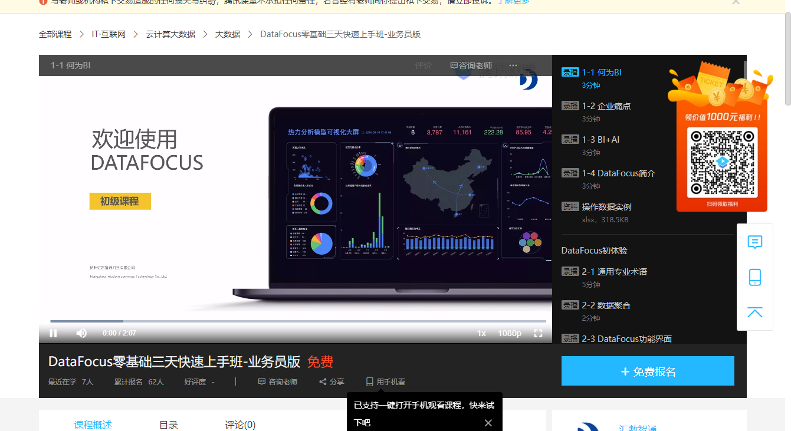

随着数据时代的到来，以往的广泛管理已经无法适应当前形式，精细化管理应运而生，尤其是C终端驱动的运营模式，每一个细节都离不开数据的支持，互惠金特别是各大银行和互联网金融巨头也纷纷抢占用户数据市场;

（下列看板、大屏均使用DataFocus数据分析工具制作）

一、搭建数据指标体系

首先，我们必须建立一个相对完整的数据索引系统。事实上，构建数据索引系统是为了理清我们的分析思路。许多人在进行数据分析时通常不知道从哪里开始。分析的内容和指标也会分散，因此人们会质疑分析结果是否正确;因此，建立一个完整的数据操作指标体系是非常必要的，它可以帮助我们理解思路，确保数据分析结构和数据分析维度的完整性。后续数据分析的性别和方向;

二、如何设计数据指标体系

指标是连接问题和数据之间的联系。只有选择正确的指标才能充分反映问题。一个好的指标是可量化的，易于观察。那么如何构建数据指标系统呢？我们可以使用一些营销管理模型来设计数据指标系统，如5W2H分析，4P分析理论，用户生命周期，逻辑树分析等。

当然，相应的分析模型必须与实际的商业模式和分析目的相结合。没有业务逻辑的数据分析不会产生任何价值;例如，共同黄金行业中的数据指标系统可以基于用户生命周期。建立

数据索引系统设计完成后，可以根据用户的不同场景和不同情况设计数据采集方案，实际上是设计业务驱动指标，推动数据采集过程的过程;

三、数据驱动运营增长

获取用户数据后，我们如何应用数据来生成数据？我们主要通过以下三个方面来描述它;

1、用数据优化运营策略

在收集用户行为数据后，我们可以知道用户在操作活动中浏览注册和下载卡投资的转换率，每个产品页面浏览的长度，观看次数，第一次投资的数量，投资金额等;数据将与业务场景相结合，进行摘要和比较分析是有意义的。否则，它只是一个数字;

例如，我们最常见的漏斗分析方法，当我们发现用户的投资转化率为30％时，所以转化率似乎相当高，但如果我们与其他同类产品相比，不同的用户使用相同的链接进行比较我们发现其他类似产品或其他用户群的转化率为40％，我们知道此链接中仍有很多优化空间;

2、利用数据验证运营策略

在互联网产品的运作中，我们经常会遇到多种产品设计和操作选择。即使界面按钮颜色的颜色不同也会引起争议，尽管与整个操作计划相比，这只是一个细节问题。但对于C端用户而言，通常是确定一切的细节。在这个信息泛滥的时代，人们经常寻求的是你是否能够在第一时刻进入用户的心中;那么我们可以在所有条件下进行A/B测试在同样的前提下，只有一个变量不同，用数据告诉我们哪种方案是可行的，让数据验证正确的操作策略，降低试验成本和错误;当然，在进行A/B测试时，最好是并且数据密度不应该太低，并且应该有足够的时间进行测试，否则获得统计结果会更加困难;

3、利用数据指导运营策略

数据和数据之间存在相关性。如果你不知道，那只是你没有找到他们之间的任何关系。最经典的数据分析案例是沃尔玛啤酒和尿布。在这种情况下，我相信每个人。我听说当业务目标与各种行为，肖像等相关时，我们可以使用数据挖掘方法对数据进行建模，以预测用户的下一个行为，从而提出可操作的解决方案。

例如，针对新用户流失的严重问题，我们可以采用聚类算法建立用户流失预测模型，并通过数据描述丢失用户的图像信息。什么是属性特征，行为特征和流失的时期，以便我们可以更准确。抓住具有潜在潜在损失的用户;

从上面我们可以看出，损失前用户的行为倾向是：在不久的将来没有投资行为，有用户正在投资黄金但想要提取现金，那么对于这些用户，我们必须采取一些保留激活策略;

最后，数据分析可以为我们提供有效的信息来指导营销决策，但不要迷信数据，并以不同的方式思考，以便数据可以用于其真正的价值。
