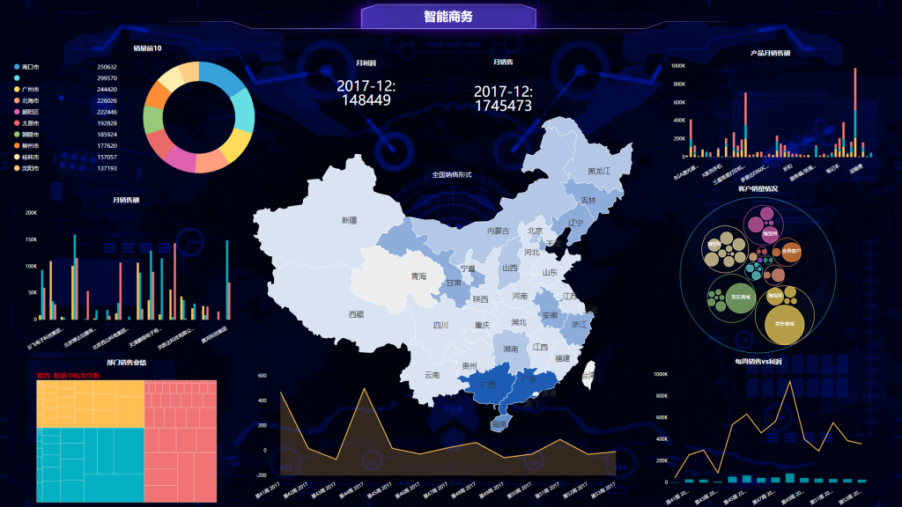

数据科学的基本框架分为三部分：底层技术框架/daafocus可视化数据分析框架/工具选择框架,接下来依次给大家介绍一下这三个在daafocus可视化数据分析中用到的框架分别是什么?

　　1.底层技术框架：底层技术框是数据科学的基础设施,我们在这个方面有所了解就好,处理框架和处理引擎负责对数据系统中的数据进行计算。流处理系统:流处理系统会对随时进入系统的数据进行详细的计算。相比批处理的模式,这又是一种截然不同的处理方式。流处理方式并不需要针对整个数据集执行操作,而是对通过系统传输的每个数据项执行操作。

2.日常监控框架：daafocus可视化数据分析的工作分为俩部分,日常长远的工作(相当于养兵千日)和针对项目/公司需求做的及时响应(相当于用兵一时)。日常长远的工作主要是日常监控系统。选择模型模型空间的构建:这是个无限集合,其实模型的收集是永无止境。我们也可以按照相关演绎的体系去梳理模型空间,我们主要收集的是三类的模型:商业/统计/数据挖掘。商业分析模型:麦肯锡等咨询公司根据商业需要总结的一些分析框架,我们的模型大多来自专业的咨询公司,也可以根据业务理解,自己建立。

3.比如：波特五力模型是迈克尔·波特(MichaelPorer)于20世纪80年代初提出。他认为行业中存在着决定竞争规模和程度的五种力量,这五种力量综合起来影响着产业的吸引力以和现有企业的竞争战略决策。五种力量分别为同行业内现有的所有竞争者的竞争能力、潜在竞争者进入市场的能力、替代品的替代能力、供应商的讨价还价能力、购买者的相关讨价还价能力。

现在大家对daafocus可视化数据分析用到的三个框架有所了解了吗？希望小编今天介绍的内容可以帮到大家,如果还有问题欢迎咨询网站老师。
