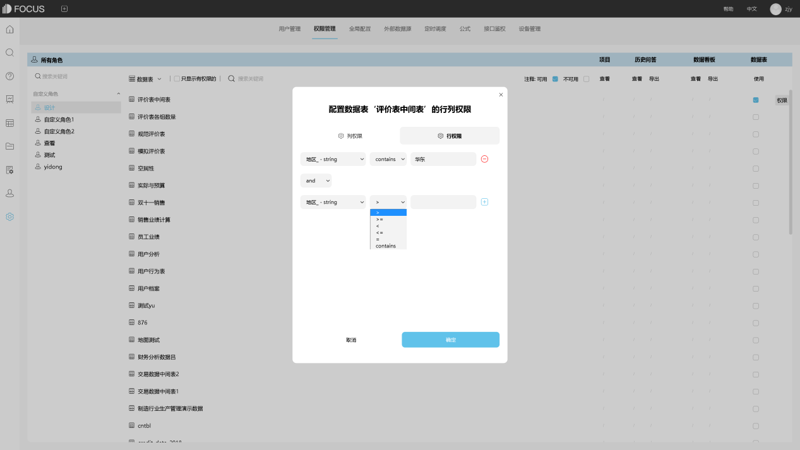

## DataFocus——数据安全与权限

在将Excel数据表导入到DataFocus系统中并进行使用后，数据的安全性是大多数人关心的问题。为避免数据遭到破坏，导入到系统的Excel表中原数据是不支持随意更改的。数据源表以及使用该表制作的中间表、历史问答、数据看板，或者使用这些资源创建的项目，都可以进行权限设置。

## 一、权限管理

DataFocus系统中的权限是依附于角色的，角色包括系统角色和自定义角色两大类。自定义角色是用户/部门和资源之间的“桥梁”。在系统管理模块中的权限管理界面，通过自定义的角色，将某部分资源权限配置给某些用户/部门。

# 二、资源管理

系统中的资源包括数据表、历史问答、数据看板和项目四大类，资源管理员可以为角色配置资源权限。

## 2.1 为角色配置资源

进入系统管理模块的“权限管理”页面，在左侧的自定义角色列表中选择一个角色（如果系统中还未自定义角色，可单击“新增角色”按钮，跳转到“用户管理-角色”界面新增自定义角色），页面右侧会显示所有资源列表，包括数据表、历史问答、数据看板和项目。

图表 2. 1 权限配置

## 2.2 数据表的行列权限配置

选择角色并勾选要配置的数据表所对应的“使用”单选框后，可以再单击右侧的“权限”按钮，在弹窗中对数据表的权限配置精确至行列权限。

弹窗中，选择列权限，勾选用户有权限查看的列；选择行权限，配置行筛选条件，可单击行右侧的加号添加多行筛选条件。

图表 2. 2 数据表行权限

图表 2. 3 数据表行权限

## 2.3 历史问答的权限配置

历史问答，即固化到系统中的图表。在权限设置界面，选择角色以及要配置的历史问答行，可配置“查看”和“导出”权限。

图表 2. 4 历史问答权限

## 2.4 项目的权限配置

“项目”类似于电脑桌面的文件夹，在资源管理界面可以将所有的数据看板、历史问答、数据表进行分类整理为“项目”，方便以后能快速找到和该项目有关的所有资源。

在权限配置界面，选择角色以及要配置的项目，为项目内资源配置权限。可在项目总行上配置数据表、历史问答和数据看板的权限，会自动同步到此项目内对应资源行的配置上。也可以单独为项目内某个资源配置权限。

图表 2. 5 项目权限

在DataFocus系统中对Excel数据表以及相关资源的权限设置，就简单介绍到这里，更加详细的权限管理内容，大家可以参考DataFocus官网的产品手册或学习视频哦~
