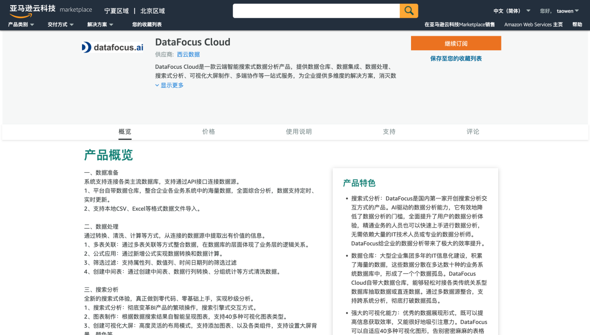
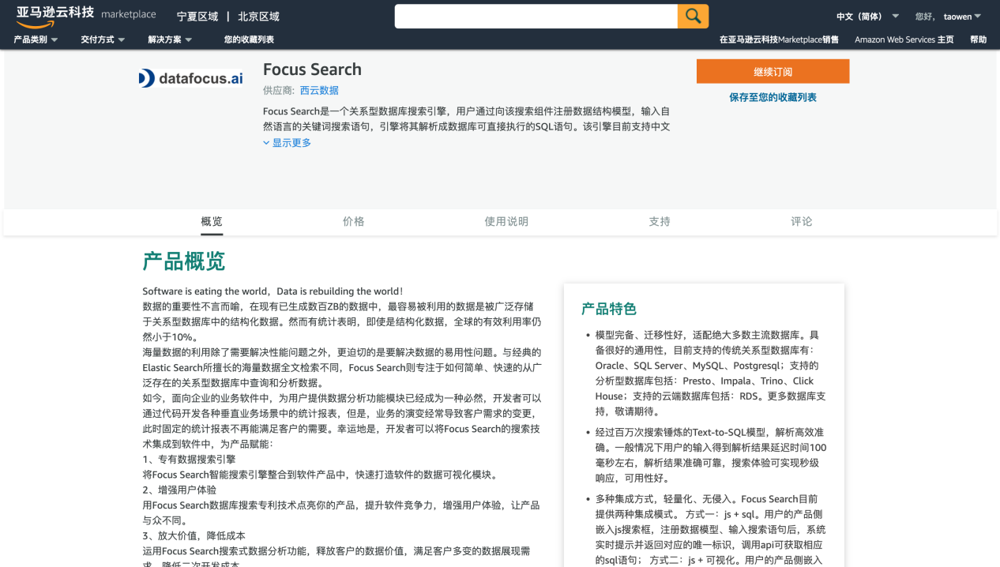

近年来，以移动互联网、云计算、大数据、人工智能等为代表的新一代数字化技术正在改变人们的生产和生活方式。新技术一边催生了新的商业模式，一边也对企业的经营发起挑战，“数字化转型”逐渐成为众多企业寻求业务发展和运营优化的战略选择。

然而企业布局数字化转型的过程并非容易，一部分企业将数字化转型想象得过于复杂化而迟迟不愿行动和尝试，而另一部分又只注重成果，希望数字化转型一站式解决企业所有问题，却又把前期自我洞察、产品选型、实施规划等环节简单化。


围绕企业数字化转型核心本质“降本、增收、提效”以及转型过程中出现的难点，DataFocus团队全新打造的产品DataFocus Cloud、Focus search现已正式上架亚马逊云科技，加速领跑智能搜索式BI产品赛道，彻底变革数据生产力，助力企业成功实现数字化转型。

```
亚马逊入口地址：https://awsmarketplace.amazonaws.cn/marketplace/pp/prodview-dwwldfehhaxdk?qid=1652411054247&sr=0-1&ref_=srh_res_product_title
```


**DataFocus Cloud:追求低门槛数字化转型的企业必选**

如今越来越多的中小企业、地方企业和传统企业都开始参与到数字化转型中去，但先前以互联网企业为代表的全面转型路径或许对他们而言并不适用。企业更合适的是，可以采取“总规划、局部先行”的策略，从某些环节低成本地开始，充分建立内部信心，再逐步推广至全企业，提升转型成功率。

正在这样的大背景下，BI云产品中的性价比之王DataFocus Cloud应运而生。

DataFocus Cloud是一款云端智能搜索式数据分析产品，提供数据仓库、数据集成、数据处理、搜索式分析、可视化大屏制作、多端协作等一站式服务，为企业提供多维度的解决方案，消灭数据孤岛、数据分析速度慢、业务人员上手繁琐等问题。



企业在数字化转型过程中，需要提升自己的自主性，不能完全依靠第三方厂商。而DataFocus Cloud的无代码搜索式分析模式则提供了相应的解决方案，业务人员无需学习代码知识，仅通过搜索即可搭建企业自己的数字系统，而且在之后的过程中随时可以根据自身变化进行更新。

同时对于中小型企业和初创企业而言，DataFocus Cloud也将成为他们的福音，若企业直接采用云部署、成本低、快捷易用的SaaS版，几十人的团队一年仅需几千的价格和较短的部署时间，这将成为开启低门槛数字化的明智之选。

上架亚马逊云市场的DataFocus Cloud价格更创历史新低。若按计算使用量收费，则每小时仅需4.5元；若按容量维护费用收费，则每天仅需12元。企业可根据实际情况选择合适的付费模式，注册登录订阅后即可上手使用。

```
亚马逊入口地址：https://awsmarketplace.amazonaws.cn/marketplace/pp/prodview-dwwldfehhaxdk?qid=1652411054247&sr=0-1&ref_=srh_res_product_title
```

**Focus Search:让数据价值更易挖掘**

数字化转型过程中，数据的重要性不言而喻，在现有已生成数百ZB的数据中，最容易被利用的数据是被广泛存储于关系型数据库中的结构化数据。然而有统计表明，即使是结构化数据，全球的有效利用率仍然小于10%。企业对于海量数据的利用除了需要解决性能问题外，更迫切的是需要解决数据易用性问题。

Focus Search是一个关系型数据库搜索引擎，用户通过向该搜索组件注册数据结构模型，输入自然语言的关键词搜索语句，引擎将其解析成数据库可直接执行的SQL语句。

经过数千万次搜索锤炼的 Text-to-SQL 解析模型，完备性、迁移性好，适配MySQL、SQLServer、Oracle等绝大多数主流的关系型数据库，解析结果准确可靠，搜索解析毫秒级响应。



该产品在亚马逊云市场的收费，将按照您使用的单位数量决定，每个解析请求仅需0.05元。同样，注册登录订阅后即可上手使用。

Focus Search助力企业从以 IT 为中心的数据作业模式，向以业务为中心的作业模式转变，帮助企业更易挖掘数据价值。

作为国内类自然语言体系大数据平台的首创者，DataFocus围绕深耕用户体验的宗旨，历经多年精心打磨产品，于2021年陆续推出DataFocus Cloud和Focus Search，不断巩固基础，优化迭代产品功能，带给用户更好的全新体验。

相信在不远的未来，DataFocus团队将取得更出彩的进步，打造出更优秀的智能BI产品，引领国际国内BI市场迸发更多活力与生命力。
