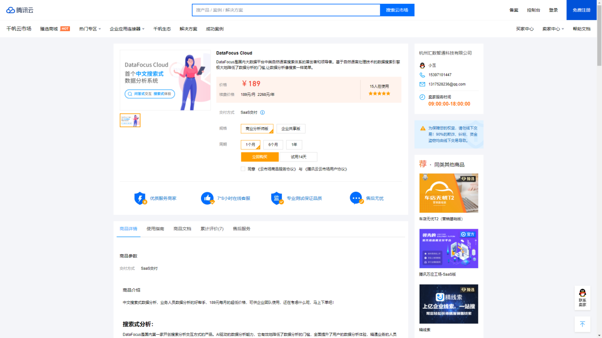

**DataFocus Cloud上线腾讯云市场，助力企业打造一站式云端数据分析平台**

近期，DataFocus Cloud成功上线“腾讯云千帆云市场· 企业应用”类目，携手腾讯云，助力企业打造一站式云端搜索式数据分析平台！

 **基于搜索技术的产品矩阵** 

作为国内大数据平台中类自然语言搜索体系的首创者和领导者，DataFocus始终以客户需求为中心，潜心多年打磨自然语言搜索引擎，让不懂代码的业务精英都能快速掌握与使用，构建业务为中心的数据驱动流程，实现企业人人都是数据分析师！

类自然语言搜索引擎始终是DataFocus团队打磨的核心，因为DataFocus相信，要想真正提升企业数据分析效率，最大限度发挥数据价值，光靠硬件革新还不够，还需要变革低效的数据分析交互方式。而搜索就是学习成本最低、覆盖人群最广、学习难度最小的交互方式。为此，DataFocus将搜索技术运用到企业刚需的数据分析系列产品中，打造基于搜索技术的产品矩阵。

**核心产品一：DataFocus Cloud**

DataFocus Cloud是新一代BI产品，提供从数据接入、预处理，到分析、可视化和数据输出全栈能力。在数据分析模块中，DataFocus Cloud就发挥出了强大的搜索技术。

传统的拖拽式操作以绘制图表为目标，先选定需要绘制的图表，比如柱状图、饼状图，然后通过拖拽X轴和Y轴配置数据，调整布局，得到最终的图表呈现。但这种作业模式是带着报表需求找答案。而DataFocus Cloud则完全不同，它可以让你带着问题出发，灵活地通过搜索找到答案。

举个例子，你想知道各个产品类别的销售额月增长率。传统的拖拽式操作需要你创建计算公式、绘制图表，而DataFocus Cloud却可以让你向它提问：输入产品类别 销售额 月增长率，它会在几秒钟内给你可视化的结果。这就是搜索的强大能力！

**核心产品二：Focus Search**

Focus Search是一个关系型数据库搜索引擎，其主要解决如何高效地从关系型数据库中快速查询和分析数据。用户可以通过向Focus Search组件注册数据结构模型，输入类自然语言的关键词搜索语句，引擎将自动解析成数据库可直接执行的SQL语句，例如直接搜索同环比、vs、分类排名等复杂的计算。

Focus Search适配市场上绝大多数主流的关系型数据库，如MySQL、SQLServer、Oracle、PGSQL、Impala、ClickHouse、Presto、Trino等，其搜索解析能力经过数千万次的锤炼，解析结果精准，搜索秒级响应。其与第三方集成搜索功能，可以通过多种集成模式：目前支持 JS+SDK 以及 JS+SQL ，只需少量代码便可实现完整的搜索业务逻辑集成。

Focus Search助力企业实现真正的数字化转型，同时极大地释放了企业的数据价值，满足企业多变的数据展现需求，也减少了IT人员大量无意义重复的工作，大大降低二次开发成本。

**像京东上购买图书一样简单**

如何购买DataFocus Cloud呢？下面一起来看看如何开启DataFocus Cloud吧！

进入“腾讯云千帆云市场”，搜索“DataFocus”，点击进入“DataFocus Cloud”应用。

进入DataFocus Cloud购买界面，选择要购买的规格版本和周期，立即下单支付，没有任何多余步骤，简单快速！

购买后，进入控制台，点击已购产品—“管理”，进入具体应用，点击免登地址后的链接，即可进入DataFocus Cloud 产品界面，正式开启搜索分析之旅！

 

**390元起/月，企业一站式数据分析平台的性价比之选** 

DataFocus Cloud非常适合中小企业或集团业务部门使用，基于创新的自然语言搜索技术，开箱即用的大数据分析能力，助力人人成为数据分析师。基于云平台SaaS交付的方式，最低390元/月起，您就可快速体验到一站式数据分析服务。

**马上试试**

点击以下链接进入**“腾讯云市场 · DataFocus Cloud”**页面，快来开启DataFocus Cloud吧！

****

[https://market.cloud.tencent.com/products/33123](https://market.cloud.tencent.com/products/33123)

**常见问题：**

1. **腾讯云市场的DataFocus Cloud与DataFocus官网注册使用的空间有何区别？**

**产品功能没有任何差别。千帆市场是一个面向腾讯云用户的入口，有了这个入口，腾讯云的用户就可以更方便的开启和使用DFC。**

1. **腾讯云千帆市场的Focus Search注册后只能手动开启吗？**

**对，目前腾讯云千帆市场还不支持按量计费的SaaS应用，因此必须通过管理员手动开启的方式启用Focus Search服务。**
