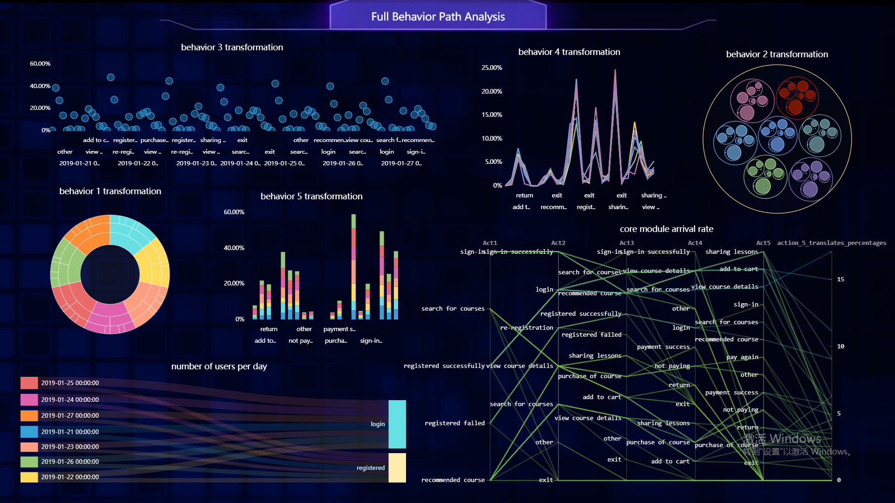

《美丽的证据》的作者Edward R. Tufte曾说过，“设计的基本考验是有助于理解内容，而不是它的时尚性”。数据可视化就是这样一种将相对复杂、抽象的数据通过图表的方式，以人们更易理解的形式展示出来的设计方式。

优秀的数据可视化图表不仅仅是简单地罗列、总结数据。应该通过使用图表，清晰有效地传达数据信息。数据可视化真正的价值是设计出可以被读者轻松理解的数据展示。

然而，说起来容易做起来难。要想做出易于理解、颜值好看、数据清晰的可视化图表，还真是有不少坑。

**痛点1 选图表全凭感觉**

假设你手中有一份XX公司的产品销售额统计表，数据如下所示。你想要对产品的销售情况做一个分析，你会怎么做？

给大家简单举几个分析例子：

如果我们对各产品对总销售额的贡献占比感兴趣，那么你就是在制作一个构成的对比关系图表，适合选择饼图、环形图、百分比堆积图、矩形图等。 如果我们想分析产品A的销售额随时间变化的情况，以便分析是否存在季节效应等，适合选择折线图、面积图、瀑布图等。

你有这样的分析思路吗？还是在选择的时候要么全凭感觉，点到哪个是哪个，又或者一成不变，总是列表默认第一个。

**痛点2  作图费时费力，总是不满意**

图表的颜色、样式都会影响到读者对图表的观感，当然需要花时间去美化。然而现实是两眼直勾勾盯着屏幕，10分钟过去了，30分钟过去了，1个小时就这么过去了，Excel中能点的地方都点到了，一顿操作猛如虎，做出来的图表依然是个丑。

作图费时费力，但结果不能令人满意，投入的时间都是徒劳。

而想要做出好图表离不开良好的审美，还需要熟练掌握操作软件中各种繁琐的操作。

如果想要做出桑基图、弦图这样的高级图表，更需要花费大量的时间研究高级图表的制作方法，着实令人苦恼。

一如既往地，DataFocus想要通过自身的技术优势解决这些痛点，让每个人轻松上手就能做出可视化图表。一起来解开高效数据可视化的秘密吧~

**1 系统智能匹配图表类型，解决不会选图、作图问题**

DataFocus不仅有高效的搜索式分析，还可以根据搜索问题，系统**智能匹配最适合的图表进行呈现。**系统可以自适应多达40种可视化图表类型，**包括桑基图、弦图、极坐标柱状图、箱型图等高级图表类型**。在此基础上，提供了大量图形通用配置功能，只需要根据提示简单设置，就可以获取个性化、美观的图表，一次性解决不会选图、制作高级图表的问题。

**2 作图省时90%，点击按钮就完成**

DataFocus中的图表属性设置，跟随着图表类型而变动。设置一下开关按钮，或者选择想要的主题配色就可以迅速切换，会实时在右侧的显示区进行效果呈现，作图速度立即提升。

**3 从图表到数据看板，全方位的可视化方案**

DataFocus的数据看板（数字化大屏），有网格布局和自由布局两种形式。网格布局是默认布局形式，用户可以通过向看板中钉入多个图表的方式，快速开发出专题数据报告。 如果想开发个性化的数据可视化大屏，则可以通过自由布局的方式，通过拖拽图表大小和位置 ，改变图表或大屏的组件配置参数，如界面背景、组件背景、标题栏背景、组件文字、标题文字等美化设计，自由挥洒您的视觉创意。让可视化大屏的可读性和阅读感更强。

**注：文末福利来了！DataFocus Cloud正在公测中，邀请产品体验官免费试用！**

**如果您是新用户，您可以点击【阅读原文】，或直接访问官网datafocus.ai的试用界面。微信扫码注册或填写注册信息后联系客服可获取您的专属代金券。**

**已经注册过的小伙伴，您可以在公众号菜单栏“关于我们”中点击“申请试用”，我们将会给您推送客服二维码，联系客服后我们也将送出您的专属代金券！**

