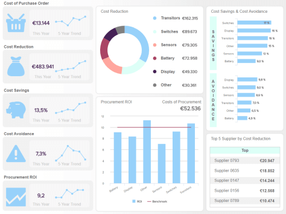

### 什么是可视化分析工具，为什么要使用它们？

可视化分析工具使用现代技术从多个数据源中提取数据，这些技术能够以可视化、交互式和图形方式探索信息。此类软件有助于轻松识别关键趋势并提取可操作的业务洞察力。

当今的企业必须管理和处理大量数据集和信息。收集、监控、评估和分析数据的技术和程序已成为大型企业和小型企业的必需品。在正确的时间做出正确的决定，实现长期目标，建立能够确保增长的绩效管理实践是可持续成功的重要先决条件。这就是可视化分析工具展示其全部能力的地方。

但是这些工具在实践中是如何工作的呢？专业的可视化分析工具提供以下关键功能和优势：

**数据的交互式视图：**通过交互式和可视化展示，揭示海量、模棱两可且经常相互矛盾的数据背后的模式，提供额外的分析结果和洞察力，使业务用户能够自己成为分析师。有效的理解、推理和决策更加精确，因为这些工具使人们能够与可视化交互并快速发现意想不到的事情，而无需深厚的 IT 知识。

**解锁和访问大数据集：**可视化分析软件的精髓在于复杂和大型数据集的可视化。在清晰、定义明确和图形化的[业务仪表板](https://www.datafocus.ai/infos/dashboard-examples-and-templates)中显示数据，确保快速解释和易于理解。简明扼要地传达事实和数据，提供了人眼以更快的速度处理的视觉环境，从而能够快速消费信息。

**数据探索：**通过使用专业工具，分析实时数据的效率更高。将各种[数据连接器](https://www.datafocus.ai/infos/data-connectors)混合到一个集中的访问点可确保生成洞察并轻松访问所有业务信息。季度更新不会对公司的绩效提供即时反馈，因此无法提供任何给定时间点所需的见解。另一方面，对数据的持续探索使用户能够立即识别需要进一步分析的变量。

**可访问性和协作：**使数据可访问是企业在处理信息时面临的最大挑战之一。借助用户友好且直观的强大可视化数据分析工具，您组织中的每个人都将有权处理数据。这不仅会改善他们执行个人任务的方式，还会大大加强部门间的协作，从而实施数据驱动的文化，使您的企业在竞争中脱颖而出。

**在更短的时间内获得更多数据：**电子表格中的数千行无法满足可视化分析工具的响应能力。这些工具执行分析的速度和准确性是传统分析形式无法比拟的。可以在更短的时间内处理更多数据，这使得这些工具成为商业世界中无与伦比的力量。

**升级报告：**创建可视化报告不再需要数小时或数天的时间来生成。由于可视化分析软件提供了报告实践的自动化，经理和员工可以专注于真正重要的事情：手头的数据。借助功能强大的仪表板和自动化报告，每个业务用户都可以查看数据之外的内容，并生成可操作的实时见解。

**多种可视化选项：**传统的数据分析方法是静态的，并且充满了大多数接收者难以理解的数字。现代[在线数据可视化工具](https://www.datafocus.ai/infos/data-visualization-tools)提供了广泛的交互式图形和图表，因此您可以可视化您最重要的关键绩效指标并以最有效的方式提取可操作的见解。能够快速了解​​数据背后的内容是业务成功的基础，并且拥有多种图表选项，例如仪表图、面积图、地图、折线图、柱形图或条形图，是实现这一目标的方法。

**定制仪表板：**现代业务仪表板的视觉特性使其在各种规模的公司中都非常成功。为了更进一步地利用这些可视化数据分析工具的力量，您的仪表板可以根据您品牌的颜色和徽标进行定制。通过这种方式，您可以使您的报告看起来更专业，并将它们用作与客户或投资者会面的视觉支持。

密码

### 利用可视化分析软件将原始数据转化为可行的见解

今天收集和存储的数据量从未如此庞大。文件堆积如山，以至于浏览文件已成为公司每位员工的日常任务。在当今的业务环境中，经理需要速度和敏捷性，C 级主管需要触手可及所有业务信息，员工需要运营支持以高效完成任务。[有机会在令人惊叹的交互式仪表板](https://www.datafocus.ai/infos/interactive-dashboard-features)中可视化所有数据，确保了企业的成长。可视化数据分析不仅仅是实现图表和图形的过程，而是使用智能软件使业务用户能够产生见解并减少处理业务查询和任务所需的时间。因此，它创建了一个连贯的业务环境，超越了传统数据管理方式提供的静态分析和报告实践。

为什么是视觉？这很简单。科学证明，人类处理视觉数据的速度比书面信息快得多，尤其是在今天，速度至关重要。通过拥有可以加速数据收集、存储、共享、监控和分析过程的软件，尤其是通过可视化方式，信息变得更易于访问和整理。

像 DataFocus 这样的现代可视化数据分析工具可帮助个人业务用户将大量数据转化为有价值的见解，从而支持整个组织的重要运营流程和高效决策。这种可视化分析软件在视觉上支持数据处理，通过提供交互式图表、智能数据警报和易于使用的模板来提高工作流程速度。

专注于大局，同时您可以使用 DataFocus 的可视化分析软件：

**将**原始数据转化为交互式图表和图形，以支持和增强决策和规划流程。只需单击几下即可连接您的数据源，您就可以开始探索您的数据并创建利用交互式功能的[在线仪表板](https://www.datafocus.ai/infos/online-dashboard)，这使您能够在各种过滤器和众多仪表板的帮助下深入了解您需要的每个数据故事选项。

**监控**数据以发现需要进一步审查或更改运营流程、策略和程序的趋势。借助人工智能等现代技术，只要发生业务异常，就会向您发出警报，无需手动完成监控过程。这使您能够节省宝贵的时间并在出现任何严重损害之前及时调整策略。

**挖掘**数据以支持快速决策，即使在时间压力下也不会因 IT 资源负载而延迟数据可视化。通过简单地利用可视化分析工具的全部功能即可发现模式，并将您的洞察力提升到一个新的水平。减轻您的 IT 部门的负担，使员工能够通过强大的可视化自行探索趋势，这将使他们能够快速对数据进行分类并采取行动。

**使用**报告服务和我们的可视化分析功能，根据您的受众增强和帮助沟通。无论您是需要发送电子邮件报告、通过公共 URL 共享仪表板还是分配查看者访问权限，这些选择都使您能够通过最先进的可视化和现代报告实践来提升与同事或利益相关者的协作。

[通过使用我们在线数据分析工具中的可视化分析功能来](https://www.datafocus.ai/infos/data-analysis-tools)**加强**决策，专注于数据的重要指标并提取可能隐藏在大型数字数据集中的关键见解。您需要做出快速的业务决策，而适当的工具将使您能够做到这一点，而无需在大量文件和电子表格中进行无休止的搜索。

从我们的[仪表板工具中](https://www.datafocus.ai/infos/online-dashboard)**选择**各种模板，以创建令人惊叹的数据可视化，可从任何具有互联网连接的设备访问。无论您是在旅途中需要通过手机快速查看仪表板，还是想在电视屏幕上展示您的仪表板，您都可以选择。由于 SaaS 软件的云特性，您的可视数据将始终可供您使用，只需登录您的帐户，即可轻松享受所有分析。

使用强大的人工智能功能**预测结果，使用户能够识别趋势并克服业务障碍。**在预测分析、神经网络、模式识别和机器学习的帮助下，可视化数据分析工具已经发展成为推动实现效率最大化、消除手动任务并最终产生利润的商业解决方案的最佳手段之一。有了这种洞察力，您可以提前准备好您的策略和资源。

**连接**来自各种来源和数据库的数据，包括平面文件、营销分析、社交媒体、CRM/ERP、帮助台等等。[借助现代BI 报告工具，](https://www.datafocus.ai/infos/bi-reporting)这一切从未如此简单。使用我们的专业数据连接器，您可以非常简单地管理数据源、合并、更新或编辑它们。如果您需要连接自定义数据源，您可以快速完成，无需任何额外麻烦。敏捷的力量使可视化分析及其工具易于使用。

**过滤**您的数据以获得更有效的分析过程。可视化数据分析软件为您提供多种过滤选项，使您能够在一个屏幕上执行整个分析过程。如果您想查看地理信息或特定时间段的表现，只需单击几下即可过滤整个仪表板，让您完全控制数据。

### 多合一的可视化数据分析软件

只需单击按钮即可提供强大的分析功能，DataFocus 富有洞察力的[仪表板创建](https://www.datafocus.ai/infos/dashboard-creator)器完全支持高级和复杂的决策和分析过程。

使用 DataFocus，您无需任何 SQL 知识即可体验可视化数据分析软件的强大功能。与您之前可能尝试过的其他[在线 BI](https://www.datafocus.ai/infos/online-bi-tools)工具相比，DataFocus使用可视化分析使数据分析变得前所未有的简单。用户友好的界面经过精心设计，通过采用易于使用的搜索方法来增强和实现图表和图形的高效创建。我们的可视化仪表板使您无需一行代码即可探索和分析数据——当您在界面上拖放指标时，DataFocus 会自动在后台构建 SQL 代码。

仪表板可以保存和共享，并在数据报告中以可视方式表示。结果是一种强大、专业且实用的方式来构建、分析和呈现 KPI，而无需依赖 IT 部门。因此，可以在需要时通过安全的在线访问来执行数据可视化，这有助于跨多个业务部门以及在从实习生到 PHD 的不同技术熟练程度的利益相关者之间使用数据和可视化数据分析。

无论您身在何处，无论何时发现自己需要的业务洞察力，都可以访问 DataFocus。它可以在固定或移动设备上查看，并通过单击按钮与任何其他位置的任何同事进行通信。无论您的团队多么紧密或分散，每个成员都可以享受自己对数据可视化的个人访问，使每个人都能够比使用大多数其他可视化分析工具更高效地执行他们的任务。

只需单击几下即可连接任何类型的数据源，并了解 DataFocus 的可视化数据分析工具如何彻底改变您的业务。立即试用我们的产品， 30 天免费试用。
