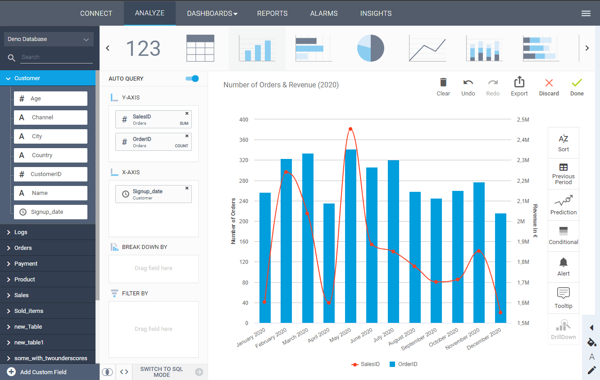
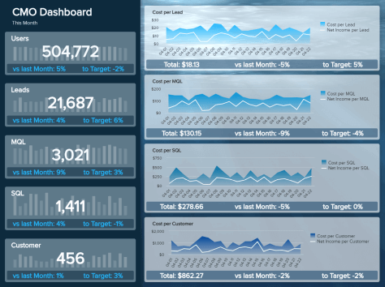

### 什么是云商业智能?

云 BI 是一个术语，用于描述第三方商业智能应用程序，这些应用程序可通过互联网提供给商业终端用户，并提供高级 BI 相关服务，例如智能 KPI 监控或动态交互式仪表板报告。

基于云的工具和服务的重要性呈指数级增长。未来几年，预计 90% 的组织将使用 SaaS 等云服务。这绝非巧合。考虑到潜在的、预算友好的选项，从单一 BI 工具访问完整的业务数据，其在线特性允许用户在移动设备中生成见解并从包括移动设备在内的任何设备访问数据，越来越多的公司正在转向这些解决方案，而不是传统的本地应用程序。我们将解释原因和方式。

**它们提供了竞争优势：**在当今竞争激烈的市场中，云商业智能是公司可以拥有的最大资产之一，但前提是合适的人能够有效地使用它进行决策。无论公司规模如何，企业每天都会产生大量信息，这些信息来自客户行为以及人力资源或财务等内部资源。在所有这些信息的背后，有一些有价值的见解，如果管理得当，可以促进业务增长和效率。云商业智能解决方案为企业提供实时数据，以实现有效和敏捷的分析流程。能够在易于共享和创建的交互式[BI 仪表板中可视化他们的数据](https://www.datafocus.ai/infos/bi-dashboard-best-practices)，将使公司比竞争对手更进一步。

**更少的 IT 参与：**在大多数组织中，只有经过培训的 IT 专家和数据库程序员才能处理传统的[BI 报告工具](https://www.datafocus.ai/infos/bi-reporting)，因此公司的商业智能方法通常不像它应该的那样有效或有益，使其处于竞争劣势。执行手动数据库查询并接收可操作的结果可能需要数小时甚至数天，尤其是当数据需要进行更深入的分析或必须从多个资源中收集时。使用传统的数据分析方法，报告是静态的，并且需要更长的时间才能完成，当它们完成时，数据可能不再有用。[在线 BI 工具](https://www.datafocus.ai/infos/online-bi-tools)使这一过程变得更容易，使用户能够提取可操作的见解并获得积极的业务成果，同时减轻 IT 部门手动创建报告的所有痛苦，让他们有时间处理其他相关问题和任务。

**敏捷决策：**企业和小型企业都转向基于云的数据源，例如 Amazon Web Services (AWS)、Salesforce、Zendesk、Dropbox 或 OneDrive，以提高业务战略和信息的敏捷性。但是，当业务用户必须从这些来源收集所需的所有信息并创建报告和分析时，这些任务所需的时间通常与获取快速信息的需求不相符。这就是云 BI 软件发挥作用的地方——使业务数据比以往任何时候都更容易访问，为市场上的所有数据连接器和数据源提供单一、集中的数据管理点，更不用说链接自定义源的可能性，从而创建可持续的业务运营，并在一个商业智能保护伞下提供所有数据。

**促进协作：**成功实施数据的基础之一是确保组织中的每个人都有权进行数据分析。由于现代基于云的商业智能工具的用户友好性，每个人只需单击几下即可创建自己的仪表板，并授予他们的同事和经理访问权限，以便他们可以一起工作。像这样，将实现协作环境，数据分析过程将不再局限于少数人。

分析与商业智能相关的信息的能力以及可访问工具总是必须掌握在最需要这些信息的人手中。一个专业的云 BI 工具不需要用户成为一名技术人员即可充分利用公司的数据库，并使每个人都可以随时执行数据分析。这是通过简单但功能强大的[业务仪表板](https://www.datafocus.ai/infos/dashboard-examples-and-templates)实现的，在仪表板中，数字变成了交互式的视觉效果，随时可以对组织或公司可能拥有的所有业务数据进行分析、报告和监控。

### 体验云 BI 工具的优势

**易用性：** Cloud BI 是关于在基于 Web 的软件应用程序中构建对各种业务 KPI 和其他重要公司信息的洞察力。云商业智能工具使参与业务流程的任何人都可以分析和可视化公司数据，并通过智能[仪表板报告](https://www.datafocus.ai/infos/dashboard-reporting)与利益相关者和其他感兴趣的人共享分析结果。借助现代 SaaS 软件，任何具有基本计算技能的人都可以处理业务报告、数据库分析和其他任务。

**数据集成：**此类智能在线软件借助智能[数据连接器](https://www.datafocus.ai/infos/data-connectors)集成各种数据，以结构化和可视化的方式反映您的数据库，让您更轻松地执行自己的数据分析。拖放式界面和直观的设计使用户能够深入了解他们的数据，使用我们全面的可视化功能，并生成有助于提高业务绩效和发现当前趋势的分析和结果。在高级业务分析方面，云 BI 使[SQL 报告](https://www.datafocus.ai/infos/sql-reporting)比以往任何时候都更易于访问，并且它不再需要依赖昂贵的内部或外部 IT 专家的技能。

**预算友好：**与传统的本地解决方案相比，这些工具提供的低入门成本创造了显着优势。来自 IT 部门的服务器、机器、硬件和资源显着减少，因为云商业智能软件提供基于订阅的选项，使成本可预测，同时可以额外支付附加功能。这种透明度使公司能够充分利用这些云 BI 工具，同时考虑注册免费试用和根据您的需求定制订阅的可用性。云商业智能解决方案的在线性质也使它们更实惠，因为在工具更新时不需要昂贵的安装或维护费用。

**数据分发：**不仅易于使用、集成来自各种来源的数据或提供预算友好的选项，而且还可以通过简单的链接共享、通过查看器访问或通过不同的文件选项导出来分发数据，从而实现远程数据访问和跨位置数据共享，只有一个要求：互联网连接。无需额外开发基础设施，因此有助于推动更快的 ROI（投资回报）​​。从任何设备和网络浏览器（包括移动应用程序）访问这些工具的能力使共享选项易于使用，即使在外出时间也可以使用。

**准确的信息：**在云 BI 软件中，信息的准确性提高了，因为可以随时保留公式、维护链接和重新检查数据。借助已发展成为全球企业使用的智能解决方案的在线[报告工具](https://www.datafocus.ai/infos/online-reporting)，信息不会丢失、被忽视或未被利用。这些工具提供的快速数据处理具有无法与传统报告和数据分析方法相比的精度，为降低运营和战略成本奠定了基础，同时增加了业务发展的机会。

**新的业务洞察力：**云业务分析旨在通过提供智能解决方案来利用数据的力量，让您的生活更轻松。连接所有最相关的来源并创建报告后，您无需担心手动更新数据，因为该工具将始终为您提供可用的最新信息。您需要做的就是从任何有互联网连接的地方访问您的报告，并使新的业务洞察触手可及。

**未来预测：**随着今天收集的大量数据，需要更多的分析来做出明智的商业决策，预测未来的战略和商业机会甚至会给最有经验的管理者带来困难。[通过使用智能数据警报](https://www.datafocus.ai/infos/business-intelligence-data-alerts)和机器学习等先进技术对场景进行建模，云商业智能工具使预测未来的可能性变得更加容易和具有成本效益。DataFocus 免费提供了一个高级预测分析工具，通过研究您的历史数据，该工具会发现模式和趋势，以便您可以预测未来性能和计划策略。
