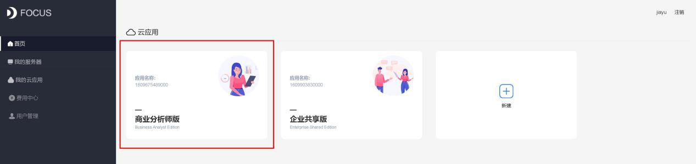
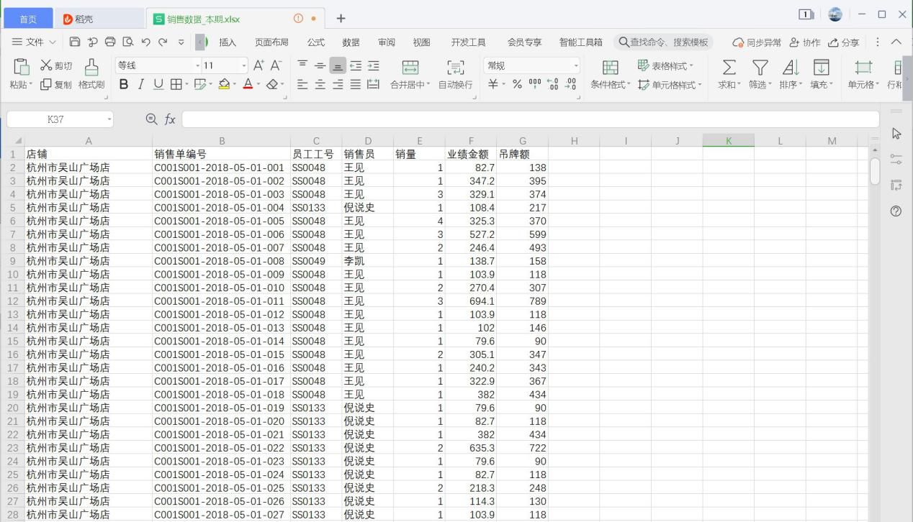
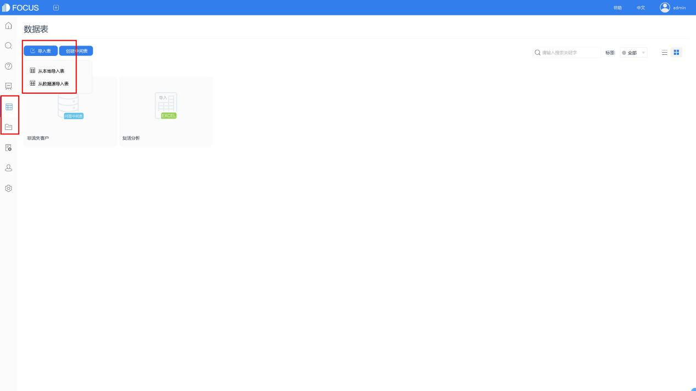
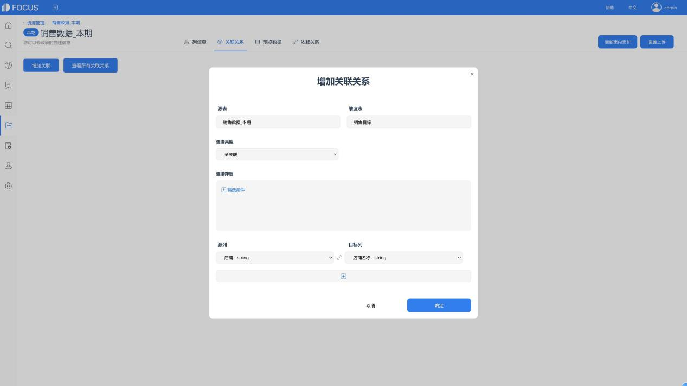
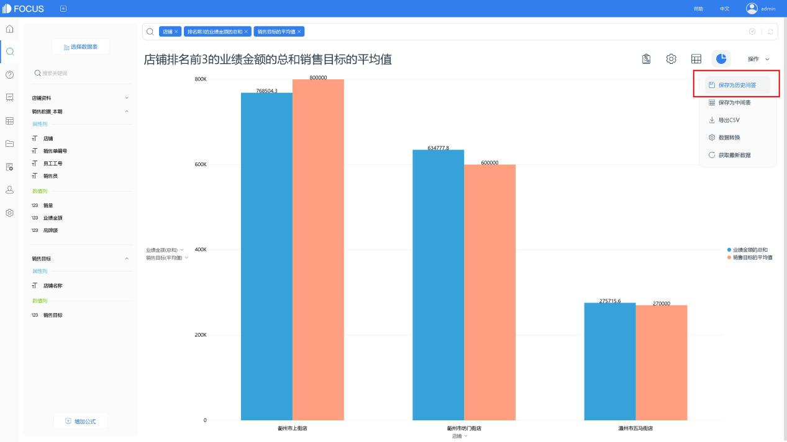
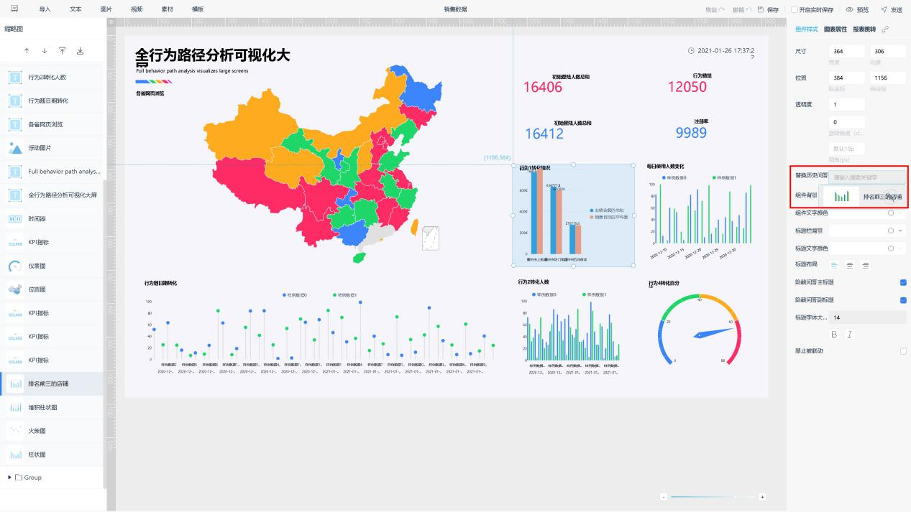
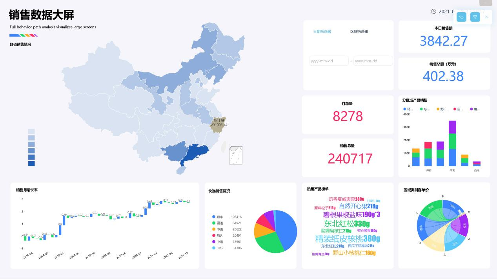

DataFocus是一款国际首家商用、且支持中英双文搜索的大数据分析产品，中国第一家搜索分析交互方式的商业智能BI工具。

2021年1月19日，DataFocus Cloud 正式上线。BI走进了云时代！只要有网络和客户端浏览器，即可实现数据分析。

今天，我们简单了解下新版DataFocus Cloud和它的应用。

## DataFocus Cloud版本及功能

DataFocus Cloud，采用AAAS（Analysis as a services）分析即服务的模式，主要包括四个版本：商业分析师版、企业共享版、企业专享版和全量版。

DataFocus可以快速连接多种数据源，进行数据处理与分析、生成图表以及制作可视化大屏；可在电脑、平板、手机等多种场景使用。

各版本间有使用人数和功能的区别，在DataFocus官网的产品手册最后一章中可以看到功能上的区别。

商业分析师版：适合个人使用，无需代码基础。

企业共享版：适合50人以下中小企业或集团业务部门。

企业专享版及以上：适合大型企业和组织机构使用，用来解决数据孤岛问题。

## 案例——搭建动态销售报告

以浙江省某零售企业若干店铺的虚拟销售数据为例，了解如何从零开始使用DataFocus制作一份销售报告。

图表 1 大屏样例

### 快速试用DataFocus Cloud

在DataFocus官网注册并登录后，即可直接试用商业分析师版。

图表 2 官网注册登录

图表 3 商业分析师版

### 导入销售数据

A、数据存储在不同工作簿内，建议整理成常规的一维表。可以先合并，也可以分别导入系统后再进行关联。

图表 4 工作簿

图表 5 一维表

B、登录DataFocus系统，在数据表管理模块，即可将本地的csv、excel、json格式的文件导入系统。

图表 6 数据表导入

1. 导入Excel表时，系统会自动识别表中第一行信息作为列名。此时，需要检查一下，系统自动识别的列类型string、int、double等是否符合需求。同时，也可以对表名或列名进行更改。确认无误后，点击确定完成导入。

图表 7 导入Excel表

### 2.2 表间关联

完成导入后，进入“销售数据”表详情，在关联关系界面，将销售数据分别与“销售目标”和“店铺资料”进行关联。本次采用相同字段“店铺名称”。

图表 8 数据表详情

图表 9 关联关系

### 2.3 图表制作

有关联关系的表，即可在搜索模块，一起进行搜索式数据分析。

图表 10 选择数据源表

分析时，可通过列名、关键词和公式，对数据进行分析。

系统会自动匹配一张较合适的图表。当然，可以在“图形转换”中进行更换，DataFocus目前支持40多种图表的使用。

图表 11 搜索分析

分析并设置完成的图表，在“操作”栏下，以历史问答形式保存到系统，以用于可视化大屏的制作。

图表 12 保存

可进入历史问答模块或资源管理模块，查看、重新编辑该历史问答。

图表 13 查看历史问答

### 2.4 可视化报告的制作

制作可视化报告时，即进行可视化大屏的制作，先进入数据看板模块，创建看板。

图表 14 创建数据看板

创建时，可以选择空白模板，进行自定义编辑；也可以使用系统预置的模版，保留样式，进行内容的替换。为节省时间，一般会按图片数量选择模板。

图表 15 创建模板

选择看板模板并创建后，进入看板编辑界面。在这里，对所需的可视化报告进行编辑。

选中模板上的图片组件，即可在右侧编辑栏中，替换成自己需要的历史问答或内容。

图表 16 看板编辑

进行素材、图片、筛选框、报表跳转等设置后，完成并保存，即可进行预览。并在预览时，实现筛选联动、上卷下钻、报表跳转等交互。

图表 17 看板预览

可以自己制作看板模板的哦~用其完成可视化报告，简单轻松！

更多数据分析，可视化报表，可以在DataFocus中体验哦~
