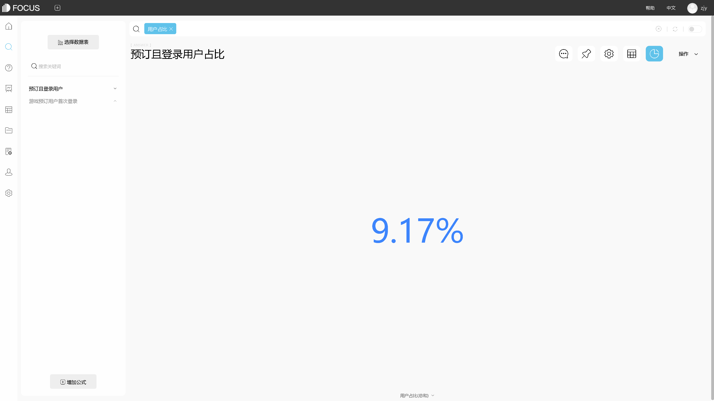

DataFocus，国内第一家采用中文自然语言进行搜索分析的BI工具。今天我们主要来教大家如何在DataFocus中创建中间表。

很多人可能都是第一次听说中间表，那什么是中间表？中间表就是在数据清洗数据处理过程中，生成的一些用来再次进行处理的表，不是最终结果表，是数据分析的中间产物。

那如何创建中间表？在DataFocus中，创建中间表有两种方式，一种就是采用搜索分析，然后将搜索分析的结果保存为中间表，这种方式创建的中间表，其表中的数值列一般都是聚合后的数值，具体操作如下：

在搜索框内加入列或者关键语句，也可以添加公式，待搜索结果返回后，点击“操作-保存为中间表”，将中间表命名，即可看到数据管理页面该中间表正在创建，等待几秒后，显示中间表创建成果“SUCCESS”。

保存为中间表

 中间表正在创建

另一种方式，不是通过搜索创建，而且直接按原始表来创建，这种方式与搜索创建中间表最大的区别在于创建后中间表中的数值列是无聚合状态。若是想要将数据保持原样的，不聚合的，可以选用该种方式，具体操作如下：

在数据管理页面点击“操作-创建中间表”，即可进入具体的中间表创建页面，在此页面，可以选择某些列作为中间表的列，也可以添加公式列，待选结束后，修改中间表名，点击右上角“操作-保存”，中间表即进入创建状态。

创建中间表

保存中间表

在数据管理页面，可以查看中间表的类型，来区别该中间表是通过什么方式创建的，类型为“prejoin”即采用的第二种，类型为“question”即为第一种。

创建中间表，你学会了吗？
