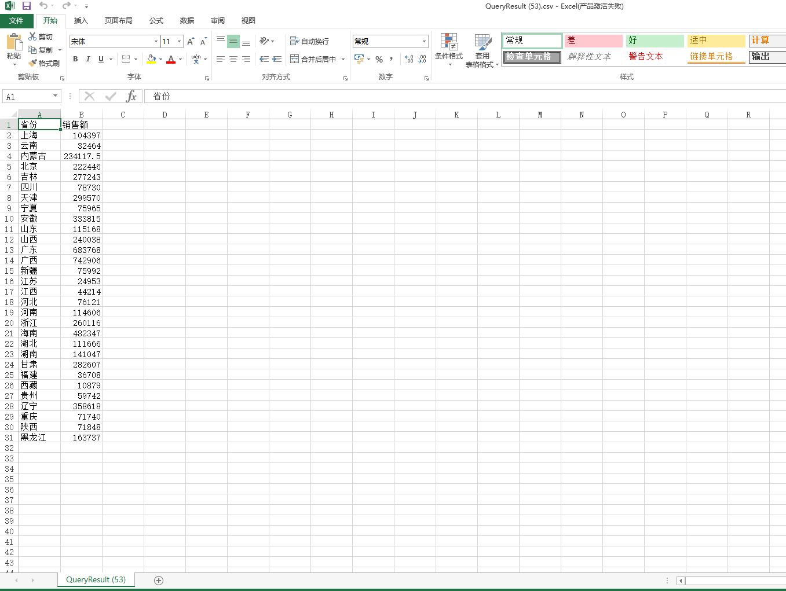

**DataFocus使用小技巧之数据导出功能**

数据分析，主要是指用适当的统计分析方法对收集来的大量数据进行分析，提取有用信息和形成结论而对数据加以详细研究和概括总结的过程。而分析结论，就是企业管理层制定决策之前的参考依据。今天，本文主要就是讲解怎么样把DataFocus中的分析结论应用到日常工作中。

首先，我们要了解DataFocus，它是一款专业的数据分析工具，在DataFocus中可以直接查看数据分析结果，但是需要登录系统才能查看，可是有时候，我们只需要分析的一个结论，一张图或者一个表，不想要那么多步骤，登录系统，找到对应的图才能看，就比如我们在做会议报告，PPT上需要有分析结果展示，这时候我只需要一张图放在PPT上，而不是在会议现场进入系统查找这张表。那么DataFocus中怎么直接导出分析结果呢？其实操作非常简单，既可以选择导出表格，也可以选择导出图片，下面我们一起来看一看。

1、表格形式导出。

如果想将最后的分析结果以表格形式导出，该如何操作？很简单，在搜索分析之后，直接选择右上角“操作-导出CSV”，就会自动跳转到下载好的CSV文件页面，效果如下：

2、图片形式导出。

有时候表格显示分析结论不是很清晰，这时候我就想以图片形式显示并导出，以便我可以直接在各类文档报告中利用数据分析的结论。操作如同表格导出，直接选择“操作—导出图片”，可看到左下角有图片被下载，打开即可看到被导出的图片，效果如下：

现在大家学会了吗？是不是超级简单~
