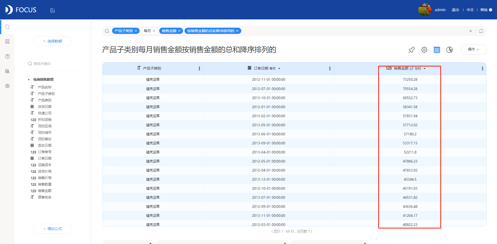
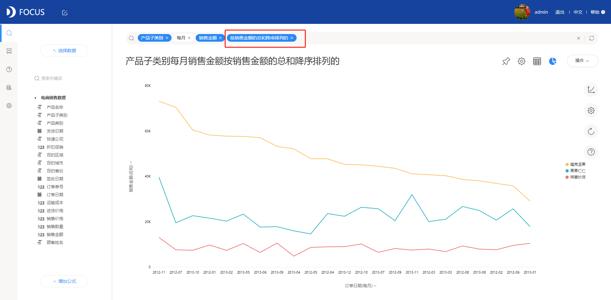

排序是将杂乱无章的[数据元素](https://baike.baidu.com/item/%E6%95%B0%E6%8D%AE%E5%85%83%E7%B4%A0" \t "https://baike.baidu.com/item/%E6%8E%92%E5%BA%8F/_blank)，通过一定的方法按[关键字](https://baike.baidu.com/item/%E5%85%B3%E9%94%AE%E5%AD%97" \t "https://baike.baidu.com/item/%E6%8E%92%E5%BA%8F/_blank)顺序排列的过程。在数据分析中，最基础用到最多的功能点之一就是排序。例如在分析销售前10的商品时，我们需要对销售量进行排序；在查看门店销售额按月变动情况时，需要对月份进行排序等等。本文小编要安利的就是DataFocus系统支持对数值进行升降序排序的三种方式。

假如我们想知道按月产品的销售数量对比情况，这时候，将销售数量进行按降序排序会使分析结果更加清晰。

方法一：表格排序。

选择相关数据源，在搜索框中输入“产品小类”、“每月”以及“销售数量”，点击右上角的表格图标转换为数值表。点击作为排序依赖的数值列的表头空白处，即可使表格数据依据该数值列降序排列；再点击一次表头空白，变为依据该数值列升序排列。

方法二：图表排序。

在搜索框中输入“产品小类”、“每月”以及“销售数量”，点击图形Y轴的配置项选择排序，即可使图形数据依据该数值列降序排列；再点击一次排序，变为依据该数值列升序排列。

 

方法三：搜索排序。

对任意含有一个数值列的图表，只需在搜索栏输入“按xxx升序排列”或者“按xxx降序排列”（xxx是列名）即可得到对应的排序，如果需要对数值聚合方式进行更改只需要在xxx后加上对应的聚合方式，如：“按xxx的平均值升序排列”。输入过程中系统会相应的进行智能提示。

以上就是全部内容了，大家以后再做排序的时候可以按照自己的习惯任选其一哦！当然，或许你有排序类的建议或者需求，可以在下方留言和小编交流，让我们共同成长！
