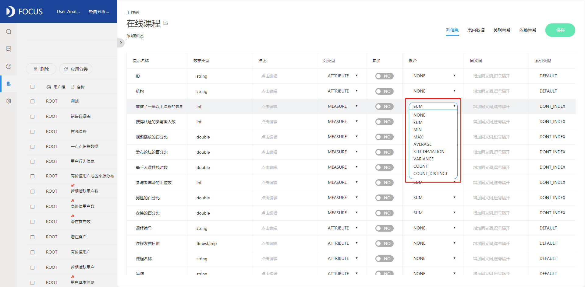

聚合方式在数据分析中被经常用到，一般数据的聚合方式包括最大值、最小值、平均值、方差等等。关于如何修改数据的聚合方式，DataFocus系统目前有四种修改数据聚合方式的方法。

方式一：数据表内修改。

进入数据管理界面打开数据表，找到对应的数据列的聚合一项的选择。属性列的聚合方式默认为无，可以修改为计数和去重计数；数值列的聚合方式默认为总和，可修改为最小值、最大值、平均值、标准差、方差、数量、去重后数量。修改后保存图表，即可在搜索界面进行搜索。

方式二：图轴直接修改。

在搜索页面的图轴处打开配置列表，找到聚合方式可以对聚合方式进行修改。注意只能修改数值列的聚合方式。数值列的聚合方式默认为总和，可修改为最小值、最大值、平均值、标准差、方差、数量、去重后数量。

方式三：数值表修改。

所搜信息完成后，点击进入数据表，找到倒三角图标可以对聚合方式进行修改。注意只能修改数值列的聚合方式。数值列的聚合方式默认为总和，可修改为最小值、最大值、平均值、标准差、方差、数量、去重后数量。

方式四：搜索语句修改。

直接在搜索页面的搜索框中对数值列进行限定，比如对默认是总和聚合方式的数据列销售价格修改成平均值，只要在搜索框内输入“销售价格的平均值”。输入过程中会有智能提示用户常用选项。

以上说的四种方式都可以在DataFocus中实现，在做业务分析的时候可以按照自己的习惯或分析进程选择合适的方式来修改聚合方式。
