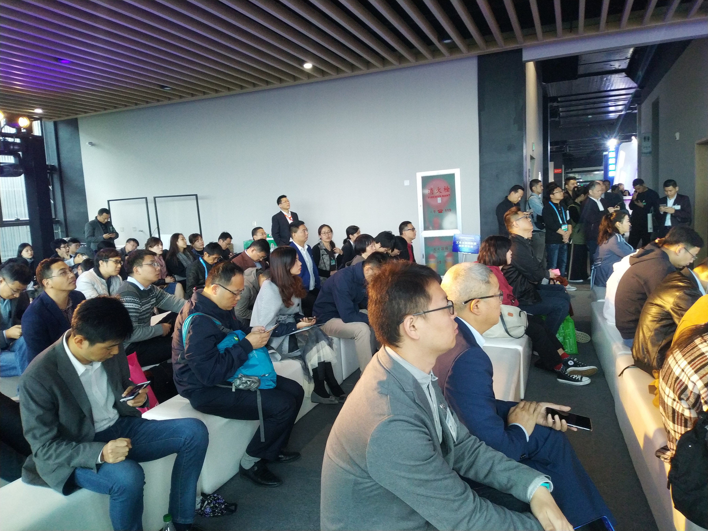
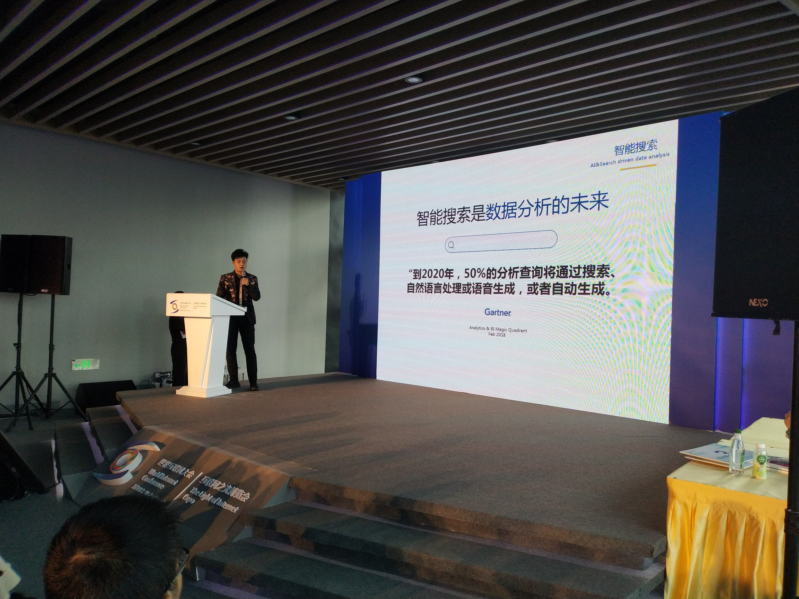

从2014年到2018年，中国互联网技术的发展在更多领域开始崭露头角，第五届世界互联网大会将于11月7日至9日召开。江南水乡乌镇，又将再次汇聚全球目光。千年古镇遇见智能未来。本届大会以“创造互信共治的数字世界——携手共建网络空间命运共同体”为主题，人工智能、5G、自动驾驶等成为大会热点。尤其是人工智能在政府、企业、个人上的实际应用，成为本次大会的重要亮点之一。在此背景下，**以AI智能搜索为驱动的数据分析软件——DataFocus在11月8日下午的创新发布会上重磅亮相。**

**DataFocus**是全球首个中文自然语言大数据分析系统， 该系统可以理解人类关于数据的问题，并以丰富的图表和数据回答相关问题，与传统的数据分析方式相比，**交互更加智能，效率提高100倍以上，将数据分析变得像百度搜索一样简单。**

在创新发布会上，DataFocus首席营销官张埔睿先生向我们展示了DataFocus的强大之处。首先张总为我们剖析了企业目前存在的数据挑战，无论是数据量级十倍以上的增长，还是企业每天越来越多的决策需要依靠客观依据来支撑，传统的数据分析模式都已无法满足。传统的数据分析工具门槛高，使用复杂，真正有需求的业务人员或管理人员根本无法实时使用。而在跟数据库打交道时，需求方需要不断地借助懂机器语言的专家（如数据分析师或研发人员）去为其实现需求，并可视化。这些所谓的专家将成为企业数字化转型的巨大瓶颈。所以张总在现场给出设问，是否有一种技术或工具，能让我们直接和数据库进行交流，让它**实时给到我们想要的分析结果，跟上决策的思绪？**

答案就是智能搜索技术。就像平时我们需要寻找信息，不再需要别人或是其他复杂的步骤，直接打开谷歌或百度搜索即可。“那么为什么大数据分析不可以使用搜索引擎呢？”张总的“质问”让在场的许多观众做出点头等恍然大悟之态。而DataFocus作为全球首个中文自然语言数据分析系统，可以完全让业务员本身或决策者在3秒之内实时处理数据，甚至可做出漂亮的可视化大屏。让前线可以听到炮火的人能够用DataFocus实时查看数据分析结果，实时优化自己的策略，以为企业人员节省时间，节省成本，节省精力，真正让企业进入数字化管理模式。

互联网大会上，微软全球副总裁沈向洋也畅想着AI在未来生活扮演的角色，他认为人类最大的特点就是能够创造新技术，塑造未来。DataFocus凭借多年人工智能技术研发的技术积累，以及在大数据分析领域出类拔萃的综合实力，将成为推动企业数字化转型的重要力量。

**申请试用方式：**

