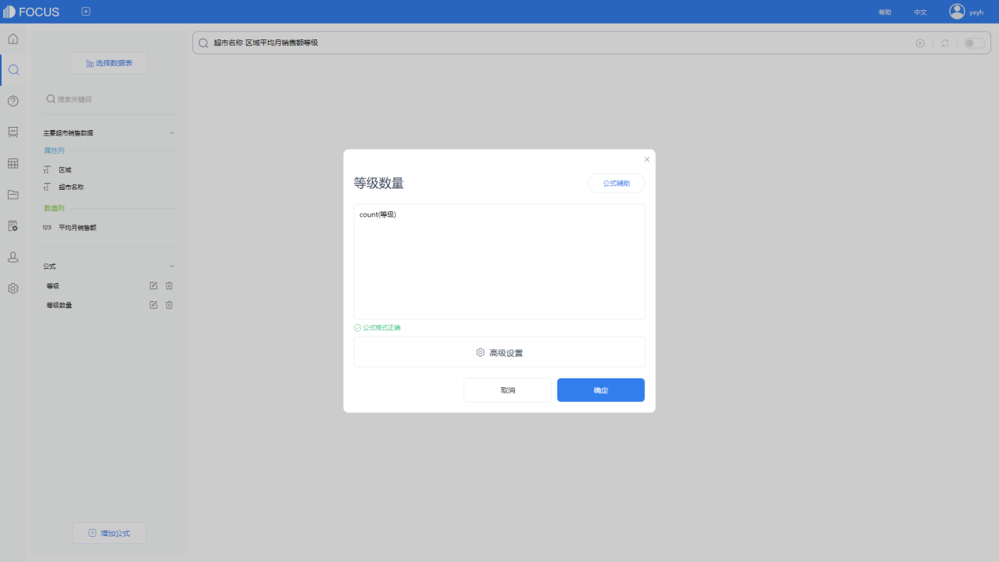
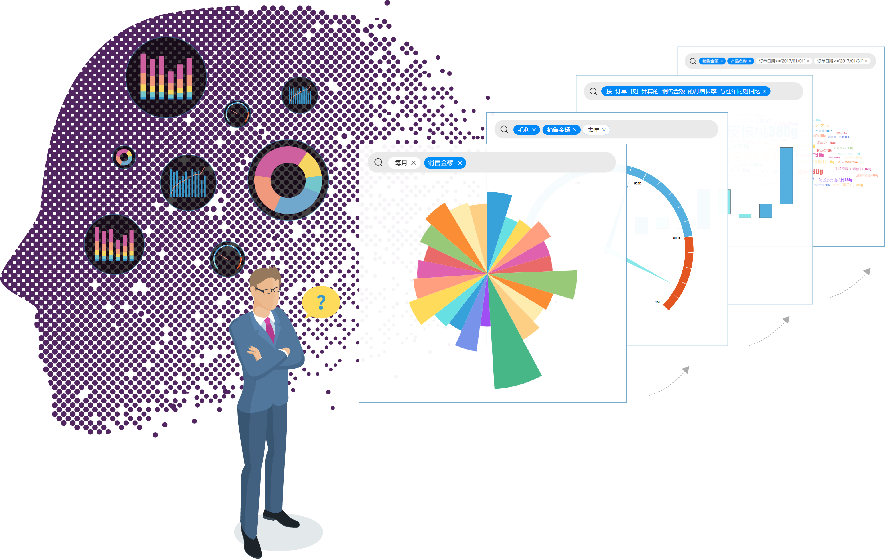

某集团公司有近十万名员工，其中管理层人员数千人，每天需要做出数万个决策。他们曾经花费巨大建设了数据报表体系，但这套系统已经落后于时代，无法响应今时快速的市场环境变化。DataFocus系统基于自然语言处理技术的数据搜索引擎，变革了传统依赖于工程师撰写大量SQL代码才能做数据分析的方式，使得业务人员稍经培训即可立刻投入使用。

“产品的使用体验就像百度、谷歌一样，直接搜索就可以进行分析，非常方便！”

变革性的搜索式分析体验

以前的业务会议，需要花费大量时间进行沟通，其中最为耗时的部分就是各部门高管从数据层面进行对其的工作。有时候，秘书花费巨大力气准备的材料，往往被高级管理者的跳跃性思维打断，他们经常会问：“浙江地区的数据情况不错，你能告诉我其他和杭州人口相当规模的城市数据吗？”，有时候，他们会问：“最近几个月上海地区数据看起来有点奇怪，谁能告诉我去年或者前年北京地区是不是也有这样的数据异常？”

有DataFocus在，以上的对话永远不会陷入尴尬的沉默。只管去问就行了，它的响应跟得上您的思绪。

跟得上思绪的响应速度

以前，数据只有高层管理人员才能触达，现在身在一线的员工也需要数据来赋能。通过DataFocus构建集团级的数字化大脑，让数据分析的能力进一步平民化，业务人员不再需要通过IT部门的协助才能看到需要的数据，企业级的数字库搜索引擎，使得数据分析触手可达。

半年的时间，集团经授权的用户共产生超过10万次搜索，创建2万多个图表，进行了1700多次智能数据洞察，生成数百个不同专题的数字大屏。

所有这些工作如果采用传统的方式来进行，一个50人规模的数据工程师团队需要不眠不休的整整干上一年。
