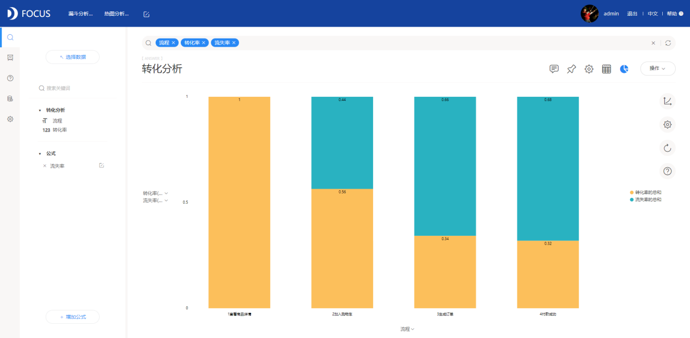
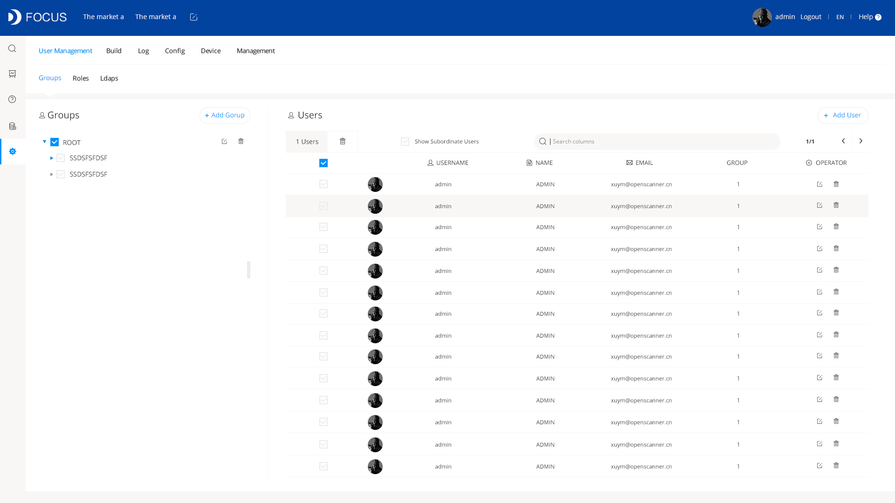

DataFocus全新UI界面更新来啦。这次UI更新考虑到用户的审美需求和使用方便，全面的优化了整体布局、交互效果以及icon细节。秉持着简约美观的设计理念，整体统一了产品的配色和排版布局，去除繁琐，相互协调的界面更富有美感；全面重制了设计元素，更多的加入了圆角元素，使视觉感受安全柔和，数据分析过程的体验更加专注；设计风格和产品理念相融合，安全简约更智能。

## 登录界面

原版的登录界面色彩比较杂乱，一些模块位置不合理或者样式不够美观，于是改版的登录界面里整体主要以蓝色和浅灰为基调，简化并优化了样式和布局，以求给用户简约轻松充满科技气息的感官体验。

 

## Search界面

Search界面更新了布局排版，面板分割比例更加合理优美，配色和icon图表也做了整体的重构，并大大丰富了图表类型，使数据分析更加全面和多样化。

  

## 数据看板

数据看板同样对样式做了大量的细节调整，并加入了自定义组件功能给用户提供文本、图片的使用，配色也进行了优化，使图表效果更时尚富有美感。

## 用户管理

用户管理这一部分，我们重新设计了列表的展示结构，使其更加贴合我们的管理策略，使用起来对功能作用更加明晰。

 

## 资源列表

对系统各个列表页面，我们做了效果和样式的统一，页面感官更加纯净条理化，并改进了部分交互效果，优化了可能造成信息模糊的部分细节。

  

在更新UI界面的同时我们还添加了一些优化和功能使交互体验更加舒适，比如隐藏数据源面板和智能提示的丰富，更多的细节体验惊喜可以在DataFocus产品使用中亲自发现哦。

\[box\]  更多产品信息可以通过百度搜索 ‘DataFocus’进入我们官网，或者搜索微信号’huishuzt’关注DataFocus的微信公众号来获取。\[/box\]
