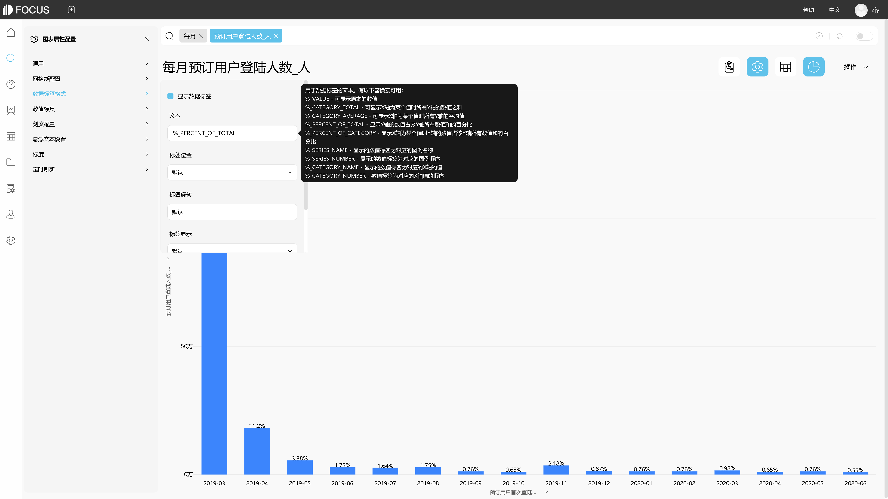

数据可视化包括数据的采集、分析、治理、管理、挖掘在内的一系列复杂数据处理，然后由设计师设计一种表现形式，或许是二维图表、三维立体视图，不管是什么样的信息图，最后由前端工程师创建对应的可视化算法及前端渲染和展现的实现。如果仅仅是能够将数据转化成漂亮的图表，设计出固定维度、不同式样的图表来解释你的观点，并不说明这样的结局就足够好。这只是一个简单的开始，只是一个美好愿望的萌芽。如果要成功报告结果，将你所分析的度量和数据有效地转化为有商业价值的见解，使其能够为基于事实所做的决策提供支持，那么还需要做更多的功课。

色彩提升信息可视化的视觉效果。在信息可视化通过造型元素明确传达信息及叙述的基础上，把握好视觉元素中色彩的运用，使图形变得更加生动、有趣，信息表达得更加准确和直观。色彩可以帮助人们对信息进行深入分类，强调和淡化、生动而有趣的可视化作品的表现形式，常常给受众带来视觉效果上的享受。当然，视觉效果要将企业品牌的色调融合进去，和企业的品牌文化保持高度的一致，这是一个最基本的常识。比如，如果企业的品牌色调比较热衷红色，你设计的可视化效果，就要有意识地朝着这个基调靠拢。但没有必要吻合，因为红色的可视化效果，通常都包含警示的韵味，所以，红色适合做预警、提醒和突出信息的功能。

排版布局增强信息可视化的叙事性。我有酒，你有故事吗?排版布局四大基本原则：

(1)对比(Contrast)：如果两个项不完全相同，就应当使之不同，而且应当是截然不同。

(2)重复(Repetition)：设计的某些方面在整个作品中重复。

(3)对齐(Alignment)：任何元素都不能在页面上随意安放。每一项都应当与页面上的某个内容存在某种视觉联系。

(4)亲密性(Proximity)：将相关的项组织在一起，使它们的物理位置相互靠近相关的项将被看作凝聚为一体的一个组。

动态增加信息可视化的视觉体验。在信息可视化的视觉表达中，动态地将相互分离的各种信息传播形式有机地融合在一起，进行有关联、有节奏的信息处理、传输和实现。最终的目的是，为了实现数据之间的联动，解释数据表现之间驱动和联系的关系。通过图表样式和色彩的运动，满足受众的视觉感受，同时将信息内容更加深刻而精简地传达给阅读者，使整个信息传达的过程更加轻松便捷。对于数据可视化有诸多工具，如：ECharts、iCharts、D3js、Flot、Rapha?l等功能都十分强大，但对于非专业可视化而又经常与图表打交道的职场人士来说，一款轻便易学而又实用的可视化软件则显得十分重要。比如datafocus。

DataFocus的主要特点：

1. 跟搜索一样简单的数据分析，摆脱复杂的代码编写和函数处理。让业务人员也可以轻松使用。
2. 消灭数据孤岛。打破数据之间的壁垒，使得数据得到充分的分析和使用。
3. 轻松处理海量数据。基于大数据分析架构设计，轻松处理海量数据。
4. 支持实时交互，为企业决策提供强力支持。企业数据跟新的时效性保证，图表实时更新为最新决策提供强力支持。
