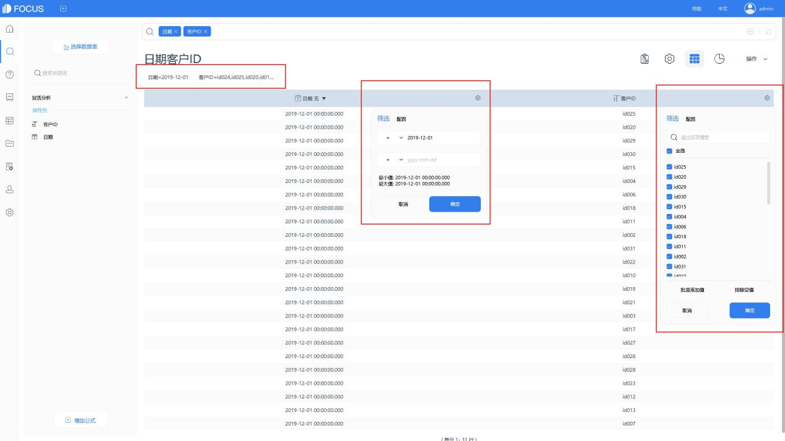
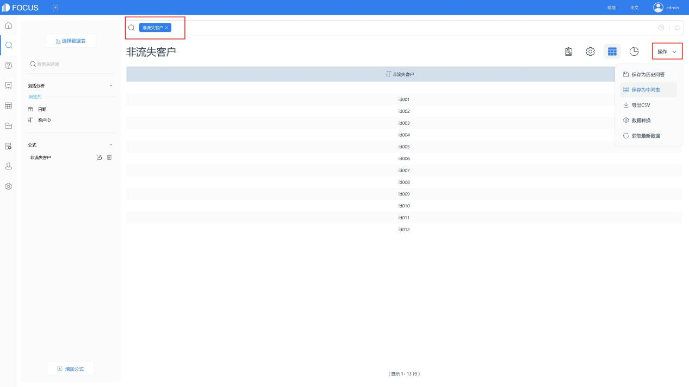
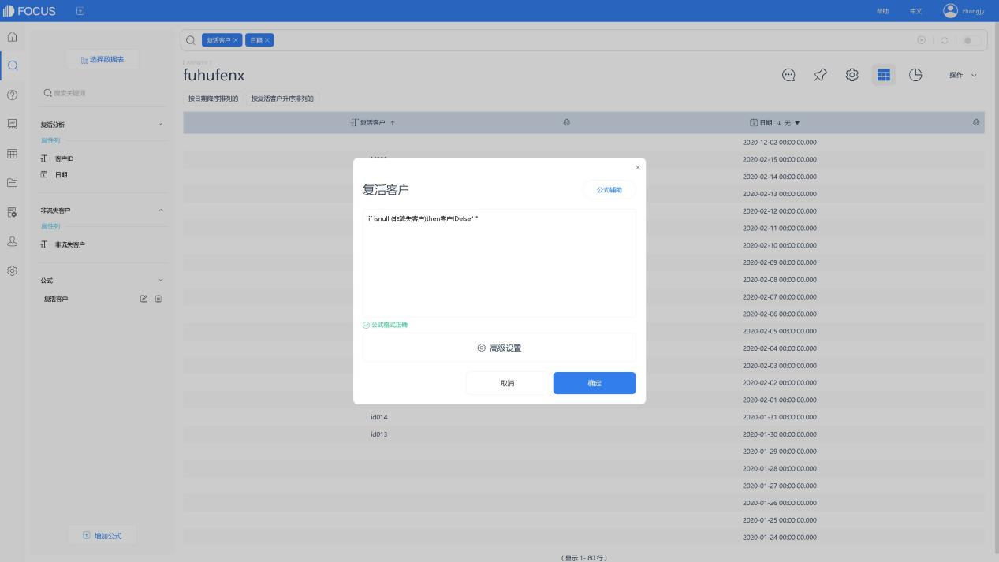
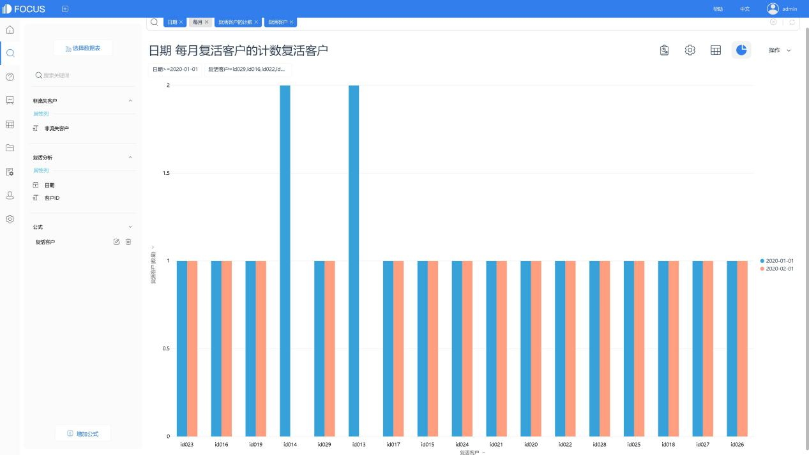

# 复活客户分析

什么是“复活客户”？如何进行“复活客户分析”呢？今天，我们借助DataFocus系统，来了解一种简单的复活客户分析。

## 1、何为复活客户

复活客户，指客户在规定的时间段之前有至少一次消费行为，且在N日内没再有任何消费行为，成为流失客户，而在规定的时间段内又发生了消费行为，这类客户则为在该规定时间段内的复活客户。

## DataFocus系统分析

以2019年12月1日有消费行为的客户，在30天之后，即2020年1月1日至今有再次消费行为的客户为例。

### 2.1 分析思路

1. 确定该日客户中，之后的30日内有消费情况的客户，即非流失客户。
2. 将该日客户，排除非流失客户，即获得复活客户。

### 2.2 系统操作

将数据表导入DataFocus系统，经过处理后，即可在搜索模块进行搜索式分析。

#### 2.2.1 数据筛选

本次，我们针对2019年12月1日有消费记录的客户进行分析。

（1）先通过筛选功能，筛选出2019年12月1日有消费的所有客户。

（2）再将日期筛选条件更换为2019年12月1日之后-，获取该日消费客户的其它消费记录，并在操作栏下将数据保存为中间表“复活分析”。

#### 2.2.2获取非流失客户

搜索模块 ，将保存后的中间表“复活分析”选为数据源表。

编辑公式，进行非流失客户的筛选，并将结果保存为公式列。

如图，非流失客户= if日期小于"2020-01-01 " and 日期大于等于add\_days ("2020-01-01 " ,-30)then客户IDelse" "

双击该列名，进行搜索，并保存为中间表“非流失客户”。

保存成功后，根据提示，直接跳转到资源管理模块，并进入表详情界面，将表“复活分析”与“非流失客户”进行全关联。

#### 2.2.3 统计复活客户

重新回到搜索模块，选择这两个表作为数据源表。通过公式，筛选出复活客户。

如图，复活客户=if isnull (非流失客户)then客户ID else" "

最后，在搜索框中输入列名、关键词进行数据分析，并进行图表的设置。

以上，是一种简单的复活客户分析方法。那，是否还有其它分析方式呢？大家可以到DataFocus中直接进行尝试哦~Datafocus Cloud 免费试用14天！
